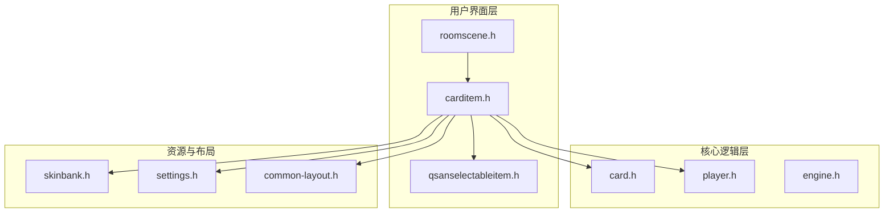
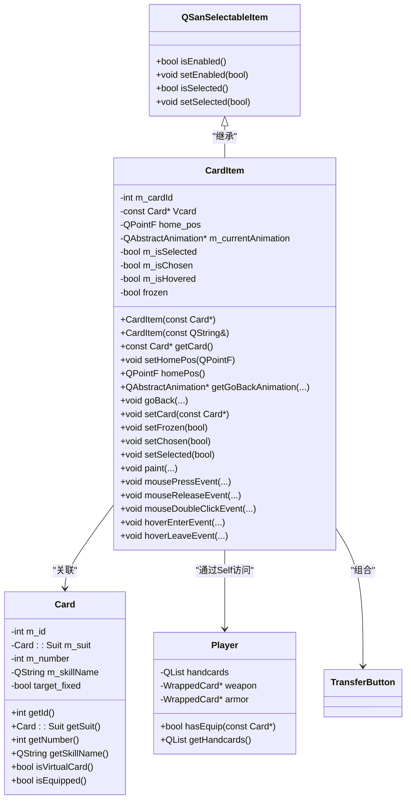
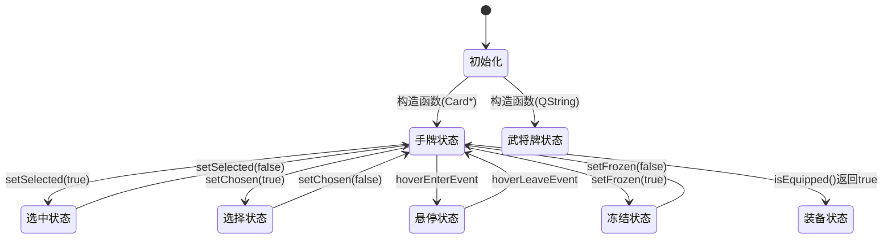

# 卡牌项组件

<cite>
**本文档引用文件**   
- [carditem.cpp](file://src/ui/carditem.cpp)
- [carditem.h](file://src/ui/carditem.h)
- [card.h](file://src/core/card.h)
- [player.h](file://src/core/player.h)
</cite>

## 目录
1. [简介](#简介)
2. [项目结构](#项目结构)
3. [核心组件](#核心组件)
4. [架构概述](#架构概述)
5. [详细组件分析](#详细组件分析)
6. [依赖分析](#依赖分析)
7. [性能考虑](#性能考虑)
8. [故障排除指南](#故障排除指南)
9. [结论](#结论)

## 简介
卡牌项组件（CardItem）是《三国杀：霸业》游戏客户端中用于表示卡牌视觉元素的核心UI组件。该组件基于Qt图形视图框架（QGraphicsItem），负责管理卡牌在不同游戏场景（如手牌区、装备区、弃牌堆等）下的视觉状态、交互行为和动画效果。本技术文档深入解析CardItem的实现机制，涵盖其与Card和Player数据模型的绑定关系、视觉状态管理、用户交互处理以及性能优化策略。

## 项目结构
项目采用分层模块化设计，主要分为核心逻辑层（core）、用户界面层（ui）和资源管理等部分。CardItem组件位于`src/ui`目录下，是连接游戏核心数据与用户界面的关键桥梁。



**图示来源**
- [carditem.h](file://src/ui/carditem.h#L59-L225)
- [card.h](file://src/core/card.h#L44-L90)
- [player.h](file://src/core/player.h#L60-L100)

**本节来源**
- [carditem.h](file://src/ui/carditem.h#L1-L230)
- [carditem.cpp](file://src/ui/carditem.cpp#L1-L553)

## 核心组件
CardItem组件是游戏UI的核心，它封装了卡牌的视觉表现和用户交互。其主要职责包括：
- **视觉状态管理**：根据卡牌类型、所属区域（手牌、装备、弃牌堆）和游戏状态（冻结、选中、悬停）动态渲染卡牌外观。
- **交互处理**：响应用户的点击、双击、拖拽等鼠标事件，并发出相应的信号。
- **动画控制**：提供卡牌移动、返回原位等平滑动画效果。
- **数据绑定**：与底层的Card数据对象和Player模型保持同步。

**本节来源**
- [carditem.cpp](file://src/ui/carditem.cpp#L1-L553)
- [carditem.h](file://src/ui/carditem.h#L59-L225)

## 架构概述
CardItem组件遵循Qt的模型-视图-控制器（MVC）设计模式，其架构清晰地分离了数据、逻辑和表现。



**图示来源**
- [carditem.h](file://src/ui/carditem.h#L59-L225)
- [card.h](file://src/core/card.h#L44-L90)
- [player.h](file://src/core/player.h#L60-L100)

## 详细组件分析

### 卡牌项分析
CardItem是`QSanSelectableItem`的子类，继承了其可选择、可交互的基本特性，并在此基础上扩展了卡牌特有的功能。

#### 类继承与结构
如上文类图所示，CardItem通过继承和组合的方式，构建了一个功能丰富的UI组件。它直接持有`Card`对象的引用（通过`m_cardId`或`Vcard`），并利用`Player`模型（特别是`Self`全局变量）来查询卡牌的实时状态（如是否已装备）。

#### 视觉状态管理机制
CardItem的视觉状态由多个内部状态变量共同决定，这些状态在`paint()`函数中被综合处理以渲染最终的视觉效果。



**图示来源**
- [carditem.cpp](file://src/ui/carditem.cpp#L438-L552)
- [carditem.h](file://src/ui/carditem.h#L191-L228)

**本节来源**
- [carditem.cpp](file://src/ui/carditem.cpp#L438-L552)
- [carditem.h](file://src/ui/carditem.h#L94-L155)

#### 显示逻辑与交互行为
CardItem通过重写Qt的事件处理函数来实现复杂的交互逻辑：

- **`mousePressEvent`**: 记录鼠标按下时的场景坐标，用于后续判断是点击还是拖拽。
- **`mouseMoveEvent`**: 当鼠标移动距离超过`_S_CLICK_JITTER_TOLERANCE`阈值时，开始拖拽卡牌。
- **`mouseReleaseEvent`**: 判断释放时的总移动距离是否小于`_S_MOVE_JITTER_TOLERANCE`，若是则视为点击并发出`clicked()`信号；否则视为拖拽结束并发出`released()`信号。若`auto_back`为true，则自动调用`goBack()`动画返回原位。
- **`mouseDoubleClickEvent`**: 若组件有焦点，则发出`double_clicked()`信号；否则发出`toggle_discards()`信号，用于切换弃牌模式。
- **`hoverEnterEvent`/`hoverLeaveEvent`**: 处理悬停状态，更新`m_isHovered`标志，并根据条件显示或隐藏“转移”按钮（TransferButton）。

#### UI效果实现
- **旋转与拖拽**：通过Qt图形视图框架的`setPos()`和`setTransform()`方法实现。拖拽时，`mouseMoveEvent`会根据鼠标当前位置和初始按下的位置计算新的坐标。
- **高亮**：通过`setOuterGlowEffectEnabled()`方法控制`QGraphicsDropShadowEffect`的启用，实现发光高亮效果。`setOuterGlowColor()`可自定义高亮颜色。
- **动画**：使用`QPropertyAnimation`和`QParallelAnimationGroup`实现平滑的移动和淡入淡出动画。`getGoBackAnimation()`方法创建一个动画对象，`goBack()`方法则启动该动画。

#### 与数据模型的绑定
- **与Card模型绑定**：通过`setCard()`方法将CardItem与一个`Card`对象关联。`getCard()`方法则根据`m_cardId`从全局`Sanguosha`引擎中获取最新的卡牌数据，确保UI与数据同步。
- **与Player模型绑定**：`isEquipped()`方法通过查询`Self`（当前客户端玩家）的`hasEquip()`方法来判断该卡牌是否已被装备，从而决定其显示逻辑。

#### 公共接口方法与信号事件
CardItem提供了丰富的公共接口和信号，供上层逻辑调用。

**公共接口方法:**
- `setHomePos()`, `homePos()`: 设置和获取卡牌的“家”位置，用于动画返回。
- `setAutoBack()`: 设置是否在释放后自动返回原位。
- `setFrozen()`: 冻结卡牌，使其不可移动和交互。
- `setSelected()`, `setChosen()`: 设置卡牌的选中和选择状态，影响视觉表现。
- `setFootnote()`: 设置卡牌底部的注释文字。
- `showFrame()`, `showAvatar()`, `showSmallCard()`: 显示卡牌的边框、头像和小图标等装饰元素。

**信号事件:**
- `clicked()`: 单击卡牌时发出。
- `double_clicked()`: 双击卡牌时发出。
- `toggle_discards()`: 在特定条件下双击时发出，用于切换弃牌模式。
- `released()`: 拖拽释放时发出。
- `enter_hover()`, `leave_hover()`: 进入和离开悬停状态时发出。
- `movement_animation_finished()`: 卡牌移动动画完成时发出。

#### 使用示例
在游戏中，当玩家需要使用一张【杀】时，流程如下：
1.  `RoomScene`遍历手牌区的`CardItem`列表。
2.  为每张卡牌连接`clicked()`信号到处理函数。
3.  玩家点击一张【杀】，触发`mouseReleaseEvent`，发出`clicked()`信号。
4.  `RoomScene`接收到信号，获取被点击的`CardItem`，调用其`getCard()`方法获取`Card`对象。
5.  游戏逻辑验证该卡牌是否可用，并进入目标选择阶段。

**本节来源**
- [carditem.cpp](file://src/ui/carditem.cpp#L1-L552)
- [carditem.h](file://src/ui/carditem.h#L59-L225)

## 依赖分析
CardItem组件依赖于多个核心模块，形成了一个紧密耦合的系统。

```mermaid
graph TD
CardItem --> QSanSelectableItem : "继承"
CardItem --> Card : "数据源"
CardItem --> Player : "状态查询"
CardItem --> Sanguosha : "全局引擎，获取Card/General"
CardItem --> G_ROOM_SKIN : "皮肤资源，获取Pixmap"
CardItem --> G_COMMON_LAYOUT : "布局配置"
CardItem --> Config : "全局配置，如动画时长"
CardItem --> TransferButton : "内部组件"
```

**图示来源**
- [carditem.cpp](file://src/ui/carditem.cpp#L1-L553)
- [carditem.h](file://src/ui/carditem.h#L1-L230)

**本节来源**
- [carditem.cpp](file://src/ui/carditem.cpp#L1-L553)
- [carditem.h](file://src/ui/carditem.h#L1-L230)

## 性能考虑
CardItem在性能方面做了多项优化：
- **动画互斥锁**：使用`QMutex m_animationMutex`保护`m_currentAnimation`指针，防止在动画播放过程中被意外修改或删除，确保线程安全。
- **资源复用**：通过`G_ROOM_SKIN`单例管理所有图片资源，避免重复加载。
- **延迟创建**：`TransferButton`在`setTransferable(true)`时才被创建，减少不必要的内存开销。
- **条件渲染**：在`paint()`函数中，只有在特定条件下（如`_m_frameType`非空、`_m_avatarName`非空）才会绘制相应的元素，避免无效绘制。

## 故障排除指南
- **卡牌无法拖拽**：检查`frozen`标志是否为`true`，或`ItemIsMovable`标志是否被正确设置。
- **动画不播放**：检查`m_currentAnimation`是否为`NULL`，或动画的`start()`方法是否被正确调用。确保在主线程中操作UI。
- **视觉状态不更新**：确认`update()`方法在状态改变后被调用，以触发重绘。
- **信号未连接**：检查信号与槽的连接是否正确，特别是在动态创建和销毁`CardItem`时。

**本节来源**
- [carditem.cpp](file://src/ui/carditem.cpp#L1-L553)
- [carditem.h](file://src/ui/carditem.h#L1-L230)

## 结论
CardItem组件是《三国杀：霸业》客户端UI系统的核心，它成功地将复杂的卡牌逻辑与直观的视觉表现相结合。通过继承Qt的图形视图框架，它实现了高效的渲染和流畅的交互。其清晰的接口设计和与核心数据模型的紧密绑定，使得上层游戏逻辑能够方便地控制和响应卡牌的状态变化。该组件的设计体现了良好的面向对象原则和性能优化意识，为游戏的稳定运行和良好用户体验提供了坚实的基础。