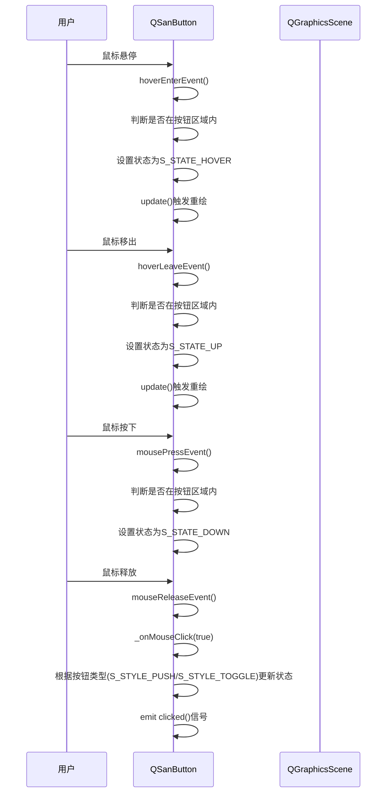

# 按钮与进度条组件

<cite>
**本文档引用文件**   
- [button.cpp](file://src/ui/button.cpp)
- [button.h](file://src/ui/button.h)
- [timedprogressbar.cpp](file://src/ui/timedprogressbar.cpp)
- [timedprogressbar.h](file://src/ui/timedprogressbar.h)
- [qsanbutton.h](file://src/ui/qsanbutton.h)
- [qsanbutton.cpp](file://src/ui/qsanbutton.cpp)
- [choosetriggerorderbox.cpp](file://src/ui/choosetriggerorderbox.cpp)
- [choosetriggerorderbox.h](file://src/ui/choosetriggerorderbox.h)
</cite>

## 目录
1. [简介](#简介)
2. [核心组件概览](#核心组件概览)
3. [按钮组件深度解析](#按钮组件深度解析)
4. [倒计时进度条组件深度解析](#倒计时进度条组件深度解析)
5. [游戏关键流程中的应用模式](#游戏关键流程中的应用模式)
6. [组件样式定制与事件响应链](#组件样式定制与事件响应链)
7. [性能监控与优化实践](#性能监控与优化实践)
8. [结论](#结论)

## 简介
本文档深入解析《三国杀：霸业》游戏客户端中两个核心UI交互组件：自定义按钮（Button）与倒计时进度条（TimedProgressBar）。文档重点阐述了`button.cpp`中按钮的视觉状态管理与信号触发机制，以及`timedprogressbar.cpp`中倒计时进度条的动态更新与动画效果实现。同时，分析了这两类组件在游戏关键流程（如出牌阶段倒计时、技能选择确认）中的集成应用，并提供了样式定制、事件响应链设计及性能优化建议。

## 核心组件概览
本项目UI层的核心交互组件主要由`Button`和`TimedProgressBar`两大类构成。`Button`类提供了基础的文本和图像按钮功能，而`QSanButton`作为其功能更强大的子类，支持多状态切换和复杂的交互逻辑。`TimedProgressBar`则是一个带自动计时功能的进度条，其子类`QSanCommandProgressBar`专门用于处理游戏指令的倒计时。

```mermaid
classDiagram
class QGraphicsObject {
<<abstract>>
}
class Button {
+QString label
+QSizeF size
+QGraphicsPixmapItem* m_icon
+QGraphicsPixmapItem* m_colorReversedIcon
+Button(const QString& label, qreal scale)
+void setText(const QString& text)
+void mouseReleaseEvent(QGraphicsSceneMouseEvent*)
+void hoverEnterEvent(QGraphicsSceneHoverEvent*)
+void hoverLeaveEvent(QGraphicsSceneHoverEvent*)
+void setTextColorReversed(bool reversed)
+QColor backgroundColor()
+void paint(QPainter*, const QStyleOptionGraphicsItem*, QWidget*)
+void onEnabledChanged()
}
class QSanButton {
+enum ButtonState { S_STATE_UP, S_STATE_HOVER, ... }
+enum ButtonStyle { S_STYLE_PUSH, S_STYLE_TOGGLE }
+QPixmap _m_bgPixmap[12]
+QRegion _m_mask
+QSize _m_size
+ButtonState _m_state
+ButtonStyle _m_style
+QSanButton(const QString& groupName, const QString& buttonName, ...)
+void setState(ButtonState state)
+void setEnabled(bool enabled)
+void hoverEnterEvent(QGraphicsSceneHoverEvent*)
+void hoverLeaveEvent(QGraphicsSceneHoverEvent*)
+void mousePressEvent(QGraphicsSceneMouseEvent*)
+void paint(QPainter*, const QStyleOptionGraphicsItem*, QWidget*)
+void _onMouseClick(bool inside)
}
class QProgressBar {
<<abstract>>
}
class TimedProgressBar {
+bool m_hasTimer
+bool m_autoHide
+int m_timer
+time_t m_step, m_max, m_val
+QMutex m_mutex
+void show()
+void hide()
+void timerEvent(QTimerEvent*)
+void setCountdown(time_t maximum, time_t startVal)
}
class QSanCommandProgressBar {
+ProcessInstanceType m_instanceType
+void setCountdown(CommandType command)
+void paintEvent(QPaintEvent*)
}
QGraphicsObject <|-- Button
Button <|-- QSanButton
QProgressBar <|-- TimedProgressBar
TimedProgressBar <|-- QSanCommandProgressBar
Button : "基础文本/图像按钮"
QSanButton : "多状态功能按钮"
TimedProgressBar : "可计时进度条"
QSanCommandProgressBar : "游戏指令倒计时条"
```

**图示来源**
- [button.h](file://src/ui/button.h#L1-L99)
- [button.cpp](file://src/ui/button.cpp#L1-L211)
- [qsanbutton.h](file://src/ui/qsanbutton.h#L1-L155)
- [qsanbutton.cpp](file://src/ui/qsanbutton.cpp#L1-L228)
- [timedprogressbar.h](file://src/ui/timedprogressbar.h#L1-L100)
- [timedprogressbar.cpp](file://src/ui/timedprogressbar.cpp#L1-L126)

**本节来源**
- [button.h](file://src/ui/button.h)
- [button.cpp](file://src/ui/button.cpp)
- [timedprogressbar.h](file://src/ui/timedprogressbar.h)
- [timedprogressbar.cpp](file://src/ui/timedprogressbar.cpp)

## 按钮组件深度解析

### 视觉状态管理
`QSanButton`类通过枚举`ButtonState`定义了按钮的多种视觉状态，这是实现丰富交互体验的核心。

**按钮状态枚举**
```c++
enum ButtonState {
    S_STATE_UP,         // 正常状态
    S_STATE_HOVER,      // 悬停状态
    S_STATE_DOWN,       // 按下状态
    S_STATE_CANPRESHOW, // 可预展示状态
    S_STATE_DISABLED,   // 禁用状态
    S_NUM_BUTTON_STATES // 状态总数
};
```

按钮的视觉状态管理依赖于一个关键的数据结构`_m_bgPixmap`，它是一个包含12个元素的`QPixmap`数组。该数组存储了按钮在不同状态下的背景图片。其索引逻辑如下：
- 索引 `0` 到 `4`：存储`multi_state`为`false`时，5种基本状态的图片。
- 索引 `5` 到 `9`：存储`multi_state`为`true`时，5种基本状态的图片。
- 索引 `10` 和 `11`：用于存储`S_NUM_BUTTON_STATES * 2`的扩展状态（在`multi_state`为`true`时使用）。

当需要切换按钮状态时，调用`setState()`方法：
```c++
void QSanButton::setState(QSanButton::ButtonState state) {
    if (this->_m_state != state) {
        this->_m_state = state;
        update(); // 触发重绘
    }
}
```
`update()`方法会触发`paint()`函数的调用，从而根据当前状态和`m_isFirstState`标志，从`_m_bgPixmap`数组中选择正确的图片进行绘制。

### 信号触发机制
按钮的信号触发是一个复杂的事件响应链，涉及鼠标事件、状态管理和信号发射。

**事件响应流程**


核心的信号触发逻辑在`_onMouseClick()`方法中：
```c++
void QSanButton::_onMouseClick(bool inside) {
    bool changeState = true;
    // 特殊技能按钮逻辑
    if (inherits("QSanSkillButton")) {
        const Skill * skill = qobject_cast<const QSanSkillButton *>(this)->getSkill();
        if (skill->canPreshow() && !Self->hasShownSkill(skill)) changeState = false;
    }
    // 多状态按钮逻辑
    if (multi_state && inside)
        m_isFirstState = !m_isFirstState;
    // 推动式按钮：点击后恢复到UP状态
    if (_m_style == S_STYLE_PUSH && changeState)
        setState(S_STATE_UP);
    // 切换式按钮：状态在UP和DOWN之间切换
    else if (_m_style == S_STYLE_TOGGLE) {
        if (_m_state == S_STATE_DOWN) {
            if (inside) setState(S_STATE_HOVER);
            else setState(S_STATE_UP);
        } else {
            setState(S_STATE_DOWN);
        }
    }
    // 最终发射clicked信号
    emit clicked();
}
```

**本节来源**
- [qsanbutton.h](file://src/ui/qsanbutton.h#L42-L116)
- [qsanbutton.cpp](file://src/ui/qsanbutton.cpp#L57-L228)

## 倒计时进度条组件深度解析

### 动态更新与动画效果
`TimedProgressBar`类通过Qt的定时器机制（`QTimerEvent`）实现了倒计时的动态更新。

**倒计时核心逻辑**
```c++
void TimedProgressBar::timerEvent(QTimerEvent *) {
    bool emitTimeout = false;
    bool doHide = false;
    int val = 0;
    m_mutex.lock();
    m_val += m_step; // 每次定时器触发，值增加m_step
    if (m_val >= m_max) {
        m_val = m_max;
        if (m_autoHide) doHide = true; // 自动隐藏
        else killTimer(m_timer); // 停止定时器
        emitTimeout = true; // 发射超时信号
    }
    val = m_val;
    m_mutex.unlock();
    this->setValue(val); // 更新进度条显示
    if (doHide) hide();
    if (emitTimeout) emit timedOut(); // 发射timedOut信号
}
```

`QSanCommandProgressBar`继承了`TimedProgressBar`，并重写了`paintEvent()`方法来实现自定义的视觉效果。它利用`G_ROOM_SKIN`（皮肤管理器）根据当前进度动态加载不同的进度条图片，从而实现平滑的动画效果。

**自定义绘制流程**
```c++
void QSanCommandProgressBar::paintEvent(QPaintEvent *) {
    m_mutex.lock();
    int val = this->m_val;
    int max = this->m_max;
    m_mutex.unlock();
    // 获取控件尺寸
    int width = this->width();
    int height = this->height();
    QPainter painter(this);
    // 处理垂直方向
    if (orientation() == Qt::Vertical) {
        painter.translate(0, height);
        qSwap(width, height);
        painter.rotate(-90);
    }
    // 绘制背景
    QPixmap progBg = G_ROOM_SKIN.getProgressBarPixmap(0);
    painter.drawPixmap(0, 0, width, height, progBg);
    // 计算当前进度百分比
    double percent = 1 - (double)val / max;
    // 根据百分比加载对应的进度条图片
    QPixmap prog = G_ROOM_SKIN.getProgressBarPixmap((int)(percent * 100));
    // 计算需要绘制的宽度
    int drawWidth = percent * prog.width();
    // 绘制进度条（源图片的一部分）
    painter.drawPixmap(0, 0, percent * width, height, prog, 0, 0, drawWidth, prog.height());
}
```
此方法通过`percent * 100`计算出当前进度的整数百分比，并以此作为参数从皮肤资源中获取对应的图片，实现了类似“帧动画”的视觉效果。

**本节来源**
- [timedprogressbar.cpp](file://src/ui/timedprogressbar.cpp#L47-L124)
- [timedprogressbar.h](file://src/ui/timedprogressbar.h#L38-L98)

## 游戏关键流程中的应用模式

### 出牌阶段倒计时
在出牌阶段，`QSanCommandProgressBar`被广泛用于显示玩家的操作倒计时。其应用模式如下：

1.  **初始化**：当轮到某玩家行动时，游戏逻辑层调用`setCountdown()`方法，传入`CommandType`（如`S_COMMAND_PLAY_CARD`）。
    ```c++
    void QSanCommandProgressBar::setCountdown(CommandType command) {
        m_mutex.lock();
        m_max = ServerInfo.getCommandTimeout(command, m_instanceType);
        m_mutex.unlock();
    }
    ```
    `ServerInfo`会根据服务器配置返回该指令的超时时间（例如30秒），并设置为进度条的最大值。

2.  **启动倒计时**：调用`show()`方法，该方法内部会启动一个定时器，每隔`m_step`毫秒（通常为100ms）触发一次`timerEvent`，从而更新进度条。

3.  **超时处理**：当倒计时结束，`timedOut()`信号被发射。游戏UI层会连接此信号，执行超时逻辑，如自动执行默认操作或跳过该玩家的回合。

4.  **提前结束**：如果玩家在倒计时结束前完成了操作，游戏逻辑会调用`hide()`方法停止定时器并隐藏进度条。

### 技能选择确认
在技能选择界面，`QSanButton`被用于构建确认和取消按钮。其应用模式如下：

1.  **组件集成**：以`ChooseTriggerOrderBox`为例，其构造函数中创建了取消按钮：
    ```c++
    ChooseTriggerOrderBox::ChooseTriggerOrderBox()
        : optional(true), m_minimumWidth(0),
        cancel(new Button(tr("cancel"), 0.6)), progressBar(NULL)
    {
        cancel->hide();
        cancel->setParentItem(this);
        cancel->setObjectName("cancel");
        connect(cancel, &Button::clicked, this, &ChooseTriggerOrderBox::reply);
        // ...
    }
    ```
    这里使用了基础的`Button`类，通过`tr("cancel")`获取本地化文本。

2.  **事件响应**：通过`connect()`函数将`Button`的`clicked()`信号与`ChooseTriggerOrderBox`的`reply()`槽函数连接。当用户点击“取消”按钮时，`reply()`函数被调用，向服务器发送取消选择的指令。

3.  **状态同步**：`setEnabled()`方法被用来根据游戏规则动态启用或禁用按钮。例如，当玩家没有可选择的技能时，确认按钮会被禁用，其视觉状态变为`S_STATE_DISABLED`，并降低透明度。

**本节来源**
- [choosetriggerorderbox.cpp](file://src/ui/choosetriggerorderbox.cpp#L295-L338)
- [timedprogressbar.cpp](file://src/ui/timedprogressbar.cpp#L0-L46)
- [button.cpp](file://src/ui/button.cpp#L140-L209)

## 组件样式定制与事件响应链

### 样式定制接口
组件的样式主要通过皮肤系统（`SkinBank`）进行定制，而非硬编码。

-   **按钮样式**：`QSanButton`的构造函数接受`groupName`和`buttonName`参数。这两个参数共同决定了皮肤资源的加载路径。例如，`QSanButton("main", "confirm", parent)`会从`skins`目录下的皮肤配置文件中查找`main_confirm_up.png`、`main_confirm_hover.png`等图片资源。
-   **进度条样式**：`QSanCommandProgressBar`的`paintEvent()`完全依赖`G_ROOM_SKIN.getProgressBarPixmap()`方法。皮肤配置文件（如`defaultSkin.image.json`）定义了不同百分比下应使用的图片资源，实现了高度可定制的视觉效果。

### 事件响应链设计
组件的事件响应链设计遵循了Qt的信号与槽机制，实现了UI与游戏逻辑的松耦合。

-   **低层事件处理**：`QSanButton`和`TimedProgressBar`负责处理底层的鼠标、定时器事件，并将其转化为高层次的语义信号（如`clicked()`和`timedOut()`）。
-   **高层逻辑连接**：游戏逻辑层的UI组件（如`ChooseTriggerOrderBox`）通过`connect()`函数监听这些信号，并执行相应的业务逻辑（如发送网络指令、更新游戏状态）。
-   **状态同步**：`setEnabled()`和`setVisible()`等方法的`onEnabledChanged()`和`onVisibleChanged()`槽函数，确保了UI状态与组件的视觉表现同步。

**本节来源**
- [qsanbutton.cpp](file://src/ui/qsanbutton.cpp#L57-L97)
- [timedprogressbar.cpp](file://src/ui/timedprogressbar.cpp#L95-L124)
- [choosetriggerorderbox.cpp](file://src/ui/choosetriggerorderbox.cpp#L295-L338)

## 性能监控与优化实践

### 高频刷新场景下的优化
`TimedProgressBar`在处理高频刷新时，采用了以下优化策略：

1.  **互斥锁保护**：`m_mutex`（递归互斥锁）被用于保护`m_val`、`m_max`等共享变量，确保在`timerEvent`、`setCountdown`和`paintEvent`等多线程访问场景下的数据一致性。
2.  **最小化重绘**：`paintEvent`中，`m_mutex`的锁定时间被严格限制在读取`m_val`和`m_max`的瞬间，避免了在耗时的绘图操作中长时间持有锁。
3.  **资源预加载**：进度条图片由`G_ROOM_SKIN`统一管理，通常在游戏启动时预加载到内存中，避免了在`paintEvent`中进行耗时的文件I/O操作。

### 性能监控建议
1.  **定时器粒度**：`Config.S_PROGRESS_BAR_UPDATE_INTERVAL`是控制倒计时平滑度的关键。过小的值（如10ms）会增加CPU负担，过大的值（如500ms）会导致动画卡顿。建议通过性能分析工具（如Qt Creator的Profiler）在目标设备上测试，找到最佳平衡点。
2.  **图片资源优化**：`QSanCommandProgressBar`每秒可能加载10次图片。应确保皮肤资源中的进度条图片数量适中（如100张以内），且图片尺寸和格式经过优化（如使用WebP或压缩PNG），以减少内存占用和GPU压力。
3.  **对象复用**：对于频繁创建和销毁的按钮（如手牌按钮），应考虑实现对象池模式，避免频繁的内存分配和释放。

**本节来源**
- [timedprogressbar.cpp](file://src/ui/timedprogressbar.cpp#L47-L124)
- [timedprogressbar.h](file://src/ui/timedprogressbar.h#L1-L42)

## 结论
本文档详细解析了《三国杀：霸业》中`Button`和`TimedProgressBar`两大核心UI组件的实现机制。`QSanButton`通过多状态图片和精细的事件处理，实现了丰富的交互反馈；`QSanCommandProgressBar`则利用定时器和皮肤系统，构建了流畅的倒计时动画。两者均通过信号与槽机制与游戏逻辑层解耦，支持灵活的样式定制。在性能方面，通过互斥锁和资源预加载等手段，确保了在高频刷新场景下的稳定运行。开发者在使用这些组件时，应遵循其设计模式，合理配置定时器和皮肤资源，以构建高性能、高可用的游戏界面。