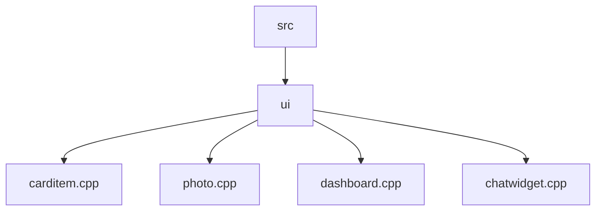
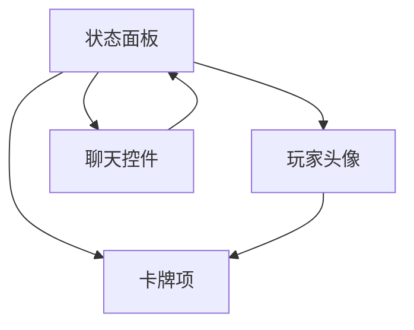
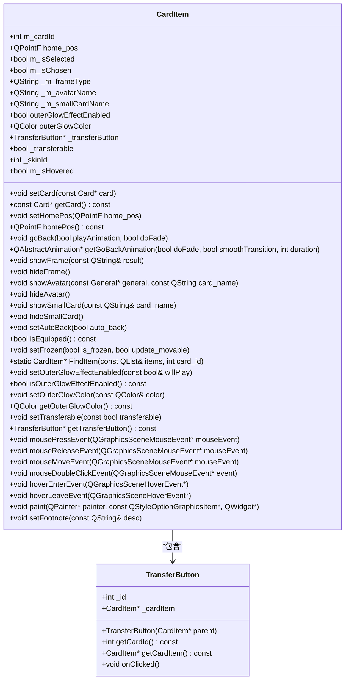
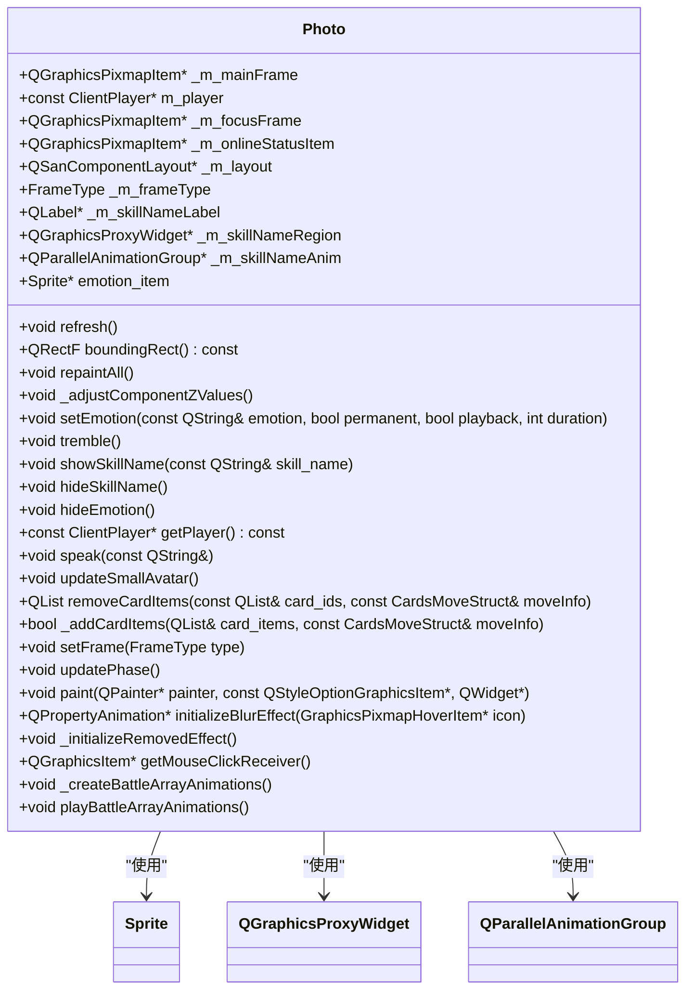
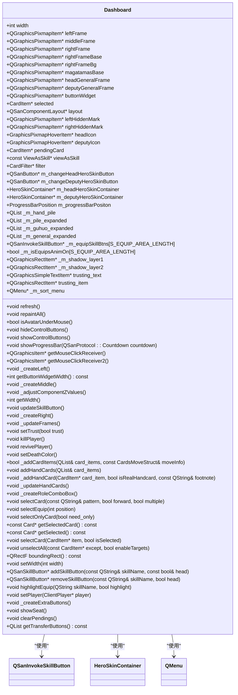
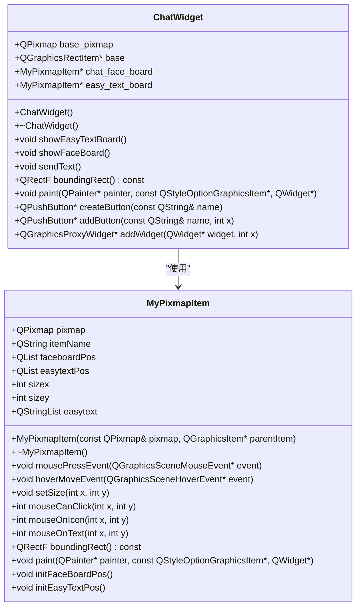

# 核心UI组件

<cite>
**本文档中引用的文件**   
- [carditem.cpp](file://src/ui/carditem.cpp)
- [carditem.h](file://src/ui/carditem.h)
- [photo.cpp](file://src/ui/photo.cpp)
- [photo.h](file://src/ui/photo.h)
- [dashboard.cpp](file://src/ui/dashboard.cpp)
- [dashboard.h](file://src/ui/dashboard.h)
- [chatwidget.cpp](file://src/ui/chatwidget.cpp)
- [chatwidget.h](file://src/ui/chatwidget.h)
</cite>

## 目录
1. [项目结构](#项目结构)
2. [核心组件](#核心组件)
3. [架构概述](#架构概述)
4. [详细组件分析](#详细组件分析)
5. [依赖分析](#依赖分析)
6. [性能考虑](#性能考虑)
7. [故障排除指南](#故障排除指南)
8. [结论](#结论)

## 项目结构

项目结构展示了核心UI组件位于`src/ui`目录下，主要包括卡牌项、玩家头像、状态面板和聊天控件等关键文件。

**图示来源**
- [carditem.cpp](file://src/ui/carditem.cpp)
- [photo.cpp](file://src/ui/photo.cpp)
- [dashboard.cpp](file://src/ui/dashboard.cpp)
- [chatwidget.cpp](file://src/ui/chatwidget.cpp)

**本节来源**
- [carditem.cpp](file://src/ui/carditem.cpp)
- [photo.cpp](file://src/ui/photo.cpp)
- [dashboard.cpp](file://src/ui/dashboard.cpp)
- [chatwidget.cpp](file://src/ui/chatwidget.cpp)

## 核心组件

核心UI组件包括卡牌项（carditem）、玩家头像（photo）、状态面板（dashboard）和聊天控件（chatwidget），它们共同构成了游戏界面的主要交互元素。

**本节来源**
- [carditem.cpp](file://src/ui/carditem.cpp)
- [photo.cpp](file://src/ui/photo.cpp)
- [dashboard.cpp](file://src/ui/dashboard.cpp)
- [chatwidget.cpp](file://src/ui/chatwidget.cpp)

## 架构概述

系统架构展示了各个UI组件之间的关系和交互方式，其中状态面板作为中心组件，集成了玩家信息和游戏状态。

**图示来源**
- [dashboard.cpp](file://src/ui/dashboard.cpp)
- [photo.cpp](file://src/ui/photo.cpp)
- [carditem.cpp](file://src/ui/carditem.cpp)
- [chatwidget.cpp](file://src/ui/chatwidget.cpp)

## 详细组件分析

### 卡牌项分析

卡牌项组件负责管理卡牌的视觉状态和交互逻辑，支持手牌、装备和弃牌堆等多种状态。

#### 类图

**图示来源**
- [carditem.cpp](file://src/ui/carditem.cpp#L1-L552)
- [carditem.h](file://src/ui/carditem.h)

**本节来源**
- [carditem.cpp](file://src/ui/carditem.cpp#L1-L552)
- [carditem.h](file://src/ui/carditem.h)

### 玩家头像分析

玩家头像组件实现了武将头像与血量显示机制，支持表情动画和技能名称显示等功能。

#### 类图

**图示来源**
- [photo.cpp](file://src/ui/photo.cpp#L1-L497)
- [photo.h](file://src/ui/photo.h)

**本节来源**
- [photo.cpp](file://src/ui/photo.cpp#L1-L497)
- [photo.h](file://src/ui/photo.h)

### 状态面板分析

状态面板组件集成了身份、体力、装备等信息的实时更新，是玩家主要的操作界面。

#### 类图

**图示来源**
- [dashboard.cpp](file://src/ui/dashboard.cpp#L1-L799)
- [dashboard.h](file://src/ui/dashboard.h)

**本节来源**
- [dashboard.cpp](file://src/ui/dashboard.cpp#L1-L799)
- [dashboard.h](file://src/ui/dashboard.h)

### 聊天控件分析

聊天控件组件提供了便捷的聊天功能，支持表情和快捷短语的发送。

#### 类图

**图示来源**
- [chatwidget.cpp](file://src/ui/chatwidget.cpp#L1-L252)
- [chatwidget.h](file://src/ui/chatwidget.h)

**本节来源**
- [chatwidget.cpp](file://src/ui/chatwidget.cpp#L1-L252)
- [chatwidget.h](file://src/ui/chatwidget.h)

## 依赖分析

各组件之间的依赖关系清晰，状态面板作为中心组件依赖于其他所有组件，而卡牌项、玩家头像和聊天控件则相对独立。

**图示来源**
- [dashboard.cpp](file://src/ui/dashboard.cpp)
- [photo.cpp](file://src/ui/photo.cpp)
- [carditem.cpp](file://src/ui/carditem.cpp)
- [chatwidget.cpp](file://src/ui/chatwidget.cpp)

**本节来源**
- [dashboard.cpp](file://src/ui/dashboard.cpp)
- [photo.cpp](file://src/ui/photo.cpp)
- [carditem.cpp](file://src/ui/carditem.cpp)
- [chatwidget.cpp](file://src/ui/chatwidget.cpp)

## 性能考虑

各组件在设计时都考虑了性能优化，如使用缓存、减少重绘和合理管理动画等。

## 故障排除指南

常见问题包括组件不显示、交互无响应等，可通过检查组件初始化、信号连接和样式设置来解决。

**本节来源**
- [carditem.cpp](file://src/ui/carditem.cpp)
- [photo.cpp](file://src/ui/photo.cpp)
- [dashboard.cpp](file://src/ui/dashboard.cpp)
- [chatwidget.cpp](file://src/ui/chatwidget.cpp)

## 结论

核心UI组件设计合理，功能完整，为游戏提供了良好的用户体验。