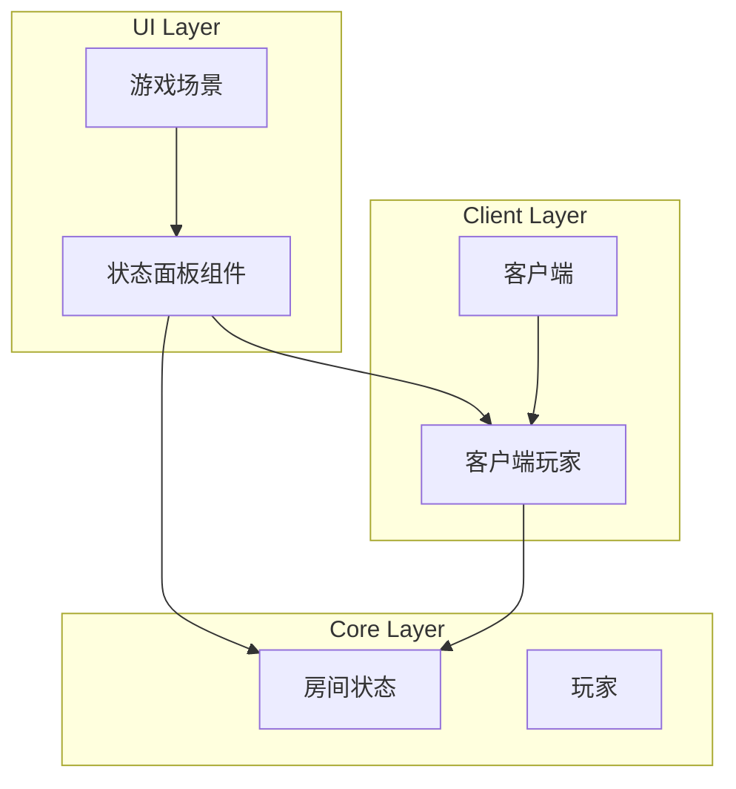
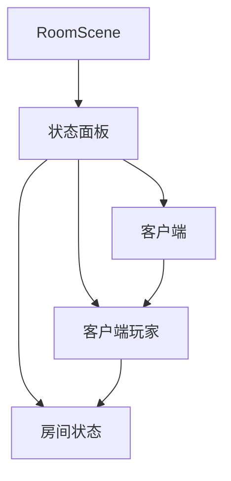

# 状态面板组件

<cite>
**本文档引用文件**   
- [dashboard.cpp](file://src/ui/dashboard.cpp)
- [dashboard.h](file://src/ui/dashboard.h)
- [roomstate.h](file://src/core/roomstate.h)
- [client.cpp](file://src/client/client.cpp)
- [client.h](file://src/client/client.h)
- [clientplayer.h](file://src/client/clientplayer.h)
- [roomscene.cpp](file://src/ui/roomscene.cpp)
</cite>

## 目录
1. [项目结构](#项目结构)
2. [核心组件](#核心组件)
3. [架构概述](#架构概述)
4. [详细组件分析](#详细组件分析)
5. [依赖分析](#依赖分析)
6. [性能考量](#性能考量)
7. [故障排除指南](#故障排除指南)
8. [结论](#结论)

## 项目结构

状态面板组件位于 `src/ui` 目录下，主要由 `dashboard.cpp` 和 `dashboard.h` 两个文件构成。该组件是游戏用户界面的核心部分，负责展示玩家的实时状态信息。项目结构清晰地将UI逻辑与核心游戏逻辑分离，`dashboard` 组件依赖于 `core` 和 `client` 模块提供的数据和状态管理功能。



**Diagram sources**
- [dashboard.cpp](file://src/ui/dashboard.cpp#L37-L69)
- [clientplayer.h](file://src/client/clientplayer.h#L15-L20)
- [roomstate.h](file://src/core/roomstate.h#L25-L30)

**Section sources**
- [dashboard.cpp](file://src/ui/dashboard.cpp#L37-L69)
- [dashboard.h](file://src/ui/dashboard.h#L38-L44)

## 核心组件

状态面板（Dashboard）是继承自 `PlayerCardContainer` 的核心UI组件，负责整合并展示玩家的身份、体力值、装备栏、技能按钮等关键信息。该组件通过信号槽机制与 `RoomState` 变化进行连接，实现数据的实时更新。

```cpp
Dashboard::Dashboard()
    : width(G_DASHBOARD_LAYOUT.m_leftWidth + G_DASHBOARD_LAYOUT.m_rightWidth + 20),
    leftFrame(NULL), middleFrame(NULL), rightFrame(NULL),
    ...
{
    _m_hand_pile = QList<int>();
    _m_pile_expanded = QList<int>();
    ...
}
```

**Section sources**
- [dashboard.cpp](file://src/ui/dashboard.cpp#L37-L69)
- [dashboard.h](file://src/ui/dashboard.h#L38-L44)

## 架构概述

状态面板采用分层布局架构，分为左、中、右三个主要区域。左侧区域显示装备和延时锦囊，中间区域显示手牌和控制按钮，右侧区域显示武将头像、身份和技能按钮。这种布局设计使得信息展示清晰有序，便于玩家快速获取关键游戏信息。

```mermaid
classDiagram
class Dashboard {
+int width
+QGraphicsPixmapItem* leftFrame
+QGraphicsPixmapItem* middleFrame
+QGraphicsPixmapItem* rightFrame
+QSanInvokeSkillDock* m_leftSkillDock
+QSanInvokeSkillDock* m_rightSkillDock
+CardItem* selected
+QList<CardItem*> m_handCards
+QList<CardItem*> m_leftCards
+QList<CardItem*> m_middleCards
+QList<CardItem*> m_rightCards
+QList<CardItem*> m_markCards
+QSanButton* m_trustButton
+QSanButton* m_btnReverseSelection
+QSanButton* m_btnSortHandcard
+QSanButton* m_btnNoNullification
+QGraphicsRectItem* trusting_item
+QGraphicsSimpleTextItem* trusting_text
+QMenu* _m_sort_menu
+QPropertyAnimation* _removedEffect
+QSanButton* m_changeHeadHeroSkinButton
+QSanButton* m_changeDeputyHeroSkinButton
+HeroSkinContainer* m_headHeroSkinContainer
+HeroSkinContainer* m_deputyHeroSkinContainer
+QHash<QString, PixmapAnimation*> _m_frameBorders
+QHash<QString, PixmapAnimation*> _m_roleBorders
+void _createLeft()
+void _createMiddle()
+void _createRight()
+void _createExtraButtons()
+void _adjustComponentZValues()
+void _createEquipBorderAnimations()
+void _createBattleArrayAnimations()
+void _createChainAnimation()
+void _updateFrames()
+void setTrust(bool trust)
+void killPlayer()
+void revivePlayer()
+void setDeathColor()
+bool _addCardItems(QList<CardItem*>&, const CardsMoveStruct&)
+void addHandCards(QList<CardItem*>&)
+void _addHandCard(CardItem*, bool, const QString&)
+void _updateHandCards()
+void _createRoleComboBox()
+void selectCard(const QString&, bool, bool)
+void selectEquip(int)
+void selectOnlyCard(bool)
+const Card* getSelectedCard() const
+const Card* getSelected() const
+void selectCard(CardItem*, bool)
+void unselectAll(const CardItem*, bool)
+void setPlayer(ClientPlayer*)
+void showSeat()
+void clearPendings()
+QList<TransferButton*> getTransferButtons() const
+void showProgressBar(QSanProtocol : : Countdown)
+QGraphicsItem* getMouseClickReceiver()
+QGraphicsItem* getMouseClickReceiver2()
+void updateSkillButton()
+QSanSkillButton* addSkillButton(const QString&, const bool&)
+QSanSkillButton* removeSkillButton(const QString&, bool)
+void highlightEquip(QString, bool)
+void _onEquipSelectChanged()
+void onCardItemClicked()
+void onCardItemDoubleClicked()
+void onCardItemThrown()
+void onMarkChanged()
+void onHeadStateChanged()
+void onDeputyStateChanged()
+void updateTrustButton()
+void bringSenderToTop()
+void resetSenderZValue()
+void onGuhuoCardClicked()
+void onGeneralCardClicked()
+void showHeroSkinList()
+void heroSkinButtonMouseOutsideClicked()
+void onAvatarHoverEnter()
+void onAvatarHoverLeave()
+void onSkinChangingStart()
+void onSkinChangingFinished()
}
class PlayerCardContainer {
+virtual void refresh()
+virtual void repaintAll()
+virtual void _adjustComponentZValues()
+virtual void addHandCards(QList<CardItem*>&)
+virtual QList<CardItem*> removeHandCards(const QList<int>&)
+virtual QGraphicsItem* _getEquipParent()
+virtual QGraphicsItem* _getDelayedTrickParent()
+virtual QGraphicsItem* _getAvatarParent()
+virtual QGraphicsItem* _getMarkParent()
+virtual QGraphicsItem* _getPhaseParent()
+virtual QGraphicsItem* _getRoleComboBoxParent()
+virtual QGraphicsItem* _getPileParent()
+virtual QGraphicsItem* _getProgressBarParent()
+virtual QGraphicsItem* _getFocusFrameParent()
+virtual QGraphicsItem* _getDeathIconParent()
+virtual QString getResourceKeyName()
+virtual QAbstractAnimation* _getPlayerRemovedEffect()
+void _createEquipBorderAnimations()
+void _setEquipBorderAnimation(int, bool)
+void drawEquip(QPainter*, const CardItem*, int)
+void setSelectedItem(CardItem*)
+void _initializeRemovedEffect()
}
Dashboard --|> PlayerCardContainer : "继承"
```



**Diagram sources**
- [dashboard.h](file://src/ui/dashboard.h#L38-L44)
- [dashboard.cpp](file://src/ui/dashboard.cpp#L37-L69)

## 详细组件分析

### 状态面板布局结构

状态面板采用三栏式布局设计，通过 `_createLeft()`、`_createMiddle()` 和 `_createRight()` 三个私有方法分别创建左、中、右三个区域。这种模块化的创建方式使得布局结构清晰，易于维护和扩展。

```cpp
void Dashboard::_createLeft()
{
    QRect rect = QRect(0, 0, G_DASHBOARD_LAYOUT.m_leftWidth, G_DASHBOARD_LAYOUT.m_normalHeight);
    _paintPixmap(leftFrame, rect, _getPixmap(QSanRoomSkin::S_SKIN_KEY_LEFTFRAME), this);
    leftFrame->setZValue(-1000);
    _createEquipBorderAnimations();
}

void Dashboard::_createMiddle()
{
    QRect rect = QRect(0, 0, 1, G_DASHBOARD_LAYOUT.m_normalHeight);
    _paintPixmap(middleFrame, rect, _getPixmap(QSanRoomSkin::S_SKIN_KEY_MIDDLEFRAME), this);
    middleFrame->setZValue(-1000);
    buttonWidget = new QGraphicsPixmapItem(G_ROOM_SKIN.getPixmap(QSanRoomSkin::S_SKIN_KEY_DASHBOARD_BUTTON_SET_BG)
        .scaled(G_DASHBOARD_LAYOUT.m_buttonSetSize));
    buttonWidget->setParentItem(middleFrame);
    ...
}

void Dashboard::_createRight()
{
    QRect rect = QRect(width - G_DASHBOARD_LAYOUT.m_rightWidth, 0,
        G_DASHBOARD_LAYOUT.m_rightWidth,
        G_DASHBOARD_LAYOUT.m_normalHeight);
    QPixmap pix = QPixmap(1, 1);
    pix.fill(QColor(0, 0, 0, 0));
    _paintPixmap(rightFrame, rect, pix, _m_groupMain);
    _paintPixmap(rightFrameBase, QRect(0, 0, rect.width(), rect.height()),
        _getPixmap(QSanRoomSkin::S_SKIN_KEY_RIGHTBASE), rightFrame);
    _paintPixmap(rightFrameBg, QRect(0, 0, rect.width(), rect.height()),
        _getPixmap(QSanRoomSkin::S_SKIN_KEY_RIGHTFRAME), rightFrame);
    ...
}
```

**Section sources**
- [dashboard.cpp](file://src/ui/dashboard.cpp#L205-L233)
- [dashboard.cpp](file://src/ui/dashboard.cpp#L197-L230)
- [dashboard.cpp](file://src/ui/dashboard.cpp#L320-L344)

### 数据更新机制

状态面板通过信号槽机制与 `RoomState` 变化进行连接，实现数据的实时更新。当房间状态发生变化时，相关的信号会被触发，状态面板组件会相应地更新其显示内容。

```cpp
void Dashboard::refresh()
{
    PlayerCardContainer::refresh();
    if (!m_player || !m_player->getGeneral() || !m_player->isAlive()) {
        _m_shadow_layer1->setBrush(Qt::NoBrush);
        _m_shadow_layer2->setBrush(Qt::NoBrush);
        leftHiddenMark->setVisible(false);
        rightHiddenMark->setVisible(false);
    } else if (m_player) {
        _m_shadow_layer1->setBrush(m_player->hasShownGeneral1() ? Qt::transparent : G_DASHBOARD_LAYOUT.m_generalShadowColor);
        _m_shadow_layer2->setBrush(m_player->hasShownGeneral2() ? Qt::transparent : G_DASHBOARD_LAYOUT.m_generalShadowColor);
        leftHiddenMark->setVisible(m_player->isHidden(true));
        rightHiddenMark->setVisible(m_player->isHidden(false));
    }
}
```

**Section sources**
- [dashboard.cpp](file://src/ui/dashboard.cpp#L158-L197)

### 用户交互响应逻辑

状态面板组件实现了丰富的用户交互功能，包括技能激活、卡牌使用等。通过连接各种信号和槽函数，实现了对用户操作的响应。

```cpp
void Dashboard::_createExtraButtons()
{
    m_trustButton = new QSanButton("handcard", "trust", this, true);
    m_trustButton->setStyle(QSanButton::S_STYLE_TOGGLE);
    m_btnReverseSelection = new QSanButton("handcard", "reverse-selection", this);
    m_btnSortHandcard = new QSanButton("handcard", "sort", this);
    m_btnNoNullification = new QSanButton("handcard", "nullification", this, true);
    m_btnNoNullification->setStyle(QSanButton::S_STYLE_TOGGLE);
    ...
    connect(m_trustButton, &QSanButton::clicked, RoomSceneInstance, &RoomScene::trust);
    connect(Self, &ClientPlayer::state_changed, this, &Dashboard::updateTrustButton);
    connect(m_btnReverseSelection, &QSanButton::clicked, this, &Dashboard::reverseSelection);
    connect(m_btnSortHandcard, &QSanButton::clicked, this, &Dashboard::sortCards);
    connect(m_btnNoNullification, &QSanButton::clicked, this, &Dashboard::cancelNullification);
}
```

**Section sources**
- [dashboard.cpp](file://src/ui/dashboard.cpp#L746-L768)
- [roomscene.cpp](file://src/ui/roomscene.cpp#L414-L449)

### 模块化设计思路

状态面板采用了高度模块化的设计思路，将不同的功能分离到独立的方法中。例如，`_createEquipBorderAnimations()` 负责创建装备边框动画，`_createBattleArrayAnimations()` 负责创建阵法动画，`_createChainAnimation()` 负责创建连环动画。这种设计使得代码结构清晰，便于维护和扩展。

```cpp
void Dashboard::_createEquipBorderAnimations()
{
    for (int i = 0; i < S_EQUIP_AREA_LENGTH; i++) {
        _m_equipBorders[i] = PixmapAnimation::GetPixmapAnimation(_getEquipParent(), "equip-border");
        _m_equipBorders[i]->setObjectName(QString("equip-border-%1").arg(i));
        _m_equipBorders[i]->setZValue(1001.0);
        _m_equipBorders[i]->hide();
    }
}
```

**Section sources**
- [dashboard.cpp](file://src/ui/dashboard.cpp#L205-L233)

### 可扩展性支持

状态面板组件通过 `addSkillButton()` 和 `removeSkillButton()` 方法支持插件式的技能按钮添加。这种设计使得新的技能可以很容易地集成到现有系统中，而不需要修改核心代码。

```cpp
QSanSkillButton *Dashboard::addSkillButton(const QString &skillName, const bool &head)
{
    // if it's a equip skill, add it to equip bar
    _mutexEquipAnim.lock();

    for (int i = 0; i < S_EQUIP_AREA_LENGTH; i++) {
        if (!_m_equipCards[i]) continue;
        const EquipCard *equip = qobject_cast<const EquipCard *>(_m_equipCards[i]->getCard()->getRealCard());
        Q_ASSERT(equip);
        const Skill *skill = Sanguosha->getSkill(equip);
        if (skill == NULL) continue;
        if (skill->objectName() == skillName) {
            Q_ASSERT(_m_equipSkillBtns[i] == NULL);
            _m_equipSkillBtns[i] = new QSanInvokeSkillButton(this);
            _m_equipSkillBtns[i]->setSkill(skill);
            _m_equipSkillBtns[i]->setVisible(false);
            connect(_m_equipSkillBtns[i], &QSanSkillButton::clicked, this, &Dashboard::_onEquipSelectChanged);
            connect(_m_equipSkillBtns[i], &QSanSkillButton::enable_changed, this, &Dashboard::_onEquipSelectChanged);
            QSanSkillButton *btn = _m_equipSkillBtns[i];
            _mutexEquipAnim.unlock();
            return btn;
        }
    }
    _mutexEquipAnim.unlock();
    ...
}
```

**Section sources**
- [dashboard.cpp](file://src/ui/dashboard.cpp#L158-L197)

### 不同游戏模式下的适配策略

状态面板组件通过条件编译和运行时检查来适应不同的游戏模式。例如，在Android平台上，技能按钮的位置和大小会根据屏幕尺寸进行调整。

```cpp
#ifdef Q_OS_ANDROID
    int screen_width = RoomSceneInstance->sceneRect().width();
    int screen_height = RoomSceneInstance->sceneRect().height();
    int plane_height = (screen_height - G_DASHBOARD_LAYOUT.m_normalHeight - G_ROOM_LAYOUT.m_chatTextBoxHeight) * (1 - G_ROOM_LAYOUT.m_logBoxHeightPercentage)
            + G_ROOM_LAYOUT.m_chatTextBoxHeight;
    m_leftSkillDock->setPos(screen_width * (1 - G_ROOM_LAYOUT.m_infoPlaneWidthPercentage),
                            10 -(screen_height - G_DASHBOARD_LAYOUT.m_normalHeight - plane_height));
    m_leftSkillDock->setWidth(screen_width * G_ROOM_LAYOUT.m_infoPlaneWidthPercentage / 2);

    m_rightSkillDock->setPos(screen_width * (1 - G_ROOM_LAYOUT.m_infoPlaneWidthPercentage / 2),
                             10 -(screen_height - G_DASHBOARD_LAYOUT.m_normalHeight - plane_height));
    m_leftSkillDock->setWidth(screen_width * G_ROOM_LAYOUT.m_infoPlaneWidthPercentage / 2);
    m_rightSkillDock->setWidth(screen_width * G_ROOM_LAYOUT.m_infoPlaneWidthPercentage / 2);
#endif
```

**Section sources**
- [dashboard.cpp](file://src/ui/dashboard.cpp#L158-L197)

## 依赖分析

状态面板组件依赖于多个核心模块，包括 `RoomState`、`ClientPlayer` 和 `Client`。这些依赖关系通过头文件包含和信号槽连接实现。



**Diagram sources**
- [dashboard.h](file://src/ui/dashboard.h#L38-L44)
- [clientplayer.h](file://src/client/clientplayer.h#L15-L20)
- [roomstate.h](file://src/core/roomstate.h#L25-L30)

**Section sources**
- [dashboard.cpp](file://src/ui/dashboard.cpp#L37-L69)
- [client.cpp](file://src/client/client.cpp#L154-L197)
- [client.h](file://src/client/client.h#L45-L48)

## 性能考量

状态面板组件在性能方面进行了多项优化，包括使用 `QPixmapCache` 缓存图像资源，使用 `QParallelAnimationGroup` 管理并行动画，以及通过 `QMutex` 保护共享资源的访问。

```cpp
void Dashboard::repaintAll()
{
    PlayerCardContainer::repaintAll();
    if (NULL != m_changeHeadHeroSkinButton) {
        m_changeHeadHeroSkinButton->setPos(layout->m_changeHeadHeroSkinButtonPos);
    }
    if (NULL != m_changeDeputyHeroSkinButton) {
        m_changeDeputyHeroSkinButton->setPos(layout->m_changeDeputyHeroSkinButtonPos);
    }

    QStringList kingdoms = Sanguosha->getKingdoms();
    kingdoms.removeAll("god");
    kingdoms.removeAll("careerist");
    foreach (const QString &kingdom, kingdoms) {
        _m_frameBorders[kingdom]->setSize(QSize(layout->m_avatarArea.width() * 2 * 1.1, layout->m_normalHeight * 1.2));
        _m_frameBorders[kingdom]->setPos(- layout->m_avatarArea.width() * 0.1, - layout->m_normalHeight * 0.1);
        double scale = G_ROOM_LAYOUT.scale;
        QPixmap pix;
        pix.load("image/system/roles/careerist.png");
        int w = pix.width() * scale;
        int h = pix.height() * scale;
        _m_roleBorders[kingdom]->setPos(G_DASHBOARD_LAYOUT.m_roleComboBoxPos
                                    - QPoint((_m_roleBorders[kingdom]->boundingRect().width() - w) / 2, (_m_roleBorders[kingdom]->boundingRect().height() - h) / 2));
    }
}
```

**Section sources**
- [dashboard.cpp](file://src/ui/dashboard.cpp#L158-L197)

## 故障排除指南

在开发和调试状态面板组件时，可能会遇到一些常见问题。以下是一些故障排除建议：

1. **布局错乱**：检查 `G_DASHBOARD_LAYOUT` 中的尺寸定义是否正确，确保 `_updateFrames()` 方法被正确调用。
2. **信号槽连接失败**：确认信号和槽函数的签名匹配，检查对象的生命周期是否正确。
3. **性能问题**：使用 `QPixmapCache` 缓存频繁使用的图像资源，避免不必要的重绘操作。
4. **跨平台兼容性问题**：使用条件编译处理不同平台的差异，如Android平台的特殊布局需求。

**Section sources**
- [dashboard.cpp](file://src/ui/dashboard.cpp#L158-L197)
- [roomscene.cpp](file://src/ui/roomscene.cpp#L414-L449)

## 结论

状态面板组件是游戏用户界面的核心部分，通过模块化设计和信号槽机制实现了高效的数据更新和用户交互。该组件的架构清晰，可扩展性强，能够适应不同的游戏模式和平台需求。通过对性能的优化和对依赖关系的合理管理，确保了游戏的流畅运行和良好的用户体验。