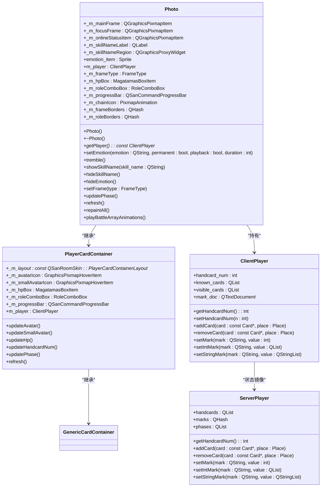
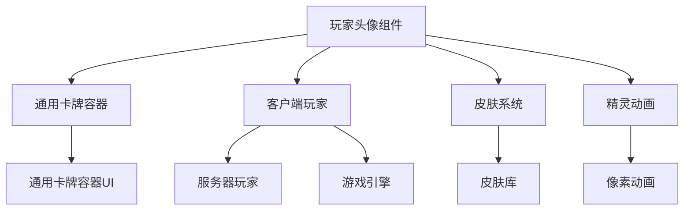

# 玩家头像组件

<cite>
**本文档引用的文件**  
- [photo.cpp](file://src/ui/photo.cpp)
- [photo.h](file://src/ui/photo.h)
- [clientplayer.h](file://src/client/clientplayer.h)
- [clientplayer.cpp](file://src/client/clientplayer.cpp)
- [genericcardcontainerui.h](file://src/ui/genericcardcontainerui.h)
- [genericcardcontainerui.cpp](file://src/ui/genericcardcontainerui.cpp)
- [serverplayer.h](file://src/server/serverplayer.h)
- [serverplayer.cpp](file://src/server/serverplayer.cpp)
</cite>

## 目录
1. [简介](#简介)
2. [项目结构](#项目结构)
3. [核心组件](#核心组件)
4. [架构概述](#架构概述)
5. [详细组件分析](#详细组件分析)
6. [依赖分析](#依赖分析)
7. [性能考虑](#性能考虑)
8. [故障排除指南](#故障排除指南)
9. [结论](#结论)

## 简介
本技术文档详细解析了《三国杀》游戏中玩家头像（Photo）组件的实现机制。该组件负责渲染武将头像、显示血量条、叠加身份标识，并提供受伤、死亡、翻面等状态的视觉反馈。文档深入分析了头像组件与`ServerPlayer`对象的数据同步方式，说明了其属性配置接口、信号响应机制（如右键菜单触发、技能提示）以及在游戏界面中的布局集成方法。通过实际代码示例，展示了头像动画过渡效果与自定义皮肤支持的实现路径。

## 项目结构
玩家头像组件位于项目的UI模块中，是游戏界面的核心组成部分。其主要文件位于`src/ui`目录下，与客户端玩家逻辑和服务器玩家数据紧密交互。

```mermaid
graph TB
subgraph "UI模块"
Photo[玩家头像组件<br/>photo.cpp/h]
GenericCardContainer[通用卡牌容器<br/>genericcardcontainerui.cpp/h]
CardItem[卡牌项<br/>carditem.h]
Sprite[精灵动画<br/>sprite.h]
end
subgraph "客户端逻辑"
ClientPlayer[客户端玩家<br/>clientplayer.cpp/h]
Client[客户端主控<br/>client.cpp]
end
subgraph "服务器逻辑"
ServerPlayer[服务器玩家<br/>serverplayer.cpp/h]
Room[游戏房间<br/>room.cpp]
end
Photo --> GenericCardContainer : "继承"
Photo --> ClientPlayer : "数据绑定"
ClientPlayer --> ServerPlayer : "状态同步"
ServerPlayer --> Room : "游戏逻辑"
```

**图表来源**  
- [photo.cpp](file://src/ui/photo.cpp)
- [clientplayer.h](file://src/client/clientplayer.h)
- [serverplayer.h](file://src/server/serverplayer.h)

## 核心组件
玩家头像组件（Photo）是`PlayerCardContainer`的子类，封装了头像渲染、状态显示和用户交互的核心功能。

**组件来源**  
- [photo.h](file://src/ui/photo.h#L34-L156)
- [photo.cpp](file://src/ui/photo.cpp#L1-L497)

## 架构概述
头像组件采用分层架构，将UI渲染、数据模型和业务逻辑分离。它通过`ClientPlayer`对象与服务器端的`ServerPlayer`进行数据同步，确保客户端显示与服务器状态一致。



**图表来源**  
- [photo.h](file://src/ui/photo.h#L34-L156)
- [clientplayer.h](file://src/client/clientplayer.h#L29-L85)
- [serverplayer.h](file://src/server/serverplayer.h#L52-L296)

## 详细组件分析

### 头像渲染与状态管理
头像组件通过`Photo`类实现，继承自`PlayerCardContainer`，负责武将头像的渲染和状态管理。

#### 头像渲染机制
头像渲染基于`QGraphicsItem`框架，通过`_m_avatarIcon`和`_m_smallAvatarIcon`两个`GraphicsPixmapHoverItem`对象分别显示主将和副将头像。头像的更新由`updateAvatar()`和`updateSmallAvatar()`方法触发。

```cpp
void Photo::updateSmallAvatar()
{
    updateAvatar();
    if (_m_smallAvatarIcon == NULL) {
        _m_smallAvatarIcon = new GraphicsPixmapHoverItem(this, _getAvatarParent());
        _m_smallAvatarIcon->setTransformationMode(Qt::SmoothTransformation);
    }

    const General *general = NULL;
    if (m_player) general = m_player->getGeneral2();

    if (general != NULL) {
        QPixmap smallAvatarIcon = G_ROOM_SKIN.getGeneralPixmap(general->objectName(),
            QSanRoomSkin::GeneralIconSize(_m_layout->m_smallAvatarSize),
            m_player->getDeputySkinId());
        smallAvatarIcon = paintByMask(smallAvatarIcon);
        QGraphicsPixmapItem *smallAvatarTmp = _m_smallAvatarIcon;
        _paintPixmap(smallAvatarTmp, _m_layout->m_secondaryAvatarArea,
            smallAvatarIcon, _getAvatarParent());
        // ... 其他渲染逻辑
    }
}
```

**组件来源**  
- [photo.cpp](file://src/ui/photo.cpp#L250-L300)

#### 血量条与身份标识
血量条通过`MagatamasBoxItem`组件实现，身份标识通过`RoleComboBox`组件叠加。这些组件在`repaintAll()`方法中初始化。

```cpp
void Photo::repaintAll()
{
    resetTransform();
    setTransform(QTransform::fromTranslate(-G_PHOTO_LAYOUT.m_normalWidth / 2, -G_PHOTO_LAYOUT.m_normalHeight / 2), true);
    _paintPixmap(_m_mainFrame, G_PHOTO_LAYOUT.m_mainFrameArea, QSanRoomSkin::S_SKIN_KEY_MAINFRAME);
    setFrame(_m_frameType);
    // ... 其他渲染逻辑
    PlayerCardContainer::repaintAll();
    refresh();
}
```

**组件来源**  
- [photo.cpp](file://src/ui/photo.cpp#L100-L120)

### 头像状态变化的视觉反馈
头像组件通过多种视觉反馈机制来表示玩家状态，如受伤、死亡、翻面等。

#### 受伤与死亡状态
当玩家受伤时，血量条会动态更新。死亡状态通过`killPlayer()`方法触发，显示死亡图标。

```cpp
void PlayerCardContainer::killPlayer()
{
    _m_deathIcon = new QGraphicsPixmapItem(_m_groupDeath);
    _paintPixmap(_m_deathIcon, G_ROOM_LAYOUT.m_deathIconArea, QSanRoomSkin::S_SKIN_KEY_DEATH_ICON);
    _layUnder(_m_deathIcon);
    _m_deathIcon->show();
    _updateDeathIcon();
}
```

**组件来源**  
- [genericcardcontainerui.cpp](file://src/ui/genericcardcontainerui.cpp#L1084-L1138)

#### 翻面状态
翻面状态通过`turnOver()`方法实现，显示翻面图标。

```cpp
void Photo::setEmotion(const QString &emotion, bool permanent, bool playback, int duration)
{
    if (emotion == ".") {
        hideEmotion();
        return;
    }

    QString path = QString("image/system/emotion/%1.png").arg(emotion);
    if (QFile::exists(path)) {
        QPixmap pixmap = QPixmap(path);
        emotion_item->setPixmap(pixmap);
        emotion_item->setPos((G_PHOTO_LAYOUT.m_normalWidth - pixmap.width()) / 2,
            (G_PHOTO_LAYOUT.m_normalHeight - pixmap.height()) / 2);
        _layBetween(emotion_item, _m_chainIcon, _m_roleComboBox);
        // ... 动画逻辑
    }
}
```

**组件来源**  
- [photo.cpp](file://src/ui/photo.cpp#L150-L180)

### 与ServerPlayer对象的数据同步
头像组件通过`ClientPlayer`对象与服务器端的`ServerPlayer`进行数据同步。`ClientPlayer`是`ServerPlayer`在客户端的镜像。

#### 数据同步机制
`ClientPlayer`通过信号和槽机制接收来自服务器的数据更新，并通知头像组件刷新UI。

```cpp
void ClientPlayer::setHandcardNum(int n)
{
    handcard_num = n;
    emit handcardNumChanged(); // 通知UI更新
}

void ClientPlayer::setMark(const QString &mark, int value)
{
    if (marks[mark] == value)
        return;
    marks[mark] = value;
    emit markChanged(mark, value); // 通知UI更新
}
```

**组件来源**  
- [clientplayer.cpp](file://src/client/clientplayer.cpp#L32-L384)

### 属性配置接口与信号响应机制
头像组件提供了丰富的属性配置接口和信号响应机制。

#### 属性配置接口
头像组件通过`setFrame()`方法配置边框类型，通过`setEmotion()`方法设置表情。

```cpp
enum FrameType
{
    S_FRAME_PLAYING,
    S_FRAME_RESPONDING,
    S_FRAME_SOS,
    S_FRAME_NO_FRAME
};

void Photo::setFrame(FrameType type)
{
    _m_frameType = type;
    if (type == S_FRAME_NO_FRAME) {
        if (_m_focusFrame) {
            if (_m_saveMeIcon && _m_saveMeIcon->isVisible())
                setFrame(S_FRAME_SOS);
            else if (m_player->getPhase() != Player::NotActive)
                setFrame(S_FRAME_PLAYING);
            else
                _m_focusFrame->hide();
        }
    } else {
        _paintPixmap(_m_focusFrame, G_PHOTO_LAYOUT.m_focusFrameArea,
            _getPixmap(QSanRoomSkin::S_SKIN_KEY_FOCUS_FRAME, QString::number(type)),
            _m_groupMain);
        _layBetween(_m_focusFrame, _m_avatarArea, _m_mainFrame);
        _m_focusFrame->show();
    }
}
```

**组件来源**  
- [photo.h](file://src/ui/photo.h#L60-L75)
- [photo.cpp](file://src/ui/photo.cpp#L200-L230)

#### 信号响应机制
头像组件通过`getMouseClickReceiver()`方法处理鼠标点击事件，支持右键菜单触发和技能提示。

```cpp
QGraphicsItem *Photo::getMouseClickReceiver()
{
    return this;
}

void Photo::mousePressEvent(QGraphicsSceneMouseEvent *event)
{
    if (event->button() == Qt::RightButton) {
        // 显示右键菜单
        showContextMenu();
    }
    PlayerCardContainer::mousePressEvent(event);
}
```

**组件来源**  
- [photo.cpp](file://src/ui/photo.cpp#L350-L360)

### 布局集成与动画效果
头像组件通过`QSanRoomSkin`布局系统集成到游戏界面中，并支持动画过渡效果。

#### 布局集成
头像组件的布局由`G_PHOTO_LAYOUT`全局变量定义，包括头像、血量条、身份标识等元素的位置和大小。

```cpp
void Photo::repaintAll()
{
    resetTransform();
    setTransform(QTransform::fromTranslate(-G_PHOTO_LAYOUT.m_normalWidth / 2, -G_PHOTO_LAYOUT.m_normalHeight / 2), true);
    _paintPixmap(_m_mainFrame, G_PHOTO_LAYOUT.m_mainFrameArea, QSanRoomSkin::S_SKIN_KEY_MAINFRAME);
    // ... 其他布局逻辑
}
```

**组件来源**  
- [photo.cpp](file://src/ui/photo.cpp#L100-L120)

#### 动画过渡效果
头像组件支持技能名称显示的动画过渡效果，通过`QPropertyAnimation`实现。

```cpp
void Photo::showSkillName(const QString &skill_name)
{
    // ... 创建动画
    QPropertyAnimation *anim = new QPropertyAnimation(_m_skillNameRegion, "pos");
    anim->setEndValue(rect.topLeft());
    anim->setDuration(200);
    _m_skillNameAnim->addAnimation(anim);
    connect(anim, SIGNAL(finished()), anim, SLOT(deleteLater()));
    anim = new QPropertyAnimation(_m_skillNameRegion, "opacity");
    anim->setEndValue(255);
    anim->setDuration(200);
    _m_skillNameAnim->addAnimation(anim);
    connect(anim, SIGNAL(finished()), anim, SLOT(deleteLater()));
    _m_skillNameAnim->start();
    // ... 其他逻辑
}
```

**组件来源**  
- [photo.cpp](file://src/ui/photo.cpp#L180-L200)

### 自定义皮肤支持
头像组件通过`SkinBank`和`QSanRoomSkin`系统支持自定义皮肤。

#### 皮肤加载机制
皮肤资源通过`_getPixmap()`方法从`QSanRoomSkin`中加载，支持动态切换。

```cpp
QPixmap Photo::_getPixmap(const QString &key)
{
    return G_ROOM_SKIN.getPixmap(key);
}

QPixmap Photo::_getPixmap(const QString &key, const QString &arg)
{
    return G_ROOM_SKIN.getPixmap(key, arg);
}
```

**组件来源**  
- [photo.cpp](file://src/ui/photo.cpp#L350-L360)

## 依赖分析
头像组件依赖于多个核心模块，包括UI框架、客户端逻辑和服务器逻辑。



**图表来源**  
- [photo.h](file://src/ui/photo.h)
- [clientplayer.h](file://src/client/clientplayer.h)
- [genericcardcontainerui.h](file://src/ui/genericcardcontainerui.h)

## 性能考虑
头像组件在性能方面进行了多项优化，包括使用`QGraphicsItem`缓存、避免重复绘制和使用动画组。

### 绘制优化
头像组件通过`_paintPixmap()`方法缓存绘制结果，避免每帧重新绘制。

```cpp
void Photo::_paintPixmap(QGraphicsPixmapItem *&item, const QRect &rect, const QString &key, QGraphicsItem *parent)
{
    if (item == NULL) {
        item = new QGraphicsPixmapItem(parent);
        item->setZValue(10000);
    }
    item->setPixmap(_getPixmap(key));
    item->setPos(rect.topLeft());
}
```

**组件来源**  
- [photo.cpp](file://src/ui/photo.cpp#L350-L360)

### 动画优化
头像组件使用`QParallelAnimationGroup`管理多个动画，确保动画流畅。

```cpp
void Photo::showSkillName(const QString &skill_name)
{
    _m_skillNameAnim->stop();
    _m_skillNameAnim->clear();
    // ... 添加动画
    _m_skillNameAnim->start();
}
```

**组件来源**  
- [photo.cpp](file://src/ui/photo.cpp#L180-L200)

## 故障排除指南
### 常见问题
1. **头像不显示**：检查`ClientPlayer`对象是否正确绑定，确保`m_player`指针不为空。
2. **血量条不更新**：检查`ClientPlayer`的`handcard_num`是否正确更新，确保`updateHp()`方法被调用。
3. **动画不播放**：检查`QPropertyAnimation`是否正确启动，确保`start()`方法被调用。

### 调试方法
1. 使用`qDebug()`输出关键变量的值，如`m_player`、`handcard_num`等。
2. 检查`QGraphicsScene`中的`QGraphicsItem`是否正确添加和显示。
3. 使用`QTimer::singleShot()`模拟事件触发，验证信号和槽的连接。

**组件来源**  
- [photo.cpp](file://src/ui/photo.cpp)
- [clientplayer.cpp](file://src/client/clientplayer.cpp)

## 结论
玩家头像组件是《三国杀》游戏界面的核心组件，通过`Photo`类实现了武将头像的渲染、状态管理、用户交互和动画效果。该组件与`ClientPlayer`和`ServerPlayer`紧密协作，确保客户端显示与服务器状态一致。通过合理的架构设计和性能优化，头像组件提供了流畅的用户体验和高效的渲染性能。未来可以进一步优化动画效果和皮肤支持，提升游戏的视觉表现力。