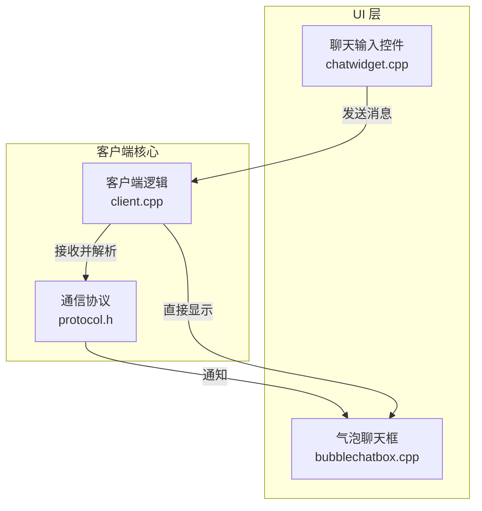
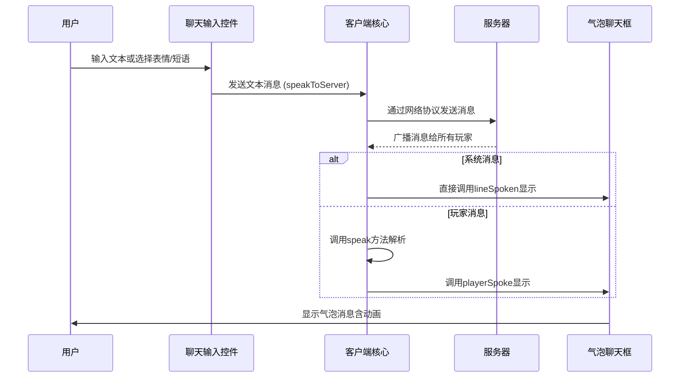
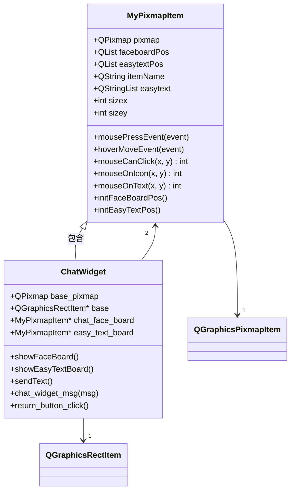
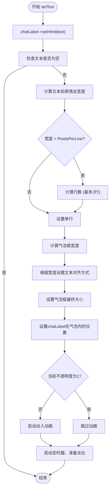
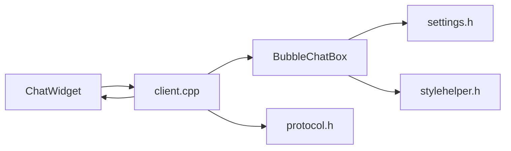

# 聊天控件组件

<cite>
**本文档中引用的文件**  
- [chatwidget.cpp](file://src/ui/chatwidget.cpp)
- [bubblechatbox.cpp](file://src/ui/bubblechatbox.cpp)
- [client.cpp](file://src/client/client.cpp)
- [protocol.h](file://src/core/protocol.h)
- [client.h](file://src/client/client.h)
</cite>

## 目录
1. [简介](#简介)
2. [项目结构](#项目结构)
3. [核心组件](#核心组件)
4. [架构概览](#架构概览)
5. [详细组件分析](#详细组件分析)
6. [依赖分析](#依赖分析)
7. [性能考虑](#性能考虑)
8. [故障排除指南](#故障排除指南)
9. [结论](#结论)

## 简介
本技术文档系统性地阐述了《三国杀：霸业》游戏中聊天控件（ChatWidget）与气泡式聊天框（BubbleChatBox）的完整实现。文档覆盖了消息的输入、发送、接收、解析、显示以及历史记录管理等核心功能。重点分析了`chatwidget.cpp`和`bubblechatbox.cpp`两个核心文件，详细说明了其架构设计、事件处理流程、与服务器的通信协议对接机制，并探讨了私聊、全体、观战等频道的切换逻辑。此外，文档还提供了API接口说明、安全性扩展点（如敏感词过滤）以及自定义样式和多语言适配方案。

## 项目结构
聊天控件功能主要分布在`src/ui`目录下，其核心实现由`chatwidget.cpp`和`bubblechatbox.cpp`两个文件构成。`chatwidget.cpp`负责用户输入界面的构建和交互，而`bubblechatbox.cpp`则专注于消息的气泡式渲染与动画效果。这两个组件通过信号与槽机制与客户端核心模块（`client.cpp`）进行通信，共同完成聊天功能。

**图示来源**
- [chatwidget.cpp](file://src/ui/chatwidget.cpp)
- [bubblechatbox.cpp](file://src/ui/bubblechatbox.cpp)
- [client.cpp](file://src/client/client.cpp)
- [protocol.h](file://src/core/protocol.h)

**本节来源**
- [chatwidget.cpp](file://src/ui/chatwidget.cpp)
- [bubblechatbox.cpp](file://src/ui/bubblechatbox.cpp)

## 核心组件
聊天系统的核心由两个主要组件构成：`ChatWidget` 和 `BubbleChatBox`。

`ChatWidget` 是一个继承自 `QGraphicsItem` 的复合控件，它集成了一个基础背景、一个返回按钮、一个表情按钮和一个快捷短语按钮。用户可以通过点击表情按钮弹出表情面板（`chat_face_board`），或点击快捷短语按钮弹出短语面板（`easy_text_board`）。这两个面板都是 `MyPixmapItem` 的实例，它们通过鼠标事件处理来捕获用户的点击，并将选中的表情代码（如`<#1#>`）或短语文本作为信号发出。

`BubbleChatBox` 是一个继承自 `QGraphicsObject` 的气泡式消息显示控件。它使用一张背景图片（`bubble.png`）作为气泡的外形，并通过 `QPropertyAnimation` 实现淡入淡出的动画效果。其内部包含一个 `BubbleChatLabel`，该标签继承自 `QGraphicsTextItem`，用于渲染实际的聊天内容。`BubbleChatBox` 能够根据文本内容自动调整自身大小，并在指定区域居中显示。

**本节来源**
- [chatwidget.cpp](file://src/ui/chatwidget.cpp)
- [bubblechatbox.cpp](file://src/ui/bubblechatbox.cpp)

## 架构概览
整个聊天系统的架构遵循典型的MVC（Model-View-Controller）模式，但更侧重于视图（View）和控制器（Controller）的分离。

**图示来源**
- [chatwidget.cpp](file://src/ui/chatwidget.cpp#L167-L175)
- [client.cpp](file://src/client/client.cpp#L2381-L2427)
- [bubblechatbox.cpp](file://src/ui/bubblechatbox.cpp#L75-L118)

**本节来源**
- [chatwidget.cpp](file://src/ui/chatwidget.cpp)
- [client.cpp](file://src/client/client.cpp)
- [bubblechatbox.cpp](file://src/ui/bubblechatbox.cpp)

## 详细组件分析
### ChatWidget 分析
`ChatWidget` 组件是用户与聊天系统交互的入口。

#### 类结构与事件处理

**图示来源**
- [chatwidget.cpp](file://src/ui/chatwidget.cpp#L1-L130)

**本节来源**
- [chatwidget.cpp](file://src/ui/chatwidget.cpp)

`MyPixmapItem` 类是 `ChatWidget` 的内部辅助类，用于承载表情面板和快捷短语面板。它重写了 `mousePressEvent` 和 `hoverMoveEvent` 方法，实现了鼠标悬停时的光标变化和点击时的区域判断。`mouseCanClick` 方法通过遍历预定义的 `QRect` 列表（`faceboardPos` 和 `easytextPos`）来确定鼠标点击的具体位置，并返回对应的索引。

`ChatWidget` 的构造函数中，通过 `addButton` 方法创建了三个按钮，并使用 `addWidget` 将它们添加到 `base` 项上。同时，它创建了 `chat_face_board` 和 `easy_text_board` 两个 `MyPixmapItem` 实例，并通过信号 `my_pixmap_item_msg` 与自身的 `chat_widget_msg` 槽函数连接。当用户在面板上点击时，会发出消息，`ChatWidget` 接收到后，会将消息内容（表情代码或短语）暂存。当用户点击“返回”按钮时，`sendText` 槽函数被调用，它会隐藏所有面板，并发出 `return_button_click` 信号，通知上层控件（如 `RoomScene`）获取并发送最终的聊天文本。

### BubbleChatBox 分析
`BubbleChatBox` 组件负责将接收到的聊天消息以美观的气泡形式呈现给用户。

#### 消息渲染与布局

**图示来源**
- [bubblechatbox.cpp](file://src/ui/bubblechatbox.cpp#L75-L118)

**本节来源**
- [bubblechatbox.cpp](file://src/ui/bubblechatbox.cpp)

`BubbleChatBox` 的核心方法是 `setText`。当接收到新的消息时，该方法首先将消息设置为 `chatLabel` 的HTML内容。然后，它使用 `QFontMetrics` 计算纯文本的宽度，并统计消息中包含的表情数量（通过 `</img>` 标签计数），从而得出消息的总宽度。如果总宽度超过单行最大像素（`PixelsPerLine`），则需要换行，但最多只显示两行（`MaxLineCount`）。根据计算出的宽度，`BubbleChatBox` 会动态调整自身的大小（`rect`），并相应地设置 `chatLabel` 的文本宽度和在气泡内的位置。最后，它会启动一个淡入动画（如果当前不可见），并启动一个定时器，用于在一段时间后自动淡出并销毁该气泡。

## 依赖分析
聊天控件组件与其他模块存在紧密的依赖关系。

**图示来源**
- [chatwidget.cpp](file://src/ui/chatwidget.cpp#L167-L175)
- [bubblechatbox.cpp](file://src/ui/bubblechatbox.cpp#L1-L10)
- [client.cpp](file://src/client/client.cpp#L2381-L2427)

**本节来源**
- [chatwidget.cpp](file://src/ui/chatwidget.cpp)
- [bubblechatbox.cpp](file://src/ui/bubblechatbox.cpp)
- [client.cpp](file://src/client/client.cpp)

`ChatWidget` 依赖于 `Client` 类来发送消息。`BubbleChatBox` 依赖于 `Settings` 模块获取配置（如气泡显示时长 `Config.BubbleChatBoxKeepSeconds`），并依赖于 `StyleHelper` 获取字体。`Client` 类是整个通信的核心，它不仅处理来自 `ChatWidget` 的发送请求，还将从服务器接收到的原始消息（`speak` 命令）进行解析和格式化，然后分发给 `BubbleChatBox` 进行显示。`Client` 类通过 `playerSpoke` 和 `lineSpoken` 信号与UI层通信，这两个信号在 `client.h` 中声明。

## 性能考虑
`BubbleChatBox` 的设计充分考虑了性能。它使用 `QPropertyAnimation` 来实现平滑的淡入淡出效果，避免了手动重绘带来的性能开销。通过 `setFlag(ItemClipsChildrenToShape)`，确保了子项不会超出气泡的遮罩区域，提升了渲染效率。此外，气泡的大小是动态计算的，避免了为不同长度的消息创建不同大小的图片资源，节省了内存。定时器的使用也确保了过期消息能被及时清理，防止内存泄漏。

## 故障排除指南
*   **问题：点击表情或快捷短语无反应。**
    **原因与解决**：检查 `MyPixmapItem` 的 `mousePressEvent` 是否被正确触发。确保 `faceboardPos` 和 `easytextPos` 的坐标计算正确，且与图片上的实际区域匹配。确认信号 `my_pixmap_item_msg` 已正确连接到 `ChatWidget` 的槽函数。

*   **问题：气泡消息不显示或显示异常。**
    **原因与解决**：检查 `Client` 类的 `speak` 方法是否被调用。确认消息的格式是否正确，特别是表情代码 `<#1#>` 是否被正确替换为 `` 标签。检查 `BubbleChatBox` 的 `area` 区域是否有效，以及 `scene()` 是否正确设置。

*   **问题：气泡位置偏移。**
    **原因与解决**：`updatePos` 方法负责将气泡居中显示在 `area` 区域内。检查传入的 `QRect &area` 参数是否正确，以及 `area` 的坐标系是否与 `BubbleChatBox` 所在的场景坐标系一致。

**本节来源**
- [chatwidget.cpp](file://src/ui/chatwidget.cpp)
- [bubblechatbox.cpp](file://src/ui/bubblechatbox.cpp)
- [client.cpp](file://src/client/client.cpp)

## 结论
`ChatWidget` 和 `BubbleChatBox` 组件共同构建了一个功能完整、交互流畅的聊天系统。`ChatWidget` 提供了直观的输入和选择界面，而 `BubbleChatBox` 则以现代化的气泡形式呈现消息，提升了用户体验。两者通过清晰的信号与槽机制与客户端核心解耦，保证了代码的可维护性。该实现充分运用了Qt的图形视图框架和动画系统，展现了良好的架构设计和性能优化。未来可在此基础上轻松扩展，例如增加更丰富的表情支持、消息历史记录功能或更复杂的敏感词过滤机制。