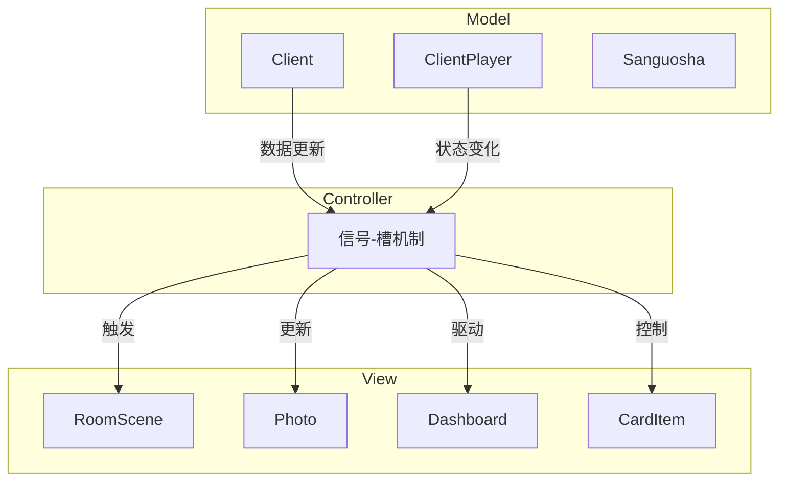

# 用户界面

<cite>
**本文档引用的文件**   
- [roomscene.cpp](file://src/ui/roomscene.cpp)
- [mainwindow.cpp](file://src/dialog/mainwindow.cpp)
- [defaultSkin.layout.json](file://skins/defaultSkin.layout.json)
- [skinList.json](file://skins/skinList.json)
</cite>

## 目录
1. [项目结构](#项目结构)
2. [核心组件](#核心组件)
3. [架构概述](#架构概述)
4. [详细组件分析](#详细组件分析)
5. [皮肤系统](#皮肤系统)
6. [UI组件关系图](#uicomponentrelationshipdiagram)
7. [皮肤加载流程图](#skinloadingflowdiagram)
8. [自定义皮肤配置示例](#自定义皮肤配置示例)
9. [CSS样式修改指南](#css样式修改指南)

## 项目结构

该项目采用模块化分层架构，主要分为以下几个目录：

- **ai-selector**: AI权重配置文件
- **etc\customScenes**: 自定义场景配置
- **extension-doc**: 扩展功能Lua脚本文档
- **extensions**: 游戏扩展Lua脚本
- **image\big-card**: 卡牌图像资源
- **include**: 第三方库头文件（FMOD音频、FreeType字体等）
- **lang\zh_CN**: 中文语言资源
- **lua**: 游戏逻辑Lua脚本
- **resource\android**: Android资源文件
- **rule**: 游戏规则文档
- **skins**: 界面皮肤配置文件
- **src**: C++源代码
  - **breakpad**: 崩溃报告系统
  - **client**: 客户端核心逻辑
  - **core**: 游戏引擎核心
  - **dialog**: 对话框实现
  - **ui**: 用户界面组件
  - **server**: 服务器逻辑
- **style-sheet**: CSS样式表
- **ui-script**: 前端JavaScript

**Section sources**
- [roomscene.cpp](file://src/ui/roomscene.cpp)
- [mainwindow.cpp](file://src/dialog/mainwindow.cpp)

## 核心组件

用户界面系统基于Qt框架实现，采用MVC变体架构：

- **Model (模型)**: `ClientPlayer`、`Client`类管理游戏状态和玩家数据
- **View (视图)**: `RoomScene`、`Photo`、`Dashboard`等类负责界面渲染
- **Controller (控制器)**: 通过信号-槽机制连接模型和视图

主要UI组件包括：
- `RoomScene`: 游戏主场景，管理所有界面元素
- `Photo`: 玩家头像面板
- `Dashboard`: 玩家自己的控制面板
- `CardItem`: 卡牌项
- `QSanButton`: 自定义按钮

**Section sources**
- [roomscene.cpp](file://src/ui/roomscene.cpp#L1-L100)
- [mainwindow.cpp](file://src/dialog/mainwindow.cpp#L1-L50)

## 架构概述



**Diagram sources**
- [roomscene.cpp](file://src/ui/roomscene.cpp#L1-L50)
- [mainwindow.cpp](file://src/dialog/mainwindow.cpp#L1-L30)

## 详细组件分析

### RoomScene分析

`RoomScene`是游戏主界面的核心类，负责管理整个游戏场景。

```mermaid
classDiagram
    class RoomScene {
        +game_started: bool
        +battle_started: bool
        +main_window: QMainWindow*
        +photos: QList<Photo*>
        +m_tablePile: TablePile*
        +dashboard: Dashboard*
        +chatBox: QTextEdit*
        +log_box: ClientLogBox*
        +m_guanxingBox: GuanxingBox*
        +m_cardchooseBox: CardChooseBox*
        +m_fieldcardtransferBox: FieldCardTransferBox*
        +m_pindianBox: PindianBox*
        +m_chooseGeneralBox: ChooseGeneralBox*
        +m_chooseOptionsBox: ChooseOptionsBox*
        +m_chooseTriggerOrderBox: ChooseTriggerOrderBox*
        +m_chooseHuashenSkillBox: ChooseHuashenSkillBox*
        +m_playerCardBox: PlayerCardBox*
        +m_chooseSuitBox: ChooseSuitBox*
        +m_cardContainer: CardContainer*
        +pileContainer: CardContainer*
        +ok_button: QSanButton*
        +cancel_button: QSanButton*
        +discard_button: QSanButton*
        +m_replayControl: ReplayerControlBar*
        +m_skillButtons: QList<QSanSkillButton*>
        +current_guhuo_box: GuhuoBox*
        +pausing_item: QGraphicsRectItem*
        +pausing_text: QGraphicsSimpleTextItem*
        +animations: EffectAnimation*
        +prompt_box_widget: PromptInfoItem*
        +m_rolesBox: QGraphicsPixmapItem*
        +m_pileCardNumInfoTextBox: QGraphicsTextItem*
        +add_robot: Button*
        +fill_robots: Button*
        +return_to_start_scene: Button*
        +control_panel: QGraphicsRectItem*
        +chat_widget: ChatWidget*
        +chat_edit_widget: QGraphicsProxyWidget*
        +chat_box_widget: QGraphicsProxyWidget*
        +log_box_widget: QGraphicsProxyWidget*
        +_m_roomSkin: const QSanRoomSkin*
        +_m_roomLayout: const QSanRoomLayout*
        +_m_photoLayout: const QSanPhotoLayout*
        +_m_commonLayout: const QSanCommonLayout*
        +m_isInDragAndUseMode: bool
        +m_superDragStarted: bool
        +m_mousePressed: bool
        +_m_last_front_item: QGraphicsItem*
        +_m_last_front_ZValue: qreal
        +m_skillButtonSank: bool
        +response_skill: ResponseSkill*
        +showorpindian_skill: ShowOrPindianSkill*
        +discard_skill: DiscardSkill*
        +yiji_skill: YijiViewAsSkill*
        +choose_skill: ChoosePlayerSkill*
        +exchange_skill: ExchangeSkill*
        +miscellaneous_menu: QMenu*
        -createDashboardButtons()
        -showDashboardButtons(bool can_discard)
        -hideDashboardButtons()
        -createReplayControlBar()
        -onSceneRectChanged(const QRectF &rect)
        -bringToFront(QGraphicsItem *item)
        -updateHandcardNum(int num)
        -updateHandPile(const QList<CardsMoveStruct> &moves)
        -getCards(const CardsMoveStruct &move)
        -loseCards(const CardsMoveStruct &move)
        -moveCardToPile(const CardsMoveStruct &move)
        -takeAmazingGrace(const QList<int> &ids)
        -fillCards(const QList<int> &ids)
        -doOkButton()
        -doCancelButton()
        -doDiscardButton()
        -doScript()
        -speak()
        -showBubbleChatBox(const QString &speaker, const QString &content)
        -appendChatEdit(const QString &text)
        -enableTargets(const Card *card)
        -setDashboardShadow(bool dead)
        -changeHp(const QString &who, int hp, int lost)
        -changeMaxHp(const QString &who, int maxHp)
        -killPlayer(const QString &who)
        -revivePlayer(const QString &who)
        -moveFocus(const QString &who)
        -setEmotion(const QString &who, const QString &emotion, bool permanent = false, int duration = 0)
        -showSkillInvocation(const QString &who, const QString &skill_name)
        -acquireSkill(const QString &who, const QString &skill_name, bool head = true)
        -attachSkill(const QString &skill_name, bool head = true)
        -detachSkill(const QString &skill_name, bool head = true)
        -updateSkillButtons()
        -addPlayer(ClientPlayer *player)
        -removePlayer(ClientPlayer *player)
        -arrangeSeats()
        -updateStatus(Client::Status status)
        -hideAvatars()
        -showCard(const Card *card, const QString &who)
        -doGongxin(const QList<int> &card_ids, const QString &reason)
        -chooseGeneral(const QList<const General*> &generals, bool optional)
        -viewGenerals(const QList<const General*> &generals)
        -chooseSuit(const QList<int> &suits)
        -chooseOption(const QStringList &options)
        -chooseCard(const QList<int> &cards, const QString &reason)
        -chooseKingdom(const QStringList &kingdoms)
        -chooseTriggerOrder(const QList<TriggerStruct> &triggers)
        -onGameStart()
        -onBattleStart()
        -onGameOver(const QList<const ClientPlayer*> &winners, const QString &reason)
        -onStandoff()
        -startInXs()
        -return_to_start()
        -toggleDiscards()
        -viewDistance()
        -showServerInformation()
        -surrender()
        -makeKilling()
        -makeDamage()
        -makeReviving()
        -saveReplayRecord()
        -playPindianSuccess()
        -cardMovedinCardchooseBox(const Card *card, const QString &from, const QString &to)
        -stopHeroSkinChangingAnimations()
    }
    
    class Photo {
        +m_player: ClientPlayer*
        +m_avatar: QGraphicsPixmapItem*
        +m_avatarFrame: QGraphicsPixmapItem*
        +m_avatarFrame2: QGraphicsPixmapItem*
        +m_avatarLabel: QGraphicsTextItem*
        +m_avatarLabel2: QGraphicsTextItem*
        +m_screenName: QGraphicsTextItem*
        +m_kingdomIcon: QGraphicsPixmapItem*
        +m_roleComboBox: RoleComboBox*
        +m_phaseText: QGraphicsTextItem*
        +m_progressBar: TimedProgressBar*
        +m_magatamas: QList<MagatamasItem*>
        +m_equipItems: QList<CardItem*>
        +m_delayedTrickItems: QList<CardItem*>
        +m_handCardNum: QGraphicsTextItem*
        +m_actionedIcon: QGraphicsPixmapItem*
        +m_saveMeIcon: QGraphicsPixmapItem*
        +m_votesIcon: QGraphicsPixmapItem*
        +m_chainedIcon: QGraphicsPixmapItem*
        +m_deathIcon: QGraphicsPixmapItem*
        +m_skillName: QGraphicsTextItem*
        +m_extraSkill: QGraphicsTextItem*
        +m_seatIcon: QGraphicsPixmapItem*
        +m_leftDisableShowLock: QGraphicsPixmapItem*
        +m_rightDisableShowLock: QGraphicsPixmapItem*
        +m_duanchangMask: QGraphicsPixmapItem*
        +m_duanchangMask2: QGraphicsPixmapItem*
        +m_drunkMask: QGraphicsPixmapItem*
        +m_deathEffect: PixmapAnimation*
        +m_privatePileButton: Button*
        +m_heroSkinContainer: HeroSkinContainer*
        +m_changeHeroSkinButton: QSanButton*
        +m_frame: int
        +m_frame2: int
        +m_isSecondaryFrame: bool
        +m_isSecondaryFrame2: bool
        +m_isCircular: bool
        +m_isCircular2: bool
        +m_isCircularFrame: bool
        +m_isCircularFrame2: bool
        +m_isCircularFrame3: bool
        +m_isCircularFrame4: bool
        +m_isCircularFrame5: bool
        +m_isCircularFrame6: bool
        +m_isCircularFrame7: bool
        +m_isCircularFrame8: bool
        +m_isCircularFrame9: bool
        +m_isCircularFrame10: bool
        +m_isCircularFrame11: bool
        +m_isCircularFrame12: bool
        +m_isCircularFrame13: bool
        +m_isCircularFrame14: bool
        +m_isCircularFrame15: bool
        +m_isCircularFrame16: bool
        +m_isCircularFrame17: bool
        +m_isCircularFrame18: bool
        +m_isCircularFrame19: bool
        +m_isCircularFrame20: bool
        +m_isCircularFrame21: bool
        +m_isCircularFrame22: bool
        +m_isCircularFrame23: bool
        +m_isCircularFrame24: bool
        +m_isCircularFrame25: bool
        +m_isCircularFrame26: bool
        +m_isCircularFrame27: bool
        +m_isCircularFrame28: bool
        +m_isCircularFrame29: bool
        +m_isCircularFrame30: bool
        +m_isCircularFrame31: bool
        +m_isCircularFrame32: bool
        +m_isCircularFrame33: bool
        +m_isCircularFrame34: bool
        +m_isCircularFrame35: bool
        +m_isCircularFrame36: bool
        +m_isCircularFrame37: bool
        +m_isCircularFrame38: bool
        +m_isCircularFrame39: bool
        +m_isCircularFrame40: bool
        +m_isCircularFrame41: bool
        +m_isCircularFrame42: bool
        +m_isCircularFrame43: bool
        +m_isCircularFrame44: bool
        +m_isCircularFrame45: bool
        +m_isCircularFrame46: bool
        +m_isCircularFrame47: bool
        +m_isCircularFrame48: bool
        +m_isCircularFrame49: bool
        +m_isCircularFrame50: bool
        +m_isCircularFrame51: bool
        +m_isCircularFrame52: bool
        +m_isCircularFrame53: bool
        +m_isCircularFrame54: bool
        +m_isCircularFrame55: bool
        +m_isCircularFrame56: bool
        +m_isCircularFrame57: bool
        +m_isCircularFrame58: bool
        +m_isCircularFrame59: bool
        +m_isCircularFrame60: bool
        +m_isCircularFrame61: bool
        +m_isCircularFrame62: bool
        +m_isCircularFrame63: bool
        +m_isCircularFrame64: bool
        +m_isCircularFrame65: bool
        +m_isCircularFrame66: bool
        +m_isCircularFrame67: bool
        +m_isCircularFrame68: bool
        +m_isCircularFrame69: bool
        +m_isCircularFrame70: bool
        +m_isCircularFrame71: bool
        +m_isCircularFrame72: bool
        +m_isCircularFrame73: bool
        +m_isCircularFrame74: bool
        +m_isCircularFrame75: bool
        +m_isCircularFrame76: bool
        +m_isCircularFrame77: bool
        +m_isCircularFrame78: bool
        +m_isCircularFrame79: bool
        +m_isCircularFrame80: bool
        +m_isCircularFrame81: bool
        +m_isCircularFrame82: bool
        +m_isCircularFrame83: bool
        +m_isCircularFrame84: bool
        +m_isCircularFrame85: bool
        +m_isCircularFrame86: bool
        +m_isCircularFrame87: bool
        +m_isCircularFrame88: bool
        +m_isCircularFrame89: bool
        +m_isCircularFrame90: bool
        +m_isCircularFrame91: bool
        +m_isCircularFrame92: bool
        +m_isCircularFrame93: bool
        +m_isCircularFrame94: bool
        +m_isCircularFrame95: bool
        +m_isCircularFrame96: bool
        +m_isCircularFrame97: bool
        +m_isCircularFrame98: bool
        +m_isCircularFrame99: bool
        +m_isCircularFrame100: bool
        +m_isCircularFrame101: bool
        +m_isCircularFrame102: bool
        +m_isCircularFrame103: bool
        +m_isCircularFrame104: bool
        +m_isCircularFrame105: bool
        +m_isCircularFrame106: bool
        +m_isCircularFrame107: bool
        +m_isCircularFrame108: bool
        +m_isCircularFrame109: bool
        +m_isCircularFrame110: bool
        +m_isCircularFrame111: bool
        +m_isCircularFrame112: bool
        +m_isCircularFrame113: bool
        +m_isCircularFrame114: bool
        +m_isCircularFrame115: bool
        +m_isCircularFrame116: bool
        +m_isCircularFrame117: bool
        +m_isCircularFrame118: bool
        +m_isCircularFrame119: bool
        +m_isCircularFrame120: bool
        +m_isCircularFrame121: bool
        +m_isCircularFrame122: bool
        +m_isCircularFrame123: bool
        +m_isCircularFrame124: bool
        +m_isCircularFrame125: bool
        +m_isCircularFrame126: bool
        +m_isCircularFrame127: bool
        +m_isCircularFrame128: bool
        +m_isCircularFrame129: bool
        +m_isCircularFrame130: bool
        +m_isCircularFrame131: bool
        +m_isCircularFrame132: bool
        +m_isCircularFrame133: bool
        +m_isCircularFrame134: bool
        +m_isCircularFrame135: bool
        +m_isCircularFrame136: bool
        +m_isCircularFrame137: bool
        +m_isCircularFrame138: bool
        +m_isCircularFrame139: bool
        +m_isCircularFrame140: bool
        +m_isCircularFrame141: bool
        +m_isCircularFrame142: bool
        +m_isCircularFrame143: bool
        +m_isCircularFrame144: bool
        +m_isCircularFrame145: bool
        +m_isCircularFrame146: bool
        +m_isCircularFrame147: bool
        +m_isCircularFrame148: bool
        +m_isCircularFrame149: bool
        +m_isCircularFrame150: bool
        +m_isCircularFrame151: bool
        +m_isCircularFrame152: bool
        +m_isCircularFrame153: bool
        +m_isCircularFrame154: bool
        +m_isCircularFrame155: bool
        +m_isCircularFrame156: bool
        +m_isCircularFrame157: bool
        +m_isCircularFrame158: bool
        +m_isCircularFrame159: bool
        +m_isCircularFrame160: bool
        +m_isCircularFrame161: bool
        +m_isCircularFrame162: bool
        +m_isCircularFrame163: bool
        +m_isCircularFrame164: bool
        +m_isCircularFrame165: bool
        +m_isCircularFrame166: bool
        +m_isCircularFrame167: bool
        +m_isCircularFrame168: bool
        +m_isCircularFrame169: bool
        +m_isCircularFrame170: bool
        +m_isCircularFrame171: bool
        +m_isCircularFrame172: bool
        +m_isCircularFrame173: bool
        +m_isCircularFrame174: bool
        +m_isCircularFrame175: bool
        +m_isCircularFrame176: bool
        +m_isCircularFrame177: bool
        +m_isCircularFrame178: bool
        +m_isCircularFrame179: bool
        +m_isCircularFrame180: bool
        +m_isCircularFrame181: bool
        +m_isCircularFrame182: bool
        +m_isCircularFrame183: bool
        +m_isCircularFrame184: bool
        +m_isCircularFrame185: bool
        +m_isCircularFrame186: bool
        +m_isCircularFrame187: bool
        +m_isCircularFrame188: bool
        +m_isCircularFrame189: bool
        +m_isCircularFrame190: bool
        +m_isCircularFrame191: bool
        +m_isCircularFrame192: bool
        +m_isCircularFrame193: bool
        +m_isCircularFrame194: bool
        +m_isCircularFrame195: bool
        +m_isCircularFrame196: bool
        +m_isCircularFrame197: bool
        +m_isCircularFrame198: bool
        +m_isCircularFrame199: bool
        +m_isCircularFrame200: bool
        +m_isCircularFrame201: bool
        +m_isCircularFrame202: bool
        +m_isCircularFrame203: bool
        +m_isCircularFrame204: bool
        +m_isCircularFrame205: bool
        +m_isCircularFrame206: bool
        +m_isCircularFrame207: bool
        +m_isCircularFrame208: bool
        +m_isCircularFrame209: bool
        +m_isCircularFrame210: bool
        +m_isCircularFrame211: bool
        +m_isCircularFrame212: bool
        +m_isCircularFrame213: bool
        +m_isCircularFrame214: bool
        +m_isCircularFrame215: bool
        +m_isCircularFrame216: bool
        +m_isCircularFrame217: bool
        +m_isCircularFrame218: bool
        +m_isCircularFrame219: bool
        +m_isCircularFrame220: bool
        +m_isCircularFrame221: bool
        +m_isCircularFrame222: bool
        +m_isCircularFrame223: bool
        +m_isCircularFrame224: bool
        +m_isCircularFrame225: bool
        +m_isCircularFrame226: bool
        +m_isCircularFrame227: bool
        +m_isCircularFrame228: bool
        +m_isCircularFrame229: bool
        +m_isCircularFrame230: bool
        +m_isCircularFrame231: bool
        +m_isCircularFrame232: bool
        +m_isCircularFrame233: bool
        +m_isCircularFrame234: bool
        +m_isCircularFrame235: bool
        +m_isCircularFrame236: bool
        +m_isCircularFrame237: bool
        +m_isCircularFrame238: bool
        +m_isCircularFrame239: bool
        +m_isCircularFrame240: bool
        +m_isCircularFrame241: bool
        +m_isCircularFrame242: bool
        +m_isCircularFrame243: bool
        +m_isCircularFrame244: bool
        +m_isCircularFrame245: bool
        +m_isCircularFrame246: bool
        +m_isCircularFrame247: bool
        +m_isCircularFrame248: bool
        +m_isCircularFrame249: bool
        +m_isCircularFrame250: bool
        +m_isCircularFrame251: bool
        +m_isCircularFrame252: bool
        +m_isCircularFrame253: bool
        +m_isCircularFrame254: bool
        +m_isCircularFrame255: bool
        +m_isCircularFrame256: bool
        +m_isCircularFrame257: bool
        +m_isCircularFrame258: bool
        +m_isCircularFrame259: bool
        +m_isCircularFrame260: bool
        +m_isCircularFrame261: bool
        +m_isCircularFrame262: bool
        +m_isCircularFrame263: bool
        +m_isCircularFrame264: bool
        +m_isCircularFrame265: bool
        +m_isCircularFrame266: bool
        +m_isCircularFrame267: bool
        +m_isCircularFrame268: bool
        +m_isCircularFrame269: bool
        +m_isCircularFrame270: bool
        +m_isCircularFrame271: bool
        +m_isCircularFrame272: bool
        +m_isCircularFrame273: bool
        +m_isCircularFrame274: bool
        +m_isCircularFrame275: bool
        +m_isCircularFrame276: bool
        +m_isCircularFrame277: bool
        +m_isCircularFrame278: bool
        +m_isCircularFrame279: bool
        +m_isCircularFrame280: bool
        +m_isCircularFrame281: bool
        +m_isCircularFrame282: bool
        +m_isCircularFrame283: bool
        +m_isCircularFrame284: bool
        +m_isCircularFrame285: bool
        +m_isCircularFrame286: bool
        +m_isCircularFrame287: bool
        +m_isCircularFrame288: bool
        +m_isCircularFrame289: bool
        +m_isCircularFrame290: bool
        +m_isCircularFrame291: bool
        +m_isCircularFrame292: bool
        +m_isCircularFrame293: bool
        +m_isCircularFrame294: bool
        +m_isCircularFrame295: bool
        +m_isCircularFrame296: bool
        +m_isCircularFrame297: bool
        +m_isCircularFrame298: bool
        +m_isCircularFrame299: bool
        +m_isCircularFrame300: bool
        +m_isCircularFrame301: bool
        +m_isCircularFrame302: bool
        +m_isCircularFrame303: bool
        +m_isCircularFrame304: bool
        +m_isCircularFrame305: bool
        +m_isCircularFrame306: bool
        +m_isCircularFrame307: bool
        +m_isCircularFrame308: bool
        +m_isCircularFrame309: bool
        +m_isCircularFrame310: bool
        +m_isCircularFrame311: bool
        +m_isCircularFrame312: bool
        +m_isCircularFrame313: bool
        +m_isCircularFrame314: bool
        +m_isCircularFrame315: bool
        +m_isCircularFrame316: bool
        +m_isCircularFrame317: bool
        +m_isCircularFrame318: bool
        +m_isCircularFrame319: bool
        +m_isCircularFrame320: bool
        +m_isCircularFrame321: bool
        +m_isCircularFrame322: bool
        +m_isCircularFrame323: bool
        +m_isCircularFrame324: bool
        +m_isCircularFrame325: bool
        +m_isCircularFrame326: bool
        +m_isCircularFrame327: bool
        +m_isCircularFrame328: bool
        +m_isCircularFrame329: bool
        +m_isCircularFrame330: bool
        +m_isCircularFrame331: bool
        +m_isCircularFrame332: bool
        +m_isCircularFrame333: bool
        +m_isCircularFrame334: bool
        +m_isCircularFrame335: bool
        +m_isCircularFrame336: bool
        +m_isCircularFrame337: bool
        +m_isCircularFrame338: bool
        +m_isCircularFrame339: bool
        +m_isCircularFrame340: bool
        +m_isCircularFrame341: bool
        +m_isCircularFrame342: bool
        +m_isCircularFrame343: bool
        +m_isCircularFrame344: bool
        +m_isCircularFrame345: bool
        +m_isCircularFrame346: bool
        +m_isCircularFrame347: bool
        +m_isCircularFrame348: bool
        +m_isCircularFrame349: bool
        +m_isCircularFrame350: bool
        +m_isCircularFrame351: bool
        +m_isCircularFrame352: bool
        +m_isCircularFrame353: bool
        +m_isCircularFrame354: bool
        +m_isCircularFrame355: bool
        +m_isCircularFrame356: bool
        +m_isCircularFrame357: bool
        +m_isCircularFrame358: bool
        +m_isCircularFrame359: bool
        +m_isCircularFrame360: bool
        +m_isCircularFrame361: bool
        +m_isCircularFrame362: bool
        +m_isCircularFrame363: bool
        +m_isCircularFrame364: bool
        +m_isCircularFrame365: bool
        +m_isCircularFrame366: bool
        +m_isCircularFrame367: bool
        +m_isCircularFrame368: bool
        +m_isCircularFrame369: bool
        +m_isCircularFrame370: bool
        +m_isCircularFrame371: bool
        +m_isCircularFrame372: bool
        +m_isCircularFrame373: bool
        +m_isCircularFrame374: bool
        +m_isCircularFrame375: bool
        +m_isCircularFrame376: bool
        +m_isCircularFrame377: bool
        +m_isCircularFrame378: bool
        +m_isCircularFrame379: bool
        +m_isCircularFrame380: bool
        +m_isCircularFrame381: bool
        +m_isCircularFrame382: bool
        +m_isCircularFrame383: bool
        +m_isCircularFrame384: bool
        +m_isCircularFrame385: bool
        +m_isCircularFrame386: bool
        +m_isCircularFrame387: bool
        +m_isCircularFrame388: bool
        +m_isCircularFrame389: bool
        +m_isCircularFrame390: bool
        +m_isCircularFrame391: bool
        +m_isCircularFrame392: bool
        +m_isCircularFrame393: bool
        +m_isCircularFrame394: bool
        +m_isCircularFrame395: bool
        +m_isCircularFrame396: bool
        +m_isCircularFrame397: bool
        +m_isCircularFrame398: bool
        +m_isCircularFrame399: bool
        +m_isCircularFrame400: bool
        +m_isCircularFrame401: bool
        +m_isCircularFrame402: bool
        +m_isCircularFrame403: bool
        +m_isCircularFrame404: bool
        +m_isCircularFrame405: bool
        +m_isCircularFrame406: bool
        +m_isCircularFrame407: bool
        +m_isCircularFrame408: bool
        +m_isCircularFrame409: bool
        +m_isCircularFrame410: bool
        +m_isCircularFrame411: bool
        +m_isCircularFrame412: bool
        +m_isCircularFrame413: bool
        +m_isCircularFrame414: bool
        +m_isCircularFrame415: bool
        +m_isCircularFrame416: bool
        +m_isCircularFrame417: bool
        +m_isCircularFrame418: bool
        +m_isCircularFrame419: bool
        +m_isCircularFrame420: bool
        +m_isCircularFrame421: bool
        +m_isCircularFrame422: bool
        +m_isCircularFrame423: bool
        +m_isCircularFrame424: bool
        +m_isCircularFrame425: bool
        +m_isCircularFrame426: bool
        +m_isCircularFrame427: bool
        +m_isCircularFrame428: bool
        +m_isCircularFrame429: bool
        +m_isCircularFrame430: bool
        +m_isCircularFrame431: bool
        +m_isCircularFrame432: bool
        +m_isCircularFrame433: bool
        +m_isCircularFrame434: bool
        +m_isCircularFrame435: bool
        +m_isCircularFrame436: bool
        +m_isCircularFrame437: bool
        +m_isCircularFrame438: bool
        +m_isCircularFrame439: bool
        +m_isCircularFrame440: bool
        +m_isCircularFrame441: bool
        +m_isCircularFrame442: bool
        +m_isCircularFrame443: bool
        +m_isCircularFrame444: bool
        +m_isCircularFrame445: bool
        +m_isCircularFrame446: bool
        +m_isCircularFrame447: bool
        +m_isCircularFrame448: bool
        +m_isCircularFrame449: bool
        +m_isCircularFrame450: bool
        +m_isCircularFrame451: bool
        +m_isCircularFrame452: bool
        +m_isCircularFrame453: bool
        +m_isCircularFrame454: bool
        +m_isCircularFrame455: bool
        +m_isCircularFrame456: bool
        +m_isCircularFrame457: bool
        +m_isCircularFrame458: bool
        +m_isCircularFrame459: bool
        +m_isCircularFrame460: bool
        +m_isCircularFrame461: bool
        +m_isCircularFrame462: bool
        +m_isCircularFrame463: bool
        +m_isCircularFrame464: bool
        +m_isCircularFrame465: bool
        +m_isCircularFrame466: bool
        +m_isCircularFrame467: bool
        +m_isCircularFrame468: bool
        +m_isCircularFrame469: bool
        +m_isCircularFrame470: bool
        +m_isCircularFrame471: bool
        +m_isCircularFrame472: bool
        +m_isCircularFrame473: bool
        +m_isCircularFrame474: bool
        +m_isCircularFrame475: bool
        +m_isCircularFrame476: bool
        +m_isCircularFrame477: bool
        +m_isCircularFrame478: bool
        +m_isCircularFrame479: bool
        +m_isCircularFrame480: bool
        +m_isCircularFrame481: bool
        +m_isCircularFrame482: bool
        +m_isCircularFrame483: bool
        +m_isCircularFrame484: bool
        +m_isCircularFrame485: bool
        +m_isCircularFrame486: bool
        +m_isCircularFrame487: bool
        +m_isCircularFrame488: bool
        +m_isCircularFrame489: bool
        +m_isCircularFrame490: bool
        +m_isCircularFrame491: bool
        +m_isCircularFrame492: bool
        +m_isCircularFrame493: bool
        +m_isCircularFrame494: bool
        +m_isCircularFrame495: bool
        +m_isCircularFrame496: bool
        +m_isCircularFrame497: bool
        +m_isCircularFrame498: bool
        +m_isCircularFrame499: bool
        +m_isCircularFrame500: bool
        +m_isCircularFrame501: bool
        +m_isCircularFrame502: bool
        +m_isCircularFrame503: bool
        +m_isCircularFrame504: bool
        +m_isCircularFrame505: bool
        +m_isCircularFrame506: bool
        +m_isCircularFrame507: bool
        +m_isCircularFrame508: bool
        +m_isCircularFrame509: bool
        +m_isCircularFrame510: bool
        +m_isCircularFrame511: bool
        +m_isCircularFrame512: bool
        +m_isCircularFrame513: bool
        +m_isCircularFrame514: bool
        +m_isCircularFrame515: bool
        +m_isCircularFrame516: bool
        +m_isCircularFrame517: bool
        +m_isCircularFrame518: bool
        +m_isCircularFrame519: bool
        +m_isCircularFrame520: bool
        +m_isCircularFrame521: bool
        +m_isCircularFrame522: bool
        +m_isCircularFrame523: bool
        +m_isCircularFrame524: bool
        +m_isCircularFrame525: bool
        +m_isCircularFrame526: bool
        +m_isCircularFrame527: bool
        +m_isCircularFrame528: bool
        +m_isCircularFrame529: bool
        +m_isCircularFrame530: bool
        +m_isCircularFrame531: bool
        +m_isCircularFrame532: bool
        +m_isCircularFrame533: bool
        +m_isCircularFrame534: bool
        +m_isCircularFrame535: bool
        +m_isCircularFrame536: bool
        +m_isCircularFrame537: bool
        +m_isCircularFrame538: bool
        +m_isCircularFrame539: bool
        +m_isCircularFrame540: bool
        +m_isCircularFrame541: bool
        +m_isCircularFrame542: bool
        +m_isCircularFrame543: bool
        +m_isCircularFrame544: bool
        +m_isCircularFrame545: bool
        +m_isCircularFrame546: bool
        +m_isCircularFrame547: bool
        +m_isCircularFrame548: bool
        +m_isCircularFrame549: bool
        +m_isCircularFrame550: bool
        +m_isCircularFrame551: bool
        +m_isCircularFrame552: bool
        +m_isCircularFrame553: bool
        +m_isCircularFrame554: bool
        +m_isCircularFrame555: bool
        +m_isCircularFrame556: bool
        +m_isCircularFrame557: bool
        +m_isCircularFrame558: bool
        +m_isCircularFrame559: bool
        +m_isCircularFrame560: bool
        +m_isCircularFrame561: bool
        +m_isCircularFrame562: bool
        +m_isCircularFrame563: bool
        +m_isCircularFrame564: bool
        +m_isCircularFrame565: bool
        +m_isCircularFrame566: bool
        +m_isCircularFrame567: bool
        +m_isCircularFrame568: bool
        +m_isCircularFrame569: bool
        +m_isCircularFrame570: bool
        +m_isCircularFrame571: bool
        +m_isCircularFrame572: bool
        +m_isCircularFrame573: bool
        +m_isCircularFrame574: bool
        +m_isCircularFrame575: bool
        +m_isCircularFrame576: bool
        +m_isCircularFrame577: bool
        +m_isCircularFrame578: bool
        +m_isCircularFrame579: bool
        +m_isCircularFrame580: bool
        +m_isCircularFrame581: bool
        +m_isCircularFrame582: bool
        +m_isCircularFrame583: bool
        +m_isCircularFrame584: bool
        +m_isCircularFrame585: bool
        +m_isCircularFrame586: bool
        +m_isCircularFrame587: bool
        +m_isCircularFrame588: bool
        +m_isCircularFrame589: bool
        +m_isCircularFrame590: bool
        +m_isCircularFrame591: bool
        +m_isCircularFrame592: bool
        +m_isCircularFrame593: bool
        +m_isCircularFrame594: bool
        +m_isCircularFrame595: bool
        +m_isCircularFrame596: bool
        +m_isCircularFrame597: bool
        +m_isCircularFrame598: bool
        +m_isCircularFrame599: bool
        +m_isCircularFrame600: bool
        +m_isCircularFrame601: bool
        +m_isCircularFrame602: bool
        +m_isCircularFrame603: bool
        +m_isCircularFrame604: bool
        +m_isCircularFrame605: bool
        +m_isCircularFrame606: bool
        +m_isCircularFrame607: bool
        +m_isCircularFrame608: bool
        +m_isCircularFrame609: bool
        +m_isCircularFrame610: bool
        +m_isCircularFrame611: bool
        +m_isCircularFrame612: bool
        +m_isCircularFrame613: bool
        +m_isCircularFrame614: bool
        +m_isCircularFrame615: bool
        +m_isCircularFrame616: bool
        +m_isCircularFrame617: bool
        +m_isCircularFrame618: bool
        +m_isCircularFrame619: bool
        +m_isCircularFrame620: bool
        +m_isCircularFrame621: bool
        +m_isCircularFrame622: bool
        +m_isCircularFrame623: bool
        +m_isCircularFrame624: bool
        +m_isCircularFrame625: bool
        +m_isCircularFrame626: bool
        +m_isCircularFrame627: bool
        +m_isCircularFrame628: bool
        +m_isCircularFrame629: bool
        +m_isCircularFrame630: bool
        +m_isCircularFrame631: bool
        +m_isCircularFrame632: bool
        +m_isCircularFrame633: bool
        +m_isCircularFrame634: bool
        +m_isCircularFrame635: bool
        +m_isCircularFrame636: bool
        +m_isCircularFrame637: bool
        +m_isCircularFrame638: bool
        +m_isCircularFrame639: bool
        +m_isCircularFrame640: bool
        +m_isCircularFrame641: bool
        +m_isCircularFrame642: bool
        +m_isCircularFrame643: bool
        +m_isCircularFrame644: bool
        +m_isCircularFrame645: bool
        +m_isCircularFrame646: bool
        +m_isCircularFrame647: bool
        +m_isCircularFrame648: bool
        +m_isCircularFrame649: bool
        +m_isCircularFrame650: bool
        +m_isCircularFrame651: bool
        +m_isCircularFrame652: bool
        +m_isCircularFrame653: bool
        +m_isCircularFrame654: bool
        +m_isCircularFrame655: bool
        +m_isCircularFrame656: bool
        +m_isCircularFrame657: bool
        +m_isCircularFrame658: bool
        +m_isCircularFrame659: bool
        +m_isCircularFrame660: bool
        +m_isCircularFrame661: bool
        +m_isCircularFrame662: bool
        +m_isCircularFrame663: bool
        +m_isCircularFrame664: bool
        +m_isCircularFrame665: bool
        +m_isCircularFrame666: bool
        +m_isCircularFrame667: bool
        +m_isCircularFrame668: bool
        +m_isCircularFrame669: bool
        +m_isCircularFrame670: bool
        +m_isCircularFrame671: bool
        +m_isCircularFrame672: bool
        +m_isCircularFrame673: bool
        +m_isCircularFrame674: bool
        +m_isCircularFrame675: bool
        +m_isCircularFrame676: bool
        +m_isCircularFrame677: bool
        +m_isCircularFrame678: bool
        +m_isCircularFrame679: bool
        +m_isCircularFrame680: bool
        +m_isCircularFrame681: bool
        +m_isCircularFrame682: bool
        +m_isCircularFrame683: bool
        +m_isCircularFrame684: bool
        +m_isCircularFrame685: bool
        +m_isCircularFrame686: bool
        +m_isCircularFrame687: bool
        +m_isCircularFrame688: bool
        +m_isCircularFrame689: bool
        +m_isCircularFrame690: bool
        +m_isCircularFrame691: bool
        +m_isCircularFrame692: bool
        +m_isCircularFrame693: bool
        +m_isCircularFrame694: bool
        +m_isCircularFrame695: bool
        +m_isCircularFrame696: bool
        +m_isCircularFrame697: bool
        +m_isCircularFrame698: bool
        +m_isCircularFrame699: bool
        +m_isCircularFrame700: bool
        +m_isCircularFrame701: bool
        +m_isCircularFrame702: bool
        +m_isCircularFrame703: bool
        +m_isCircularFrame704: bool
        +m_isCircularFrame705: bool
        +m_isCircularFrame706: bool
        +m_isCircularFrame707: bool
        +m_isCircularFrame708: bool
        +m_isCircularFrame709: bool
        +m_isCircularFrame710: bool
        +m_isCircularFrame711: bool
        +m_isCircularFrame712: bool
        +m_isCircularFrame713: bool
        +m_isCircularFrame714: bool
        +m_isCircularFrame715: bool
        +m_isCircularFrame716: bool
        +m_isCircularFrame717: bool
        +m_isCircularFrame718: bool
        +m_isCircularFrame719: bool
        +m_isCircularFrame720: bool
        +m_isCircularFrame721: bool
        +m_isCircularFrame722: bool
        +m_isCircularFrame723: bool
        +m_isCircularFrame724: bool
        +m_isCircularFrame725: bool
        +m_isCircularFrame726: bool
        +m_isCircularFrame727: bool
        +m_isCircularFrame728: bool
        +m_isCircularFrame729: bool
        +m_isCircularFrame730: bool
        +m_isCircularFrame731: bool
        +m_isCircularFrame732: bool
        +m_isCircularFrame733: bool
        +m_isCircularFrame734: bool
        +m_isCircularFrame735: bool
        +m_isCircularFrame736: bool
        +m_isCircularFrame737: bool
        +m_isCircularFrame738: bool
        +m_isCircularFrame739: bool
        +m_isCircularFrame740: bool
        +m_isCircularFrame741: bool
        +m_isCircularFrame742: bool
        +m_isCircularFrame743: bool
        +m_isCircularFrame744: bool
        +m_isCircularFrame745: bool
        +m_isCircularFrame746: bool
        +m_isCircularFrame747: bool
        +m_isCircularFrame748: bool
        +m_isCircularFrame749: bool
        +m_isCircularFrame750: bool
        +m_isCircularFrame751: bool
        +m_isCircularFrame752: bool
        +m_isCircularFrame753: bool
        +m_isCircularFrame754: bool
        +m_isCircularFrame755: bool
        +m_isCircularFrame756: bool
        +m_isCircularFrame757: bool
        +m_isCircularFrame758: bool
        +m_isCircularFrame759: bool
        +m_isCircularFrame760: bool
        +m_isCircularFrame761: bool
        +m_isCircularFrame762: bool
        +m_isCircularFrame763: bool
        +m_isCircularFrame764: bool
        +m_isCircularFrame765: bool
        +m_isCircularFrame766: bool
        +m_isCircularFrame767: bool
        +m_isCircularFrame768: bool
        +m_isCircularFrame769: bool
        +m_isCircularFrame770: bool
        +m_isCircularFrame771: bool
        +m_isCircularFrame772: bool
        +m_isCircularFrame773: bool
        +m_isCircularFrame774: bool
        +m_isCircularFrame775: bool
        +m_isCircularFrame776: bool
        +m_isCircularFrame777: bool
        +m_isCircularFrame778: bool
        +m_isCircularFrame779: bool
        +m_isCircularFrame780: bool
        +m_isCircularFrame781: bool
        +m_isCircularFrame782: bool
        +m_isCircularFrame783: bool
        +m_isCircularFrame784: bool
        +m_isCircularFrame785: bool
        +m_isCircularFrame786: bool
        +m_isCircularFrame787: bool
        +m_isCircularFrame788: bool
        +m_isCircularFrame789: bool
        +m_isCircularFrame790: bool
        +m_isCircularFrame791: bool
        +m_isCircularFrame792: bool
        +m_isCircularFrame793: bool
        +m_isCircularFrame794: bool
        +m_isCircularFrame795: bool
        +m_isCircularFrame796: bool
        +m_isCircularFrame797: bool
        +m_isCircularFrame798: bool
        +m_isCircularFrame799: bool
        +m_isCircularFrame800: bool
        +m_isCircularFrame801: bool
        +m_isCircularFrame802: bool
        +m_isCircularFrame803: bool
        +m_isCircularFrame804: bool
        +m_isCircularFrame805: bool
        +m_isCircularFrame806: bool
        +m_isCircularFrame807: bool
        +m_isCircularFrame808: bool
        +m_isCircularFrame809: bool
        +m_isCircularFrame810: bool
        +m_isCircularFrame811: bool
        +m_isCircularFrame812: bool
        +m_isCircularFrame813: bool
        +m_isCircularFrame814: bool
        +m_isCircularFrame815: bool
        +m_isCircularFrame816: bool
        +m_isCircularFrame817: bool
        +m_isCircularFrame818: bool
        +m_isCircularFrame819: bool
        +m_isCircularFrame820: bool
        +m_isCircularFrame821: bool
        +m_isCircularFrame822: bool
        +m_isCircularFrame823: bool
        +m_isCircularFrame824: bool
        +m_isCircularFrame825: bool
        +m_isCircularFrame826: bool
        +m_isCircularFrame827: bool
        +m_isCircularFrame828: bool
        +m_isCircularFrame829: bool
        +m_isCircularFrame830: bool
        +m_isCircularFrame831: bool
        +m_isCircularFrame832: bool
        +m_isCircularFrame833: bool
        +m_isCircularFrame834: bool
        +m_isCircularFrame835: bool
        +m_isCircularFrame836: bool
        +m_isCircularFrame837: bool
        +m_isCircularFrame838: bool
        +m_isCircularFrame839: bool
        +m_isCircularFrame840: bool
        +m_isCircularFrame841: bool
        +m_isCircularFrame842: bool
        +m_isCircularFrame843: bool
        +m_isCircularFrame844: bool
        +m_isCircularFrame845: bool
        +m_isCircularFrame846: bool
        +m_isCircularFrame847: bool
        +m_isCircularFrame848: bool
        +m_isCircularFrame849: bool
        +m_isCircularFrame850: bool
        +m_isCircularFrame851: bool
        +m_isCircularFrame852: bool
        +m_isCircularFrame853: bool
        +m_isCircularFrame854: bool
        +m_isCircularFrame855: bool
        +m_isCircularFrame856: bool
        +m_isCircularFrame857: bool
        +m_isCircularFrame858: bool
        +m_isCircularFrame859: bool
        +m_isCircularFrame860: bool
        +m_isCircularFrame861: bool
        +m_isCircularFrame862: bool
        +m_isCircularFrame863: bool
        +m_isCircularFrame864: bool
        +m_isCircularFrame865: bool
        +m_isCircularFrame866: bool
        +m_isCircularFrame867: bool
        +m_isCircularFrame868: bool
        +m_isCircularFrame869: bool
        +m_isCircularFrame870: bool
        +m_isCircularFrame871: bool
        +m_isCircularFrame872: bool
        +m_isCircularFrame873: bool
        +m_isCircularFrame874: bool
        +m_isCircularFrame875: bool
        +m_isCircularFrame876: bool
        +m_isCircularFrame877: bool
        +m_isCircularFrame878: bool
        +m_isCircularFrame879: bool
        +m_isCircularFrame880: bool
        +m_isCircularFrame881: bool
        +m_isCircularFrame882: bool
        +m_isCircularFrame883: bool
        +m_isCircularFrame884: bool
        +m_isCircularFrame885: bool
        +m_isCircularFrame886: bool
        +m_isCircularFrame887: bool
        +m_isCircularFrame888: bool
        +m_isCircularFrame889: bool
        +m_isCircularFrame890: bool
        +m_isCircularFrame891: bool
        +m_isCircularFrame892: bool
        +m_isCircularFrame893: bool
        +m_isCircularFrame894: bool
        +m_isCircularFrame895: bool
        +m_isCircularFrame896: bool
        +m_isCircularFrame897: bool
        +m_isCircularFrame898: bool
        +m_isCircularFrame899: bool
        +m_isCircularFrame900: bool
        +m_isCircularFrame901: bool
        +m_isCircularFrame902: bool
        +m_isCircularFrame903: bool
        +m_isCircularFrame904: bool
        +m_isCircularFrame905: bool
        +m_isCircularFrame906: bool
        +m_isCircularFrame907: bool
        +m_isCircularFrame908: bool
        +m_isCircularFrame909: bool
        +m_isCircularFrame910: bool
        +m_isCircularFrame911: bool
        +m_isCircularFrame912: bool
        +m_isCircularFrame913: bool
        +m_isCircularFrame914: bool
        +m_isCircularFrame915: bool
        +m_isCircularFrame916: bool
        +m_isCircularFrame917: bool
        +m_isCircularFrame918: bool
        +m_isCircularFrame919: bool
        +m_isCircularFrame920: bool
        +m_isCircularFrame921: bool
        +m_isCircularFrame922: bool
        +m_isCircularFrame923: bool
        +m_isCircularFrame924: bool
        +m_isCircularFrame925: bool
        +m_isCircularFrame926: bool
        +m_isCircularFrame927: bool
        +m_isCircularFrame928: bool
        +m_isCircularFrame929: bool
        +m_isCircularFrame930: bool
        +m_isCircularFrame931: bool
        +m_isCircularFrame932: bool
        +m_isCircularFrame933: bool
        +m_isCircularFrame934: bool
        +m_isCircularFrame935: bool
        +m_isCircularFrame936: bool
        +m_isCircularFrame937: bool
        +m_isCircularFrame938: bool
        +m_isCircularFrame939: bool
        +m_isCircularFrame940: bool
        +m_isCircularFrame941: bool
        +m_isCircularFrame942: bool
        +m_isCircularFrame943: bool
        +m_isCircularFrame944: bool
        +m_isCircularFrame945: bool
        +m_isCircularFrame946: bool
        +m_isCircularFrame947: bool
        +m_isCircularFrame948: bool
        +m_isCircularFrame949: bool
        +m_isCircularFrame950: bool
        +m_isCircularFrame951: bool
        +m_isCircularFrame952: bool
        +m_isCircularFrame953: bool
        +m_isCircularFrame954: bool
        +m_isCircularFrame955: bool
        +m_isCircularFrame956: bool
        +m_isCircularFrame957: bool
        +m_isCircularFrame958: bool
        +m_isCircularFrame959: bool
        +m_isCircularFrame960: bool
        +m_isCircularFrame961: bool
        +m_isCircularFrame962: bool
        +m_isCircularFrame963: bool
        +m_isCircularFrame964: bool
        +m_isCircularFrame965: bool
        +m_isCircularFrame966: bool
        +m_isCircularFrame967: bool
        +m_isCircularFrame968: bool
        +m_isCircularFrame969: bool
        +m_isCircularFrame970: bool
        +m_isCircularFrame971: bool
        +m_isCircularFrame972: bool
        +m_isCircularFrame973: bool
        +m_isCircularFrame974: bool
        +m_isCircularFrame975: bool
        +m_isCircularFrame976: bool
        +m_isCircularFrame977: bool
        +m_isCircularFrame978: bool
        +m_isCircularFrame979: bool
        +m_isCircularFrame980: bool
        +m_isCircularFrame981: bool
        +m_isCircularFrame982: bool
        +m_isCircularFrame983: bool
        +m_isCircularFrame984: bool
        +m_isCircularFrame985: bool
        +m_isCircularFrame986: bool
        +m_isCircularFrame987: bool
        +m_isCircularFrame988: bool
        +m_isCircularFrame989: bool
        +m_isCircularFrame990: bool
        +m_isCircularFrame991: bool
        +m_isCircularFrame992: bool
        +m_isCircularFrame993: bool
        +m_isCircularFrame994: bool
        +m_isCircularFrame995: bool
        +m_isCircularFrame996: bool
        +m_isCircularFrame997: bool
        +m_isCircularFrame998: bool
        +m_isCircularFrame999: bool
        +m_isCircularFrame1000: bool
        +m_isCircularFrame1001: bool
        +m_isCircularFrame1002: bool
        +m_isCircularFrame1003: bool
        +m_isCircularFrame1004: bool
        +m_isCircularFrame1005: bool
        +m_isCircularFrame1006: bool
        +m_isCircularFrame1007: bool
        +m_isCircularFrame1008: bool
        +m_isCircularFrame1009: bool
        +m_isCircularFrame1010: bool
        +m_isCircularFrame1011: bool
        +m_isCircularFrame1012: bool
        +m_isCircularFrame1013: bool
        +m_isCircularFrame1014: bool
        +m_isCircularFrame1015: bool
        +m_isCircularFrame1016: bool
        +m_isCircularFrame1017: bool
        +m_isCircularFrame1018: bool
        +m_isCircularFrame1019: bool
        +m_isCircularFrame1020: bool
        +m_isCircularFrame1021: bool
        +m_isCircularFrame1022: bool
        +m_isCircularFrame1023: bool
        +m_isCircularFrame1024: bool
        +m_isCircularFrame1025: bool
        +m_isCircularFrame1026: bool
        +m_isCircularFrame1027: bool
        +m_isCircularFrame1028: bool
        +m_isCircularFrame1029: bool
        +m_isCircularFrame1030: bool
        +m_isCircularFrame1031: bool
        +m_isCircularFrame1032: bool
        +m_isCircularFrame1033: bool
        +m_isCircularFrame1034: bool
        +m_isCircularFrame1035: bool
        +m_isCircularFrame1036: bool
        +m_isCircularFrame1037: bool
        +m_isCircularFrame1038: bool
        +m_isCircularFrame1039: bool
        +m_isCircularFrame1040: bool
        +m_isCircularFrame1041: bool
        +m_isCircularFrame1042: bool
        +m_isCircularFrame1043: bool
        +m_isCircularFrame1044: bool
        +m_isCircularFrame1045: bool
        +m_isCircularFrame1046: bool
        +m_isCircularFrame1047: bool
        +m_isCircularFrame1048: bool
        +m_isCircularFrame1049: bool
        +m_isCircularFrame1050: bool
        +m_isCircularFrame1051: bool
        +m_isCircularFrame1052: bool
        +m_isCircularFrame1053: bool
        +m_isCircularFrame1054: bool
        +m_isCircularFrame1055: bool
        +m_isCircularFrame1056: bool
        +m_isCircularFrame1057: bool
        +m_isCircularFrame1058: bool
        +m_isCircularFrame1059: bool
        +m_isCircularFrame1060: bool
        +m_isCircularFrame1061: bool
        +m_isCircularFrame1062: bool
        +m_isCircularFrame1063: bool
        +m_isCircularFrame1064: bool
        +m_isCircularFrame1065: bool
        +m_isCircularFrame1066: bool
        +m_isCircularFrame1067: bool
        +m_isCircularFrame1068: bool
        +m_isCircularFrame1069: bool
        +m_isCircularFrame1070: bool
        +m_isCircularFrame1071: bool
        +m_isCircularFrame1072: bool
        +m_isCircularFrame1073: bool
        +m_isCircularFrame1074: bool
        +m_isCircularFrame1075: bool
        +m_isCircularFrame1076: bool
        +m_isCircularFrame1077: bool
        +m_isCircularFrame1078: bool
        +m_isCircularFrame1079: bool
        +m_isCircularFrame1080: bool
        +m_isCircularFrame1081: bool
        +m_isCircularFrame1082: bool
        +m_isCircularFrame1083: bool
        +m_isCircularFrame1084: bool
        +m_isCircularFrame1085: bool
        +m_isCircularFrame1086: bool
        +m_isCircularFrame1087: bool
        +m_isCircularFrame1088: bool
        +m_isCircularFrame1089: bool
        +m_isCircularFrame1090: bool
        +m_isCircularFrame1091: bool
        +m_isCircularFrame1092: bool
        +m_isCircularFrame1093: bool
        +m_isCircularFrame1094: bool
        +m_isCircularFrame1095: bool
        +m_isCircularFrame1096: bool
        +m_isCircularFrame1097: bool
        +m_isCircularFrame1098: bool
        +m_isCircularFrame1099: bool
        +m_isCircularFrame1100: bool
        +m_isCircularFrame1101: bool
        +m_isCircularFrame1102: bool
        +m_isCircularFrame1103: bool
        +m_isCircularFrame1104: bool
        +m_isCircularFrame1105: bool
        +m_isCircularFrame1106: bool
        +m_isCircularFrame1107: bool
        +m_isCircularFrame1108: bool
        +m_isCircularFrame1109: bool
        +m_isCircularFrame1110: bool
        +m_isCircularFrame1111: bool
        +m_isCircularFrame1112: bool
        +m_isCircularFrame1113: bool
        +m_isCircularFrame1114: bool
        +m_isCircularFrame1115: bool
        +m_isCircularFrame1116: bool
        +m_isCircularFrame1117: bool
        +m_isCircularFrame1118: bool
        +m_isCircularFrame1119: bool
        +m_isCircularFrame1120: bool
        +m_isCircularFrame1121: bool
        +m_isCircularFrame1122: bool
        +m_isCircularFrame1123: bool
        +m_isCircularFrame1124: bool
        +m_isCircularFrame1125: bool
        +m_isCircularFrame1126: bool
        +m_isCircularFrame1127: bool
        +m_isCircularFrame1128: bool
        +m_isCircularFrame1129: bool
        +m_isCircularFrame1130: bool
        +m_isCircularFrame1131: bool
        +m_isCircularFrame1132: bool
        +m_isCircularFrame1133: bool
        +m_isCircularFrame1134: bool
        +m_isCircularFrame1135: bool
        +m_isCircularFrame1136: bool
        +m_isCircularFrame1137: bool
        +m_isCircularFrame1138: bool
        +m_isCircularFrame1139: bool
        +m_isCircularFrame1140: bool
        +m_isCircularFrame1141: bool
        +m_isCircularFrame1142: bool
        +m_isCircularFrame1143: bool
        +m_isCircularFrame1144: bool
        +m_isCircularFrame1145: bool
        +m_isCircularFrame1146: bool
        +m_isCircularFrame1147: bool
        +m_isCircularFrame1148: bool
        +m_isCircularFrame1149: bool
        +m_isCircularFrame1150: bool
        +m_isCircularFrame1151: bool
        +m_isCircularFrame1152: bool
        +m_isCircularFrame1153: bool
        +m_isCircularFrame1154: bool
        +m_isCircularFrame1155: bool
        +m_isCircularFrame1156: bool
        +m_isCircularFrame1157: bool
        +m_isCircularFrame1158: bool
        +m_isCircularFrame1159: bool
        +m_isCircularFrame1160: bool
        +m_isCircularFrame1161: bool
        +m_isCircularFrame1162: bool
        +m_isCircularFrame1163: bool
        +m_isCircularFrame1164: bool
        +m_isCircularFrame1165: bool
        +m_isCircularFrame1166: bool
        +m_isCircularFrame1167: bool
        +m_isCircularFrame1168: bool
        +m_isCircularFrame1169: bool
        +m_isCircularFrame1170: bool
        +m_isCircularFrame1171: bool
        +m_isCircularFrame1172: bool
        +m_isCircularFrame1173: bool
        +m_isCircularFrame1174: bool
        +m_isCircularFrame1175: bool
        +m_isCircularFrame1176: bool
        +m_isCircularFrame1177: bool
        +m_isCircularFrame1178: bool
        +m_isCircularFrame1179: bool
        +m_isCircularFrame1180: bool
        +m_isCircularFrame1181: bool
        +m_isCircularFrame1182: bool
        +m_isCircularFrame1183: bool
        +m_isCircularFrame1184: bool
        +m_isCircularFrame1185: bool
        +m_isCircularFrame1186: bool
        +m_isCircularFrame1187: bool
        +m_isCircularFrame1188: bool
        +m_isCircularFrame1189: bool
        +m_isCircularFrame1190: bool
        +m_isCircularFrame1191: bool
        +m_isCircularFrame1192: bool
        +m_isCircularFrame1193: bool
        +m_isCircularFrame1194: bool
        +m_isCircularFrame1195: bool
        +m_isCircularFrame1196: bool
        +m_isCircularFrame1197: bool
        +m_isCircularFrame1198: bool
        +m_isCircularFrame1199: bool
        +m_isCircularFrame1200: bool
        +m_isCircularFrame1201: bool
        +m_isCircularFrame1202: bool
        +m_isCircularFrame1203: bool
        +m_isCircularFrame1204: bool
        +m_isCircularFrame1205: bool
        +m_isCircularFrame1206: bool
        +m_isCircularFrame1207: bool
        +m_isCircularFrame1208: bool
        +m_isCircularFrame1209: bool
        +m_isCircularFrame1210: bool
        +m_isCircularFrame1211: bool
        +m_isCircularFrame1212: bool
        +m_isCircularFrame1213: bool
        +m_isCircularFrame1214: bool
        +m_isCircularFrame1215: bool
        +m_isCircularFrame1216: bool
        +m_isCircularFrame1217: bool
        +m_isCircularFrame1218: bool
        +m_isCircularFrame1219: bool
        +m_isCircularFrame1220: bool
        +m_isCircularFrame1221: bool
        +m_isCircularFrame1222: bool
        +m_isCircularFrame1223: bool
        +m_isCircularFrame1224: bool
        +m_isCircularFrame1225: bool
        +m_isCircularFrame1226: bool
        +m_isCircularFrame1227: bool
        +m_isCircularFrame1228: bool
        +m_isCircularFrame1229: bool
        +m_isCircularFrame1230: bool
        +m_isCircularFrame1231: bool
        +m_isCircularFrame1232: bool
        +m_isCircularFrame1233: bool
        +m_isCircularFrame1234: bool
        +m_isCircularFrame1235: bool
        +m_isCircularFrame1236: bool
        +m_isCircularFrame1237: bool
        +m_isCircularFrame1238: bool
        +m_isCircularFrame1239: bool
        +m_isCircularFrame1240: bool
        +m_isCircularFrame1241: bool
        +m_isCircularFrame1242: bool
        +m_isCircularFrame1243: bool
        +m_isCircularFrame1244: bool
        +m_isCircularFrame1245: bool
        +m_isCircularFrame1246: bool
        +m_isCircularFrame1247: bool
        +m_isCircularFrame1248: bool
        +m_isCircularFrame1249: bool
        +m_isCircularFrame1250: bool
        +m_isCircularFrame1251: bool
        +m_isCircularFrame1252: bool
        +m_isCircularFrame1253: bool
        +m_isCircularFrame1254: bool
        +m_isCircularFrame1255: bool
        +m_isCircularFrame1256: bool
        +m_isCircularFrame1257: bool
        +m_isCircularFrame1258: bool
        +m_isCircularFrame1259: bool
        +m_isCircularFrame1260: bool
        +m_isCircularFrame1261: bool
        +m_isCircularFrame1262: bool
        +m_isCircularFrame1263: bool
        +m_isCircularFrame1264: bool
        +m_isCircularFrame1265: bool
        +m_isCircularFrame1266: bool
        +m_isCircularFrame1267: bool
        +m_isCircularFrame1268: bool
        +m_isCircularFrame1269: bool
        +m_isCircularFrame1270: bool
        +m_isCircularFrame1271: bool
        +m_isCircularFrame1272: bool
        +m_isCircularFrame1273: bool
        +m_isCircularFrame1274: bool
        +m_isCircularFrame1275: bool
        +m_isCircularFrame1276: bool
        +m_isCircularFrame1277: bool
        +m_isCircularFrame1278: bool
        +m_isCircularFrame1279: bool
        +m_isCircularFrame1280: bool
        +m_isCircularFrame1281: bool
        +m_isCircularFrame1282: bool
        +m_isCircularFrame1283: bool
        +m_isCircularFrame1284: bool
        +m_isCircularFrame1285: bool
        +m_isCircularFrame1286: bool
        +m_isCircularFrame1287: bool
        +m_isCircularFrame1288: bool
        +m_isCircularFrame1289: bool
        +m_isCircularFrame1290: bool
        +m_isCircularFrame1291: bool
        +m_isCircularFrame1292: bool
        +m_isCircularFrame1293: bool
        +m_isCircularFrame1294: bool
        +m_isCircularFrame1295: bool
        +m_isCircularFrame1296: bool
        +m_isCircularFrame1297: bool
        +m_isCircularFrame1298: bool
        +m_isCircularFrame1299: bool
        +m_isCircularFrame1300: bool
        +m_isCircularFrame1301: bool
        +m_isCircularFrame1302: bool
        +m_isCircularFrame1303: bool
        +m_isCircularFrame1304: bool
        +m_isCircularFrame1305: bool
        +m_isCircularFrame1306: bool
        +m_isCircularFrame1307: bool
        +m_isCircularFrame1308: bool
        +m_isCircularFrame1309: bool
        +m_isCircularFrame1310: bool
        +m_isCircularFrame1311: bool
        +m_isCircularFrame1312: bool
        +m_isCircularFrame1313: bool
        +m_isCircularFrame1314: bool
        +m_isCircularFrame1315: bool
        +m_isCircularFrame1316: bool
        +m_isCircularFrame1317: bool
        +m_isCircularFrame1318: bool
        +m_isCircularFrame1319: bool
        +m_isCircularFrame1320: bool
        +m_isCircularFrame1321: bool
        +m_isCircularFrame1322: bool
        +m_isCircularFrame1323: bool
        +m_isCircularFrame1324: bool
        +m_isCircularFrame1325: bool
        +m_isCircularFrame1326: bool
        +m_isCircularFrame1327: bool
        +m_isCircularFrame1328: bool
        +m_isCircularFrame1329: bool
        +m_isCircularFrame1330: bool
        +m_isCircularFrame1331: bool
        +m_isCircularFrame1332: bool
        +m_isCircularFrame1333: bool
        +m_isCircularFrame1334: bool
        +m_isCircularFrame1335: bool
        +m_isCircularFrame1336: bool
        +m_isCircularFrame1337: bool
        +m_isCircularFrame1338: bool
        +m_isCircularFrame1339: bool
        +m_isCircularFrame1340: bool
        +m_isCircularFrame1341: bool
        +m_isCircularFrame1342: bool
        +m_isCircularFrame1343: bool
        +m_isCircularFrame1344: bool
        +m_isCircularFrame1345: bool
        +m_isCircularFrame1346: bool
        +m_isCircularFrame1347: bool
        +m_isCircularFrame1348: bool
        +m_isCircularFrame1349: bool
        +m_isCircularFrame1350: bool
        +m_isCircularFrame1351: bool
        +m_isCircularFrame1352: bool
        +m_isCircularFrame1353: bool
        +m_isCircularFrame1354: bool
        +m_isCircularFrame1355: bool
        +m_isCircularFrame1356: bool
        +m_isCircularFrame1357: bool
        +m_isCircularFrame1358: bool
        +m_isCircularFrame1359: bool
        +m_isCircularFrame1360: bool
        +m_isCircularFrame1361: bool
        +m_isCircularFrame1362: bool
        +m_isCircularFrame1363: bool
        +m_isCircularFrame1364: bool
        +m_isCircularFrame1365: bool
        +m_isCircularFrame1366: bool
        +m_isCircularFrame1367: bool
        +m_isCircularFrame1368: bool
        +m_isCircularFrame1369: bool
        +m_isCircularFrame1370: bool
        +m_isCircularFrame1371: bool
        +m_isCircularFrame1372: bool
        +m_isCircularFrame1373: bool
        +m_isCircularFrame1374: bool
        +m_isCircularFrame1375: bool
        +m_isCircularFrame1376: bool
        +m_isCircularFrame1377: bool
        +m_isCircularFrame1378: bool
        +m_isCircularFrame1379: bool
        +m_isCircularFrame1380: bool
        +m_isCircularFrame1381: bool
        +m_isCircularFrame1382: bool
        +m_isCircularFrame1383: bool
        +m_isCircularFrame1384: bool
        +m_isCircularFrame1385: bool
        +m_isCircularFrame1386: bool
        +m_isCircularFrame1387: bool
        +m_isCircularFrame1388: bool
        +m_isCircularFrame1389: bool
        +m_isCircularFrame1390: bool
        +m_isCircularFrame1391: bool
        +m_isCircularFrame1392: bool
        +m_isCircularFrame1393: bool
        +m_isCircularFrame1394: bool
        +m_isCircularFrame1395: bool
        +m_isCircularFrame1396: bool
        +m_isCircularFrame1397: bool
        +m_isCircularFrame1398: bool
        +m_isCircularFrame1399: bool
        +m_isCircularFrame1400: bool
        +m_isCircularFrame1401: bool
        +m_isCircularFrame1402: bool
        +m_isCircularFrame1403: bool
        +m_isCircularFrame1404: bool
        +m_isCircularFrame1405: bool
        +m_isCircularFrame1406: bool
        +m_isCircularFrame1407: bool
        +m_isCircularFrame1408: bool
        +m_isCircularFrame1409: bool
        +m_isCircularFrame1410: bool
        +m_isCircularFrame1411: bool
        +m_isCircularFrame1412: bool
        +m_isCircularFrame1413: bool
        +m_isCircularFrame1414: bool
        +m_isCircularFrame1415: bool
        +m_isCircularFrame1416: bool
        +m_isCircularFrame1417: bool
        +m_isCircularFrame1418: bool
        +m_isCircularFrame1419: bool
        +m_isCircularFrame1420: bool
        +m_isCircularFrame1421: bool
        +m_isCircularFrame1422: bool
        +m_isCircularFrame1423: bool
        +m_isCircularFrame1424: bool
        +m_isCircularFrame1425: bool
        +m_isCircularFrame1426: bool
        +m_isCircularFrame1427: bool
        +m_isCircularFrame1428: bool
        +m_isCircularFrame1429: bool
        +m_isCircularFrame1430: bool
        +m_isCircularFrame1431: bool
        +m_isCircularFrame1432: bool
        +m_isCircularFrame1433: bool
        +m_isCircularFrame1434: bool
        +m_isCircularFrame1435: bool
        +m_isCircularFrame1436: bool
        +m_isCircularFrame1437: bool
        +m_isCircularFrame1438: bool
        +m_isCircularFrame1439: bool
        +m_isCircularFrame1440: bool
        +m_isCircularFrame1441: bool
        +m_isCircularFrame1442: bool
        +m_isCircularFrame1443: bool
        +m_isCircularFrame1444: bool
        +m_isCircularFrame1445: bool
        +m_isCircularFrame1446: bool
        +m_isCircularFrame1447: bool
        +m_isCircularFrame1448: bool
        +m_isCircularFrame1449: bool
        +m_isCircularFrame1450: bool
        +m_isCircularFrame1451: bool
        +m_isCircularFrame1452: bool
        +m_isCircularFrame1453: bool
        +m_isCircularFrame1454: bool
        +m_isCircularFrame1455: bool
        +m_isCircularFrame1456: bool
        +m_isCircularFrame1457: bool
        +m_isCircularFrame1458: bool
        +m_isCircularFrame1459: bool
        +m_isCircularFrame1460: bool
        +m_isCircularFrame1461: bool
        +m_isCircularFrame1462: bool
        +m_isCircularFrame1463: bool
        +m_isCircularFrame1464: bool
        +m_isCircularFrame1465: bool
        +m_isCircularFrame1466: bool
        +m_isCircularFrame1467: bool
        +m_isCircularFrame1468: bool
        +m_isCircularFrame1469: bool
        +m_isCircularFrame1470: bool
        +m_isCircularFrame1471: bool
        +m_isCircularFrame1472: bool
        +m_isCircularFrame1473: bool
        +m_isCircularFrame1474: bool
        +m_isCircularFrame1475: bool
        +m_isCircularFrame1476: bool
        +m_isCircularFrame1477: bool
        +m_isCircularFrame1478: bool
        +m_isCircularFrame1479: bool
        +m_isCircularFrame1480: bool
        +m_isCircularFrame1481: bool
        +m_isCircularFrame1482: bool
        +m_isCircularFrame1483: bool
        +m_isCircularFrame1484: bool
        +m_isCircularFrame1485: bool
        +m_isCircularFrame1486: bool
        +m_isCircularFrame1487: bool
        +m_isCircularFrame1488: bool
        +m_isCircularFrame1489: bool
        +m_isCircularFrame1490: bool
        +m_isCircularFrame1491: bool
        +m_isCircularFrame1492: bool
        +m_isCircularFrame1493: bool
        +m_isCircularFrame1494: bool
        +m_isCircularFrame1495: bool
        +m_isCircularFrame1496: bool
        +m_isCircularFrame1497: bool
        +m_isCircularFrame1498: bool
        +m_isCircularFrame1499: bool
        +m_isCircularFrame1500: bool
        +m_isCircularFrame1501: bool
        +m_isCircularFrame1502: bool
        +m_isCircularFrame1503: bool
        +m_isCircularFrame1504: bool
        +m_isCircularFrame1505: bool
        +m_isCircularFrame1506: bool
        +m_isCircularFrame1507: bool
        +m_isCircularFrame1508: bool
        +m_isCircularFrame1509: bool
        +m_isCircularFrame1510: bool
        +m_isCircularFrame1511: bool
        +m_isCircularFrame1512: bool
        +m_isCircularFrame1513: bool
        +m_isCircularFrame1514: bool
        +m_isCircularFrame1515: bool
        +m_isCircularFrame1516: bool
        +m_isCircularFrame1517: bool
        +m_isCircularFrame1518: bool
        +m_isCircularFrame1519: bool
        +m_isCircularFrame1520: bool
        +m_isCircularFrame1521: bool
        +m_isCircularFrame1522: bool
        +m_isCircularFrame1523: bool
        +m_isCircularFrame1524: bool
        +m_isCircularFrame1525: bool
        +m_isCircularFrame1526: bool
        +m_isCircularFrame1527: bool
        +m_isCircularFrame1528: bool
        +m_isCircularFrame1529: bool
        +m_isCircularFrame1530: bool
        +m_isCircularFrame1531: bool
        +m_isCircularFrame1532: bool
        +m_isCircularFrame1533: bool
        +m_isCircularFrame1534: bool
        +m_isCircularFrame1535: bool
        +m_isCircularFrame1536: bool
        +m_isCircularFrame1537: bool
        +m_isCircularFrame1538: bool
        +m_isCircularFrame1539: bool
        +m_isCircularFrame1540: bool
        +m_isCircularFrame1541: bool
        +m_isCircularFrame1542: bool
        +m_isCircularFrame1543: bool
        +m_isCircularFrame1544: bool
        +m_isCircularFrame1545: bool
        +m_isCircularFrame1546: bool
        +m_isCircularFrame1547: bool
        +m_isCircularFrame1548: bool
        +m_isCircularFrame1549: bool
        +m_isCircularFrame1550: bool
        +m_isCircularFrame1551: bool
        +m_isCircularFrame1552: bool
        +m_isCircularFrame1553: bool
        +m_isCircularFrame1554: bool
        +m_isCircularFrame1555: bool
        +m_isCircularFrame1556: bool
        +m_isCircularFrame1557: bool
        +m_isCircularFrame1558: bool
        +m_isCircularFrame1559: bool
        +m_isCircularFrame1560: bool
        +m_isCircularFrame1561: bool
        +m_isCircularFrame1562: bool
        +m_isCircularFrame1563: bool
        +m_isCircularFrame1564: bool
        +m_isCircularFrame1565: bool
        +m_isCircularFrame1566: bool
        +m_isCircularFrame1567: bool
        +m_isCircularFrame1568: bool
        +m_isCircularFrame1569: bool
        +m_isCircularFrame1570: bool
        +m_isCircularFrame1571: bool
        +m_isCircularFrame1572: bool
        +m_isCircularFrame1573: bool
        +m_isCircularFrame1574: bool
        +m_isCircularFrame1575: bool
        +m_isCircularFrame1576: bool
        +m_isCircularFrame1577: bool
        +m_isCircularFrame1578: bool
        +m_isCircularFrame1579: bool
        +m_isCircularFrame1580: bool
        +m_isCircularFrame1581: bool
        +m_isCircularFrame1582: bool
        +m_isCircularFrame1583: bool
        +m_isCircularFrame1584: bool
        +m_isCircularFrame1585: bool
        +m_isCircularFrame1586: bool
        +m_isCircularFrame1587: bool
        +m_isCircularFrame1588: bool
        +m_isCircularFrame1589: bool
        +m_isCircularFrame1590: bool
        +m_isCircularFrame1591: bool
        +m_isCircularFrame1592: bool
        +m_isCircularFrame1593: bool
        +m_isCircularFrame1594: bool
        +m_isCircularFrame1595: bool
        +m_isCircularFrame1596: bool
        +m_isCircularFrame1597: bool
        +m_isCircularFrame1598: bool
        +m_isCircularFrame1599: bool
        +m_isCircularFrame1600: bool
        +m_isCircularFrame1601: bool
        +m_isCircularFrame1602: bool
        +m_isCircularFrame1603: bool
        +m_isCircularFrame1604: bool
        +m_isCircularFrame1605: bool
        +m_isCircularFrame1606: bool
        +m_isCircularFrame1607: bool
        +m_isCircularFrame1608: bool
        +m_isCircularFrame1609: bool
        +m_isCircularFrame1610: bool
        +m_isCircularFrame1611: bool
        +m_isCircularFrame1612: bool
        +m_isCircularFrame1613: bool
        +m_isCircularFrame1614: bool
        +m_isCircularFrame1615: bool
        +m_isCircularFrame1616: bool
        +m_isCircularFrame1617: bool
        +m_isCircularFrame1618: bool
        +m_isCircularFrame1619: bool
        +m_isCircularFrame1620: bool
        +m_isCircularFrame1621: bool
        +m_isCircularFrame1622: bool
        +m_isCircularFrame1623: bool
        +m_isCircularFrame1624: bool
        +m_isCircularFrame1625: bool
        +m_isCircularFrame1626: bool
        +m_isCircularFrame1627: bool
        +m_isCircularFrame1628: bool
        +m_isCircularFrame1629: bool
        +m_isCircularFrame1630: bool
        +m_isCircularFrame1631: bool
        +m_isCircularFrame1632: bool
        +m_isCircularFrame1633: bool
        +m_isCircularFrame1634: bool
        +m_isCircularFrame1635: bool
        +m_isCircularFrame1636: bool
        +m_isCircularFrame1637: bool
        +m_isCircularFrame1638: bool
        +m_isCircularFrame1639: bool
        +m_isCircularFrame1640: bool
        +m_isCircularFrame1641: bool
        +m_isCircularFrame1642: bool
        +m_isCircularFrame1643: bool
        +m_isCircularFrame1644: bool
        +m_isCircularFrame1645: bool
        +m_isCircularFrame1646: bool
        +m_isCircularFrame1647: bool
        +m_isCircularFrame1648: bool
        +m_isCircularFrame1649: bool
        +m_isCircularFrame1650: bool
        +m_isCircularFrame1651: bool
        +m_isCircularFrame1652: bool
        +m_isCircularFrame1653: bool
        +m_isCircularFrame1654: bool
        +m_isCircularFrame1655: bool
        +m_isCircularFrame1656: bool
        +m_isCircularFrame1657: bool
        +m_isCircularFrame1658: bool
        +m_isCircularFrame1659: bool
        +m_isCircularFrame1660: bool
        +m_isCircularFrame1661: bool
        +m_isCircularFrame1662: bool
        +m_isCircularFrame1663: bool
        +m_isCircularFrame1664: bool
        +m_isCircularFrame1665: bool
        +m_isCircularFrame1666: bool
        +m_isCircularFrame1667: bool
        +m_isCircularFrame1668: bool
        +m_isCircularFrame1669: bool
        +m_isCircularFrame1670: bool
        +m_isCircularFrame1671: bool
        +m_isCircularFrame1672: bool
        +m_isCircularFrame1673: bool
        +m_isCircularFrame1674: bool
        +m_isCircularFrame1675: bool
        +m_isCircularFrame1676: bool
        +m_isCircularFrame1677: bool
        +m_isCircularFrame1678: bool
        +m_isCircularFrame1679: bool
        +m_isCircularFrame1680: bool
        +m_isCircularFrame1681: bool
        +m_isCircularFrame1682: bool
        +m_isCircularFrame1683: bool
        +m_isCircularFrame1684: bool
        +m_isCircularFrame1685: bool
        +m_isCircularFrame1686: bool
        +m_isCircularFrame1687: bool
        +m_isCircularFrame1688: bool
        +m_isCircularFrame1689: bool
        +m_isCircularFrame1690: bool
        +m_isCircularFrame1691: bool
        +m_isCircularFrame1692: bool
        +m_isCircularFrame1693: bool
        +m_isCircularFrame1694: bool
        +m_isCircularFrame1695: bool
        +m_isCircularFrame1696: bool
        +m_isCircularFrame1697: bool
        +m_isCircularFrame1698: bool
        +m_isCircularFrame1699: bool
        +m_isCircularFrame1700: bool
        +m_isCircularFrame1701: bool
        +m_isCircularFrame1702: bool
        +m_isCircularFrame1703: bool
        +m_isCircularFrame1704: bool
        +m_isCircularFrame1705: bool
        +m_isCircularFrame1706: bool
        +m_isCircularFrame1707: bool
        +m_isCircularFrame1708: bool
        +m_isCircularFrame1709: bool
        +m_isCircularFrame1710: bool
        +m_isCircularFrame1711: bool
        +m_isCircularFrame1712: bool
        +m_isCircularFrame1713: bool
        +m_isCircularFrame1714: bool
        +m_isCircularFrame1715: bool
        +m_isCircularFrame1716: bool
        +m_isCircularFrame1717: bool
        +m_isCircularFrame1718: bool
        +m_isCircularFrame1719: bool
        +m_isCircularFrame1720: bool
        +m_isCircularFrame1721: bool
        +m_isCircularFrame1722: bool
        +m_isCircularFrame1723: bool
        +m_isCircularFrame1724: bool
        +m_isCircularFrame1725: bool
        +m_isCircularFrame1726: bool
        +m_isCircularFrame1727: bool
        +m_isCircularFrame1728: bool
        +m_isCircularFrame1729: bool
        +m_isCircularFrame1730: bool
        +m_isCircularFrame1731: bool
        +m_isCircularFrame1732: bool
        +m_isCircularFrame1733: bool
        +m_isCircularFrame1734: bool
        +m_isCircularFrame1735: bool
        +m_isCircularFrame1736: bool
        +m_isCircularFrame1737: bool
        +m_isCircularFrame1738: bool
        +m_isCircularFrame1739: bool
        +m_isCircularFrame1740: bool
        +m_isCircularFrame1741: bool
        +m_isCircularFrame1742: bool
        +m_isCircularFrame1743: bool
        +m_isCircularFrame1744: bool
        +m_isCircularFrame1745: bool
        +m_isCircularFrame1746: bool
        +m_isCircularFrame1747: bool
        +m_isCircularFrame1748: bool
        +m_isCircularFrame1749: bool
        +m_isCircularFrame1750: bool
        +m_isCircularFrame1751: bool
        +m_isCircularFrame1752: bool
        +m_isCircularFrame1753: bool
        +m_isCircularFrame1754: bool
        +m_isCircularFrame1755: bool
        +m_isCircularFrame1756: bool
        +m_isCircularFrame1757: bool
        +m_isCircularFrame1758: bool
        +m_isCircularFrame1759: bool
        +m_isCircularFrame1760: bool
        +m_isCircularFrame1761: bool
        +m_isCircularFrame1762: bool
        +m_isCircularFrame1763: bool
        +m_isCircularFrame1764: bool
        +m_isCircularFrame1765: bool
        +m_isCircularFrame1766: bool
        +m_isCircularFrame1767: bool
        +m_isCircularFrame1768: bool
        +m_isCircularFrame1769: bool
        +m_isCircularFrame1770: bool
        +m_isCircularFrame1771: bool
        +m_isCircularFrame1772: bool
        +m_isCircularFrame1773: bool
        +m_isCircularFrame1774: bool
        +m_isCircularFrame1775: bool
        +m_isCircularFrame1776: bool
        +m_isCircularFrame1777: bool
        +m_isCircularFrame1778: bool
        +m_isCircularFrame1779: bool
        +m_isCircularFrame1780: bool
        +m_isCircularFrame1781: bool
        +m_isCircularFrame1782: bool
        +m_isCircularFrame1783: bool
        +m_isCircularFrame1784: bool
        +m_isCircularFrame1785: bool
        +m_isCircularFrame1786: bool
        +m_isCircularFrame1787: bool
        +m_isCircularFrame1788: bool
        +m_isCircularFrame1789: bool
        +m_isCircularFrame1790: bool
        +m_isCircularFrame1791: bool
        +m_isCircularFrame1792: bool
        +m_isCircularFrame1793: bool
        +m_isCircularFrame1794: bool
        +m_isCircularFrame1795: bool
        +m_isCircularFrame1796: bool
        +m_isCircularFrame1797: bool
        +m_isCircularFrame1798: bool
        +m_isCircularFrame1799: bool
        +m_isCircularFrame1800: bool
        +m_isCircularFrame1801: bool
        +m_isCircularFrame1802: bool
        +m_isCircularFrame1803: bool
        +m_isCircularFrame1804: bool
        +m_isCircularFrame1805: bool
        +m_isCircularFrame1806: bool
        +m_isCircularFrame1807: bool
        +m_isCircularFrame1808: bool
        +m_isCircularFrame1809: bool
        +m_isCircularFrame1810: bool
        +m_isCircularFrame1811: bool
        +m_isCircularFrame1812: bool
        +m_isCircularFrame1813: bool
        +m_isCircularFrame1814: bool
        +m_isCircularFrame1815: bool
        +m_isCircularFrame1816: bool
        +m_isCircularFrame1817: bool
        +m_isCircularFrame1818: bool
        +m_isCircularFrame1819: bool
        +m_isCircularFrame1820: bool
        +m_isCircularFrame1821: bool
        +m_isCircularFrame1822: bool
        +m_isCircularFrame1823: bool
        +m_isCircularFrame1824: bool
        +m_isCircularFrame1825: bool
        +m_isCircularFrame1826: bool
        +m_isCircularFrame1827: bool
        +m_isCircularFrame1828: bool
        +m_isCircularFrame1829: bool
        +m_isCircularFrame1830: bool
        +m_isCircularFrame1831: bool
        +m_isCircularFrame1832: bool
        +m_isCircularFrame1833: bool
        +m_isCircularFrame1834: bool
        +m_isCircularFrame1835: bool
        +m_isCircularFrame1836: bool
        +m_isCircularFrame1837: bool
        +m_isCircularFrame1838: bool
        +m_isCircularFrame1839: bool
        +m_isCircularFrame1840: bool
        +m_isCircularFrame1841: bool
        +m_isCircularFrame1842: bool
        +m_isCircularFrame1843: bool
        +m_isCircularFrame1844: bool
        +m_isCircularFrame1845: bool
        +m_isCircularFrame1846: bool
        +m_isCircularFrame1847: bool
        +m_isCircularFrame1848: bool
        +m_isCircularFrame1849: bool
        +m_isCircularFrame1850: bool
        +m_isCircularFrame1851: bool
        +m_isCircularFrame1852: bool
        +m_isCircularFrame1853: bool
        +m_isCircularFrame1854: bool
        +m_isCircularFrame1855: bool
        +m_isCircularFrame1856: bool
        +m_isCircularFrame1857: bool
        +m_isCircularFrame1858: bool
        +m_isCircularFrame1859: bool
        +m_isCircularFrame1860: bool
        +m_isCircularFrame1861: bool
        +m_isCircularFrame1862: bool
        +m_isCircularFrame1863: bool
        +m_isCircularFrame1864: bool
        +m_isCircularFrame1865: bool
        +m_isCircularFrame1866: bool
        +m_isCircularFrame1867: bool
        +m_isCircularFrame1868: bool
        +m_isCircularFrame1869: bool
        +m_isCircularFrame1870: bool
        +m_isCircularFrame1871: bool
        +m_isCircularFrame1872: bool
        +m_isCircularFrame1873: bool
        +m_isCircularFrame1874: bool
        +m_isCircularFrame1875: bool
        +m_isCircularFrame1876: bool
        +m_isCircularFrame1877: bool
        +m_isCircularFrame1878: bool
        +m_isCircularFrame1879: bool
        +m_isCircularFrame1880: bool
        +m_isCircularFrame1881: bool
        +m_isCircularFrame1882: bool
        +m_isCircularFrame1883: bool
        +m_isCircularFrame1884: bool
        +m_isCircularFrame1885: bool
        +m_isCircularFrame1886: bool
        +m_isCircularFrame1887: bool
        +m_isCircularFrame1888: bool
        +m_isCircularFrame1889: bool
        +m_isCircularFrame1890: bool
        +m_isCircularFrame1891: bool
        +m_isCircularFrame1892: bool
        +m_isCircularFrame1893: bool
        +m_isCircularFrame1894: bool
        +m_isCircularFrame1895: bool
        +m_isCircularFrame1896: bool
        +m_isCircularFrame1897: bool
        +m_isCircularFrame1898: bool
        +m_isCircularFrame1899: bool
        +m_isCircularFrame1900: bool
        +m_isCircularFrame1901: bool
        +m_isCircularFrame1902: bool
        +m_isCircularFrame1903: bool
        +m_isCircularFrame1904: bool
        +m_isCircularFrame1905: bool
        +m_isCircularFrame1906: bool
        +m_isCircularFrame1907: bool
        +m_isCircularFrame1908: bool
        +m_isCircularFrame1909: bool
        +m_isCircularFrame1910: bool
        +m_isCircularFrame1911: bool
        +m_isCircularFrame1912: bool
        +m_isCircularFrame1913: bool
        +m_isCircularFrame1914: bool
        +m_isCircularFrame1915: bool
        +m_isCircularFrame1916: bool
        +m_isCircularFrame1917: bool
        +m_isCircularFrame1918: bool
        +m_isCircularFrame1919: bool
        +m_isCircularFrame1920: bool
        +m_isCircularFrame1921: bool
        +m_isCircularFrame1922: bool
        +m_isCircularFrame1923: bool
        +m_isCircularFrame1924: bool
        +m_isCircularFrame1925: bool
        +m_isCircularFrame1926: bool
        +m_isCircularFrame1927: bool
        +m_isCircularFrame1928: bool
        +m_isCircularFrame1929: bool
        +m_isCircularFrame1930: bool
        +m_isCircularFrame1931: bool
        +m_isCircularFrame1932: bool
        +m_isCircularFrame1933: bool
        +m_isCircularFrame1934: bool
        +m_isCircularFrame1935: bool
        +m_isCircularFrame1936: bool
        +m_isCircularFrame1937: bool
        +m_isCircularFrame1938: bool
        +m_isCircularFrame1939: bool
        +m_isCircularFrame1940: bool
        +m_isCircularFrame1941: bool
        +m_isCircularFrame1942: bool
        +m_isCircularFrame1943: bool
        +m_isCircularFrame1944: bool
        +m_isCircularFrame1945: bool
        +m_isCircularFrame1946: bool
        +m_isCircularFrame1947: bool
        +m_isCircularFrame1948: bool
        +m_isCircularFrame1949: bool
        +m_isCircularFrame1950: bool
        +m_isCircularFrame1951: bool
        +m_isCircularFrame1952: bool
        +m_isCircularFrame1953: bool
        +m_isCircularFrame1954: bool
        +m_isCircularFrame1955: bool
        +m_isCircularFrame1956: bool
        +m_isCircularFrame1957: bool
        +m_isCircularFrame1958: bool
        +m_isCircularFrame1959: bool
        +m_isCircularFrame1960: bool
        +m_isCircularFrame1961: bool
        +m_isCircularFrame1962: bool
        +m_isCircularFrame1963: bool
        +m_isCircularFrame1964: bool
        +m_isCircularFrame1965: bool
        +m_isCircularFrame1966: bool
        +m_isCircularFrame1967: bool
        +m_isCircularFrame1968: bool
        +m_isCircularFrame1969: bool
        +m_isCircularFrame1970: bool
        +m_isCircularFrame1971: bool
        +m_isCircularFrame1972: bool
        +m_isCircularFrame1973: bool
        +m_isCircularFrame1974: bool
        +m_isCircularFrame1975: bool
        +m_isCircularFrame1976: bool
        +m_isCircularFrame1977: bool
        +m_isCircularFrame1978: bool
        +m_isCircularFrame1979: bool
        +m_isCircularFrame1980: bool
        +m_isCircularFrame1981: bool
        +m_isCircularFrame1982: bool
        +m_isCircularFrame1983: bool
        +m_isCircularFrame1984: bool
        +m_isCircularFrame1985: bool
        +m_isCircularFrame1986: bool
        +m_isCircularFrame1987: bool
        +m_isCircularFrame1988: bool
        +m_isCircularFrame1989: bool
        +m_isCircularFrame1990: bool
        +m_isCircularFrame1991: bool
        +m_isCircularFrame1992: bool
        +m_isCircularFrame1993: bool
        +m_isCircularFrame1994: bool
        +m_isCircularFrame1995: bool
        +m_isCircularFrame1996: bool
        +m_isCircularFrame1997: bool
        +m_isCircularFrame1998: bool
        +m_isCircularFrame1999: bool
        +m_isCircularFrame2000: bool
        +m_isCircularFrame2001: bool
        +m_isCircularFrame2002: bool
        +m_isCircularFrame2003: bool
        +m_isCircularFrame2004: bool
        +m_isCircularFrame2005: bool
        +m_isCircularFrame2006: bool
        +m_isCircularFrame2007: bool
        +m_isCircularFrame2008: bool
        +m_isCircularFrame2009: bool
        +m_isCircularFrame2010: bool
        +m_isCircularFrame2011: bool
        +m_isCircularFrame2012: bool
        +m_isCircularFrame2013: bool
        +m_isCircularFrame2014: bool
        +m_isCircularFrame2015: bool
        +m_isCircularFrame2016: bool
        +m_isCircularFrame2017: bool
        +m_isCircularFrame2018: bool
        +m_isCircularFrame2019: bool
        +m_isCircularFrame2020: bool
        +m_isCircularFrame2021: bool
        +m_isCircularFrame2022: bool
        +m_isCircularFrame2023: bool
        +m_isCircularFrame2024: bool
        +m_isCircularFrame2025: bool
        +m_isCircularFrame2026: bool
        +m_isCircularFrame2027: bool
        +m_isCircularFrame2028: bool
        +m_isCircularFrame2029: bool
        +m_isCircularFrame2030: bool
        +m_isCircularFrame2031: bool
        +m_isCircularFrame2032: bool
        +m_isCircularFrame2033: bool
        +m_isCircularFrame2034: bool
        +m_isCircularFrame2035: bool
        +m_isCircularFrame2036: bool
        +m_isCircularFrame2037: bool
        +m_isCircularFrame2038: bool
        +m_isCircularFrame2039: bool
        +m_isCircularFrame2040: bool
        +m_isCircularFrame2041: bool
        +m_isCircularFrame2042: bool
        +m_isCircularFrame2043: bool
        +m_isCircularFrame2044: bool
        +m_isCircularFrame2045: bool
        +m_isCircularFrame2046: bool
        +m_isCircularFrame2047: bool
        +m_isCircularFrame2048: bool
        +m_isCircularFrame2049: bool
        +m_isCircularFrame2050: bool
        +m_isCircularFrame2051: bool
        +m_isCircularFrame2052: bool
        +m_isCircularFrame2053: bool
        +m_isCircularFrame2054: bool
        +m_isCircularFrame2055: bool
        +m_isCircularFrame2056: bool
        +m_isCircularFrame2057: bool
        +m_isCircularFrame2058: bool
        +m_isCircularFrame2059: bool
        +m_isCircularFrame2060: bool
        +m_isCircularFrame2061: bool
        +m_isCircularFrame2062: bool
        +m_isCircularFrame2063: bool
        +m_isCircularFrame2064: bool
        +m_isCircularFrame2065: bool
        +m_isCircularFrame2066: bool
        +m_isCircularFrame2067: bool
        +m_isCircularFrame2068: bool
        +m_isCircularFrame2069: bool
        +m_isCircularFrame2070: bool
        +m_isCircularFrame2071: bool
        +m_isCircularFrame2072: bool
        +m_isCircularFrame2073: bool
        +m_isCircularFrame2074: bool
        +m_isCircularFrame2075: bool
        +m_isCircularFrame2076: bool
        +m_isCircularFrame2077: bool
        +m_isCircularFrame2078: bool
        +m_isCircularFrame2079: bool
        +m_isCircularFrame2080: bool
        +m_isCircularFrame2081: bool
        +m_isCircularFrame2082: bool
        +m_isCircularFrame2083: bool
        +m_isCircularFrame2084: bool
        +m_isCircularFrame2085: bool
        +m_isCircularFrame2086: bool
        +m_isCircularFrame2087: bool
        +m_isCircularFrame2088: bool
        +m_isCircularFrame2089: bool
        +m_isCircularFrame2090: bool
        +m_isCircularFrame2091: bool
        +m_isCircularFrame2092: bool
        +m_isCircularFrame2093: bool
        +m_isCircularFrame2094: bool
        +m_isCircularFrame2095: bool
        +m_isCircularFrame2096: bool
        +m_isCircularFrame2097: bool
        +m_isCircularFrame2098: bool
        +m_isCircularFrame2099: bool
        +m_isCircularFrame2100: bool
        +m_isCircularFrame2101: bool
        +m_isCircularFrame2102: bool
        +m_isCircularFrame2103: bool
        +m_isCircularFrame2104: bool
        +m_isCircularFrame2105: bool
        +m_isCircularFrame2106: bool
        +m_isCircularFrame2107: bool
        +m_isCircularFrame2108: bool
        +m_isCircularFrame2109: bool
        +m_isCircularFrame2110: bool
        +m_isCircularFrame2111: bool
        +m_isCircularFrame2112: bool
        +m_isCircularFrame2113: bool
        +m_isCircularFrame2114: bool
        +m_isCircularFrame2115: bool
        +m_isCircularFrame2116: bool
        +m_isCircularFrame2117: bool
        +m_isCircularFrame2118: bool
        +m_isCircularFrame2119: bool
        +m_isCircularFrame2120: bool
        +m_isCircularFrame2121: bool
        +m_isCircularFrame2122: bool
        +m_isCircularFrame2123: bool
        +m_isCircularFrame2124: bool
        +m_isCircularFrame2125: bool
        +m_isCircularFrame2126: bool
        +m_isCircularFrame2127: bool
        +m_isCircularFrame2128: bool
        +m_isCircularFrame2129: bool
        +m_isCircularFrame2130: bool
        +m_isCircularFrame2131: bool
        +m_isCircularFrame2132: bool
        +m_isCircularFrame2133: bool
        +m_isCircularFrame2134: bool
        +m_isCircularFrame2135: bool
        +m_isCircularFrame2136: bool
        +m_isCircularFrame2137: bool
        +m_isCircularFrame2138: bool
        +m_isCircularFrame2139: bool
        +m_isCircularFrame2140: bool
        +m_isCircularFrame2141: bool
        +m_isCircularFrame2142: bool
        +m_isCircularFrame2143: bool
        +m_isCircularFrame2144: bool
        +m_isCircularFrame2145: bool
        +m_isCircularFrame2146: bool
        +m_isCircularFrame2147: bool
        +m_isCircularFrame2148: bool
        +m_isCircularFrame2149: bool
        +m_isCircularFrame2150: bool
        +m_isCircularFrame2151: bool
        +m_isCircularFrame2152: bool
        +m_isCircularFrame2153: bool
        +m_isCircularFrame2154: bool
        +m_isCircularFrame2155: bool
        +m_isCircularFrame2156: bool
        +m_isCircularFrame2157: bool
        +m_isCircularFrame2158: bool
        +m_isCircularFrame2159: bool
        +m_isCircularFrame2160: bool
        +m_isCircularFrame2161: bool
        +m_isCircularFrame2162: bool
        +m_isCircularFrame2163: bool
        +m_isCircularFrame2164: bool
        +m_isCircularFrame2165: bool
        +m_isCircularFrame2166: bool
        +m_isCircularFrame2167: bool
        +m_isCircularFrame2168: bool
        +m_isCircularFrame2169: bool
        +m_isCircularFrame2170: bool
        +m_isCircularFrame2171: bool
        +m_isCircularFrame2172: bool
        +m_isCircularFrame2173: bool
        +m_isCircularFrame2174: bool
        +m_isCircularFrame2175: bool
        +m_isCircularFrame2176: bool
        +m_isCircularFrame2177: bool
        +m_isCircularFrame2178: bool
        +m_isCircularFrame2179: bool
        +m_isCircularFrame2180: bool
        +m_isCircularFrame2181: bool
        +m_isCircularFrame2182: bool
        +m_isCircularFrame2183: bool
        +m_isCircularFrame2184: bool
        +m_isCircularFrame2185: bool
        +m_isCircularFrame2186: bool
        +m_isCircularFrame2187: bool
        +m_isCircularFrame2188: bool
        +m_isCircularFrame2189: bool
        +m_isCircularFrame2190: bool
        +m_isCircularFrame2191: bool
        +m_isCircularFrame2192: bool
        +m_isCircularFrame2193: bool
        +m_isCircularFrame2194: bool
        +m_isCircularFrame2195: bool
        +m_isCircularFrame2196: bool
        +m_isCircularFrame2197: bool
        +m_isCircularFrame2198: bool
        +m_isCircularFrame2199: bool
        +m_isCircularFrame2200: bool
        +m_isCircularFrame2201: bool
        +m_isCircularFrame2202: bool
        +m_isCircularFrame2203: bool
        +m_isCircularFrame2204: bool
        +m_isCircularFrame2205: bool
        +m_isCircularFrame2206: bool
        +m_isCircularFrame2207: bool
        +m_isCircularFrame2208: bool
        +m_isCircularFrame2209: bool
        +m_isCircularFrame2210: bool
        +m_isCircularFrame2211: bool
        +m_isCircularFrame2212: bool
        +m_isCircularFrame2213: bool
        +m_isCircularFrame2214: bool
        +m_isCircularFrame2215: bool
        +m_isCircularFrame2216: bool
        +m_isCircularFrame2217: bool
        +m_isCircularFrame2218: bool
        +m_isCircularFrame2219: bool
        +m_isCircularFrame2220: bool
        +m_isCircularFrame2221: bool
        +m_isCircularFrame2222: bool
        +m_isCircularFrame2223: bool
        +m_isCircularFrame2224: bool
        +m_isCircularFrame2225: bool
        +m_isCircularFrame2226: bool
        +m_isCircularFrame2227: bool
        +m_isCircularFrame2228: bool
        +m_isCircularFrame2229: bool
        +m_isCircularFrame2230: bool
        +m_isCircularFrame2231: bool
        +m_isCircularFrame2232: bool
        +m_isCircularFrame2233: bool
        +m_isCircularFrame2234: bool
        +m_isCircularFrame2235: bool
        +m_isCircularFrame2236: bool
        +m_isCircularFrame2237: bool
        +m_isCircularFrame2238: bool
        +m_isCircularFrame2239: bool
        +m_isCircularFrame2240: bool
        +m_isCircularFrame2241: bool
        +m_isCircularFrame2242: bool
        +m_isCircularFrame2243: bool
        +m_isCircularFrame2244: bool
        +m_isCircularFrame2245: bool
        +m_isCircularFrame2246: bool
        +m_isCircularFrame2247: bool
        +m_isCircularFrame2248: bool
        +m_isCircularFrame2249: bool
        +m_isCircularFrame2250: bool
        +m_isCircularFrame2251: bool
        +m_isCircularFrame2252: bool
        +m_isCircularFrame2253: bool
        +m_isCircularFrame2254: bool
        +m_isCircularFrame2255: bool
        +m_isCircularFrame2256: bool
        +m_isCircularFrame2257: bool
        +m_isCircularFrame2258: bool
        +m_isCircularFrame2259: bool
        +m_isCircularFrame2260: bool
        +m_isCircularFrame2261: bool
        +m_isCircularFrame2262: bool
        +m_isCircularFrame2263: bool
        +m_isCircularFrame2264: bool
        +m_isCircularFrame2265: bool
        +m_isCircularFrame2266: bool
        +m_isCircularFrame2267: bool
        +m_isCircularFrame2268: bool
        +m_isCircularFrame2269: bool
        +m_isCircularFrame2270: bool
        +m_isCircularFrame2271: bool
        +m_isCircularFrame2272: bool
        +m_isCircularFrame2273: bool
        +m_isCircularFrame2274: bool
        +m_isCircularFrame2275: bool
        +m_isCircularFrame2276: bool
        +m_isCircularFrame2277: bool
        +m_isCircularFrame