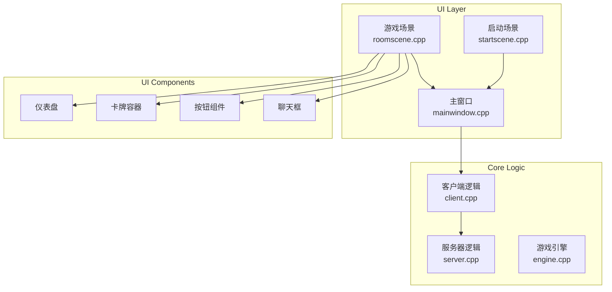
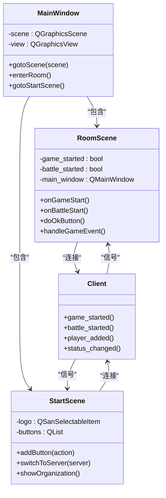
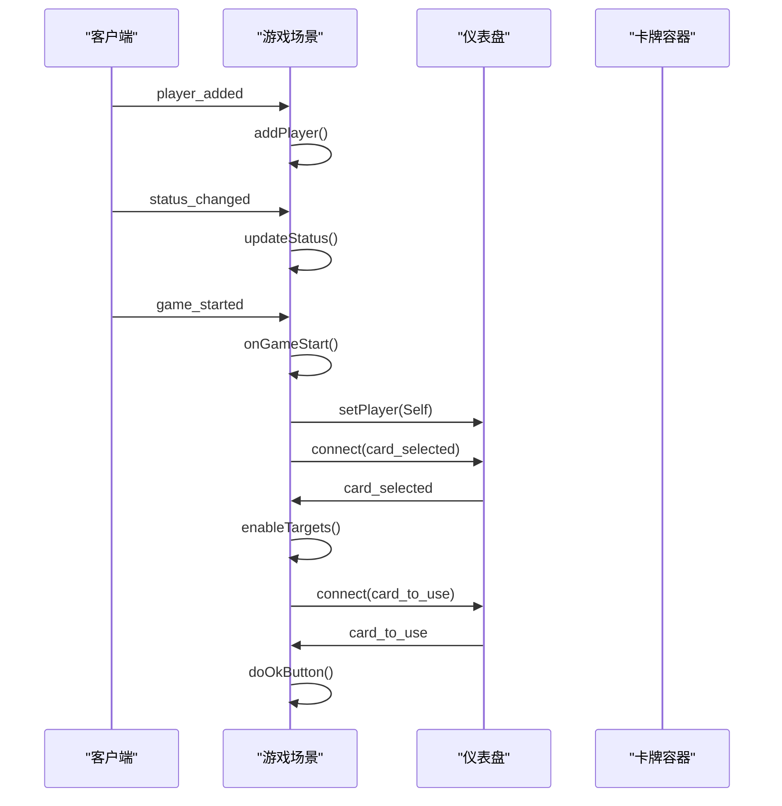
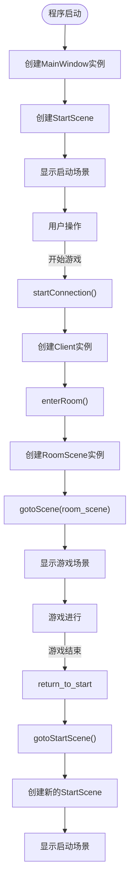
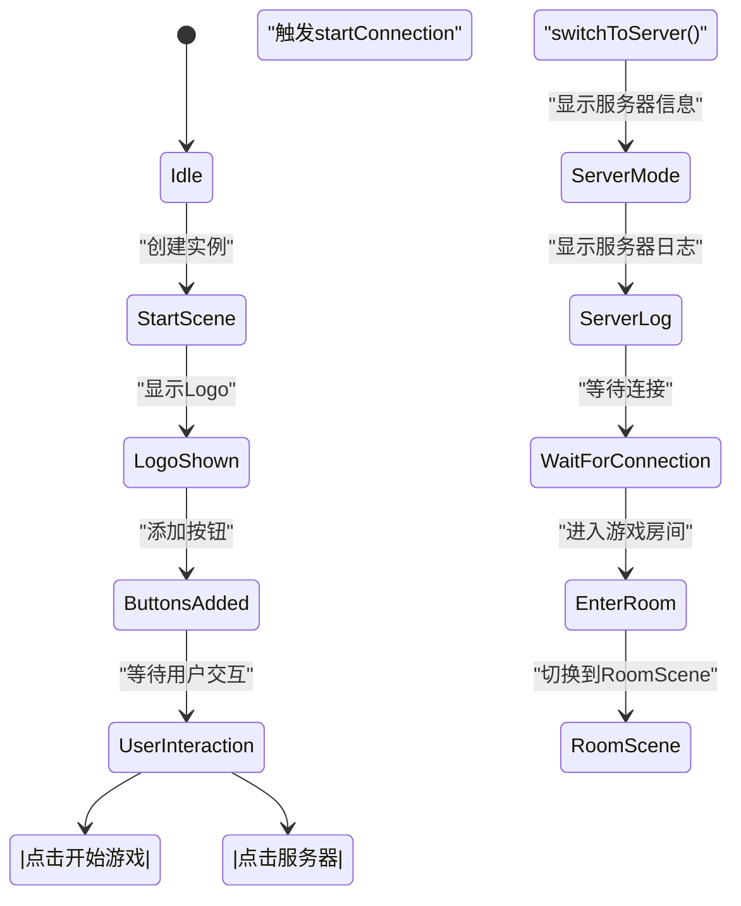

# 界面架构

<cite>
**本文档引用的文件**   
- [roomscene.cpp](file://src/ui/roomscene.cpp)
- [mainwindow.cpp](file://src/dialog/mainwindow.cpp)
- [startscene.cpp](file://src/ui/startscene.cpp)
- [roomscene.h](file://src/ui/roomscene.h)
- [mainwindow.h](file://src/dialog/mainwindow.h)
- [startscene.h](file://src/ui/startscene.h)
</cite>

## 目录
1. [项目结构](#项目结构)
2. [核心组件](#核心组件)
3. [架构概览](#架构概览)
4. [详细组件分析](#详细组件分析)
5. [依赖分析](#依赖分析)
6. [性能考虑](#性能考虑)
7. [故障排除指南](#故障排除指南)
8. [结论](#结论)

## 项目结构

该项目采用基于Qt的MVC变体设计模式，将用户界面与游戏逻辑分离。核心UI组件位于`src/ui`目录下，包括`roomscene.cpp`（游戏场景）、`startscene.cpp`（启动场景）和`mainwindow.cpp`（主窗口管理）。`src/dialog`目录包含各种对话框实现，而`src/core`和`src/server`目录则处理游戏核心逻辑和网络通信。



**图示来源**
- [roomscene.cpp](file://src/ui/roomscene.cpp)
- [mainwindow.cpp](file://src/dialog/mainwindow.cpp)
- [startscene.cpp](file://src/ui/startscene.cpp)

**本节来源**
- [roomscene.cpp](file://src/ui/roomscene.cpp)
- [mainwindow.cpp](file://src/dialog/mainwindow.cpp)
- [startscene.cpp](file://src/ui/startscene.cpp)

## 核心组件

系统的核心UI组件包括`RoomScene`、`StartScene`和`MainWindow`。`RoomScene`作为游戏主场景的View层，负责渲染游戏状态并处理用户交互。`StartScene`提供启动界面和服务器信息显示，而`MainWindow`则管理窗口布局和场景切换。

**本节来源**
- [roomscene.cpp](file://src/ui/roomscene.cpp#L1-L50)
- [startscene.cpp](file://src/ui/startscene.cpp#L1-L50)
- [mainwindow.cpp](file://src/dialog/mainwindow.cpp#L1-L50)

## 架构概览

系统采用基于Qt的MVC变体架构，其中`MainWindow`作为控制器管理场景切换，`RoomScene`和`StartScene`作为视图层，通过信号与槽机制与客户端逻辑通信。UI线程与游戏逻辑线程通过Qt的信号槽机制进行安全通信，确保界面响应性。



**图示来源**
- [roomscene.cpp](file://src/ui/roomscene.cpp)
- [mainwindow.cpp](file://src/dialog/mainwindow.cpp)
- [startscene.cpp](file://src/ui/startscene.cpp)

## 详细组件分析

### RoomScene分析

`RoomScene`作为核心游戏场景的View层，实现了与服务器Room状态的同步。它通过大量的信号槽连接监听客户端状态变化，如玩家添加、状态变更、技能触发等事件。



**图示来源**
- [roomscene.cpp](file://src/ui/roomscene.cpp#L100-L300)

**本节来源**
- [roomscene.cpp](file://src/ui/roomscene.cpp)

### MainWindow分析

`MainWindow`负责主窗口的布局管理和导航逻辑。它通过`gotoScene`方法实现窗口切换，管理从`StartScene`到`RoomScene`的流程。



**图示来源**
- [mainwindow.cpp](file://src/dialog/mainwindow.cpp#L200-L400)

**本节来源**
- [mainwindow.cpp](file://src/dialog/mainwindow.cpp)

### StartScene分析

`StartScene`实现了启动界面的状态机，通过`addButton`方法将QAction与UI按钮关联，并通过`switchToServer`方法切换到服务器模式。



**图示来源**
- [startscene.cpp](file://src/ui/startscene.cpp#L50-L150)

**本节来源**
- [startscene.cpp](file://src/ui/startscene.cpp)

## 依赖分析

系统组件间存在明确的依赖关系。`MainWindow`依赖于`RoomScene`和`StartScene`，而这两个场景又依赖于客户端核心组件。UI组件如`Dashboard`、`CardContainer`等被`RoomScene`直接包含和管理。

```mermaid
graph TD
MainWindow --> RoomScene
MainWindow --> StartScene
RoomScene --> Dashboard
RoomScene --> TablePile
RoomScene --> CardContainer
RoomScene --> ChatBox
RoomScene --> LogBox
RoomScene --> Button
StartScene --> Tile
StartScene --> QSanSelectableItem
RoomScene --> Client : "信号槽连接"
StartScene --> Client : "信号槽连接"
Client --> Server : "网络通信"
```

**图示来源**
- [roomscene.cpp](file://src/ui/roomscene.cpp)
- [mainwindow.cpp](file://src/dialog/mainwindow.cpp)
- [startscene.cpp](file://src/ui/startscene.cpp)

**本节来源**
- [roomscene.cpp](file://src/ui/roomscene.cpp)
- [mainwindow.cpp](file://src/dialog/mainwindow.cpp)
- [startscene.cpp](file://src/ui/startscene.cpp)

## 性能考虑

系统在UI性能方面做了多项优化：使用`setItemIndexMethod(NoIndex)`禁用场景索引以提高性能，通过预加载机制加载表情动画资源，使用`QPropertyAnimation`进行平滑的UI过渡效果。`RoomScene`中的Z值管理确保了UI元素的正确层级显示。

## 故障排除指南

常见问题包括场景切换失败、信号槽连接丢失和UI元素显示异常。检查`MainWindow`的`gotoScene`方法是否正确释放旧场景，验证信号槽连接是否在对象生命周期内有效，确保UI元素的Z值设置正确以避免遮挡问题。

**本节来源**
- [roomscene.cpp](file://src/ui/roomscene.cpp#L500-L600)
- [mainwindow.cpp](file://src/dialog/mainwindow.cpp#L300-L400)

## 结论

该系统采用清晰的MVC变体架构，通过Qt的信号槽机制实现了UI与游戏逻辑的有效分离。`RoomScene`作为核心游戏场景，`StartScene`作为启动界面，`MainWindow`作为场景管理器，三者协同工作提供了流畅的用户体验。窗口切换流程通过对象创建和`gotoScene`方法实现，UI组件生命周期由场景管理，确保了资源的正确释放和内存安全。