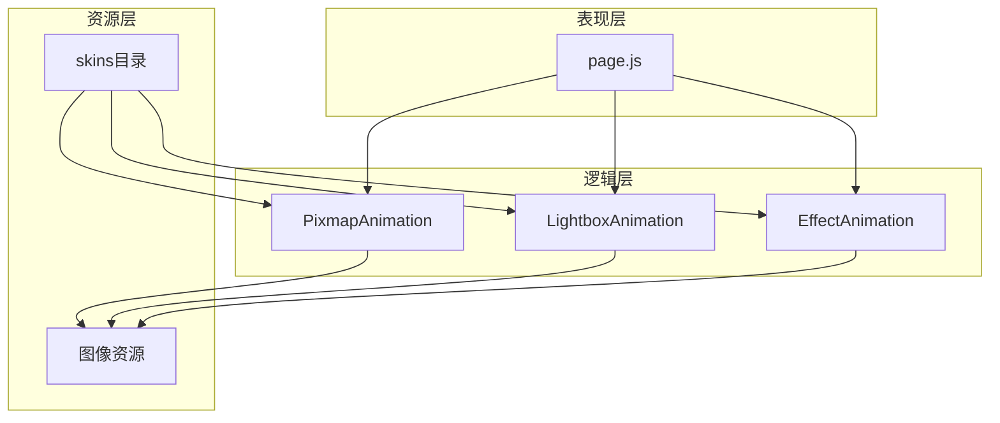
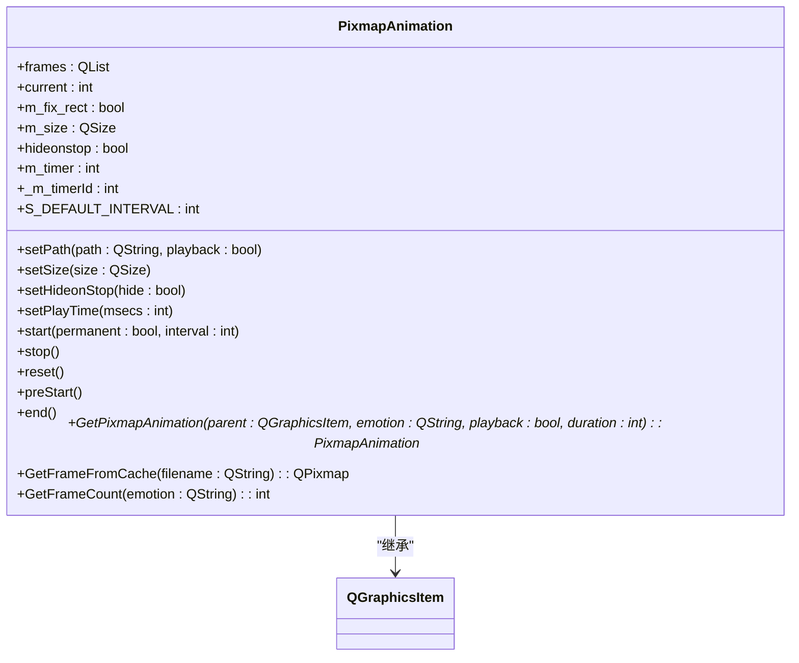
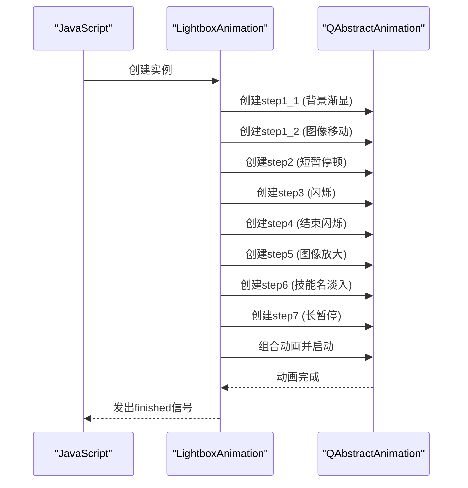
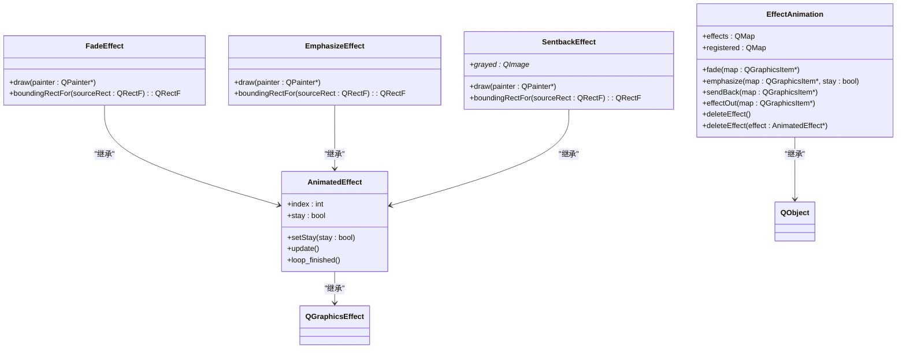
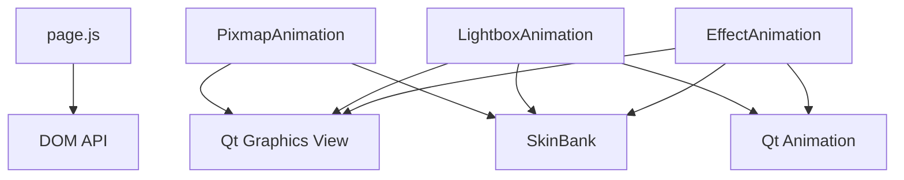

# UI脚本与动态效果

<cite>
**本文档引用的文件**   
- [page.js](file://ui-script/page.js)
- [pixmapanimation.cpp](file://src/ui/pixmapanimation.cpp)
- [lightboxanimation.cpp](file://src/ui/lightboxanimation.cpp)
- [sprite.cpp](file://src/ui/sprite.cpp)
</cite>

## 目录
1. [简介](#简介)
2. [项目结构](#项目结构)
3. [核心组件](#核心组件)
4. [架构概述](#架构概述)
5. [详细组件分析](#详细组件分析)
6. [依赖分析](#依赖分析)
7. [性能考虑](#性能考虑)
8. [故障排除指南](#故障排除指南)
9. [结论](#结论)

## 简介
本文档旨在深入解析`page.js`脚本在用户界面（UI）动态行为中的关键作用，阐明其如何通过JavaScript与C++ UI组件进行交互，实现动画触发、状态反馈和视觉特效。结合`pixmapanimation.cpp`和`lightboxanimation.cpp`分析基于帧的动画系统如何与脚本协同工作，以支持皮肤定制的动态效果。同时，阐述`sprite.cpp`中精灵图管理机制及其在脚本中的调用方式。最后，提供脚本扩展示例，展示如何通过JavaScript控制动画播放、UI显隐和事件响应，实现高度个性化的交互体验。

## 项目结构
项目结构遵循典型的客户端-服务器架构，核心逻辑与UI分离。`ui-script`目录下的`page.js`是前端脚本的入口，负责处理用户交互和动态内容生成。`src/ui`目录包含所有UI相关的C++实现，如`pixmapanimation.cpp`用于帧动画，`lightboxanimation.cpp`用于高亮动画，`sprite.cpp`用于特效管理。`skins`目录存放皮肤配置文件，定义了动画、布局和图像资源。`lua`目录包含游戏逻辑脚本，而`src/core`和`src/client`则处理核心引擎和客户端逻辑。

**中文(中文)**
- **项目结构**：项目采用分层设计，前端脚本与后端C++组件通过预定义接口通信，确保了良好的模块化和可维护性。

## 核心组件
核心组件包括`page.js`、`PixmapAnimation`、`LightboxAnimation`和`EffectAnimation`。`page.js`作为JavaScript层的控制器，负责生成目录和脚注，为动态内容提供基础。`PixmapAnimation`实现了基于图像序列的帧动画，支持循环播放和自定义时长。`LightboxAnimation`利用Qt的动画框架创建复杂的序列动画，用于技能触发等高光时刻。`EffectAnimation`管理各种视觉特效，如淡入淡出、强调和回退效果，通过`QGraphicsEffect`集成到UI组件中。

**中文(中文)**
- **核心组件**：这些组件共同构成了一个强大的动态效果系统，允许开发者通过脚本和配置文件轻松定制UI行为。

## 架构概述
系统架构分为三层：表现层（JavaScript）、逻辑层（C++）和资源层（JSON/图像）。`page.js`位于表现层，通过DOM操作和事件监听与用户交互。逻辑层的C++类（如`PixmapAnimation`）封装了复杂的动画逻辑，并通过Qt的信号与槽机制与表现层通信。资源层的`skins`目录提供了动画所需的图像和配置，支持皮肤的热插拔和定制。

**图示来源**
- [page.js](file://ui-script/page.js)
- [pixmapanimation.cpp](file://src/ui/pixmapanimation.cpp)
- [lightboxanimation.cpp](file://src/ui/lightboxanimation.cpp)
- [sprite.cpp](file://src/ui/sprite.cpp)

## 详细组件分析

### page.js分析
`page.js`主要负责生成目录和脚注，为静态内容提供动态功能。其`toc`函数扫描DOM树，提取标题元素（h2-h5）生成目录，`footnotes`函数处理脚注标记，动态插入脚注内容。虽然`page.js`本身不直接控制UI动画，但其生成的结构化内容为后续的动态效果提供了基础。

**中文(中文)**
- **page.js分析**：该脚本通过操作DOM，实现了内容的自动索引和引用，提升了用户体验。

**中文(中文)**
- **Section sources**
- [page.js](file://ui-script/page.js#L0-L137)

### PixmapAnimation分析
`PixmapAnimation`是基于帧的动画系统的核心。它继承自`QGraphicsItem`，通过`setPath`方法加载图像序列，`advance`方法在每一帧更新当前图像索引，`paint`方法绘制当前帧。`start`和`stop`方法控制动画的播放和停止，`GetPixmapAnimation`静态方法提供了一种便捷的创建和配置动画实例的方式。

**图示来源**
- [pixmapanimation.cpp](file://src/ui/pixmapanimation.cpp#L0-L212)

**中文(中文)**
- **Section sources**
- [pixmapanimation.cpp](file://src/ui/pixmapanimation.cpp#L0-L212)

### LightboxAnimation分析
`LightboxAnimation`利用Qt的动画框架创建复杂的序列动画。它通过`QSequentialAnimationGroup`和`QParallelAnimationGroup`组合多个`QPropertyAnimation`和`QPauseAnimation`，实现技能触发时的高光效果。动画包括背景渐显、武将图像移动和缩放、技能名称淡入等步骤。

**图示来源**
- [lightboxanimation.cpp](file://src/ui/lightboxanimation.cpp#L0-L177)

**中文(中文)**
- **Section sources**
- [lightboxanimation.cpp](file://src/ui/lightboxanimation.cpp#L0-L177)

### EffectAnimation分析
`EffectAnimation`管理各种视觉特效。它通过`fade`、`emphasize`和`sendBack`方法为`QGraphicsItem`应用不同的`QGraphicsEffect`子类（如`FadeEffect`、`EmphasizeEffect`）。这些特效利用`QPropertyAnimation`改变属性（如透明度、缩放），实现平滑的视觉过渡。

**图示来源**
- [sprite.cpp](file://src/ui/sprite.cpp#L0-L263)

**中文(中文)**
- **Section sources**
- [sprite.cpp](file://src/ui/sprite.cpp#L0-L263)

## 依赖分析
组件间的依赖关系清晰。`page.js`依赖于DOM API，`PixmapAnimation`和`LightboxAnimation`依赖于Qt的图形视图框架，`EffectAnimation`依赖于Qt的动画和图形效果框架。所有UI组件都依赖于`SkinBank`来获取皮肤资源。这种依赖关系确保了组件的高内聚和低耦合。

**图示来源**
- [page.js](file://ui-script/page.js)
- [pixmapanimation.cpp](file://src/ui/pixmapanimation.cpp)
- [lightboxanimation.cpp](file://src/ui/lightboxanimation.cpp)
- [sprite.cpp](file://src/ui/sprite.cpp)

**中文(中文)**
- **Section sources**
- [page.js](file://ui-script/page.js)
- [pixmapanimation.cpp](file://src/ui/pixmapanimation.cpp)
- [lightboxanimation.cpp](file://src/ui/lightboxanimation.cpp)
- [sprite.cpp](file://src/ui/sprite.cpp)

## 性能考虑
动画系统的性能主要受图像加载和绘制频率影响。`PixmapAnimation`使用`QPixmapCache`缓存图像，减少重复加载的开销。`EffectAnimation`通过`QPropertyAnimation`的硬件加速特性，确保特效的流畅性。建议在皮肤配置中优化图像大小和帧率，以平衡视觉效果和性能。

**中文(中文)**
- **性能考虑**：通过缓存和硬件加速，系统在保证视觉效果的同时，维持了良好的性能。

## 故障排除指南
常见问题包括动画不播放、特效不显示等。检查`page.js`是否正确加载，`skins`目录中的配置文件是否完整，图像路径是否正确。对于C++组件，确保`QGraphicsScene`已正确设置，动画实例的生命周期管理得当。

**中文(中文)**
- **Section sources**
- [page.js](file://ui-script/page.js)
- [pixmapanimation.cpp](file://src/ui/pixmapanimation.cpp)
- [lightboxanimation.cpp](file://src/ui/lightboxanimation.cpp)
- [sprite.cpp](file://src/ui/sprite.cpp)

## 结论
`page.js`脚本与C++ UI组件的协同工作，构建了一个灵活且强大的动态效果系统。通过JavaScript控制动画的触发和UI状态，结合C++实现的高效动画和特效，开发者可以轻松创建高度个性化的交互体验。皮肤系统的支持进一步增强了游戏的可定制性。

**中文(中文)**
- **结论**：该系统为游戏UI的动态化和个性化提供了坚实的基础。