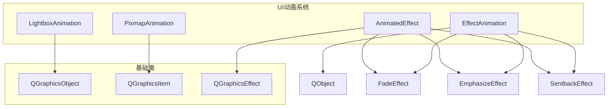
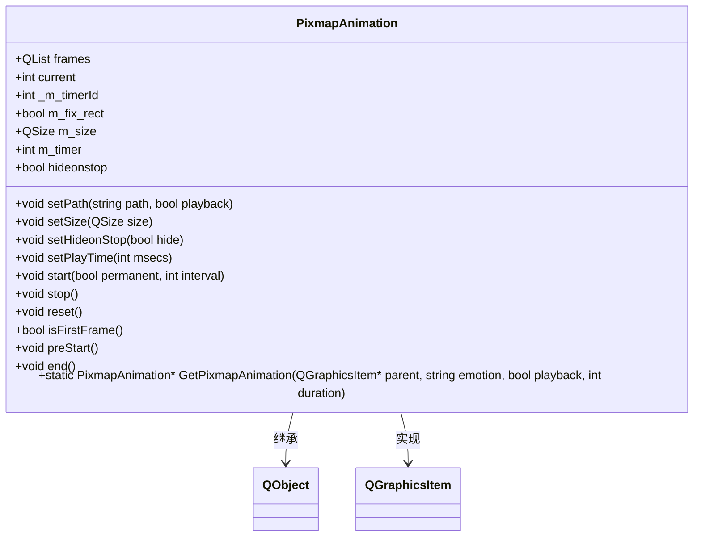
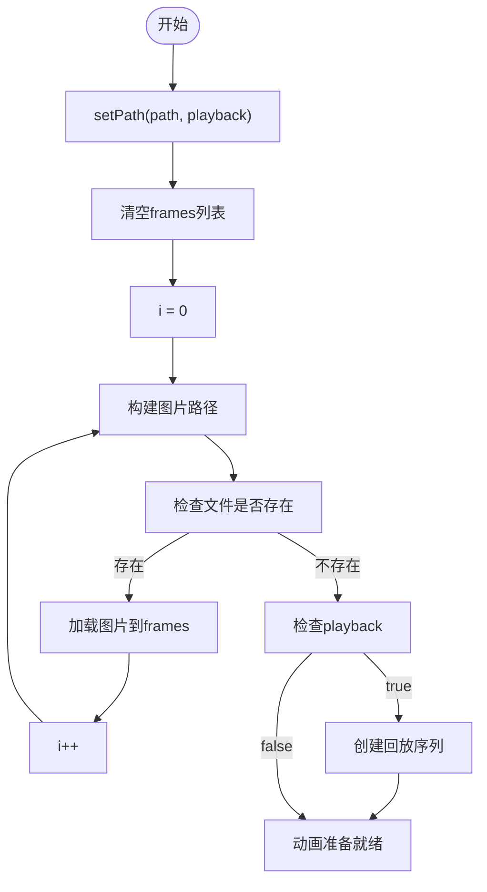
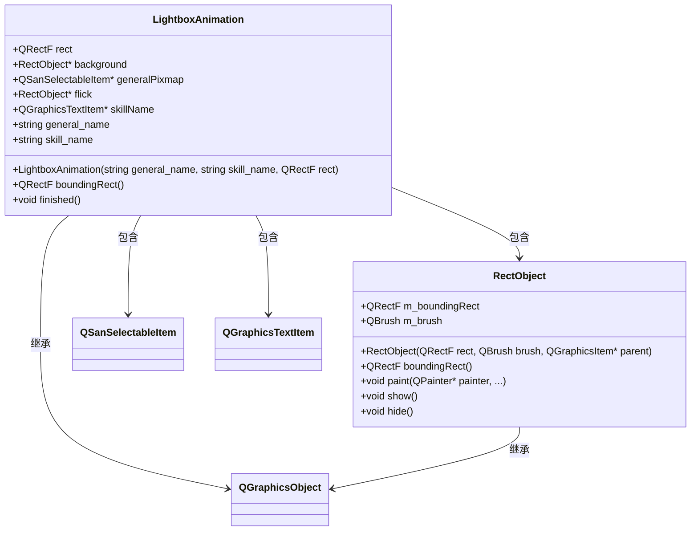
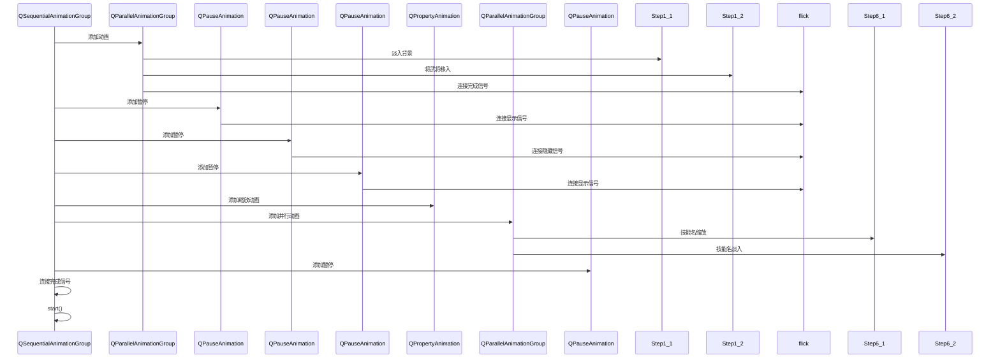
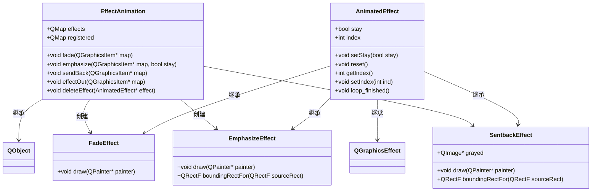
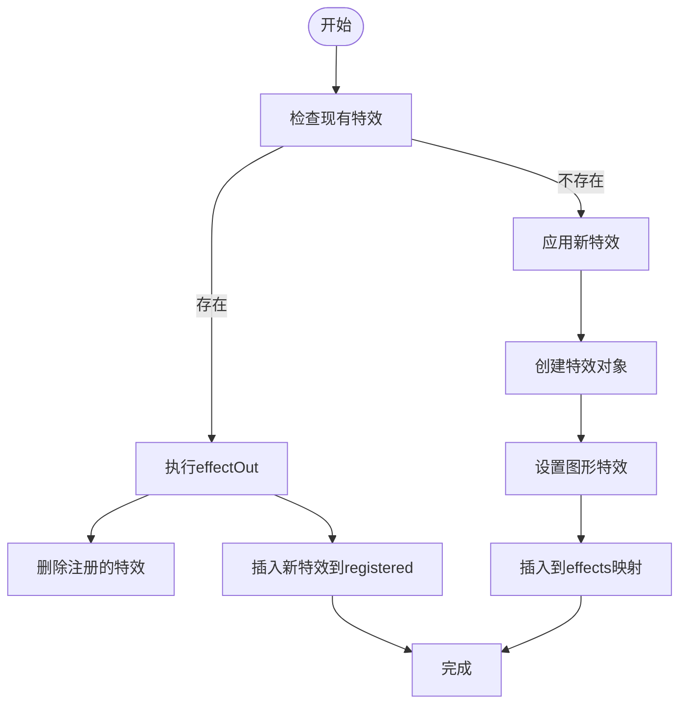
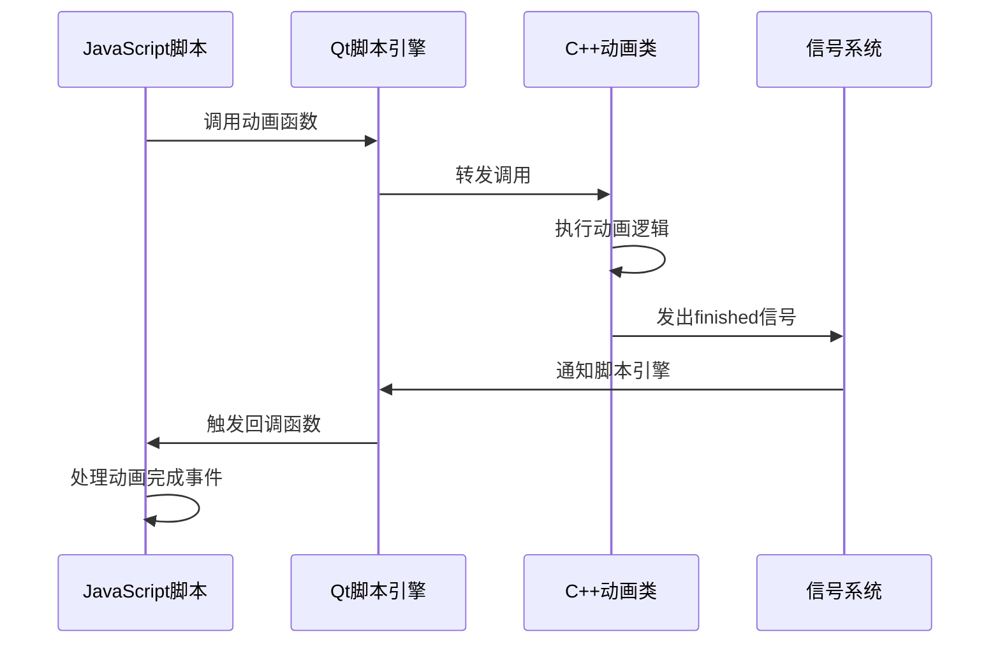

# UI脚本接口与事件绑定

<cite>
**本文档引用的文件**   
- [page.js](file://ui-script/page.js)
- [pixmapanimation.cpp](file://src/ui/pixmapanimation.cpp)
- [pixmapanimation.h](file://src/ui/pixmapanimation.h)
- [lightboxanimation.cpp](file://src/ui/lightboxanimation.cpp)
- [lightboxanimation.h](file://src/ui/lightboxanimation.h)
- [sprite.cpp](file://src/ui/sprite.cpp)
- [sprite.h](file://src/ui/sprite.h)
</cite>

## 目录
1. [项目结构分析](#项目结构分析)
2. [核心组件分析](#核心组件分析)
3. [动画系统架构](#动画系统架构)
4. [PixmapAnimation实现机制](#pixmapanimation实现机制)
5. [LightboxAnimation实现机制](#lightboxanimation实现机制)
6. [特效动画系统](#特效动画系统)
7. [JavaScript与C++交互流程](#javascript与c交互流程)
8. [事件绑定与动画触发](#事件绑定与动画触发)

## 项目结构分析

根据项目目录结构，UI动画相关的代码主要分布在`src/ui`目录下，而UI脚本位于`ui-script`目录。核心动画类包括`PixmapAnimation`和`LightboxAnimation`，它们通过Qt的图形视图框架实现动画效果。

**Section sources**
- [project_structure](file://project_structure)

## 核心组件分析

项目中的动画系统由多个核心组件构成，主要包括：
- `PixmapAnimation`: 基于精灵图的帧动画系统
- `LightboxAnimation`: 技能触发时的聚光灯效果动画
- `EffectAnimation`: 图形特效管理系统
- `AnimatedEffect`: 特效基类

这些组件共同构成了游戏的视觉反馈系统。

**Section sources**
- [pixmapanimation.h](file://src/ui/pixmapanimation.h#L0-L40)
- [lightboxanimation.h](file://src/ui/lightboxanimation.h#L0-L61)
- [sprite.h](file://src/ui/sprite.h#L38-L105)

## 动画系统架构



**Diagram sources**
- [pixmapanimation.h](file://src/ui/pixmapanimation.h#L0-L40)
- [lightboxanimation.h](file://src/ui/lightboxanimation.h#L0-L61)
- [sprite.h](file://src/ui/sprite.h#L38-L105)

**Section sources**
- [pixmapanimation.h](file://src/ui/pixmapanimation.h#L0-L40)
- [lightboxanimation.h](file://src/ui/lightboxanimation.h#L0-L61)
- [sprite.h](file://src/ui/sprite.h#L38-L105)

## PixmapAnimation实现机制

`PixmapAnimation`类实现了基于精灵图的帧动画系统，其主要功能包括：



**Diagram sources**
- [pixmapanimation.h](file://src/ui/pixmapanimation.h#L0-L40)
- [pixmapanimation.cpp](file://src/ui/pixmapanimation.cpp#L42-L92)

**Section sources**
- [pixmapanimation.h](file://src/ui/pixmapanimation.h#L0-L40)
- [pixmapanimation.cpp](file://src/ui/pixmapanimation.cpp#L42-L92)

### 帧动画加载流程



**Diagram sources**
- [pixmapanimation.cpp](file://src/ui/pixmapanimation.cpp#L42-L92)

## LightboxAnimation实现机制

`LightboxAnimation`类实现了技能触发时的聚光灯效果动画，使用Qt的动画框架组合多个动画效果。



**Diagram sources**
- [lightboxanimation.h](file://src/ui/lightboxanimation.h#L0-L61)
- [lightboxanimation.cpp](file://src/ui/lightboxanimation.cpp#L38-L87)

**Section sources**
- [lightboxanimation.h](file://src/ui/lightboxanimation.h#L0-L61)
- [lightboxanimation.cpp](file://src/ui/lightboxanimation.cpp#L38-L87)

### 聚光灯动画序列



**Diagram sources**
- [lightboxanimation.cpp](file://src/ui/lightboxanimation.cpp#L115-L177)

## 特效动画系统

`EffectAnimation`类管理各种图形特效，包括淡入淡出、强调和回送效果。



**Diagram sources**
- [sprite.h](file://src/ui/sprite.h#L38-L105)
- [sprite.cpp](file://src/ui/sprite.cpp#L38-L83)

**Section sources**
- [sprite.h](file://src/ui/sprite.h#L38-L105)
- [sprite.cpp](file://src/ui/sprite.cpp#L38-L83)

### 特效执行流程



**Diagram sources**
- [sprite.cpp](file://src/ui/sprite.cpp#L38-L83)

## JavaScript与C++交互流程

虽然`page.js`文件主要用于文档生成，但项目中的JavaScript与C++交互通过Qt的脚本引擎实现。动画类通过信号槽机制与脚本层通信。



**Diagram sources**
- [pixmapanimation.cpp](file://src/ui/pixmapanimation.cpp#L134-L174)
- [lightboxanimation.cpp](file://src/ui/lightboxanimation.cpp#L146-L177)

**Section sources**
- [pixmapanimation.cpp](file://src/ui/pixmapanimation.cpp#L134-L174)
- [lightboxanimation.cpp](file://src/ui/lightboxanimation.cpp#L146-L177)

## 事件绑定与动画触发

### 动画控制方法

**PixmapAnimation控制方法：**
- `start(bool permanent, int interval)`: 启动动画
- `stop()`: 停止动画
- `reset()`: 重置动画到第一帧
- `preStart()`: 预启动，显示动画并开始计时器
- `end()`: 结束动画并发出finished信号

**LightboxAnimation控制方法：**
- 通过`QSequentialAnimationGroup`管理动画序列
- 使用`connect`连接动画完成信号到`finished`槽函数
- 动画自动在完成后删除

### 事件绑定示例

```javascript
// 示例：按钮点击触发动画
button.clicked.connect(function() {
    // 创建并启动帧动画
    var animation = PixmapAnimation.GetPixmapAnimation(parent, "success", false, 2000);
    animation.start();
    
    // 连接动画完成信号
    animation.finished.connect(function() {
        console.log("动画完成");
        // 清理资源
        animation.deleteLater();
    });
});

// 示例：触发技能特效
function playSkillAnimation(generalName, skillName) {
    var animation = new LightboxAnimation(generalName, skillName, QRectF(0, 0, 800, 600));
    animation.finished.connect(function() {
        console.log("技能动画完成");
        animation.deleteLater();
    });
    // 动画启动后会自动播放
}
```

**Section sources**
- [pixmapanimation.cpp](file://src/ui/pixmapanimation.cpp#L90-L142)
- [lightboxanimation.cpp](file://src/ui/lightboxanimation.cpp#L146-L177)