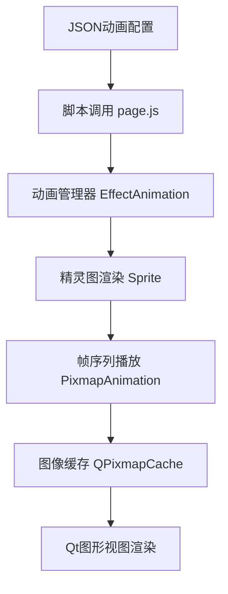

# 动画系统与脚本集成

<cite>
**本文档引用文件**  
- [sprite.cpp](file://src/ui/sprite.cpp)
- [pixmapanimation.cpp](file://src/ui/pixmapanimation.cpp)
- [pixmapanimation.h](file://src/ui/pixmapanimation.h)
- [page.js](file://ui-script/page.js)
- [defaultSkin.animation.json](file://skins/defaultSkin.animation.json)
</cite>

## 目录
1. [项目结构分析](#项目结构分析)
2. [核心组件分析](#核心组件分析)
3. [动画系统架构](#动画系统架构)
4. [精灵图管理机制](#精灵图管理机制)
5. [帧数据加载与缓存](#帧数据加载与缓存)
6. [JSON动画配置解析](#json动画配置解析)
7. [脚本动态控制机制](#脚本动态控制机制)
8. [实际集成示例](#实际集成示例)
9. [资源路径映射与内存管理](#资源路径映射与内存管理)

## 项目结构分析

项目采用模块化分层架构，主要目录包括：
- `src/ui`：用户界面核心组件，包含动画、精灵图、图像渲染等
- `skins`：皮肤资源与动画配置文件
- `ui-script`：前端脚本控制逻辑
- `lua`：游戏逻辑脚本
- `image/system/emotion/`：存放动画帧图片资源

动画系统主要由C++底层渲染与JSON配置驱动，通过脚本进行动态调用与控制。

**Section sources**
- [sprite.cpp](file://src/ui/sprite.cpp#L0-L263)
- [pixmapanimation.cpp](file://src/ui/pixmapanimation.cpp#L0-L211)
- [defaultSkin.animation.json](file://skins/defaultSkin.animation.json#L0-L42)

## 核心组件分析

### 精灵图基础类 Sprite
`Sprite` 类继承自 `QGraphicsPixmapItem`，用于表示可渲染的图像元素，支持透明度和缩放属性的动画控制。

```cpp
class Sprite : public QObject, public QGraphicsPixmapItem
{
    Q_OBJECT
    Q_PROPERTY(qreal opacity READ opacity WRITE setOpacity)
    Q_PROPERTY(qreal scale READ scale WRITE setScale)
};
```

### 像素动画类 PixmapAnimation
`PixmapAnimation` 是核心动画控制器，管理帧序列的播放、定时与渲染。

```cpp
class PixmapAnimation : public QObject, public QGraphicsItem
{
    Q_OBJECT
public:
    void start(bool permanent = true, int interval = 50);
    void stop();
    void reset();
    static PixmapAnimation *GetPixmapAnimation(QGraphicsItem *parent, const QString &emotion, bool playback = false, int duration = 0);
    static QPixmap GetFrameFromCache(const QString &filename);
};
```

**Section sources**
- [sprite.h](file://src/ui/sprite.h#L0-L44)
- [pixmapanimation.h](file://src/ui/pixmapanimation.h#L0-L73)

## 动画系统架构



**Diagram sources**
- [sprite.cpp](file://src/ui/sprite.cpp#L0-L263)
- [pixmapanimation.cpp](file://src/ui/pixmapanimation.cpp#L0-L211)
- [page.js](file://ui-script/page.js#L0-L137)

## 精灵图管理机制

精灵图通过 `EffectAnimation` 类进行特效管理，支持淡入淡出、强调、返回等视觉效果。

### 特效类型
- **FadeEffect**：淡入淡出效果
- **EmphasizeEffect**：放大强调效果
- **SentbackEffect**：灰化返回效果

```cpp
void EffectAnimation::fade(QGraphicsItem *map)
{
    FadeEffect *fade = new FadeEffect(true, this);
    map->setGraphicsEffect(fade);
    effects.insert(map, fade);
}
```

特效通过 `QPropertyAnimation` 控制 `index` 属性实现渐变动画，并自动清理资源。

**Section sources**
- [sprite.cpp](file://src/ui/sprite.cpp#L15-L35)

## 帧数据加载与缓存

### 帧加载流程
1. 根据情感名称（emotion）构建路径：`image/system/emotion/{emotion}/`
2. 读取目录下所有 `.png` 文件作为帧
3. 使用 `QPixmapCache` 缓存已加载图像

```cpp
QPixmap PixmapAnimation::GetFrameFromCache(const QString &filename)
{
    QPixmap pixmap;
    if (!QPixmapCache::find(filename, &pixmap)) {
        pixmap.load(filename);
        if (!pixmap.isNull()) QPixmapCache::insert(filename, pixmap);
    }
    return pixmap;
}
```

### 帧计数
```cpp
int PixmapAnimation::GetFrameCount(const QString &emotion)
{
    QString path = QString("image/system/emotion/%1/").arg(emotion);
    QDir dir(path);
    dir.setNameFilters(QStringList("*.png"));
    return dir.entryList(QDir::Files | QDir::NoDotAndDotDot).count();
}
```

**Section sources**
- [pixmapanimation.cpp](file://src/ui/pixmapanimation.cpp#L171-L211)

## JSON动画配置解析

`defaultSkin.animation.json` 定义了预加载的动画资源列表：

```json
{
"preloads": [
   "analeptic", "chain", "damage",
   "duel", "equipborder", "fire_slash",
   "jink", "killer", "no-success", "peach",
   "slash_black", "slash_red", "success",
   "thunder_slash", "revive", "skill_nullify",
   "armor/eight_diagram", "armor/renwang_shield",
   "weapon/axe", "weapon/blade", "weapon/crossbow"
]
}
```

### 配置说明
- **preloads**：启动时预加载的动画名称列表
- 支持分类路径（如 `armor/`, `weapon/`）
- 每个名称对应 `image/system/emotion/` 下的子目录

**Section sources**
- [defaultSkin.animation.json](file://skins/defaultSkin.animation.json#L0-L42)

## 脚本动态控制机制

### page.js 脚本调用
`page.js` 通过 DOM 操作生成目录与脚注，可扩展用于动画触发：

```javascript
toc: function (toclevels) {
    var entries = tocEntries(document.getElementById("content"), toclevels);
    for (var i = 0; i < entries.length; ++i) {
        var entry = entries[i];
        var a = document.createElement("a");
        a.href = "#" + entry.element.id;
        // 可在此注入动画触发逻辑
    }
}
```

### 动态播放控制
通过 `GetPixmapAnimation` 创建并控制动画：

```cpp
PixmapAnimation *pma = PixmapAnimation::GetPixmapAnimation(parent, "weapon/fan");
pma->setPlayTime(1000); // 设置播放时长
pma->start(); // 开始播放
```

支持参数：
- **playback**：是否倒放
- **duration**：播放时长
- **permanent**：是否永久播放

**Section sources**
- [page.js](file://ui-script/page.js#L0-L137)
- [pixmapanimation.cpp](file://src/ui/pixmapanimation.cpp#L134-L174)

## 实际集成示例

### 角色头像呼吸效果
```cpp
// 创建呼吸动画（使用 scale 变化模拟呼吸）
QPropertyAnimation *breath = new QPropertyAnimation(sprite, "scale");
breath->setStartValue(1.0);
breath->setEndValue(1.1);
breath->setDuration(1000);
breath->setEasingCurve(QEasingCurve::InOutSine);
breath->setLoopCount(-1); // 循环播放
breath->start(QAbstractAnimation::KeepWhenStopped);
```

### 技能释放动画
```cpp
void playSkillAnimation(QGraphicsItem *parent, const QString &skillName)
{
    QString emotion = "skill/" + skillName;
    PixmapAnimation *pma = PixmapAnimation::GetPixmapAnimation(parent, emotion);
    if (pma) {
        pma->setZValue(20000);
        pma->moveBy(50, -50); // 偏移位置
        pma->start(false, 60); // 播放一次，60ms间隔
        connect(pma, &PixmapAnimation::finished, pma, &PixmapAnimation::deleteLater);
    }
}
```

**Section sources**
- [pixmapanimation.cpp](file://src/ui/pixmapanimation.cpp#L134-L174)
- [sprite.cpp](file://src/ui/sprite.cpp#L15-L35)

## 资源路径映射与内存管理

### 路径映射规则
| 逻辑名称 | 实际路径 |
|---------|--------|
| `peach` | `image/system/emotion/peach/*.png` |
| `weapon/axe` | `image/system/emotion/weapon/axe/*.png` |
| `armor/vine` | `image/system/emotion/armor/vine/*.png` |

### 内存管理最佳实践
1. **缓存复用**：使用 `QPixmapCache` 避免重复加载
2. **自动清理**：动画结束自动调用 `deleteLater()`
3. **预加载机制**：通过 `preloads` 减少运行时卡顿
4. **资源释放**：`SentbackEffect` 中手动释放 `QImage` 资源

```cpp
SentbackEffect::~SentbackEffect()
{
    if (grayed) {
        delete grayed;
        grayed = NULL;
    }
}
```

**Section sources**
- [pixmapanimation.cpp](file://src/ui/pixmapanimation.cpp#L171-L211)
- [sprite.cpp](file://src/ui/sprite.cpp#L200-L205)