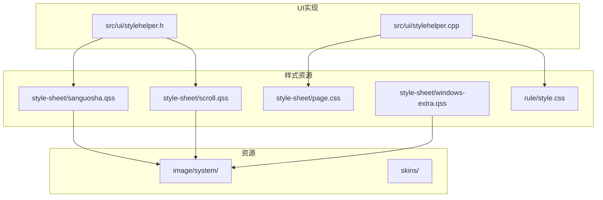
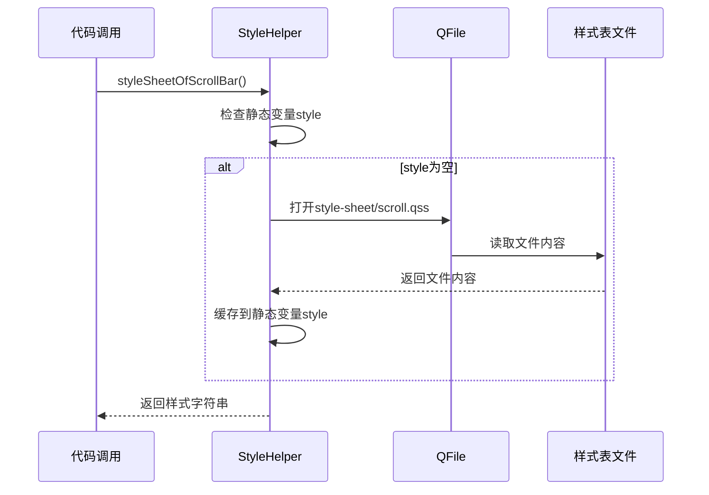
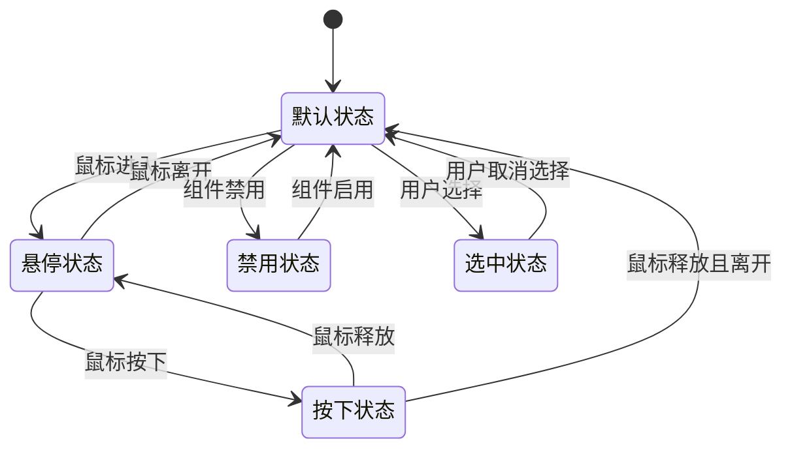
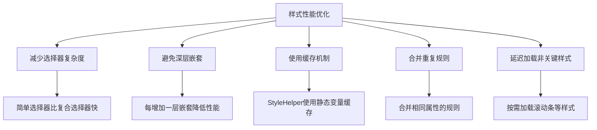

# 样式定义规范

<cite>
**本文档引用文件**   
- [page.css](file://style-sheet/page.css)
- [style.css](file://rule/style.css)
- [sanguosha.qss](file://style-sheet/sanguosha.qss)
- [scroll.qss](file://style-sheet/scroll.qss)
- [windows-extra.qss](file://style-sheet/windows-extra.qss)
- [stylehelper.h](file://src/ui/stylehelper.h)
- [stylehelper.cpp](file://src/ui/stylehelper.cpp)
</cite>

## 目录
1. [项目结构分析](#项目结构分析)
2. [核心样式文件解析](#核心样式文件解析)
3. [Qt样式系统(QSS)集成机制](#qt样式系统qss集成机制)
4. [CSS选择器与UI组件映射](#css选择器与ui组件映射)
5. [视觉属性定义规范](#视觉属性定义规范)
6. [伪状态交互反馈](#伪状态交互反馈)
7. [样式继承与优先级](#样式继承与优先级)
8. [组件样式编写范例](#组件样式编写范例)
9. [最佳实践与性能优化](#最佳实践与性能优化)

## 项目结构分析

本项目采用模块化结构设计，将样式资源集中管理于`style-sheet`目录下，同时在`rule`目录中维护HTML文档样式。项目主要包含以下样式相关组件：

- `style-sheet/`：存放Qt样式表(QSS)和CSS文件
- `rule/`：存放游戏规则文档及其CSS样式
- `src/ui/`：包含样式辅助类实现
- `skins/`：皮肤配置文件
- `image/`：图像资源



**图示来源**
- [page.css](file://style-sheet/page.css)
- [sanguosha.qss](file://style-sheet/sanguosha.qss)
- [scroll.qss](file://style-sheet/scroll.qss)
- [windows-extra.qss](file://style-sheet/windows-extra.qss)
- [stylehelper.h](file://src/ui/stylehelper.h)
- [stylehelper.cpp](file://src/ui/stylehelper.cpp)

**本节来源**
- [style-sheet](file://style-sheet)
- [rule](file://rule)
- [src/ui](file://src/ui)

## 核心样式文件解析

项目包含多个核心样式文件，分别服务于不同场景：

### page.css
位于`style-sheet/page.css`的CSS文件主要用于文档排版，定义了基本的字体、段落、标题等样式规则。该文件采用标准CSS语法，为AsciiDoc生成的HTML文档提供样式支持。

**主要特性：**
- 定义了无衬线、衬线和等宽字体族
- 设置了标题层级的视觉层次
- 规范了列表、表格、引用块等元素的样式
- 包含响应式打印样式

### style.css
位于`rule/style.css`的CSS文件专为游戏规则文档设计，与`page.css`功能相似但具有特定背景图像和字体配置。

**关键差异：**
- 背景设置为`image/system/simpleBg/dialog.png`重复平铺
- 字体优先使用"Microsoft YaHei"
- 内容区域增加海军蓝色文本和0.5em内边距

### sanguosha.qss
位于`style-sheet/sanguosha.qss`的Qt样式表(QSS)文件定义了游戏主界面的视觉样式，采用Qt样式系统语法。

**核心组件：**
- 进度条(QProgressBar)
- 文本编辑框(QTextEdit)
- 行编辑框(QLineEdit)
- 状态栏(QStatusBar)
- 菜单(QMenu)
- 按钮(QPushButton)

### scroll.qss
位于`style-sheet/scroll.qss`的滚动条样式表，专门定制垂直和水平滚动条的外观。

**设计特点：**
- 透明边框和4px圆角
- 垂直滚动条宽度8px
- 滑块背景色使用RGBA透明度
- 悬停状态提供视觉反馈

### windows-extra.qss
位于`style-sheet/windows-extra.qss`的补充样式表，定义了各种Qt控件的详细样式。

**覆盖控件：**
- QLineEdit、QSpinBox输入框
- QCheckBox复选框
- QRadioButton单选按钮
- QComboBox下拉框
- QSlider滑块
- QTableView表格视图

**本节来源**
- [page.css](file://style-sheet/page.css#L1-L387)
- [style.css](file://rule/style.css#L1-L364)
- [sanguosha.qss](file://style-sheet/sanguosha.qss#L1-L109)
- [scroll.qss](file://style-sheet/scroll.qss#L1-L78)
- [windows-extra.qss](file://style-sheet/windows-extra.qss#L1-L410)

## Qt样式系统(QSS)集成机制

项目通过`StyleHelper`类实现Qt样式系统的集成，该类位于`src/ui/stylehelper.h`和`src/ui/stylehelper.cpp`中。

### 样式加载流程


**图示来源**
- [stylehelper.cpp](file://src/ui/stylehelper.cpp#L42-L87)
- [scroll.qss](file://style-sheet/scroll.qss)

### 字体管理
`StyleHelper`类提供`getFontByFileName`方法，实现自定义字体的动态加载：

```cpp
QFont StyleHelper::getFontByFileName(const QString &fileName)
{
    static QMap<QString, QFont> loadedFonts;
    if (loadedFonts.contains(fileName)) {
        return loadedFonts.value(fileName);
    } else {
        int fontId = QFontDatabase::addApplicationFont("font/" + fileName);
        Q_ASSERT(fontId != -1);
        QString fontName = QFontDatabase::applicationFontFamilies(fontId).at(0);
        QFont font(fontName);
        loadedFonts[fileName] = font;
        return font;
    }
}
```

**关键机制：**
- 使用`QMap`缓存已加载字体，避免重复加载
- 通过`QFontDatabase::addApplicationFont`注册字体文件
- 从字体ID获取字体族名称创建QFont对象

### 工具提示样式
`styleSheetOfTooltip`方法动态生成工具提示样式，支持配置背景颜色：

```cpp
inline static QString styleSheetOfTooltip()
{
    return QString("QToolTip{ border: 1px solid rgb(166, 150, 122); padding: 1px; "
        "border-radius: 3px; background: %1; opacity: 230; }")
        .arg(Config.ToolTipBackgroundColor.name());
}
```

**特性：**
- 1px实线边框，颜色为棕褐色
- 3px圆角
- 背景色从配置中获取
- 不透明度设置为230

**本节来源**
- [stylehelper.h](file://src/ui/stylehelper.h#L44-L59)
- [stylehelper.cpp](file://src/ui/stylehelper.cpp#L42-L87)

## CSS选择器与UI组件映射

项目中的样式定义严格遵循Qt样式系统的选择器规范，通过对象名称、属性和类名实现精确匹配。

### 对象名称选择器
使用`#objectName`语法匹配特定UI组件：

```qss
QPushButton#pause {
    background-image: url(image/system/button/pause.png);
}

QPushButton#play {
    background-image: url(image/system/button/play.png);
}
```

**映射关系：**
- `#pause` → 暂停按钮
- `#play` → 播放按钮
- `#slow-down` → 减速按钮
- `#speed-up` → 加速按钮
- `#uniform` → 匀速按钮
- `#closeButton` → 关闭按钮

### 属性选择器
使用`[attribute=value]`语法匹配具有特定属性的组件：

```qss
QMenu[private_pile="true"] {
    background-color: rgba(43,63,53,200);
    border-radius: 1px;
    color: white;
}

QPushButton[private_pile="true"] {
    background-color: rgba(43,63,53,200);
    border-radius: 1px;
    color: white;
}
```

**属性类型：**
- `private_pile`：私有牌堆标识
- `treasure`：宝物标识
- `game_control`：游戏控制按钮
- `control`：通用控制按钮
- `bold`：粗体文本标识

### 类选择器
直接使用类名匹配所有该类型的组件：

```qss
QProgressBar {
    color : solid gray;
    border: 2px solid gray;
    border-radius: 5px;
    background: transparent;
    padding: 0px;
    text-align: center;
}
```

**覆盖组件：**
- QProgressBar：进度条
- QTextEdit：文本编辑框
- QLineEdit：行编辑框
- QTabWidget：选项卡控件
- QCheckBox：复选框
- QRadioButton：单选按钮

### 复合选择器
组合多种选择器实现精确控制：

```qss
QDialog QPushButton {
    color: white;
    background-color: rgb(26, 188, 156);
    border: transparent;
    border-radius: 5px;
    min-height: 30px;
    min-width: 85px;
}
```

**选择器解析：**
- `QDialog QPushButton`：匹配位于QDialog内的所有QPushButton
- `QTabBar::tab:selected`：匹配选中的选项卡
- `QMenu::item:selected`：匹配选中的菜单项

**本节来源**
- [sanguosha.qss](file://style-sheet/sanguosha.qss#L1-L109)
- [windows-extra.qss](file://style-sheet/windows-extra.qss#L1-L410)

## 视觉属性定义规范

项目中的样式定义涵盖了颜色、字体、边框、背景等多个视觉属性维度。

### 颜色调色板
项目采用统一的色彩体系，主要颜色包括：

| 颜色名称 | RGB值 | 用途 |
|---------|-------|------|
| 主色调 | rgb(26, 188, 156) | 按钮、选中状态 |
| 悬停色 | rgb(72, 201, 176) | 悬停状态 |
| 按下色 | rgb(22, 160, 133) | 按下状态 |
| 边框色 | rgb(185, 195, 199) | 输入框边框 |
| 文本色 | rgb(52, 73, 94) | 常规文本 |
| 禁用色 | rgba(163, 169, 169, 70%) | 禁用状态 |

### 字体配置
采用多层级字体配置策略：

```css
/* 无衬线字体用于标题 */
h1, h2, h3, h4, h5, h6,
div.title, caption.title,
thead, p.table.header,
div#toctitle,
span#author, span#revnumber, span#revdate, span#revremark,
div#footer {
  font-family: Arial,Helvetica,sans-serif;
}

/* 衬线字体用于正文 */
div.sectionbody {
  font-family: Georgia,"Times New Roman",Times,serif;
}

/* 中文字体优先 */
body {
  font-family: "Microsoft YaHei",Georgia,"Times New Roman",Times,serif;
}
```

### 边框样式
定义了多种边框样式以满足不同组件需求：

```qss
/* 圆角边框 */
border-radius: 5px;
border-top-left-radius: 5px;
border-bottom-left-radius: 5px;

/* 边框宽度 */
border: 2px solid rgb(185, 195, 199);
border: 1px solid rgb(166, 150, 122);

/* 透明边框 */
border: transparent;
border: none;
```

### 背景图像定位
通过URL引用图像资源并精确控制显示：

```qss
QPushButton#pause {
    background-image: url(image/system/button/pause.png);
}

QTabBar QToolButton::left-arrow {
    image: url(image/system/controls/tabbar-left-arrow.png);
    width: 12;
    height: 12;
}
```

**图像路径规范：**
- `image/system/button/`：按钮图标
- `image/system/controls/`：控件元素图标
- `image/system/simpleBg/`：背景图像

### 透明度与渐变
广泛使用RGBA和线性渐变创建现代视觉效果：

```qss
/* RGBA透明度 */
background-color: rgba(0, 0, 0, 40%);
background-color: rgba(43,63,53,200);

/* 线性渐变 */
border-top: 1px solid qlineargradient(spread:reflect, x1:0, y1:0, x2:0.5, y2:0, stop:0 transparent, stop:1 rgb(166, 150, 122));
```

**本节来源**
- [page.css](file://style-sheet/page.css#L1-L387)
- [style.css](file://rule/style.css#L1-L364)
- [sanguosha.qss](file://style-sheet/sanguosha.qss#L1-L109)
- [windows-extra.qss](file://style-sheet/windows-extra.qss#L1-L410)

## 伪状态交互反馈

Qt样式系统通过伪状态选择器实现丰富的用户交互反馈。

### 常用伪状态
```qss
QPushButton[control = true]:hover {
    background-color: rgb(72, 201, 176);
}

QDialog QPushButton:pressed {
    background-color: rgb(22, 160, 133);
}

QTextEdit#skill_info:disabled {
    background-color: rgba(244, 246, 246, 70%);
    border-color: rgba(213, 219, 219, 70%);
    color: rgba(163, 169, 169, 70%);
}

QTabBar::tab:!selected:hover {
    color: rgb(26, 188, 156);
}

QSpinBox::up-button:hover, QSpinBox::down-button:hover {
    background: rgb(26, 188, 156);
}
```

**伪状态类型：**
- `:hover`：鼠标悬停状态
- `:pressed`：鼠标按下状态
- `:disabled`：禁用状态
- `:selected`：选中状态
- `:checked`：勾选状态
- `:on`：开启状态
- `:focus`：焦点状态

### 交互反馈设计模式


**图示来源**
- [sanguosha.qss](file://style-sheet/sanguosha.qss)
- [windows-extra.qss](file://style-sheet/windows-extra.qss)

### 状态组合应用
通过组合伪状态实现复杂交互效果：

```qss
QCheckBox::indicator:hover {
    image: url(image/system/controls/checkbox-indicator.png);
}

QRadioButton::indicator:unchecked:hover {
    image: url(image/system/controls/radiobutton-indicator.png);
}

QComboBox::drop-down:hover {
    background-color: rgb(72, 201, 176);
}

QScrollBar::handle:vertical:hover {
    background-color: rgba(72, 201, 176, 200)
}
```

**组合规则：**
- `:hover`与`:pressed`提供连续反馈
- `:disabled`覆盖其他状态
- `:selected`与`:hover`可同时存在
- 属性选择器可与伪状态组合使用

**本节来源**
- [sanguosha.qss](file://style-sheet/sanguosha.qss#L1-L109)
- [windows-extra.qss](file://style-sheet/windows-extra.qss#L1-L410)

## 样式继承与优先级

Qt样式系统遵循特定的继承和优先级规则，确保样式应用的一致性和可预测性。

### 优先级层级
从高到低的优先级顺序：

1. **行内样式**：通过`setStyleSheet()`直接设置
2. **对象名称选择器**：`#objectName`
3. **属性选择器**：`[attribute=value]`
4. **类选择器**：`.ClassName`
5. **类型选择器**：`QPushButton`
6. **通配符选择器**：`*`

### 继承机制
某些属性会自动继承到子控件：

```qss
QDialog {
    background: rgb(214, 231, 239);
}
```

在此示例中，QDialog的背景色会影响其子控件，除非子控件显式定义了自己的背景色。

### 样式冲突解决
当多个规则匹配同一组件时，采用以下策略：

```qss
/* 低优先级 */
QPushButton {
    color: black;
}

/* 高优先级 */
QPushButton[control = true] {
    color: rgb(183, 218, 238);
}
```

**冲突解决规则：**
- 更具体的选择器优先
- 后定义的规则覆盖先定义的规则
- `!important`声明具有最高优先级（不推荐使用）

### 样式表合并
项目通过多个QSS文件实现样式模块化：

```cpp
QString StyleHelper::styleSheetOfScrollBar()
{
    static QString style;
    if (style.isEmpty()) {
        QFile file("style-sheet/scroll.qss");
        if (file.open(QIODevice::ReadOnly)) {
            QTextStream stream(&file);
            style = stream.readAll();
        }
    }
    return style;
}
```

**合并策略：**
- 主样式表(sanguosha.qss)定义基础样式
- 专用样式表(scroll.qss)定义特定组件样式
- 补充样式表(windows-extra.qss)定义控件细节
- 运行时动态加载并合并

**本节来源**
- [stylehelper.cpp](file://src/ui/stylehelper.cpp#L42-L87)
- [sanguosha.qss](file://style-sheet/sanguosha.qss)
- [scroll.qss](file://style-sheet/scroll.qss)
- [windows-extra.qss](file://style-sheet/windows-extra.qss)

## 组件样式编写范例

### 按钮组件
```qss
QPushButton[game_control="true"] {
    border: 0px solid gray;
    font: 12px;
    border-radius: 5px;
    padding: 6px 12px 6px 12px;
}

QPushButton[control = true] {
    color: rgb(183, 218, 238);
    background-color:rgba(0, 0, 0, 0);
    border-style:none;
}

QPushButton[control = true]:hover {
    background-color: rgb(72, 201, 176);
}

QPushButton[control = true][bold = true] {
    font: bold;
}
```

**设计要点：**
- 无边框设计，简洁现代
- 悬停时背景色变化提供反馈
- 支持粗体属性
- 透明背景适应不同界面

### 输入框组件
```qss
QLineEdit {
    border: 2px solid rgb(185, 195, 199);
    padding-left: 8px;
    min-height: 32px;
    border-radius: 6px;
    alignment: left center;
}

QLineEdit:focus {
    border-color: rgb(26, 188, 156);
}

QLineEdit:disabled {
    background-color: rgba(244, 246, 246, 70%);
    border-color: rgba(213, 219, 219, 70%);
    color: rgba(163, 169, 169, 70%);
}
```

**交互特性：**
- 获得焦点时边框变色
- 禁用状态降低透明度
- 统一的圆角和内边距
- 最小高度确保可点击区域

### 选项卡组件
```qss
QTabBar::tab {
    alignment: center;
    background-color: rgb(236, 240, 241);
    border: none;
    width: 109;
    height: 44;
    color: rgb(52, 73, 94);
    font: 13px;
}

QTabBar::tab:selected {
    background-color: rgb(26, 188, 156);
}

QTabBar::tab:!selected:hover {
    color: rgb(26, 188, 156);
}
```

**用户体验：**
- 选中标签使用主色调
- 未选中标签悬停时文字变色
- 统一的尺寸和对齐
- 圆角设计提升美观度

### 滚动条组件
```qss
QScrollBar:vertical {
    border: transparent;
    border-radius: 4px;
    background-color: rgba(43, 45, 31, 50);
    width: 8px;
    margin-bottom: 1px;
    margin-top: 1px;
}

QScrollBar::handle:vertical {
    border: transparent;
    border-radius: 4px;
    background-color: rgba(26, 188, 156, 50);
    min-height: 20px;
}

QScrollBar::handle:vertical:hover {
    background-color: rgba(72, 201, 176, 200)
}
```

**设计原则：**
- 细长设计节省空间
- 半透明背景减少视觉干扰
- 悬停时增加不透明度
- 圆角处理提升精致感

**本节来源**
- [sanguosha.qss](file://style-sheet/sanguosha.qss#L1-L109)
- [windows-extra.qss](file://style-sheet/windows-extra.qss#L1-L410)

## 最佳实践与性能优化

### 样式组织最佳实践
1. **模块化设计**：将样式按功能拆分到不同文件
2. **语义化命名**：使用有意义的属性名称
3. **避免过度特异性**：减少不必要的选择器嵌套
4. **统一设计语言**：保持颜色、圆角、间距的一致性

### 性能优化建议


**图示来源**
- [stylehelper.cpp](file://src/ui/stylehelper.cpp)
- [sanguosha.qss](file://style-sheet/sanguosha.qss)

### 避免样式冲突
1. **命名空间隔离**：为不同模块的样式使用前缀
2. **作用域限制**：使用父选择器限制样式范围
3. **属性标记**：使用自定义属性而非通用类名
4. **文档化**：记录关键样式的用途和影响范围

### 维护性建议
1. **注释规范**：为复杂规则添加详细注释
2. **版本控制**：将样式文件纳入版本管理
3. **设计系统**：建立颜色、字体、间距的设计规范
4. **自动化测试**：验证样式在不同状态下的表现

**本节来源**
- [stylehelper.cpp](file://src/ui/stylehelper.cpp#L42-L87)
- [sanguosha.qss](file://style-sheet/sanguosha.qss)
- [windows-extra.qss](file://style-sheet/windows-extra.qss)
- [page.css](file://style-sheet/page.css)
- [style.css](file://rule/style.css)