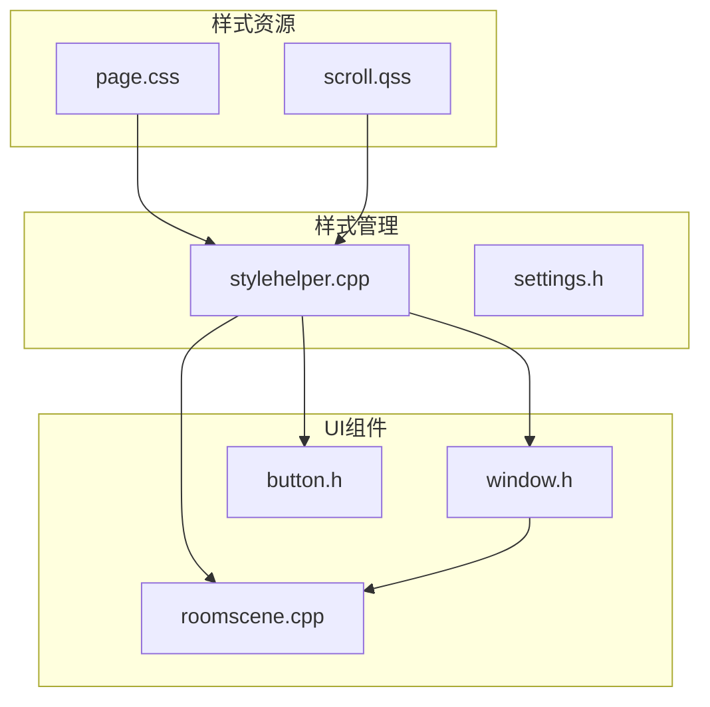
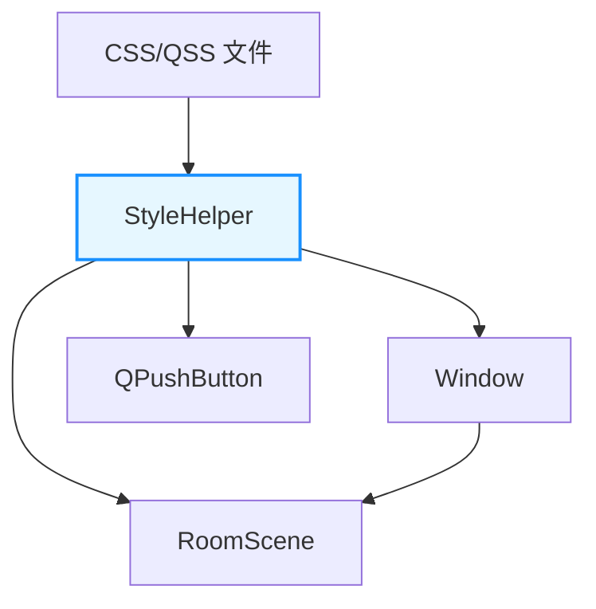
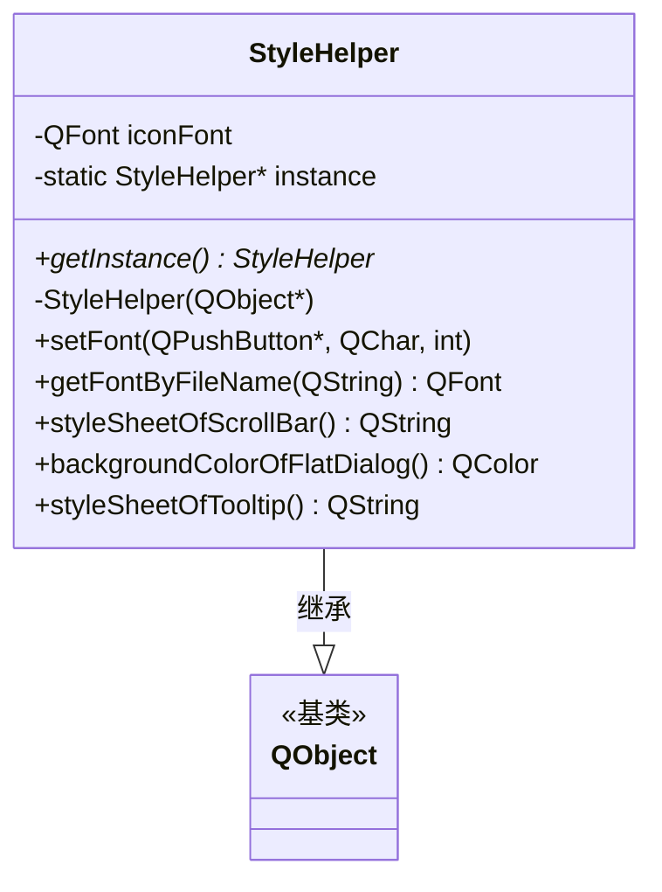
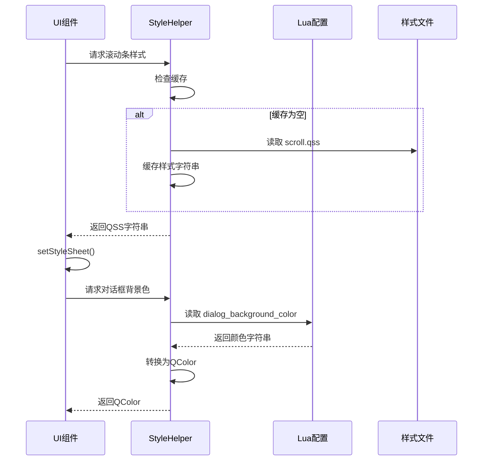
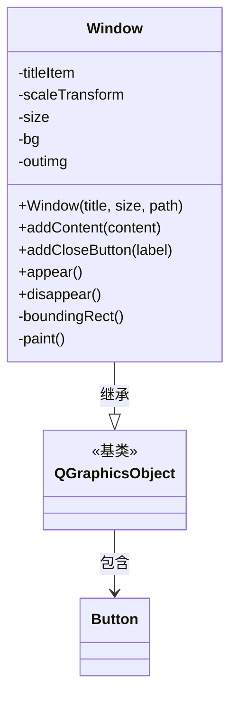
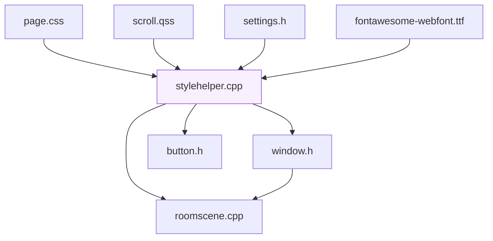

# 界面样式系统

<cite>
**本文档引用文件**  
- [page.css](file://style-sheet/page.css#L1-L388)
- [stylehelper.cpp](file://src/ui/stylehelper.cpp#L1-L105)
- [stylehelper.h](file://src/ui/stylehelper.h#L1-L61)
- [window.h](file://src/ui/window.h#L1-L63)
- [roomscene.cpp](file://src/ui/roomscene.cpp#L1-L1000)
</cite>

## 目录
1. [简介](#简介)
2. [项目结构](#项目结构)
3. [核心组件](#核心组件)
4. [架构概览](#架构概览)
5. [详细组件分析](#详细组件分析)
6. [依赖分析](#依赖分析)
7. [性能考虑](#性能考虑)
8. [故障排除指南](#故障排除指南)
9. [结论](#结论)

## 简介
本文档详细阐述了《三国杀》Qt客户端中基于CSS与Qt样式系统（QSS）的界面样式定制机制。重点分析`page.css`样式表如何与Qt框架集成，`stylehelper.cpp`如何实现运行时动态加载与主题切换，以及`window.h`和`roomscene.cpp`中的UI组件如何响应样式变化并支持状态伪类。文档旨在为开发者提供一套完整的自定义主题实践指南。

## 项目结构
项目采用分层架构，核心UI逻辑位于`src/ui`目录。样式资源独立存放于`style-sheet`目录，其中`page.css`定义了基础的CSS规则。`stylehelper.cpp`作为样式管理的单例核心，负责字体加载、颜色配置和QSS样式字符串的生成。`window.h`定义了可复用的窗口基类，而`roomscene.cpp`则实现了游戏主场景的复杂UI逻辑。



**图示来源**
- [page.css](file://style-sheet/page.css#L1-L388)
- [stylehelper.cpp](file://src/ui/stylehelper.cpp#L1-L105)
- [window.h](file://src/ui/window.h#L1-L63)
- [roomscene.cpp](file://src/ui/roomscene.cpp#L1-L1000)

**本节来源**
- [style-sheet/page.css](file://style-sheet/page.css#L1-L388)
- [src/ui/stylehelper.cpp](file://src/ui/stylehelper.cpp#L1-L105)
- [src/ui/window.h](file://src/ui/window.h#L1-L63)
- [src/ui/roomscene.cpp](file://src/ui/roomscene.cpp#L1-L1000)

## 核心组件
核心组件包括样式助手（`StyleHelper`）、窗口基类（`Window`）和游戏场景（`RoomScene`）。`StyleHelper`是整个样式系统的中枢，它通过单例模式确保全局样式的一致性，并提供便捷的API供其他组件调用。`Window`类封装了标题、背景、关闭按钮等通用窗口元素，其外观由`StyleHelper`提供的配置决定。`RoomScene`作为游戏主界面，其复杂的布局和交互依赖于动态加载的QSS样式。

**本节来源**
- [src/ui/stylehelper.cpp](file://src/ui/stylehelper.cpp#L1-L105)
- [src/ui/window.h](file://src/ui/window.h#L1-L63)
- [src/ui/roomscene.cpp](file://src/ui/roomscene.cpp#L1-L1000)

## 架构概览
系统采用“资源-管理-应用”三层架构。第一层是静态样式资源（CSS/QSS文件），第二层是`StyleHelper`，它负责解析资源、管理状态（如字体缓存）并提供统一接口。第三层是具体的UI组件，它们通过调用`StyleHelper`的接口来获取样式信息，并应用到自身。



**图示来源**
- [stylehelper.cpp](file://src/ui/stylehelper.cpp#L1-L105)
- [window.h](file://src/ui/window.h#L1-L63)
- [roomscene.cpp](file://src/ui/roomscene.cpp#L1-L1000)

## 详细组件分析

### 样式助手分析
`StyleHelper`类是样式系统的核心，其实现细节如下：

#### 类结构分析


**图示来源**
- [stylehelper.h](file://src/ui/stylehelper.h#L1-L61)
- [stylehelper.cpp](file://src/ui/stylehelper.cpp#L1-L105)

#### 动态样式加载与主题切换
`StyleHelper`通过以下机制实现动态样式加载和主题切换：
1.  **字体管理**：`getFontByFileName`方法使用`QFontDatabase`加载自定义字体（如FontAwesome），并利用`QMap`缓存已加载的字体，避免重复加载，提升性能。
2.  **颜色配置**：`backgroundColorOfFlatDialog`方法从Lua配置文件中读取颜色值（如`dialog_background_color`），并将其转换为`QColor`对象。这使得主题颜色可以在不修改C++代码的情况下通过配置文件进行修改，实现了主题的动态切换。
3.  **QSS样式生成**：`styleSheetOfScrollBar`和`styleSheetOfTooltip`等方法从外部`.qss`文件或内联字符串中读取样式规则，并返回完整的QSS样式字符串。这些字符串可直接通过`QWidget::setStyleSheet()`方法应用。



**图示来源**
- [stylehelper.cpp](file://src/ui/stylehelper.cpp#L1-L105)
- [settings.h](file://src/settings.h#L1-L50)

**本节来源**
- [src/ui/stylehelper.cpp](file://src/ui/stylehelper.cpp#L1-L105)
- [src/settings.h](file://src/settings.h#L1-L50)

### 窗口基类分析
`Window`类是`QGraphicsObject`的子类，用于创建可缩放、可动画的窗口。

#### 类结构分析


**图示来源**
- [window.h](file://src/ui/window.h#L1-L63)

#### 样式应用机制
`Window`类本身不直接定义复杂的QSS样式，而是通过`StyleHelper`获取关键的样式属性：
- **背景**：`Window`的构造函数接收一个`path`参数，该路径指向一张背景图片。这与`StyleHelper`从Lua配置中读取的纯色背景（`backgroundColorOfFlatDialog`）形成互补，分别用于不同类型的窗口。
- **标题**：`titleItem`是一个`QGraphicsTextItem`，其字体和颜色可以通过`QGraphicsTextItem`的`setDefaultTextColor`等方法设置，这些设置可以基于`StyleHelper`提供的全局字体或颜色方案。
- **按钮**：通过`addCloseButton`方法添加的`Button`对象，其样式继承自`QPushButton`，因此可以被全局的QSS规则所影响。

**本节来源**
- [src/ui/window.h](file://src/ui/window.h#L1-L63)

### 游戏场景分析
`roomscene.cpp`实现了游戏主界面，是样式应用最复杂的部分。

#### 样式响应与状态伪类
`RoomScene`中的UI组件（如玩家头像、卡牌、按钮）通过以下方式响应样式变化并支持状态伪类：
1.  **对象名称（objectName）**：Qt的QSS选择器大量使用`objectName`。例如，代码中可能会为一个按钮设置`button->setObjectName("mainMenuButton")`，然后在QSS中通过`#mainMenuButton:hover`来定义鼠标悬停时的样式。
2.  **属性（Property）**：Qt允许为控件设置自定义属性（`setProperty`），QSS可以基于这些属性进行选择。例如，一个表示“已禁用”状态的卡牌可以设置`card->setProperty("state", "disabled")`，然后在QSS中用`QGraphicsItem[state="disabled"]`来匹配并应用灰色滤镜。
3.  **继承与覆盖**：`RoomScene`中的组件继承了`StyleHelper`定义的全局样式（如字体、滚动条样式），同时也可以通过`setStyleSheet`方法应用局部的、更具体的样式规则，实现样式的继承与覆盖。

```mermaid
flowchart TD
A[UI组件] --> B{设置 objectName?}
B --> |是| C[QSS 使用 #objectName 选择]
B --> |否| D[QSS 使用类型选择]
C --> E[应用基础样式]
D --> E
E --> F{组件有自定义属性?}
F --> |是| G[QSS 使用 [property=value] 选择]
F --> |否| H[应用默认状态样式]
G --> I[应用状态特定样式]
H --> J[应用:hover, :disabled等伪类]
I --> J
J --> K[最终外观]
```

**图示来源**
- [roomscene.cpp](file://src/ui/roomscene.cpp#L1-L1000)
- [stylehelper.cpp](file://src/ui/stylehelper.cpp#L1-L105)

**本节来源**
- [src/ui/roomscene.cpp](file://src/ui/roomscene.cpp#L1-L1000)

## 依赖分析
系统各组件间存在清晰的依赖关系。



**图示来源**
- [style-sheet/page.css](file://style-sheet/page.css#L1-L388)
- [style-sheet/scroll.qss](file://style-sheet/scroll.qss#L1-L50)
- [src/ui/stylehelper.cpp](file://src/ui/stylehelper.cpp#L1-L105)
- [src/settings.h](file://src/settings.h#L1-L50)
- [src/ui/window.h](file://src/ui/window.h#L1-L63)
- [src/ui/roomscene.cpp](file://src/ui/roomscene.cpp#L1-L1000)

**本节来源**
- [style-sheet/page.css](file://style-sheet/page.css#L1-L388)
- [src/ui/stylehelper.cpp](file://src/ui/stylehelper.cpp#L1-L105)
- [src/settings.h](file://src/settings.h#L1-L50)

## 性能考虑
1.  **缓存机制**：`StyleHelper`对字体和QSS样式字符串进行缓存，避免了重复的文件I/O和字体加载操作，显著提升了启动速度和运行时性能。
2.  **单例模式**：`StyleHelper`使用单例模式，确保了全局只有一个实例，减少了内存开销，并保证了样式状态的一致性。
3.  **资源预加载**：关键资源（如图标字体）在程序启动时即被加载，避免了在用户交互时出现卡顿。

## 故障排除指南
1.  **样式未生效**：检查UI组件的`objectName`是否与QSS选择器匹配。使用Qt Designer或`QWidget::dumpObjectTree()`方法检查对象树。
2.  **字体无法显示**：确认字体文件（如`fontawesome-webfont.ttf`）路径正确且存在于`font/`目录下。检查`QFontDatabase::addApplicationFont`的返回值是否为-1（表示加载失败）。
3.  **颜色配置无效**：检查Lua配置文件中的颜色值是否为有效的CSS颜色名称或十六进制代码。`StyleHelper`会输出警告日志（`qWarning`）。

**本节来源**
- [src/ui/stylehelper.cpp](file://src/ui/stylehelper.cpp#L1-L105)
- [src/settings.h](file://src/settings.h#L1-L50)

## 结论
该界面样式系统通过将CSS/QSS与Qt框架深度集成，实现了高度的视觉定制化。`StyleHelper`作为核心管理器，通过缓存、单例和配置化设计，提供了高效、灵活的样式服务。`Window`和`RoomScene`等UI组件通过`objectName`、属性和伪类，能够精确地响应样式变化。此架构为实现多主题、动态换肤提供了坚实的基础，开发者可遵循此模式进行扩展和优化。