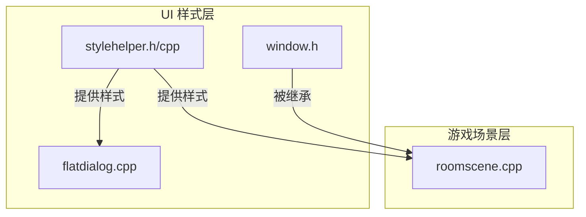
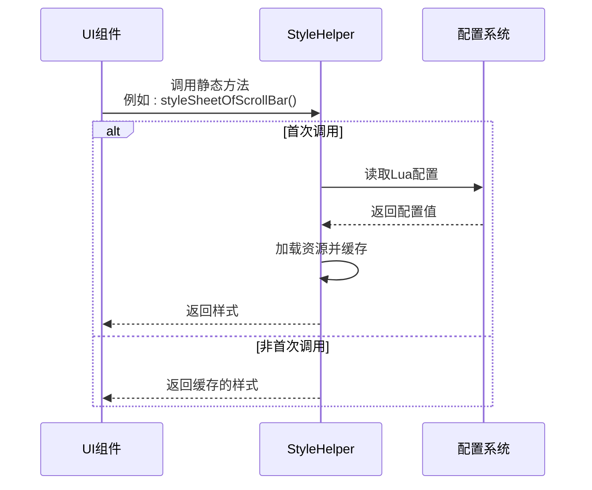
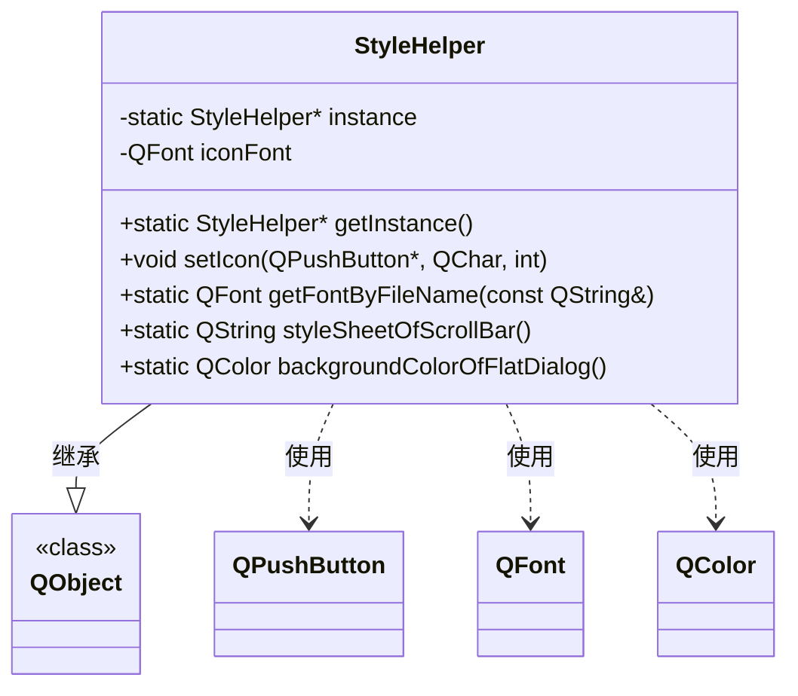
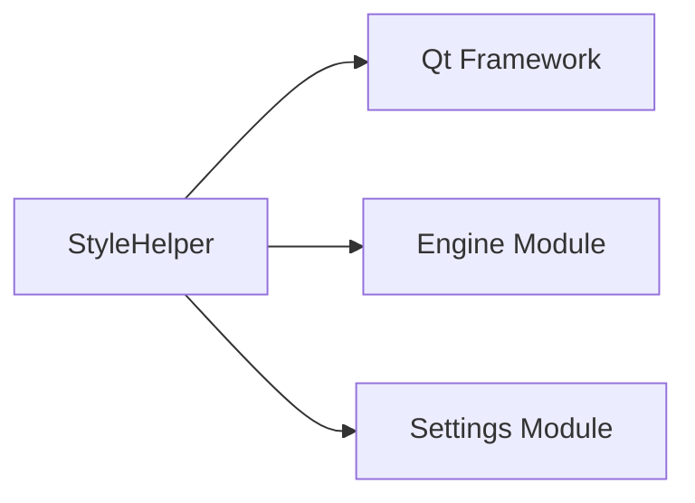

# 运行时样式处理

<cite>
**本文档引用的文件**  
- [stylehelper.cpp](file://src/ui/stylehelper.cpp)
- [stylehelper.h](file://src/ui/stylehelper.h)
- [window.h](file://src/ui/window.h)
- [roomscene.cpp](file://src/ui/roomscene.cpp)
- [flatdialog.cpp](file://src/dialog/flatdialog.cpp)
</cite>

## 目录
1. [简介](#简介)
2. [项目结构](#项目结构)
3. [核心组件](#核心组件)
4. [架构概述](#架构概述)
5. [详细组件分析](#详细组件分析)
6. [依赖分析](#依赖分析)
7. [性能考虑](#性能考虑)
8. [故障排除指南](#故障排除指南)
9. [结论](#结论)

## 简介
本文档详细阐述了《三国杀》客户端中运行时样式处理机制的实现原理，重点分析了 `StyleHelper` 类如何实现样式的动态加载、解析与应用。文档结合 `window.h` 中的窗口基类和 `roomscene.cpp` 中的游戏场景实现，说明了全局主题切换如何通过 Qt 信号槽机制广播至所有 UI 组件，并触发重绘。同时，文档提供了自定义主题扩展的编程接口使用示例。

## 项目结构
项目采用分层架构，UI 相关代码主要位于 `src/ui` 目录下。`stylehelper.cpp` 和 `stylehelper.h` 构成了样式管理的核心，负责字体、颜色和样式表的加载与分发。`window.h` 定义了所有窗口的基类，而 `roomscene.cpp` 则是游戏主场景的实现，它依赖于 `StyleHelper` 来获取样式信息。



**图示来源**
- [stylehelper.h](file://src/ui/stylehelper.h#L1-L60)
- [window.h](file://src/ui/window.h#L1-L62)
- [roomscene.cpp](file://src/ui/roomscene.cpp#L1-L100)

**本节来源**
- [stylehelper.h](file://src/ui/stylehelper.h#L1-L60)
- [window.h](file://src/ui/window.h#L1-L62)

## 核心组件
`StyleHelper` 是一个单例类，负责集中管理应用程序的样式资源。它提供了加载自定义字体、读取样式表文件和获取配置化颜色的静态方法。`Window` 类是所有 UI 窗口的基类，定义了窗口的基本行为和外观。`RoomScene` 作为游戏主场景，集成了 `StyleHelper` 的功能，确保所有 UI 元素（如按钮、对话框）都能正确应用当前主题。

**本节来源**
- [stylehelper.cpp](file://src/ui/stylehelper.cpp#L1-L104)
- [window.h](file://src/ui/window.h#L1-L62)

## 架构概述
系统的样式处理架构基于单例模式和静态方法调用。`StyleHelper` 实例在程序启动时创建，并通过 `getInstance()` 方法全局访问。当 UI 组件需要特定样式时，它们直接调用 `StyleHelper` 的静态方法。主题的动态切换通过修改配置文件（如 Lua 配置）实现，`StyleHelper` 在首次获取资源时会从配置中读取最新值，从而实现运行时更新。



**图示来源**
- [stylehelper.cpp](file://src/ui/stylehelper.cpp#L86-L103)
- [stylehelper.h](file://src/ui/stylehelper.h#L44-L59)

## 详细组件分析

### StyleHelper 类分析
`StyleHelper` 类是样式管理的核心，其设计遵循了单例模式以确保全局唯一性。

#### 类结构与关系


**图示来源**
- [stylehelper.h](file://src/ui/stylehelper.h#L1-L60)
- [stylehelper.cpp](file://src/ui/stylehelper.cpp#L1-L104)

#### 样式加载与解析逻辑
`StyleHelper` 提供了多种方法来加载不同类型的样式资源：

1.  **字体加载 (`getFontByFileName`)**：该方法使用 `QFontDatabase` 将指定的字体文件（如 `fontawesome-webfont.ttf`）加载到应用程序中。为了提高性能，已加载的字体被缓存在 `loadedFonts` 静态映射中，避免重复加载。
2.  **样式表加载 (`styleSheetOfScrollBar`)**：该方法从 `style-sheet/scroll.qss` 文件中一次性读取滚动条的样式表内容，并将其缓存于静态变量 `style` 中。这确保了每次调用都返回相同的样式字符串，减少了文件 I/O 操作。
3.  **颜色配置 (`backgroundColorOfFlatDialog`)**：该方法从 Lua 配置系统中读取对话框背景色和透明度。它使用 `GetConfigFromLuaState` 宏获取 `dialog_background_color` 和 `dialog_background_alpha` 的值，并构建一个 `QColor` 对象。如果配置的颜色无效，则使用默认的浅蓝色（RGB: 214, 231, 239）作为后备。

**本节来源**
- [stylehelper.cpp](file://src/ui/stylehelper.cpp#L30-L103)

#### 运行时主题切换与通知机制
`StyleHelper` 本身不直接使用 Qt 信号槽来广播样式变更。相反，它采用了一种“惰性加载 + 配置驱动”的模式来实现运行时主题切换：

-   **惰性加载**：大多数样式资源（如颜色、样式表）只在首次被请求时从配置中读取一次，之后便返回缓存值。
-   **配置驱动**：当用户在设置中更改主题时，会修改 Lua 配置文件。下一次 `StyleHelper` 的方法被调用时（例如，创建一个新的 `FlatDialog`），它会重新读取最新的配置值，从而应用新主题。
-   **UI 组件响应**：UI 组件（如 `FlatDialog`）在构造时会调用 `StyleHelper` 的方法来获取样式。例如，`flatdialog.cpp` 中的 `FlatDialog` 构造函数会使用 `StyleHelper::backgroundColorOfFlatDialog()` 来设置其背景色。因此，主题的变更通过组件的创建和重绘过程自然地传播。

```mermaid
flowchart TD
A[用户更改主题设置] --> B[更新Lua配置文件]
B --> C[创建新的UI组件<br/>(如 FlatDialog)]
C --> D[组件调用 StyleHelper::backgroundColorOfFlatDialog()]
D --> E{是否首次调用?}
E --> |是| F[从Lua读取新配置<br/>并缓存]
E --> |否| G[返回缓存值]
F --> H[组件使用新颜色]
G --> H
H --> I[UI显示新主题]
```

**图示来源**
- [stylehelper.cpp](file://src/ui/stylehelper.cpp#L86-L103)
- [flatdialog.cpp](file://src/dialog/flatdialog.cpp#L1-L40)

**本节来源**
- [stylehelper.cpp](file://src/ui/stylehelper.cpp#L86-L103)
- [flatdialog.cpp](file://src/dialog/flatdialog.cpp#L1-L40)

### Window 基类与 RoomScene 实现分析
`Window` 类是所有自定义窗口的基类，它继承自 `QGraphicsObject`。`RoomScene` 类则继承自 `QGraphicsScene`，代表了游戏的主场景。`RoomScene` 通过包含 `Photo`、`Dashboard` 等 `Window` 的子类来构建复杂的 UI。

#### 组件如何响应样式重绘
当主题切换后，`RoomScene` 及其子组件通过以下方式响应：

1.  **构造时获取样式**：组件在构造函数中调用 `StyleHelper` 获取初始样式。例如，`roomscene.cpp` 中创建 `QScrollBar` 时，会使用 `StyleHelper::styleSheetOfScrollBar()` 来设置其样式表。
2.  **信号槽驱动更新**：`RoomScene` 大量使用 Qt 信号槽机制来响应游戏状态变化。例如，当玩家血量变化时，`ClientInstance` 会发出 `hp_changed` 信号，`RoomScene` 槽函数 `changeHp` 会被调用，进而更新 UI。虽然这个例子不直接涉及主题，但它展示了 UI 更新的通用模式。对于样式相关的更新，通常需要重新创建或显式刷新组件。
3.  **状态相关样式**：组件的外观会根据其状态（如选中、禁用）动态变化。这通常通过 Qt 的样式表伪状态（如 `:hover`, `:disabled`）或在代码中根据状态切换不同的 `QPixmap` 来实现。`StyleHelper` 提供的基础样式为这些状态变化奠定了基础。

**本节来源**
- [window.h](file://src/ui/window.h#L1-L62)
- [roomscene.cpp](file://src/ui/roomscene.cpp#L1-L100)

## 依赖分析
`StyleHelper` 类依赖于多个核心模块：
-   **Qt 框架**：依赖 `QApplication`, `QFontDatabase`, `QFile`, `QTextStream` 等类来管理资源和文件 I/O。
-   **引擎模块**：通过 `Sanguosha->getLuaState()` 访问 Lua 配置系统，这是实现配置化样式的桥梁。
-   **设置模块**：头文件中包含了 `settings.h`，`styleSheetOfTooltip` 方法直接使用了 `Config.ToolTipBackgroundColor`。



**图示来源**
- [stylehelper.h](file://src/ui/stylehelper.h#L1-L60)
- [stylehelper.cpp](file://src/ui/stylehelper.cpp#L1-L104)

**本节来源**
- [stylehelper.h](file://src/ui/stylehelper.h#L1-L60)
- [stylehelper.cpp](file://src/ui/stylehelper.cpp#L1-L104)

## 性能考虑
`StyleHelper` 的设计充分考虑了性能：
-   **资源缓存**：字体、样式表和颜色等资源在首次加载后会被缓存，避免了重复的文件读取和解析开销。
-   **单例模式**：全局唯一的实例减少了内存占用。
-   **静态方法**：直接调用静态方法比通过对象实例调用更高效。

潜在的性能瓶颈在于对 Lua 配置的读取，但由于 `backgroundColorOfFlatDialog` 的结果也被缓存，因此该操作仅在首次调用时发生。

## 故障排除指南
-   **图标不显示**：检查 `font/` 目录下是否存在 `fontawesome-webfont.ttf` 文件。确保 `QFontDatabase::addApplicationFont()` 调用成功（返回值不为 -1）。
-   **颜色配置无效**：如果日志中出现 "Invalid color for dialog background" 警告，说明 Lua 配置中的颜色值格式错误。请检查 `dialog_background_color` 的值是否为有效的颜色名称（如 "white"）或十六进制字符串（如 "#FFFFFF"）。
-   **样式表未生效**：确认 `style-sheet/scroll.qss` 文件路径正确且可读。检查文件内容是否符合 Qt 样式表语法。

**本节来源**
- [stylehelper.cpp](file://src/ui/stylehelper.cpp#L86-L103)

## 结论
`StyleHelper` 类通过单例模式和静态方法，为《三国杀》客户端提供了一个高效、集中的样式管理方案。它利用惰性加载和缓存机制优化了性能，并通过与 Lua 配置系统的集成，实现了运行时主题的动态切换。UI 组件通过在构造时调用 `StyleHelper` 的方法来获取样式，从而保证了全局外观的一致性。该设计简洁有效，是管理复杂 UI 应用程序外观的良好实践。