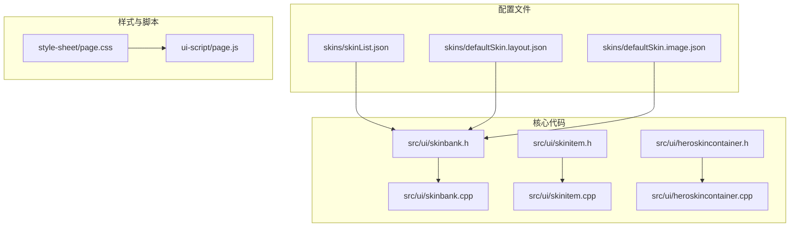
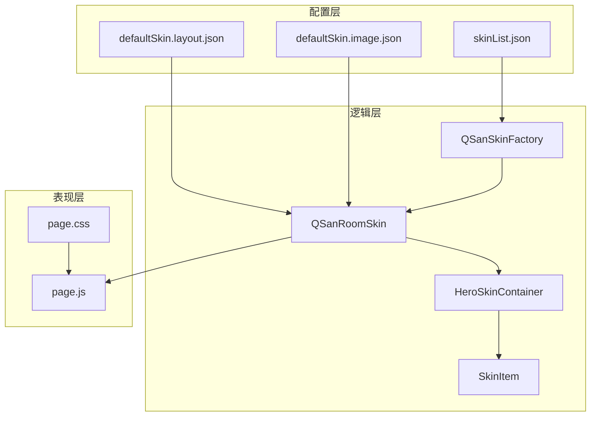
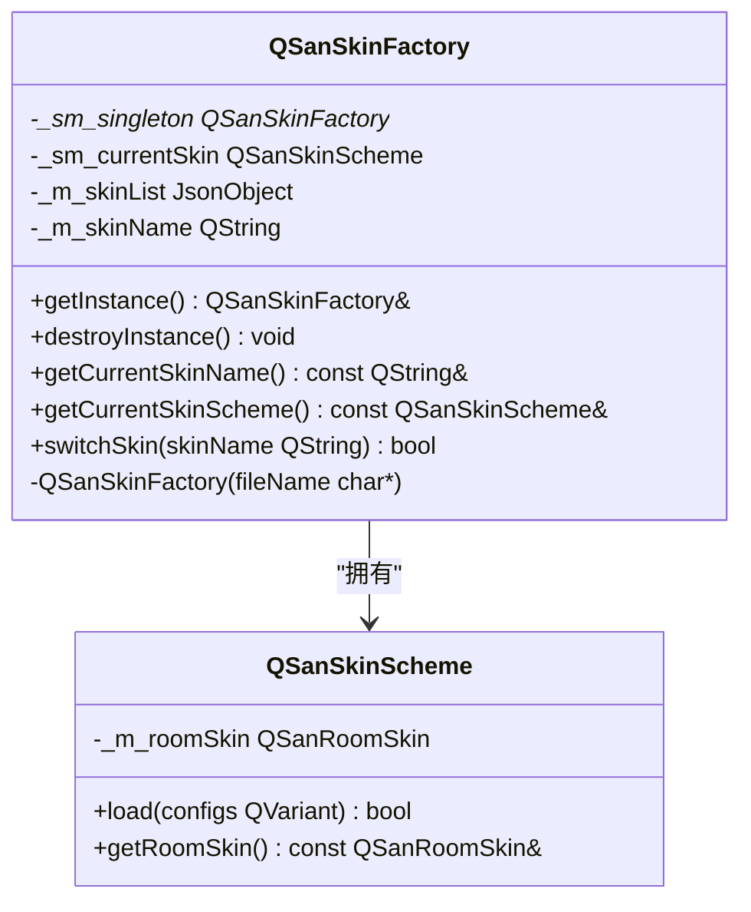
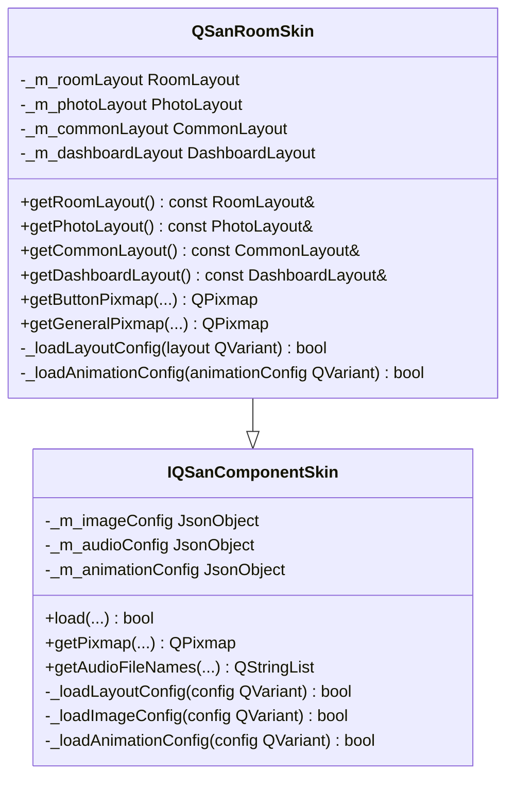
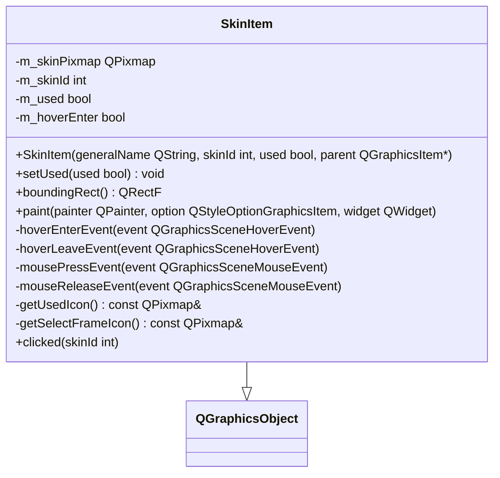
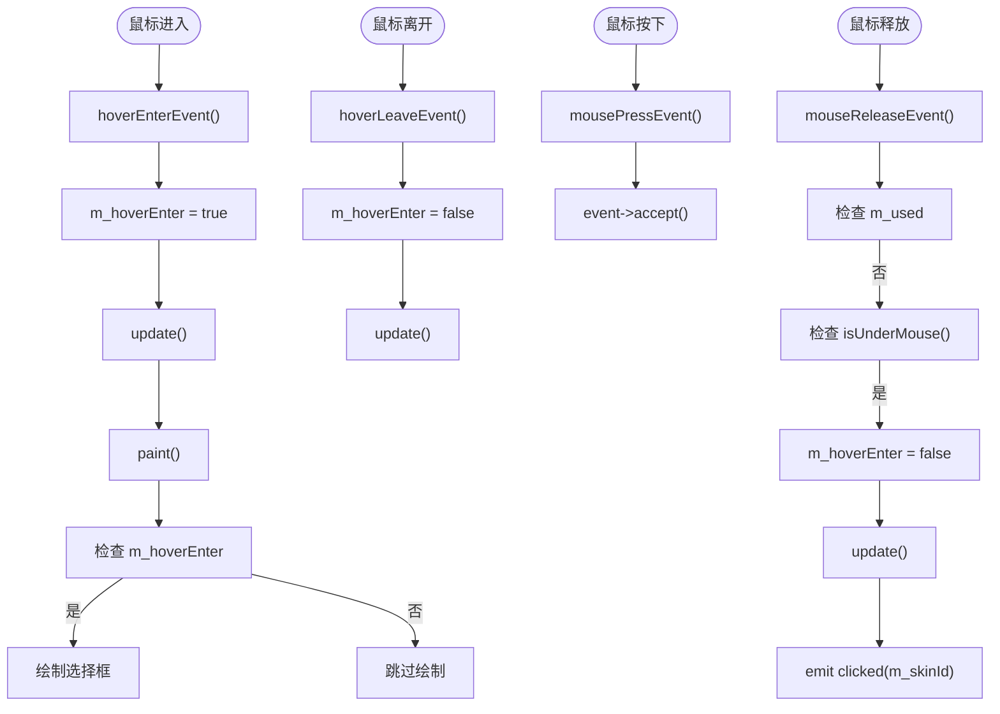
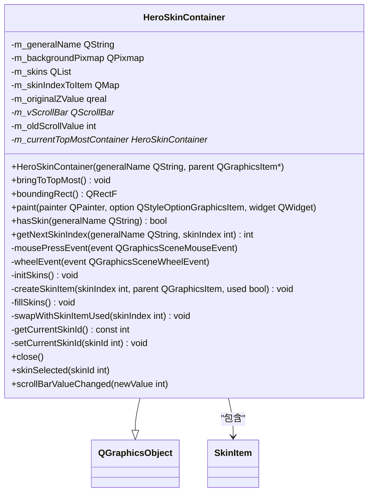
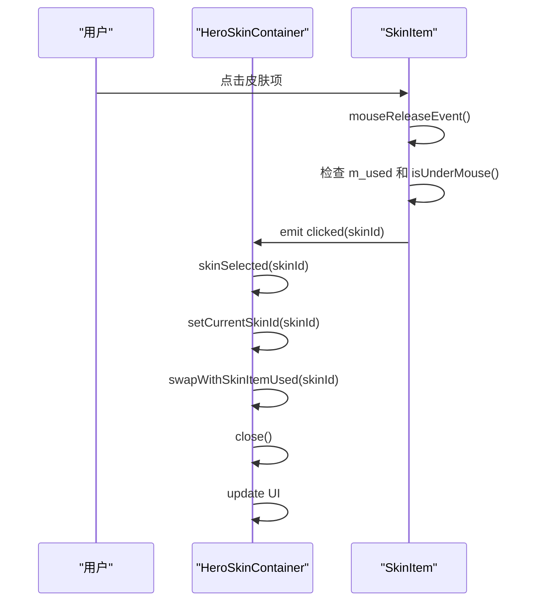
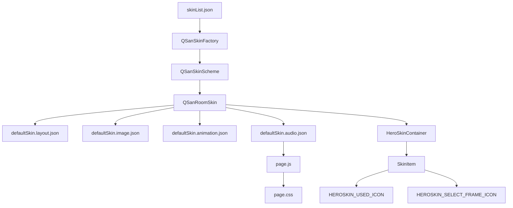

# 皮肤与样式系统

<cite>
**本文档中引用的文件**   
- [skinList.json](file://skins/skinList.json)
- [defaultSkin.layout.json](file://skins/defaultSkin.layout.json)
- [defaultSkin.image.json](file://skins/defaultSkin.image.json)
- [page.css](file://style-sheet/page.css)
- [page.js](file://ui-script/page.js)
- [skinbank.h](file://src/ui/skinbank.h)
- [skinbank.cpp](file://src/ui/skinbank.cpp)
- [skinitem.h](file://src/ui/skinitem.h)
- [skinitem.cpp](file://src/ui/skinitem.cpp)
- [heroskincontainer.h](file://src/ui/heroskincontainer.h)
- [heroskincontainer.cpp](file://src/ui/heroskincontainer.cpp)
</cite>

## 目录
1. [简介](#简介)
2. [项目结构](#项目结构)
3. [核心组件](#核心组件)
4. [架构概述](#架构概述)
5. [详细组件分析](#详细组件分析)
6. [依赖分析](#依赖分析)
7. [性能考虑](#性能考虑)
8. [故障排除指南](#故障排除指南)
9. [结论](#结论)

## 简介
本技术文档详细阐述了《三国杀》游戏中的皮肤与样式系统。该系统采用基于JSON的配置机制，实现了界面元素的灵活布局、动态UI效果以及皮肤资源的加载与应用。文档将深入解析皮肤配置文件、样式表集成、脚本实现以及核心C++类的实现逻辑，为开发者提供完整的自定义皮肤开发指南。

## 项目结构
皮肤与样式系统主要由以下几个目录构成：
- `skins/`: 存放皮肤配置文件，包括布局、图像、音频和动画的JSON定义。
- `style-sheet/`: 存放CSS样式表文件，用于定义HTML界面的视觉样式。
- `ui-script/`: 存放JavaScript脚本文件，用于实现HTML界面的动态交互效果。
- `src/ui/`: 存放核心C++源代码，包括皮肤资源管理、加载和应用的类。

**Diagram sources**
- [skinList.json](file://skins/skinList.json)
- [defaultSkin.layout.json](file://skins/defaultSkin.layout.json)
- [defaultSkin.image.json](file://skins/defaultSkin.image.json)
- [page.css](file://style-sheet/page.css)
- [page.js](file://ui-script/page.js)
- [skinbank.h](file://src/ui/skinbank.h)
- [skinbank.cpp](file://src/ui/skinbank.cpp)
- [skinitem.h](file://src/ui/skinitem.h)
- [skinitem.cpp](file://src/ui/skinitem.cpp)
- [heroskincontainer.h](file://src/ui/heroskincontainer.h)
- [heroskincontainer.cpp](file://src/ui/heroskincontainer.cpp)

**Section sources**
- [skinList.json](file://skins/skinList.json)
- [defaultSkin.layout.json](file://skins/defaultSkin.layout.json)
- [defaultSkin.image.json](file://skins/defaultSkin.image.json)
- [page.css](file://style-sheet/page.css)
- [page.js](file://ui-script/page.js)
- [skinbank.h](file://src/ui/skinbank.h)
- [skinbank.cpp](file://src/ui/skinbank.cpp)
- [skinitem.h](file://src/ui/skinitem.h)
- [skinitem.cpp](file://src/ui/skinitem.cpp)
- [heroskincontainer.h](file://src/ui/heroskincontainer.h)
- [heroskincontainer.cpp](file://src/ui/heroskincontainer.cpp)

## 核心组件
皮肤与样式系统的核心组件包括：
- **皮肤配置管理器** (`QSanSkinFactory`): 负责加载和管理所有可用的皮肤方案。
- **皮肤资源银行** (`QSanRoomSkin`): 提供对布局、图像、音频等皮肤资源的访问接口。
- **皮肤项** (`SkinItem`): 代表单个皮肤选择项的UI元素。
- **英雄皮肤容器** (`HeroSkinContainer`): 管理一组`SkinItem`，提供皮肤选择和切换功能。

**Section sources**
- [skinbank.h](file://src/ui/skinbank.h#L1640-L1660)
- [skinbank.cpp](file://src/ui/skinbank.cpp#L1640-L1660)
- [skinitem.h](file://src/ui/skinitem.h#L42-L64)
- [skinitem.cpp](file://src/ui/skinitem.cpp#L32-L73)
- [heroskincontainer.h](file://src/ui/heroskincontainer.h#L40-L88)
- [heroskincontainer.cpp](file://src/ui/heroskincontainer.cpp#L142-L193)

## 架构概述
整个皮肤系统的架构可以分为三层：配置层、逻辑层和表现层。

**Diagram sources**
- [skinList.json](file://skins/skinList.json)
- [defaultSkin.layout.json](file://skins/defaultSkin.layout.json)
- [defaultSkin.image.json](file://skins/defaultSkin.image.json)
- [skinbank.h](file://src/ui/skinbank.h)
- [skinbank.cpp](file://src/ui/skinbank.cpp)
- [heroskincontainer.h](file://src/ui/heroskincontainer.h)
- [heroskincontainer.cpp](file://src/ui/heroskincontainer.cpp)
- [skinitem.h](file://src/ui/skinitem.h)
- [skinitem.cpp](file://src/ui/skinitem.cpp)
- [page.css](file://style-sheet/page.css)
- [page.js](file://ui-script/page.js)

## 详细组件分析

### 皮肤配置管理器分析
`QSanSkinFactory`是皮肤系统的单例管理器，负责加载皮肤列表并切换当前皮肤。

#### 类图

**Diagram sources**
- [skinbank.h](file://src/ui/skinbank.h#L500-L554)
- [skinbank.cpp](file://src/ui/skinbank.cpp#L1640-L1660)

**Section sources**
- [skinbank.h](file://src/ui/skinbank.h#L500-L554)
- [skinbank.cpp](file://src/ui/skinbank.cpp#L1640-L1660)

### 皮肤资源银行分析
`QSanRoomSkin`类是皮肤资源的核心，它从JSON配置文件中解析出布局、图像等信息，并提供访问接口。

#### 类图

**Diagram sources**
- [skinbank.h](file://src/ui/skinbank.h#L100-L500)

**Section sources**
- [skinbank.h](file://src/ui/skinbank.h#L100-L500)

### 皮肤项分析
`SkinItem`类代表一个可点击的皮肤选择项，它继承自`QGraphicsObject`，用于在图形场景中显示。

#### 类图

#### 事件处理流程图

**Diagram sources**
- [skinitem.h](file://src/ui/skinitem.h#L42-L64)
- [skinitem.cpp](file://src/ui/skinitem.cpp#L32-L73)

**Section sources**
- [skinitem.h](file://src/ui/skinitem.h#L42-L64)
- [skinitem.cpp](file://src/ui/skinitem.cpp#L32-L73)

### 英雄皮肤容器分析
`HeroSkinContainer`类管理一组`SkinItem`，提供皮肤选择、滚动和切换功能。

#### 类图

#### 皮肤选择序列图

**Diagram sources**
- [heroskincontainer.h](file://src/ui/heroskincontainer.h#L40-L88)
- [heroskincontainer.cpp](file://src/ui/heroskincontainer.cpp#L142-L193)

**Section sources**
- [heroskincontainer.h](file://src/ui/heroskincontainer.h#L40-L88)
- [heroskincontainer.cpp](file://src/ui/heroskincontainer.cpp#L142-L193)

## 依赖分析
皮肤系统各组件之间的依赖关系如下：

**Diagram sources**
- [skinList.json](file://skins/skinList.json)
- [defaultSkin.layout.json](file://skins/defaultSkin.layout.json)
- [defaultSkin.image.json](file://skins/defaultSkin.image.json)
- [defaultSkin.animation.json](file://skins/defaultSkin.animation.json)
- [defaultSkin.audio.json](file://skins/defaultSkin.audio.json)
- [page.js](file://ui-script/page.js)
- [page.css](file://style-sheet/page.css)
- [skinbank.h](file://src/ui/skinbank.h)
- [skinbank.cpp](file://src/ui/skinbank.cpp)
- [heroskincontainer.h](file://src/ui/heroskincontainer.h)
- [heroskincontainer.cpp](file://src/ui/heroskincontainer.cpp)
- [skinitem.h](file://src/ui/skinitem.h)
- [skinitem.cpp](file://src/ui/skinitem.cpp)

**Section sources**
- [skinList.json](file://skins/skinList.json)
- [defaultSkin.layout.json](file://skins/defaultSkin.layout.json)
- [defaultSkin.image.json](file://skins/defaultSkin.image.json)
- [defaultSkin.animation.json](file://skins/defaultSkin.animation.json)
- [defaultSkin.audio.json](file://skins/defaultSkin.audio.json)
- [page.js](file://ui-script/page.js)
- [page.css](file://style-sheet/page.css)
- [skinbank.h](file://src/ui/skinbank.h)
- [skinbank.cpp](file://src/ui/skinbank.cpp)
- [heroskincontainer.h](file://src/ui/heroskincontainer.h)
- [heroskincontainer.cpp](file://src/ui/heroskincontainer.cpp)
- [skinitem.h](file://src/ui/skinitem.h)
- [skinitem.cpp](file://src/ui/skinitem.cpp)

## 性能考虑
- **资源缓存**: `QSanPixmapCache`类使用静态哈希表缓存已加载的图片，避免重复加载，提高性能。
- **懒加载**: 皮肤资源在需要时才从文件系统加载，减少启动时的内存占用。
- **事件优化**: `SkinItem`只接受左键点击事件，并启用悬停事件，减少了不必要的事件处理开销。

## 故障排除指南
- **皮肤不显示**: 检查`skinList.json`中的路径是否正确，确保图片文件存在。
- **布局错乱**: 检查`defaultSkin.layout.json`中的坐标和尺寸定义，确保没有超出边界。
- **点击无反应**: 检查`SkinItem`的`setAcceptedMouseButtons`是否正确设置为`Qt::LeftButton`。
- **样式不生效**: 检查`page.css`中的选择器是否正确，确保HTML元素的ID和类名匹配。

**Section sources**
- [skinList.json](file://skins/skinList.json)
- [defaultSkin.layout.json](file://skins/defaultSkin.layout.json)
- [defaultSkin.image.json](file://skins/defaultSkin.image.json)
- [page.css](file://style-sheet/page.css)
- [skinitem.h](file://src/ui/skinitem.h#L42-L64)
- [skinitem.cpp](file://src/ui/skinitem.cpp#L32-L73)

## 结论
本文档全面解析了《三国杀》游戏的皮肤与样式系统。该系统通过JSON配置文件实现了界面布局的灵活定义，通过C++类实现了皮肤资源的高效管理和动态UI交互。开发者可以基于此文档，轻松地创建和定制新的皮肤，为游戏增添更多个性化元素。