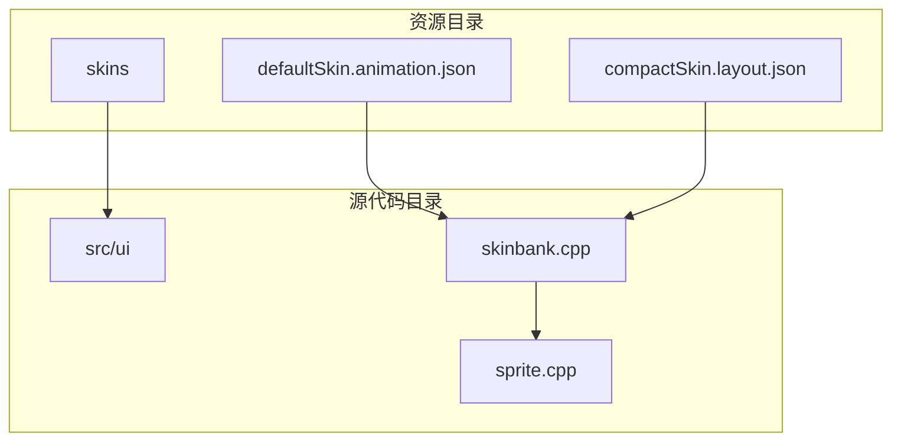
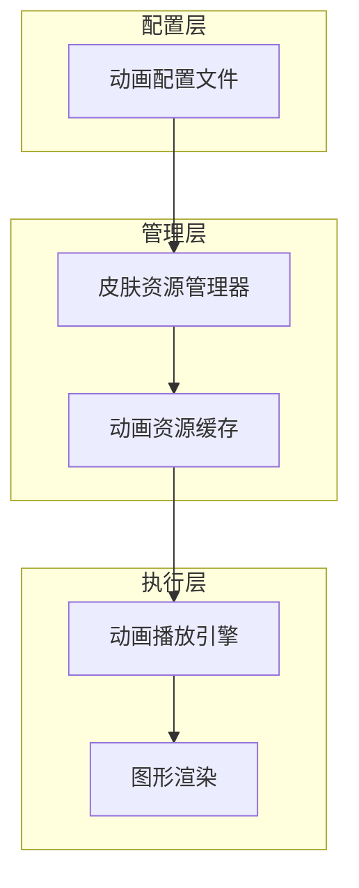
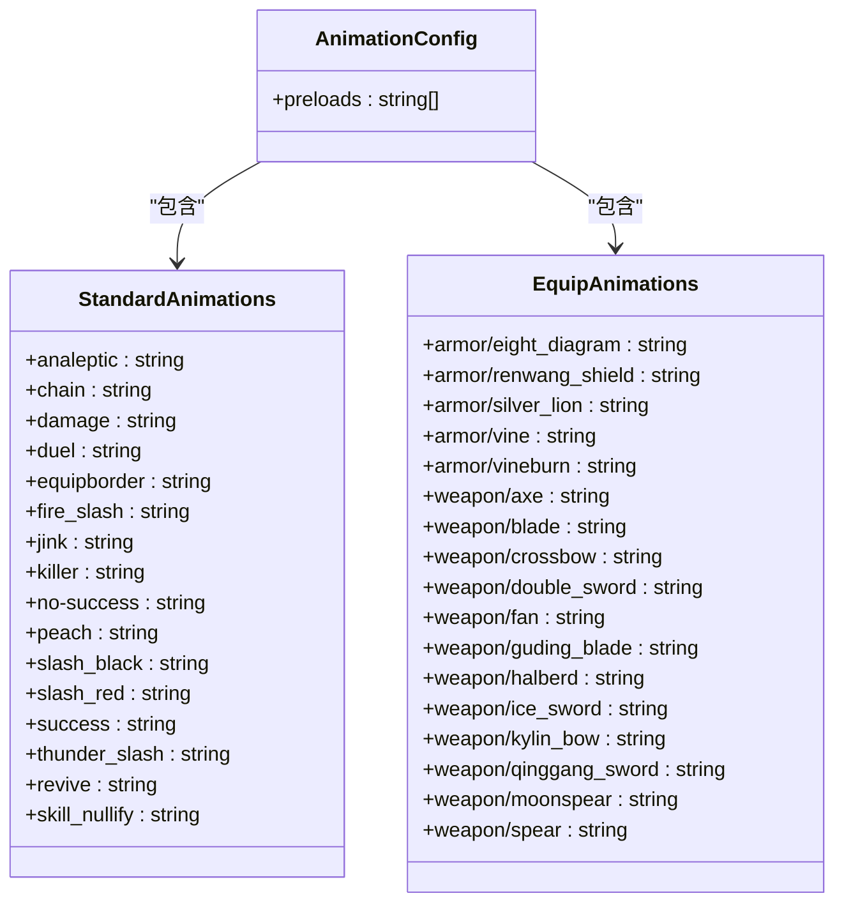
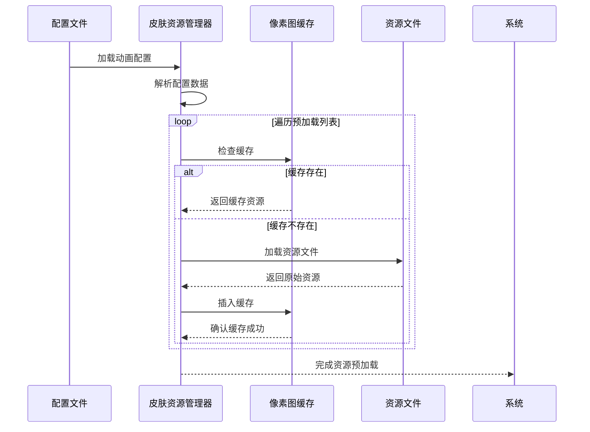
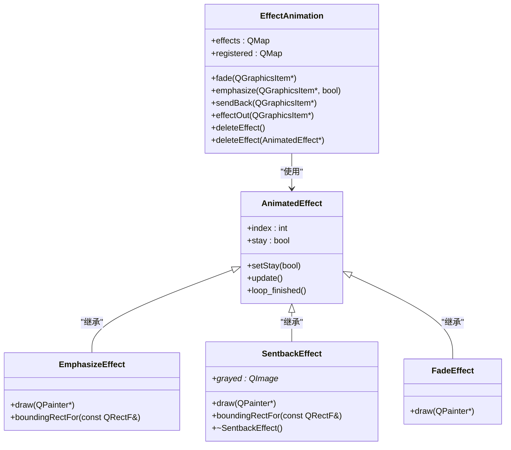
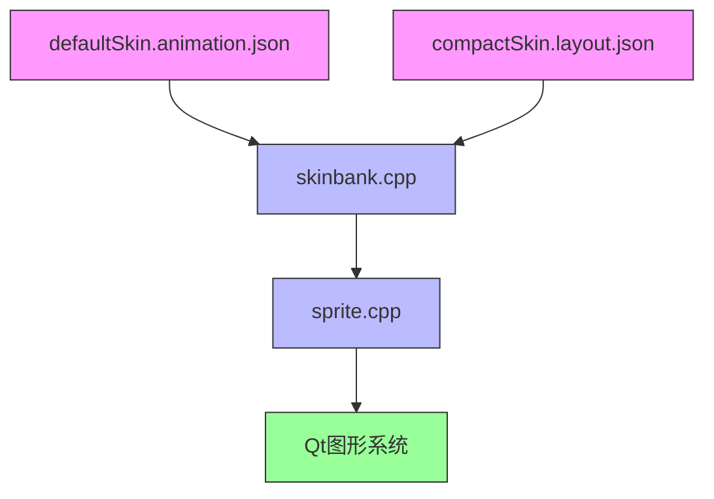

# 动画配置

<cite>
**本文档引用的文件**   
- [defaultSkin.animation.json](file://skins/defaultSkin.animation.json)
- [compactSkin.layout.json](file://skins/compactSkin.layout.json)
- [skinbank.cpp](file://src/ui/skinbank.cpp)
- [sprite.cpp](file://src/ui/sprite.cpp)
</cite>

## 目录
1. [简介](#简介)
2. [项目结构](#项目结构)
3. [核心组件](#核心组件)
4. [架构概述](#架构概述)
5. [详细组件分析](#详细组件分析)
6. [依赖分析](#依赖分析)
7. [性能考虑](#性能考虑)
8. [故障排除指南](#故障排除指南)
9. [结论](#结论)

## 简介
本文档深入解析《三国杀》游戏客户端中动画系统的实现机制。重点分析动画资源的配置、预加载、播放逻辑以及与UI组件的集成方式。文档涵盖`defaultSkin.animation.json`中的动画定义、`compactSkin.layout.json`中的布局定位、`skinbank.cpp`中的资源管理以及`sprite.cpp`中的核心播放逻辑。通过系统性分析，为开发者提供完整的动画系统技术文档。

## 项目结构
本项目采用模块化设计，将资源文件与源代码分离。动画相关配置位于`skins`目录下，而核心逻辑实现在`src/ui`目录中。这种结构有利于资源的独立维护和动态加载。

**图示来源**
- [defaultSkin.animation.json](file://skins/defaultSkin.animation.json)
- [compactSkin.layout.json](file://skins/compactSkin.layout.json)
- [skinbank.cpp](file://src/ui/skinbank.cpp)
- [sprite.cpp](file://src/ui/sprite.cpp)

**本节来源**
- [skins/defaultSkin.animation.json](file://skins/defaultSkin.animation.json)
- [src/ui/skinbank.cpp](file://src/ui/skinbank.cpp)

## 核心组件
动画系统由四个核心部分组成：动画配置、布局定义、资源管理和播放引擎。这些组件协同工作，实现流畅的视觉效果。

**本节来源**
- [defaultSkin.animation.json](file://skins/defaultSkin.animation.json)
- [skinbank.cpp](file://src/ui/skinbank.cpp)
- [sprite.cpp](file://src/ui/sprite.cpp)

## 架构概述
动画系统采用分层架构设计，从配置到渲染形成清晰的数据流。配置文件定义资源，资源管理器加载缓存，播放引擎控制动画效果。

**图示来源**
- [defaultSkin.animation.json](file://skins/defaultSkin.animation.json)
- [skinbank.cpp](file://src/ui/skinbank.cpp)
- [sprite.cpp](file://src/ui/sprite.cpp)

## 详细组件分析

### 动画配置分析
`defaultSkin.animation.json`文件定义了游戏中所有预加载的动画资源。这些动画按功能分为标准动画和装备动画两大类。

#### 动画配置结构

**图示来源**
- [defaultSkin.animation.json](file://skins/defaultSkin.animation.json)

**本节来源**
- [defaultSkin.animation.json](file://skins/defaultSkin.animation.json)

### 布局定位分析
`compactSkin.layout.json`文件定义了UI组件的布局参数，包括动画在界面中的定位和层级关系。

#### 布局配置关键参数
- **photo**: 玩家头像区域配置
  - normalWidth: 正常宽度
  - normalHeight: 正常高度
  - mainFrameArea: 主框架区域
  - canvasArea: 画布区域
- **room**: 游戏房间配置
  - scenePadding: 场景内边距
  - roleBoxHeight: 角色框高度
  - chatTextBoxHeight: 聊天文本框高度
  - logBoxHeightPercentage: 日志框高度百分比
  - chatBoxHeightPercentage: 聊天框高度百分比

**本节来源**
- [compactSkin.layout.json](file://skins/compactSkin.layout.json)

### 资源管理分析
`skinbank.cpp`文件实现了动画资源的预加载与缓存管理机制。

#### 资源加载流程

**图示来源**
- [skinbank.cpp](file://src/ui/skinbank.cpp)

**本节来源**
- [skinbank.cpp](file://src/ui/skinbank.cpp)

### 播放引擎分析
`sprite.cpp`文件实现了动画播放的核心逻辑，包括帧更新、状态切换和事件回调。

#### 动画效果类关系

**图示来源**
- [sprite.cpp](file://src/ui/sprite.cpp)

**本节来源**
- [sprite.cpp](file://src/ui/sprite.cpp)

## 依赖分析
动画系统各组件之间存在明确的依赖关系，形成清晰的调用链。

**图示来源**
- [defaultSkin.animation.json](file://skins/defaultSkin.animation.json)
- [compactSkin.layout.json](file://skins/compactSkin.layout.json)
- [skinbank.cpp](file://src/ui/skinbank.cpp)
- [sprite.cpp](file://src/ui/sprite.cpp)

**本节来源**
- [skinbank.cpp](file://src/ui/skinbank.cpp)
- [sprite.cpp](file://src/ui/sprite.cpp)

## 性能考虑
为确保动画系统的高效运行，建议采取以下优化措施：

1. **帧复用**: 通过`QPixmapCache`实现动画帧的缓存复用，避免重复加载
2. **延迟加载**: 对非关键动画采用按需加载策略，减少初始加载时间
3. **GPU加速**: 利用Qt的图形效果系统，将动画渲染卸载到GPU
4. **内存管理**: 及时清理不再使用的动画效果，防止内存泄漏
5. **批量处理**: 将多个小动画合并为批量操作，减少绘制调用次数

**本节来源**
- [skinbank.cpp](file://src/ui/skinbank.cpp)
- [sprite.cpp](file://src/ui/sprite.cpp)

## 故障排除指南
常见动画问题及解决方案：

- **动画不显示**: 检查`defaultSkin.animation.json`中是否包含对应动画名称
- **动画卡顿**: 确认`QPixmapCache`是否正常工作，检查内存使用情况
- **位置偏移**: 验证`compactSkin.layout.json`中的坐标参数是否正确
- **效果异常**: 检查`sprite.cpp`中的动画逻辑是否有逻辑错误
- **资源缺失**: 确保动画资源文件存在于正确的路径下

**本节来源**
- [skinbank.cpp](file://src/ui/skinbank.cpp)
- [sprite.cpp](file://src/ui/sprite.cpp)

## 结论
本文档全面解析了《三国杀》游戏客户端的动画系统实现。通过配置文件定义、资源管理、布局定位和播放引擎四个层次的协同工作，实现了丰富的视觉效果。系统设计合理，具有良好的可维护性和扩展性。建议在后续开发中继续优化资源管理和渲染性能，为玩家提供更流畅的游戏体验。