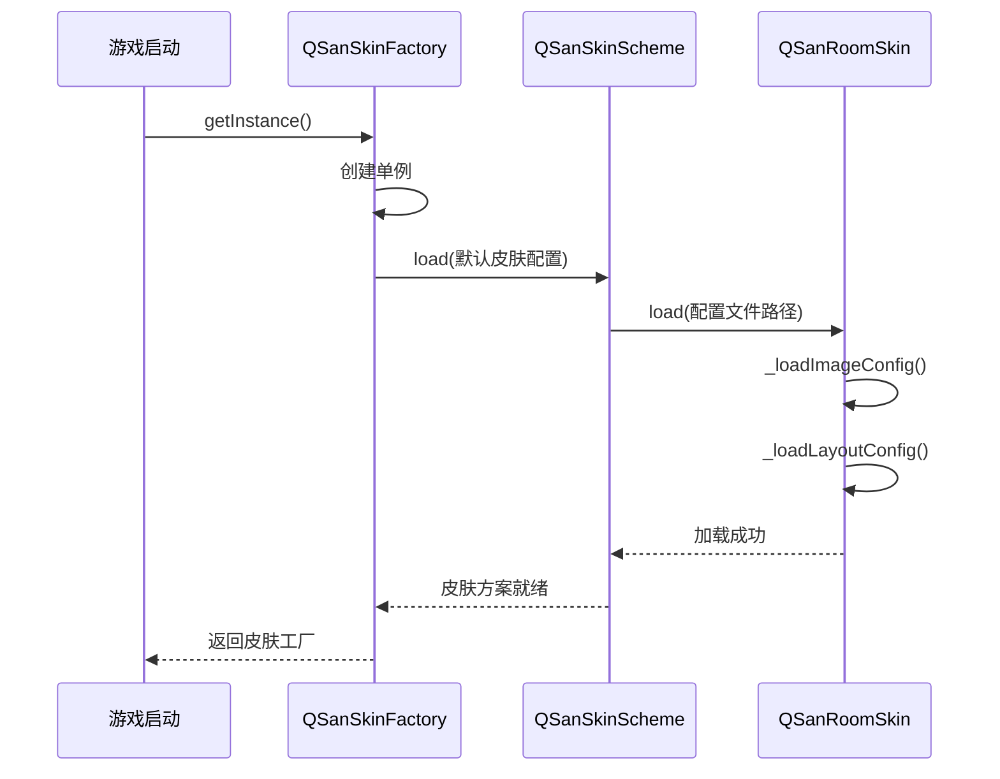
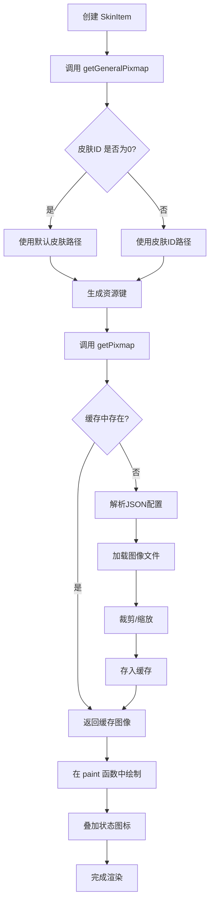

# 图像资源

<cite>
**本文档中引用的文件**   
- [defaultSkin.image.json](file://skins/defaultSkin.image.json)
- [compactSkin.image.json](file://skins/compactSkin.image.json)
- [skinbank.cpp](file://src/ui/skinbank.cpp)
- [skinbank.h](file://src/ui/skinbank.h)
- [skinitem.cpp](file://src/ui/skinitem.cpp)
</cite>

## 目录
1. [图像资源配置解析](#图像资源配置解析)
2. [图像资源加载与缓存机制](#图像资源加载与缓存机制)
3. [动态图像渲染流程](#动态图像渲染流程)
4. [图像资源优化建议](#图像资源优化建议)

## 图像资源配置解析

本节详细解析 `defaultSkin.image.json` 和 `compactSkin.image.json` 文件中的图像资源配置，涵盖资源路径映射、精灵图布局、图像尺寸定义及UI组件绑定关系。

### 资源路径映射与通配符

图像资源配置文件采用JSON格式，定义了游戏中所有UI元素的图像资源路径。路径映射支持通配符 `%1` 和 `%2`，用于动态生成具体资源路径。

- **`%1`**：通常代表武将名称、卡牌名称或皮肤ID。
- **`%2`**：通常代表皮肤ID，用于区分不同皮肤。

例如，在 `defaultSkin.image.json` 中：
```json
"playerGeneralIcon-default-0-0": ["image/generals/avatar/%1.png", [71, 28, 134, 134], [40, 40]]
```
当需要获取武将“刘备”的头像时，`%1` 会被替换为 `liubei`，最终路径为 `image/generals/avatar/liubei.png`。

### 精灵图（Sprite Sheet）布局

精灵图是一种将多个小图像合并到一张大图中的技术，以减少文件数量和加载次数。配置文件通过数组定义了从精灵图中裁剪特定图像的区域。

数组格式为 `[文件路径, [x, y, width, height], [缩放后尺寸]]`。

- **`[x, y, width, height]`**：指定从源图像中裁剪的矩形区域。
- **`[缩放后尺寸]`**：可选，指定裁剪后的图像在显示时的最终尺寸。

例如：
```json
"cardTiny-analeptic": ["image/big-card/analeptic.png",[40, 98, 124, 124],[40, 40]]
```
这表示从 `analeptic.png` 图像的 `(40, 98)` 位置开始，裁剪一个 `124x124` 的区域，并将其缩放为 `40x40` 的尺寸显示。

### 图像尺寸定义

配置文件中直接定义了多种UI元素的固定尺寸，确保UI布局的一致性。

- **`m_tinyAvatarSize`**：在 `skinbank.h` 的 `CommonLayout` 结构中定义，用于小头像的尺寸。
- **`m_generalCardSize`**：定义了武将卡牌的整体尺寸。
- **`m_magatamaSize`**：定义了代表生命值的勾玉图标尺寸。

这些尺寸在 `defaultSkin.layout.json` 中定义，并在 `skinbank.cpp` 的 `_loadLayoutConfig` 函数中被解析和应用。

### UI组件绑定关系

图像资源通过预定义的键（Key）与UI组件进行绑定。这些键在 `skinbank.h` 的 `QSanRoomSkin` 类中被声明为静态常量。

- **`S_SKIN_KEY_PHOTO`**：与玩家头像（Photo）相关的资源键前缀。
- **`S_SKIN_KEY_DASHBOARD`**：与玩家仪表盘（Dashboard）相关的资源键前缀。
- **`S_SKIN_KEY_GENERAL_CARD`**：与武将卡牌相关的资源键。

例如，`photoMainFrame` 键用于定义玩家头像框的背景图，而 `dashboardButtonSetBg` 键用于定义仪表盘按钮组的背景图。

**Section sources**
- [defaultSkin.image.json](file://skins/defaultSkin.image.json)
- [compactSkin.image.json](file://skins/compactSkin.image.json)
- [skinbank.h](file://src/ui/skinbank.h)

## 图像资源加载与缓存机制

本节分析 `skinbank.cpp` 中实现的图像资源异步加载机制与内存缓存策略。

### 异步加载机制

图像资源的加载由 `QSanSkinFactory` 单例类统一管理。游戏启动时，`getInstance()` 函数会根据 `skinList.json` 文件加载默认皮肤（`defaultSkin`）的配置。



**Diagram sources**
- [skinbank.cpp](file://src/ui/skinbank.cpp#L1600-L1661)
- [skinbank.h](file://src/ui/skinbank.h#L480-L554)

### 内存缓存策略

为避免重复加载和解析图像文件，系统采用了两级缓存策略。

1.  **`QSanPixmapCache`**：基于Qt的 `QPixmapCache` 实现，以文件路径为键，存储已加载的 `QPixmap` 对象。
2.  **`IQSanComponentSkin` 内部缓存**：使用 `S_IMAGE_KEY2FILE` 和 `S_IMAGE_KEY2PIXMAP` 两个静态哈希表。
    - `S_IMAGE_KEY2FILE`：存储资源键（Key）到文件路径的映射。
    - `S_IMAGE_KEY2PIXMAP`：存储资源键（Key）到 `QPixmap` 对象的映射。

当调用 `getPixmap()` 函数时，系统会按以下顺序查找：
1.  检查 `S_IMAGE_KEY2PIXMAP` 缓存。
2.  若未命中，则检查 `S_IMAGE_KEY2FILE` 缓存以获取文件路径。
3.  若仍未命中，则解析JSON配置文件，获取文件路径和裁剪信息。
4.  使用 `QSanPixmapCache::getPixmap()` 从文件加载图像，并根据需要进行裁剪和缩放。
5.  将结果存入 `S_IMAGE_KEY2PIXMAP` 缓存，供下次使用。

```cpp
QPixmap IQSanComponentSkin::getPixmap(const QString &key, const QString &arg, ...) const
{
    // 1. 检查内部缓存 S_IMAGE_KEY2PIXMAP
    if (S_IMAGE_KEY2PIXMAP.contains(cacheKey)) {
        return S_IMAGE_KEY2PIXMAP[cacheKey];
    }
    // 2. 解析配置，获取文件路径
    fileName = _readImageConfig(totalKey, clipRegion, clipping, scaleRegion, scaled);
    // 3. 从文件加载或从 QPixmapCache 加载
    QPixmap pixmap = QSanPixmapCache::getPixmap(fileName);
    // 4. 根据配置进行裁剪和缩放
    if (clipping) {
        pixmap = pixmap.copy(actualClip);
        if (scaled) pixmap = pixmap.scaled(scaleRegion);
    }
    // 5. 存入内部缓存
    S_IMAGE_KEY2PIXMAP[cacheKey] = pixmap;
    return pixmap;
}
```

**Section sources**
- [skinbank.cpp](file://src/ui/skinbank.cpp#L800-L1599)
- [skinbank.h](file://src/ui/skinbank.h#L100-L150)

## 动态图像渲染流程

本节说明 `skinitem.cpp` 如何根据皮肤配置动态渲染图像。

### SkinItem 组件渲染

`SkinItem` 类用于显示可选的武将皮肤。其渲染流程如下：

1.  **构造函数**：接收武将名称和皮肤ID，调用 `G_ROOM_SKIN.getGeneralPixmap()` 获取对应皮肤的图像。
2.  **`getGeneralPixmap()`**：该函数根据皮肤ID和预定义的资源键（如 `playerGeneralIcon-default-default-1`），动态生成资源路径，并通过 `getPixmap()` 从缓存或文件中获取图像。
3.  **`paint()` 函数**：在 `QPainter` 上绘制图像。
    -  使用 `QPainterPath` 绘制圆角矩形作为背景。
    -  将获取到的皮肤图像绘制在指定区域内。
    -  根据状态（是否已使用、是否悬停）叠加“已使用”图标或“选中”边框。



**Diagram sources**
- [skinitem.cpp](file://src/ui/skinitem.cpp#L0-L120)
- [skinbank.cpp](file://src/ui/skinbank.cpp#L0-L799)

## 图像资源优化建议

为确保在不同分辨率设备上的高效渲染性能，提出以下优化建议。

### 纹理压缩格式选择

对于移动平台（如Android），应优先使用平台支持的压缩纹理格式，如ETC2或ASTC。这些格式可以显著减少显存占用和加载时间。虽然当前代码使用的是PNG格式，但可以通过修改 `skinbank.cpp` 中的图像加载逻辑，在特定平台上加载 `.pkm` 或 `.ktx` 等压缩纹理文件。

### 图集合并策略

当前配置已使用精灵图（如 `big-card` 文件夹下的图像），但仍有优化空间：
- **进一步合并**：将使用频率高且位置固定的UI元素（如按钮状态、技能图标）合并到更大的图集中，减少纹理切换次数。
- **自动化工具**：引入自动化工具（如TexturePacker）来管理图集，确保图集尺寸为2的幂次方，并优化纹理填充率。

### 内存占用监控与释放机制

当前缓存机制是单向的，即加载后不会主动释放。建议实现以下机制：
- **LRU缓存**：使用最近最少使用（LRU）算法，当缓存达到一定阈值时，自动释放最久未使用的图像资源。
- **按需加载**：对于不常用的皮肤或卡牌，可以在用户选择时再进行加载，而不是在游戏启动时全部加载。
- **内存监控**：集成内存监控工具，实时报告图像资源占用情况，便于性能调优。

**Section sources**
- [skinbank.cpp](file://src/ui/skinbank.cpp)
- [skinbank.h](file://src/ui/skinbank.h)