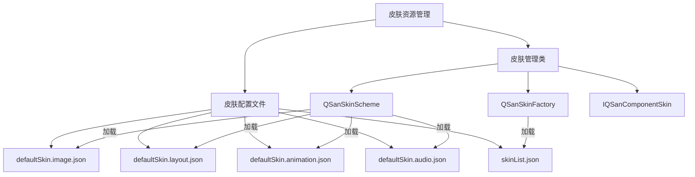
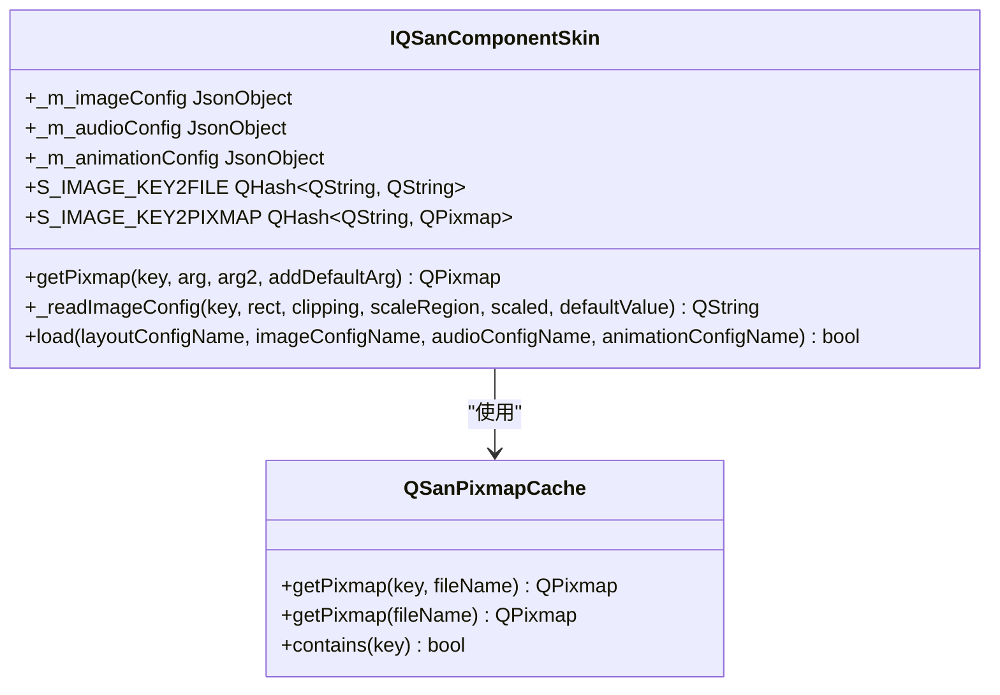
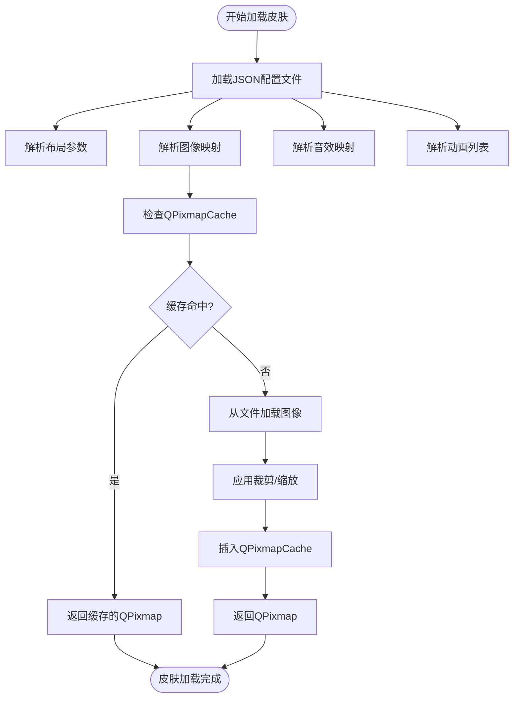

# 皮肤资源管理

<cite>
**本文档引用的文件**   
- [defaultSkin.image.json](file://skins/defaultSkin.image.json)
- [defaultSkin.animation.json](file://skins/defaultSkin.animation.json)
- [defaultSkin.audio.json](file://skins/defaultSkin.audio.json)
- [defaultSkin.layout.json](file://skins/defaultSkin.layout.json)
- [skinbank.cpp](file://src/ui/skinbank.cpp)
- [skinbank.h](file://src/ui/skinbank.h)
</cite>

## 目录
1. [皮肤资源组织结构](#皮肤资源组织结构)
2. [图像资源路径映射与精灵图配置](#图像资源路径映射与精灵图配置)
3. [动画序列定义与播放逻辑](#动画序列定义与播放逻辑)
4. [音效资源关联机制](#音效资源关联机制)
5. [资源异步加载与内存管理](#资源异步加载与内存管理)
6. [资源优化建议](#资源优化建议)

## 皮肤资源组织结构

项目中的皮肤资源主要存放在 `skins` 目录下，通过 JSON 配置文件实现资源的模块化管理。核心配置文件包括：

- **defaultSkin.image.json**：定义所有图像资源的路径映射，支持通配符 `%1` 和 `%2` 进行动态路径拼接。
- **defaultSkin.layout.json**：定义 UI 组件的布局参数，包括尺寸、位置、字体等。
- **defaultSkin.animation.json**：预加载动画资源列表。
- **defaultSkin.audio.json**：定义音效资源的路径映射。
- **skinList.json**：皮肤方案的元数据，指定各皮肤对应的配置文件。

皮肤系统通过 `QSanSkinFactory` 单例进行管理，支持在默认皮肤（`default`）和紧凑皮肤（`compact`）之间切换。该工厂类在初始化时加载 `skinList.json` 或 `skinListAlt.json`，并调用 `QSanSkinScheme` 的 `load` 方法加载具体的皮肤配置。



**Diagram sources**
- [skinbank.cpp](file://src/ui/skinbank.cpp#L1595-L1640)
- [skinbank.h](file://src/ui/skinbank.h#L44-L82)

**Section sources**
- [skinbank.cpp](file://src/ui/skinbank.cpp#L1595-L1640)

## 图像资源路径映射与精灵图配置

`defaultSkin.image.json` 文件是图像资源的核心映射表，它将逻辑键（key）映射到具体的图像文件路径。其结构遵循以下规则：

1.  **简单映射**：`"key": "path/to/image.png"`，直接关联。
2.  **带区域裁剪的映射**：`"key": ["path/to/image.png", [x, y, width, height]]`，从大图中裁剪指定区域。
3.  **带缩放的映射**：`"key": ["path/to/image.png", [x, y, width, height], [newWidth, newHeight]]`，在裁剪后进行缩放。
4.  **动态路径**：路径中包含 `%1` 和 `%2` 占位符，用于在运行时替换为具体值（如武将名、皮肤ID）。

### 核心图像资源分类

- **UI 框架**：如 `photoMainFrame`（玩家头像框）、`dashboardLeftFrame`（仪表板左侧框）、`cardContainerTop`（卡牌容器顶部）等。
- **武将头像**：通过 `playerGeneralIcon-<playerType>-<skinId>-<size>` 键定义，支持多种尺寸和状态（如 `0` 为默认头像，`4` 为小头像，`6` 为主头像）。路径支持 `hero-skin/%1/%2/full.png` 这种动态格式，其中 `%1` 为武将名，`2` 为皮肤ID。
- **卡牌资源**：`handCardMainPhoto-default` 定义了手牌正面图像路径，`cardTiny-<cardName>` 定义了卡牌小图标（用于技能描述等）。
- **装备图标**：`photoEquip-default` 定义了装备区图标路径，特殊装备（如赤兔、的卢）有独立映射。
- **状态图标**：`photoPhase0` 到 `photoPhase6` 对应游戏的七个阶段图标，`photoChain` 为连环状态图标。
- **数字与符号**：`votesNum-default` 用于票数显示，`handCardNumber-black-default` 和 `handCardNumber-red-default` 用于手牌点数，`handCardSuit-default` 用于花色。

`skinbank.cpp` 中的 `IQSanComponentSkin::getPixmap` 方法实现了这些映射的解析和缓存。它首先尝试精确匹配键，若失败则按 `default` -> `default2` 的顺序进行回退，并利用 `QPixmapCache` 进行内存缓存以提高性能。



**Diagram sources**
- [defaultSkin.image.json](file://skins/defaultSkin.image.json)
- [skinbank.cpp](file://src/ui/skinbank.cpp#L800-L1599)

**Section sources**
- [defaultSkin.image.json](file://skins/defaultSkin.image.json)
- [skinbank.cpp](file://src/ui/skinbank.cpp#L800-L1599)

## 动画序列定义与播放逻辑

`defaultSkin.animation.json` 文件定义了需要预加载的动画资源列表。其结构非常简洁，仅包含一个名为 `preloads` 的数组。

```json
{
  "preloads": [
     "analeptic", "chain", "damage",
     "duel", "equipborder", "fire_slash",
     "jink", "killer", "no-success", "peach",
     "slash_black", "slash_red", "success",
     "thunder_slash", "revive", "skill_nullify",
     "armor/eight_diagram", "armor/renwang_shield",
     "armor/silver_lion", "armor/vine",
     "armor/vineburn", "weapon/axe", "weapon/blade",
     // ... 更多动画
  ]
}
```

### 播放逻辑与触发条件

- **预加载机制**：`skinbank.cpp` 中的 `IQSanComponentSkin::getAnimationFileNames()` 方法会读取 `preloads` 数组，返回所有需要预加载的动画名称。这确保了在游戏运行时，这些动画资源已准备好，避免了播放时的延迟。
- **动画绑定**：虽然 `defaultSkin.animation.json` 本身不定义动画的播放逻辑，但动画名称（如 `fire_slash`, `duel`）与游戏中的事件（如使用【火杀】、【决斗】）直接关联。当这些事件发生时，游戏逻辑会调用相应的动画播放接口。
- **UI 动画**：除了战斗动画，`skinbank.cpp` 还定义了 UI 动画，例如 `createHuaShenAnimation` 方法创建了一个用于“化身”效果的闪烁动画，通过 `QPropertyAnimation` 改变图标的透明度来实现。

目前的配置文件仅指定了动画资源的名称，具体的帧率、帧序列和播放逻辑可能在游戏引擎的其他部分（如 Lua 脚本或 C++ 动画系统）中实现。

**Section sources**
- [defaultSkin.animation.json](file://skins/defaultSkin.animation.json)
- [skinbank.cpp](file://src/ui/skinbank.cpp#L1595-L1640)

## 音效资源关联机制

`defaultSkin.audio.json` 文件定义了音效资源的路径映射，其结构与图像映射类似，但更侧重于分类和动态生成。

```json
{
    "playerAudioEffect-common-weapon": "audio/card/common/weapon.ogg",
    "playerAudioEffect-common-armor": "audio/card/common/armor.ogg",
    "playerAudioEffect-common-horse": "audio/card/common/horse.ogg",
    "playerAudioEffect-common-treasure": "audio/card/common/armor.ogg",
    "playerAudioEffect-equip-default": "audio/equip/%1.ogg",
    "playerAudioEffect-male-default": "audio/card/male/%1.ogg",
    "playerAudioEffect-female-default": "audio/card/female/%1.ogg"
}
```

### 关联机制解析

1.  **通用音效**：`playerAudioEffect-common-*` 为装备、坐骑等通用类型提供默认音效。
2.  **动态音效路径**：`playerAudioEffect-equip-default` 使用 `%1` 占位符，允许通过装备名（如 `crossbow`）动态生成音效路径 `audio/equip/crossbow.ogg`。
3.  **性别区分音效**：`playerAudioEffect-male-default` 和 `playerAudioEffect-female-default` 为男性和女性武将提供不同的默认语音路径，`%1` 会被技能或卡牌事件名替换。
4.  **优先级查找**：`skinbank.cpp` 中的 `getPlayerAudioEffectPath` 方法实现了复杂的查找逻辑：
    -   首先尝试根据 `category`（如 `male`, `female`）和 `eventName`（如技能名）精确匹配。
    -   若未找到，则尝试从武将的技能源文件（`skill->getSources`）中查找匹配的音效文件。
    -   最后，作为兜底方案，使用 `playerAudioEffect-default` 模板生成路径。

这种机制允许游戏优先播放特定武将的专属语音，若无则播放通用的性别语音，保证了音效的丰富性和兼容性。

**Section sources**
- [defaultSkin.audio.json](file://skins/defaultSkin.audio.json)
- [skinbank.cpp](file://src/ui/skinbank.cpp#L800-L1599)

## 资源异步加载与内存管理

皮肤资源的加载和管理由 `skinbank.cpp` 中的 `IQSanComponentSkin` 及其子类 `QSanRoomSkin` 实现，核心策略是**异步加载**与**内存缓存**。

### 异步加载流程

1.  **配置加载**：`QSanSkinScheme::load` 方法接收四个配置文件路径（布局、图像、音频、动画）。
2.  **文件读取**：使用 `JsonDocument::fromFilePath` 同步读取 JSON 文件。虽然此处为同步，但整个皮肤切换过程（如 `switchSkin`）可以被设计为在后台线程执行，避免阻塞主线程。
3.  **数据解析**：`_loadImageConfig`, `_loadLayoutConfig` 等方法将 JSON 数据解析并存储到成员变量（如 `_m_imageConfig`, `_m_roomLayout`）中。

### 内存缓存与释放策略

- **图像缓存**：`QSanPixmapCache` 类利用 Qt 的 `QPixmapCache` 全局缓存机制。`getPixmap` 方法首先检查缓存，若存在则直接返回；若不存在，则加载图像并插入缓存。这极大地减少了重复的磁盘 I/O 和图像解码开销。
- **缓存键管理**：`IQSanComponentSkin` 维护了 `S_IMAGE_KEY2FILE` 和 `S_IMAGE_KEY2PIXMAP` 两个静态哈希表，用于存储经过参数替换后的最终文件路径和对应的 `QPixmap` 对象，确保了缓存的高效查找。
- **内存释放**：当皮肤切换时，旧皮肤的配置会被新配置覆盖。`_loadImageConfig` 方法在更新 `_m_imageConfig` 时，会清除旧的缓存键（`S_IMAGE_KEY2FILE.remove(key)`），使得旧的 `QPixmap` 对象在 `QPixmapCache` 的内部管理下被自动回收。`QSanSkinFactory::destroyInstance` 方法在程序退出时负责清理单例对象。

### 高性能渲染保障

- **布局缩放**：`defaultSkin.layout.json` 中的布局参数在加载时会根据屏幕分辨率进行动态缩放（`_m_roomLayout.scale`），确保 UI 在不同设备上都能正确显示，避免了因分辨率不同导致的渲染错位。
- **精灵图裁剪**：通过在 JSON 中定义裁剪区域，将多个小图标合并到一张大图（精灵图）中，减少了纹理切换次数，提升了 OpenGL 渲染效率。
- **资源预加载**：动画和关键 UI 图像的预加载机制，确保了游戏运行时的流畅性。



**Diagram sources**
- [skinbank.cpp](file://src/ui/skinbank.cpp#L800-L1599)

**Section sources**
- [skinbank.cpp](file://src/ui/skinbank.cpp#L800-L1599)

## 资源优化建议

基于对现有皮肤资源系统的分析，提出以下优化建议以进一步提升性能和用户体验：

### 1. 纹理压缩
- **现状**：图像资源多为 PNG 格式，未针对不同平台进行压缩。
- **建议**：引入纹理压缩格式（如 ETC2, ASTC）。对于 Android 平台，可将 `image` 目录下的 PNG 转换为 ETC2 格式；对于 iOS 平台，可使用 ASTC。这能显著减少显存占用和加载时间。

### 2. 动画帧复用
- **现状**：`defaultSkin.animation.json` 仅列出动画名称，但未说明其内部结构。
- **建议**：确保所有动画（尤其是技能动画）都采用精灵图（Sprite Sheet）形式。例如，将【火杀】的完整动画序列合并为一张大图，并在 `layout.json` 中定义其播放区域和帧率，避免加载大量独立的小图片。

### 3. 内存占用控制
- **现状**：`QPixmapCache` 提供了基础缓存，但缺乏主动的内存管理策略。
- **建议**：
    -   **设置缓存上限**：调用 `QPixmapCache::setCacheLimit()` 设置一个合理的内存上限（如 100MB），防止缓存无限增长导致 OOM。
    -   **按需加载**：对于非核心资源（如稀有皮肤、历史模式），实现按需加载（Lazy Loading），在玩家首次使用时才加载，用完后可主动从缓存中清除。
    -   **资源分组**：将资源按使用频率分组（如 `essential`, `common`, `rare`），在内存紧张时优先释放低频资源。

### 4. 配置优化
- **合并配置**：考虑将 `image`, `audio`, `animation` 三个 JSON 文件合并为一个 `skin.json`，减少文件 I/O 次数。
- **二进制化**：将 JSON 配置文件预编译为二进制格式，加快解析速度。

通过实施这些优化，可以构建一个更加高效、稳定且用户体验更佳的皮肤资源管理系统。

**Section sources**
- [defaultSkin.image.json](file://skins/defaultSkin.image.json)
- [defaultSkin.layout.json](file://skins/defaultSkin.layout.json)
- [skinbank.cpp](file://src/ui/skinbank.cpp#L800-L1599)