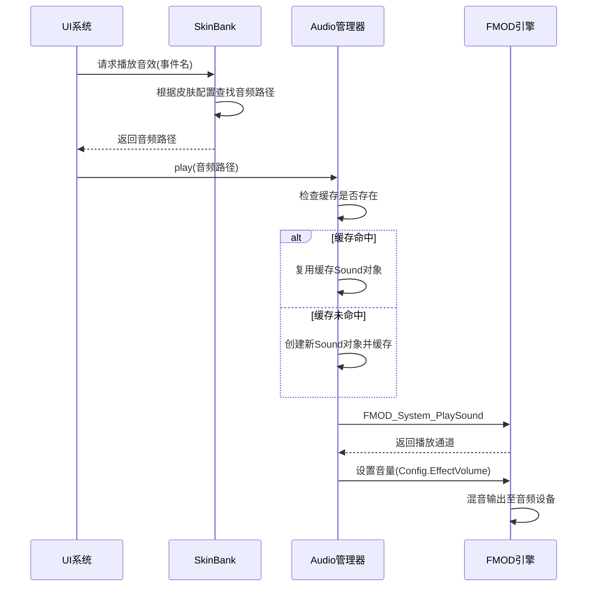
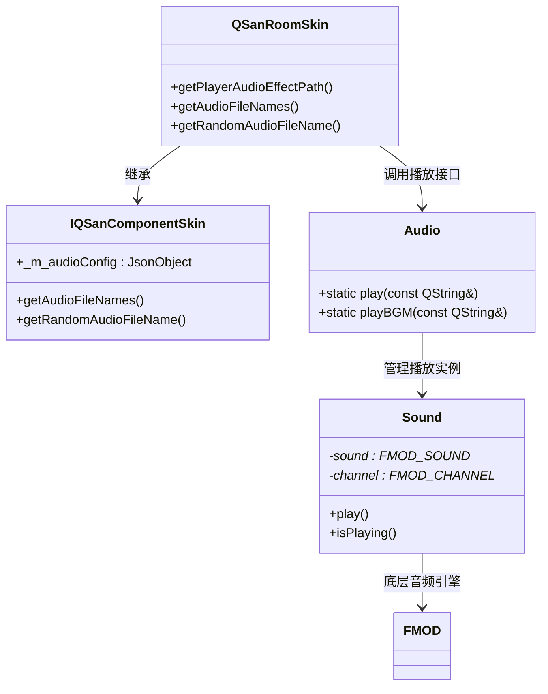

# 音效集成

<cite>
**本文档引用的文件**  
- [defaultSkin.audio.json](file://skins/defaultSkin.audio.json)
- [audio.cpp](file://src/core/audio.cpp)
- [audio.h](file://src/core/audio.h)
- [skinbank.cpp](file://src/ui/skinbank.cpp)
</cite>

## 目录
1. [音效配置结构](#音效配置结构)
2. [音效引擎底层机制](#音效引擎底层机制)
3. [皮肤音效与UI事件集成](#皮肤音效与ui事件集成)
4. [音效资源优化建议](#音效资源优化建议)

## 音效配置结构

`defaultSkin.audio.json` 文件定义了游戏中的音效资源映射关系，通过键值对形式将音效事件与音频文件路径关联。该配置文件支持静态路径映射和动态路径模板，适用于不同类型的音效触发场景。

### 音效事件与路径映射

文件中定义了多种音效类别，主要包括卡牌效果、装备音效及角色性别相关的默认音效。其结构如下：

```json
{
    // 卡牌效果音效
    "playerAudioEffect-common-weapon": "audio/card/common/weapon.ogg",
    "playerAudioEffect-common-armor": "audio/card/common/armor.ogg",
    "playerAudioEffect-common-horse": "audio/card/common/horse.ogg",
    "playerAudioEffect-common-treasure": "audio/card/common/armor.ogg",

    // 装备通用音效（支持参数化路径）
    "playerAudioEffect-equip-default": "audio/equip/%1.ogg",

    // 按性别区分的默认音效（支持参数化路径）
    "playerAudioEffect-male-default": "audio/card/male/%1.ogg",
    "playerAudioEffect-female-default": "audio/card/female/%1.ogg"
}
```

#### 映射规则说明

- **静态映射**：如 `"playerAudioEffect-common-weapon"` 直接指向固定音频文件 `weapon.ogg`，用于通用卡牌动作（如武器使用）。
- **动态模板**：包含 `%1` 占位符的路径（如 `equip/%1.ogg`）允许在运行时替换为具体技能或动作名称，实现灵活的音效绑定。
- **分类组织**：音效按功能分类（如卡牌、装备、角色），便于维护和扩展。

#### 音效触发事件

音效事件命名遵循 `playerAudioEffect-{category}-{event}` 的模式，其中：
- `category` 表示音效类别（如 `common`, `equip`, `male`, `female`）
- `event` 表示具体触发事件（如 `weapon`, `armor`, 或技能名）

这些事件由 UI 系统在用户交互（如点击按钮、释放技能）时触发，并通过皮肤系统查找对应音频路径。

**Section sources**
- [defaultSkin.audio.json](file://skins/defaultSkin.audio.json)

## 音效引擎底层机制

音效播放功能由 `audio.cpp` 实现，基于 FMOD 音频引擎封装了一套轻量级音频管理接口。系统负责音频的加载、播放控制、混音处理及设备输出。

### 音频播放核心类 Sound

`Sound` 类封装了 FMOD 的 `FMOD_SOUND` 和 `FMOD_CHANNEL` 对象，提供播放、音量控制和状态查询功能。

```cpp
class Sound
{
public:
    Sound(const QString &filename);
    ~Sound();

    void play(const bool doubleVolume = false);
    bool isPlaying() const;

private:
    FMOD_SOUND *sound;
    FMOD_CHANNEL *channel;
};
```

#### 播放流程分析

1. **构造函数**：调用 `FMOD_System_CreateSound` 创建音频对象，加载指定文件。
2. **播放方法**：通过 `FMOD_System_PlaySound` 将音频放入播放通道，并设置音量（可选双倍音量）。
3. **状态检测**：使用 `FMOD_Channel_IsPlaying` 查询当前是否正在播放，避免重复触发。

#### 音频缓存机制

为提升性能并减少重复加载开销，系统采用 `QCache<QString, Sound>` 缓存已加载的音效对象。当请求播放某个音效时：
- 若缓存中存在且未播放，则直接复用；
- 若不存在，则创建新 `Sound` 对象并插入缓存。

此机制有效降低了 I/O 开销和内存碎片。

### 全局音频管理 Audio

`Audio` 类为静态工具类，提供以下核心功能：
- `init()` / `quit()`：初始化和释放 FMOD 系统
- `play()`：播放指定音效
- `playBGM()` / `stopBGM()`：背景音乐控制
- `setBGMVolume()`：调节背景音乐音量
- `stop()`：停止所有音效和背景音乐

背景音乐（BGM）使用流式加载（`FMOD_System_CreateStream`），支持循环播放（`FMOD_LOOP_NORMAL`），适合长时间背景音轨。



**Diagram sources**
- [audio.cpp](file://src/core/audio.cpp#L1-L162)
- [audio.h](file://src/core/audio.h#L1-L48)

**Section sources**
- [audio.cpp](file://src/core/audio.cpp#L1-L162)
- [audio.h](file://src/core/audio.h#L1-L48)

## 皮肤音效与UI事件集成

`skinbank.cpp` 中的 `QSanRoomSkin` 类负责将音效配置与 UI 事件系统集成，实现上下文相关的音效播放逻辑。

### 音效路径解析逻辑

`getPlayerAudioEffectPath` 方法根据事件名、类别和玩家信息动态解析音频路径：

```cpp
QString QSanRoomSkin::getPlayerAudioEffectPath(const QString &eventName, const QString &category, int index, const Player *player, const QString &position) const
```

#### 解析优先级

1. **精确匹配**：查找 `playerAudioEffect-{category}-{eventName}` 路径。
2. **技能资源匹配**：若未找到，尝试从技能对象获取音频源（支持按武将和皮肤ID匹配）。
3. **默认模板匹配**：最后回退到 `playerAudioEffect-{category}-default` 模板路径。

该机制支持同一技能在不同武将或皮肤下播放不同音效，增强个性化体验。

### 与UI事件绑定

音效播放通常由 UI 组件（如按钮、技能图标）触发。例如：
- 点击“确认”按钮 → 触发 `playerAudioEffect-common-confirm`
- 释放技能“雷击” → 查找 `playerAudioEffect-male-leiji` 或 `equip-default`

皮肤系统通过 `S_SKIN_KEY_PLAYER_AUDIO_EFFECT` 宏生成键名，确保与 JSON 配置一致。



**Diagram sources**
- [skinbank.cpp](file://src/ui/skinbank.cpp#L1640-L1660)
- [audio.cpp](file://src/core/audio.cpp#L1-L162)

**Section sources**
- [skinbank.cpp](file://src/ui/skinbank.cpp#L37-L64)
- [skinbank.cpp](file://src/ui/skinbank.cpp#L1640-L1660)

## 音效资源优化建议

为提升游戏性能和用户体验，建议从以下方面优化音效资源：

### 音频格式选择

- **推荐格式**：`.ogg`（Vorbis 编码）
  - 优点：高压缩率、小体积、支持流式播放
  - 适用：背景音乐、长音效
- **备选格式**：`.wav`（PCM 编码）
  - 优点：无损、低延迟
  - 适用：短促关键音效（如按钮点击）

避免使用 `.mp3`，因其解码开销较大且存在专利问题。

### 内存与加载优化

- **流式加载**：对 BGM 使用 `FMOD_CREATESTREAM` 标志，避免一次性加载至内存。
- **按需加载**：仅在首次播放时创建 `Sound` 对象，结合 `QCache` 实现自动缓存与淘汰。
- **预加载关键音效**：对高频触发音效（如攻击、确认）在初始化阶段预加载，减少运行时卡顿。

### 播放性能监控

- **限制并发播放数**：FMOD 初始化时设置合理通道数（如 100），防止资源耗尽。
- **定期清理缓存**：监控 `SoundCache` 大小，适时清理长时间未使用的音效。
- **异常处理**：检查 `FMOD_RESULT` 返回值，记录错误日志（如文件缺失、解码失败）。

### 其他建议

- **音量分级控制**：保留 `Config.EffectVolume` 和 `Config.BGMVolume` 分离设置，方便用户调节。
- **静音模式支持**：实现 `Audio::stop()` 快速静音，适用于通知或省电场景。
- **多语言音效扩展**：可通过皮肤配置支持不同语言语音包，提升本地化体验。

**Section sources**
- [audio.cpp](file://src/core/audio.cpp#L1-L162)
- [skinbank.cpp](file://src/ui/skinbank.cpp#L37-L64)