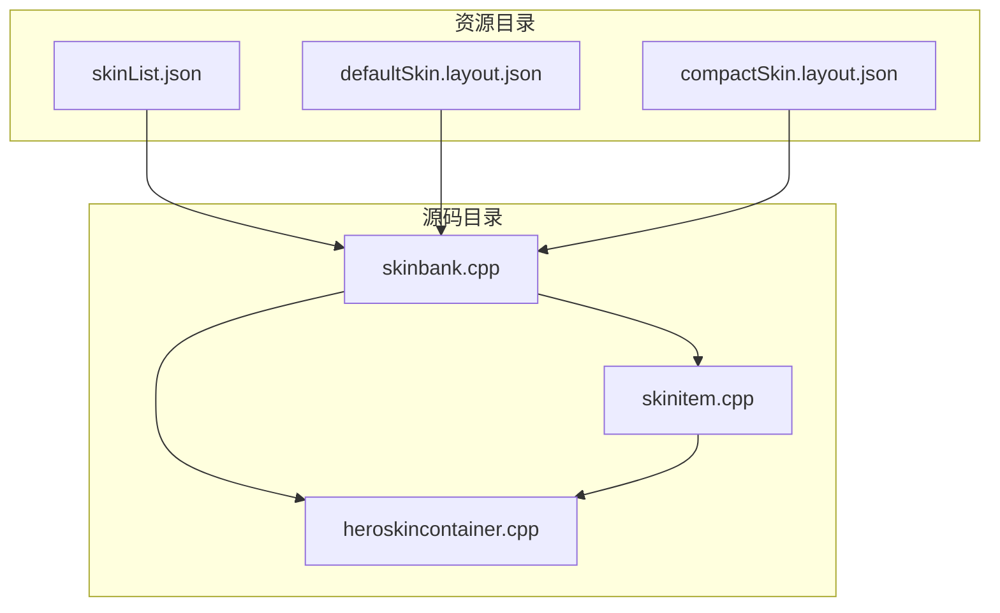
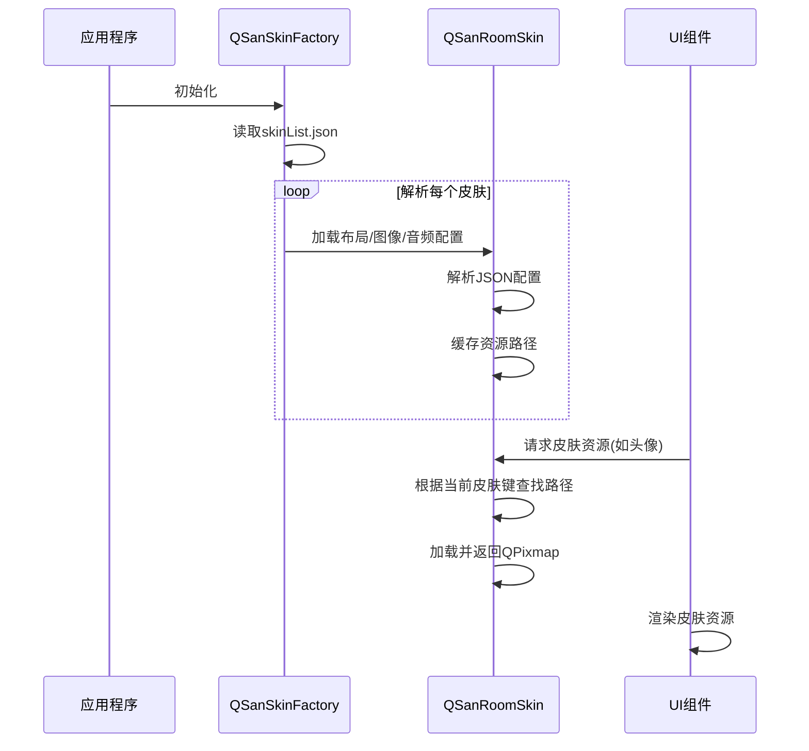
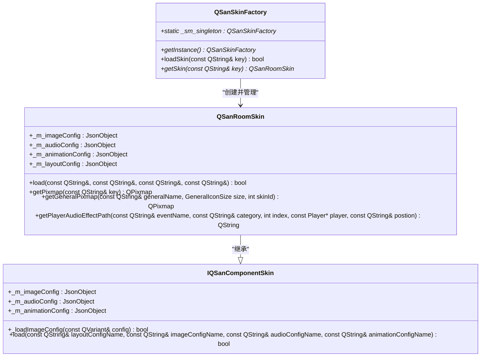
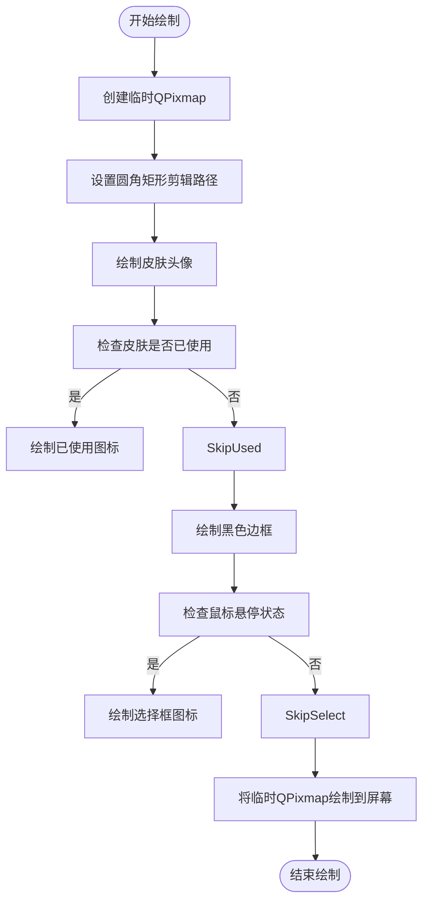
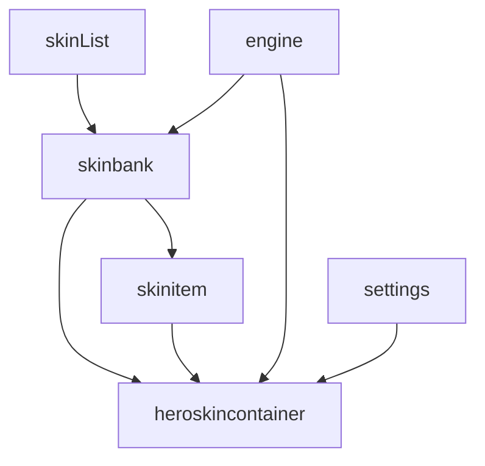

# 皮肤元数据管理

<cite>
**本文档引用文件**   
- [skinList.json](file://skins/skinList.json)
- [skinbank.cpp](file://src/ui/skinbank.cpp)
- [skinitem.cpp](file://src/ui/skinitem.cpp)
- [heroskincontainer.cpp](file://src/ui/heroskincontainer.cpp)
</cite>

## 目录
1. [引言](#引言)
2. [项目结构](#项目结构)
3. [核心组件](#核心组件)
4. [架构概览](#架构概览)
5. [详细组件分析](#详细组件分析)
6. [依赖分析](#依赖分析)
7. [性能考量](#性能考量)
8. [故障排除指南](#故障排除指南)
9. [结论](#结论)

## 引言
本文档全面解析《三国杀》游戏中的皮肤管理系统，重点分析皮肤元数据结构、皮肤注册中心实现机制、皮肤选择项渲染逻辑以及武将皮肤容器的集成应用。文档旨在为开发者提供清晰的技术指导，涵盖从元数据定义到自定义皮肤添加的完整流程。

## 项目结构
皮肤系统相关文件主要分布在`skins`资源目录和`src/ui`源码目录中。`skins`目录存放皮肤配置文件，`src/ui`目录包含皮肤管理、渲染和交互的核心实现。



**图示来源**
- [skinList.json](file://skins/skinList.json)
- [skinbank.cpp](file://src/ui/skinbank.cpp)
- [skinitem.cpp](file://src/ui/skinitem.cpp)
- [heroskincontainer.cpp](file://src/ui/heroskincontainer.cpp)

**本节来源**
- [skinList.json](file://skins/skinList.json)
- [src/ui](file://src/ui)

## 核心组件
皮肤系统由四个核心组件构成：皮肤元数据文件（skinList.json）、皮肤注册中心（skinbank.cpp）、皮肤选择项（skinitem.cpp）和武将皮肤容器（heroskincontainer.cpp）。这些组件协同工作，实现了皮肤的加载、管理、渲染和用户交互。

**本节来源**
- [skinList.json](file://skins/skinList.json)
- [skinbank.cpp](file://src/ui/skinbank.cpp)
- [skinitem.cpp](file://src/ui/skinitem.cpp)
- [heroskincontainer.cpp](file://src/ui/heroskincontainer.cpp)

## 架构概览
皮肤系统采用配置驱动的架构模式。`skinList.json`作为入口配置文件，定义了可用皮肤及其对应的资源路径。`QSanSkinFactory`单例负责解析这些配置并加载皮肤资源。UI组件通过`QSanRoomSkin`接口访问已加载的皮肤资源，实现皮肤的动态切换和渲染。



**图示来源**
- [skinList.json](file://skins/skinList.json)
- [skinbank.cpp](file://src/ui/skinbank.cpp)

## 详细组件分析

### 皮肤元数据结构分析
`skinList.json`文件定义了游戏中可用的皮肤列表及其资源路径。该文件采用JSON格式，以皮肤名称为键，包含布局、图像、音频和动画配置文件的路径。

```json
{
"default":
{
"roomLayoutConfigFile": "skins/defaultSkin.layout.json",
"roomImageConfigFile": "skins/defaultSkin.image.json",
"roomAudioConfigFile": "skins/defaultSkin.audio.json",
"roomAnimationConfigFile": "skins/defaultSkin.animation.json"
},
"compact":
{
"roomLayoutConfigFile": "skins/compactSkin.layout.json",
"roomImageConfigFile": "skins/compactSkin.image.json"
}
}
```

**关键字段说明**:
- **皮肤名称 (name)**: 皮肤的唯一标识符，如"default"和"compact"。
- **资源路径 (path)**: 指向具体配置文件的相对路径，包括布局、图像、音频和动画。
- **版本号 (version)**: 未在当前文件中显式定义，可能隐含在配置文件内容中。
- **兼容性标识 (compatible)**: 未在当前文件中定义，系统默认所有皮肤兼容。
- **预览图引用 (preview)**: 未在当前文件中定义，预览功能可能由UI组件独立实现。

**本节来源**
- [skinList.json](file://skins/skinList.json)

### 皮肤注册中心实现机制
`skinbank.cpp`文件实现了皮肤注册中心的核心逻辑，主要由`QSanSkinFactory`和`QSanRoomSkin`类构成。

#### 类图


**图示来源**
- [skinbank.cpp](file://src/ui/skinbank.cpp)

#### 实现机制
1. **皮肤列表解析**: `QSanSkinFactory`在初始化时读取`skinList.json`，将所有皮肤配置加载到内存中。
2. **缓存管理**: 使用`QPixmapCache`对已加载的图像资源进行缓存，避免重复加载，提高性能。
3. **运行时切换**: 通过`QSanRoomSkin`的`getPixmap`等方法，根据当前激活的皮肤键动态返回对应的资源。

**本节来源**
- [skinbank.cpp](file://src/ui/skinbank.cpp)

### 皮肤选择项渲染与交互
`skinitem.cpp`文件定义了`SkinItem`类，负责渲染单个皮肤选择项并处理用户交互。

#### 渲染逻辑
`SkinItem`继承自`QGraphicsObject`，通过重写`paint`方法实现自定义绘制。其绘制流程如下：
1. 创建一个透明的临时`QPixmap`用于离屏渲染。
2. 使用`QPainterPath`绘制圆角矩形作为皮肤头像的背景。
3. 在圆角矩形区域内绘制皮肤头像。
4. 如果皮肤已被使用，则叠加"已使用"图标。
5. 绘制黑色边框以增强视觉效果。
6. 当鼠标悬停时，叠加选择框图标。

#### 交互响应
`SkinItem`通过重写鼠标和悬停事件处理用户交互：
- `hoverEnterEvent`和`hoverLeaveEvent`: 鼠标进入或离开时，更新`m_hoverEnter`状态并触发重绘，实现悬停高亮效果。
- `mousePressEvent`和`mouseReleaseEvent`: 处理鼠标点击。在释放时，如果鼠标仍在项上且皮肤未被使用，则发射`clicked`信号。



**图示来源**
- [skinitem.cpp](file://src/ui/skinitem.cpp)

**本节来源**
- [skinitem.cpp](file://src/ui/skinitem.cpp)

### 武将皮肤容器集成应用
`heroskincontainer.cpp`文件实现了`HeroSkinContainer`类，这是一个用于展示和选择武将皮肤的UI容器。

#### 集成逻辑
1. **初始化**: 构造函数中创建关闭按钮、武将称号和头像，并调用`initSkins`初始化皮肤项。
2. **皮肤项创建**: `initSkins`方法遍历武将的所有皮肤ID，为每个皮肤创建一个`SkinItem`实例，并建立ID到项的映射。
3. **布局填充**: `fillSkins`方法根据皮肤数量计算网格布局。当皮肤数量超过3个时，自动添加垂直滚动条。
4. **用户交互**: `skinSelected`槽函数处理皮肤选择事件，更新玩家数据、交换已使用皮肤项的位置，并关闭容器。

#### 状态管理
`HeroSkinContainer`维护了以下状态：
- `m_skins`: 存储所有`SkinItem`的列表，索引0始终为当前使用的皮肤。
- `m_skinIndexToItem`: 建立皮肤ID到`SkinItem`实例的哈希映射，便于快速查找。
- `m_vScrollBar`: 当皮肤数量过多时创建的滚动条。

**本节来源**
- [heroskincontainer.cpp](file://src/ui/heroskincontainer.cpp)

## 依赖分析
皮肤系统各组件之间存在明确的依赖关系。



**图示来源**
- [skinList.json](file://skins/skinList.json)
- [skinbank.cpp](file://src/ui/skinbank.cpp)
- [skinitem.cpp](file://src/ui/skinitem.cpp)
- [heroskincontainer.cpp](file://src/ui/heroskincontainer.cpp)

**本节来源**
- [skinList.json](file://skins/skinList.json)
- [skinbank.cpp](file://src/ui/skinbank.cpp)
- [skinitem.cpp](file://src/ui/skinitem.cpp)
- [heroskincontainer.cpp](file://src/ui/heroskincontainer.cpp)

## 性能考量
皮肤系统在设计上考虑了性能优化：
1. **资源缓存**: `QPixmapCache`确保每个资源文件只被加载一次，后续请求直接从内存缓存中获取。
2. **延迟加载**: 皮肤资源在需要时才加载，避免启动时加载所有皮肤造成内存浪费。
3. **离屏渲染**: `SkinItem`使用临时`QPixmap`进行离屏渲染，减少直接在屏幕上的复杂绘制操作，提高绘制效率。

## 故障排除指南
### 常见问题
1. **皮肤不显示**: 检查`skinList.json`中的路径是否正确，确保配置文件和图像资源存在且路径匹配。
2. **皮肤切换无效**: 确认`QSanSkinFactory`已正确加载新皮肤，并检查UI组件是否使用了正确的皮肤键来请求资源。
3. **内存占用过高**: 如果加载了大量高分辨率皮肤，考虑优化图像尺寸或实现更精细的资源释放策略。

**本节来源**
- [skinbank.cpp](file://src/ui/skinbank.cpp)
- [skinitem.cpp](file://src/ui/skinitem.cpp)

## 结论
本文档详细解析了《三国杀》游戏的皮肤管理系统。该系统通过`skinList.json`实现配置化管理，利用`QSanSkinFactory`和`QSanRoomSkin`提供高效的资源加载和缓存机制，并通过`SkinItem`和`HeroSkinContainer`实现直观的用户交互。整体设计模块化、可扩展，为新增自定义皮肤提供了清晰的实现路径。