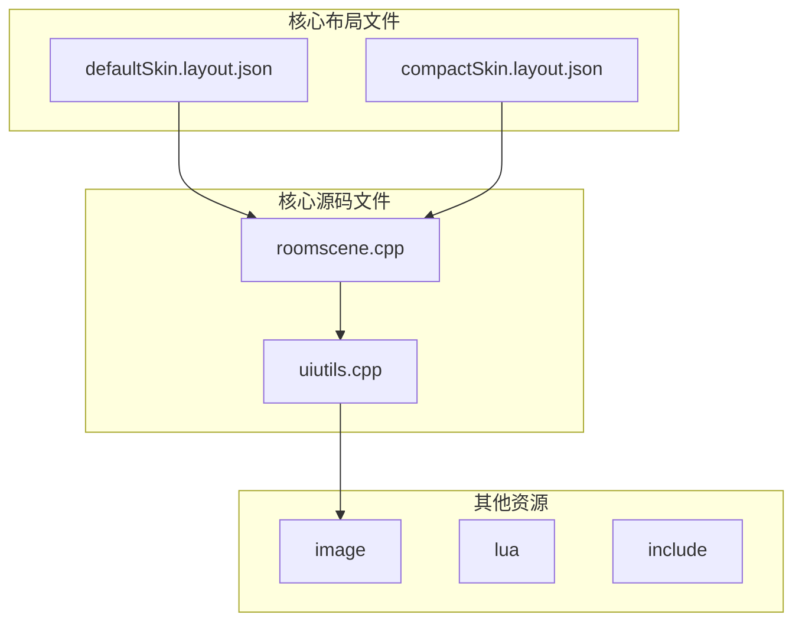
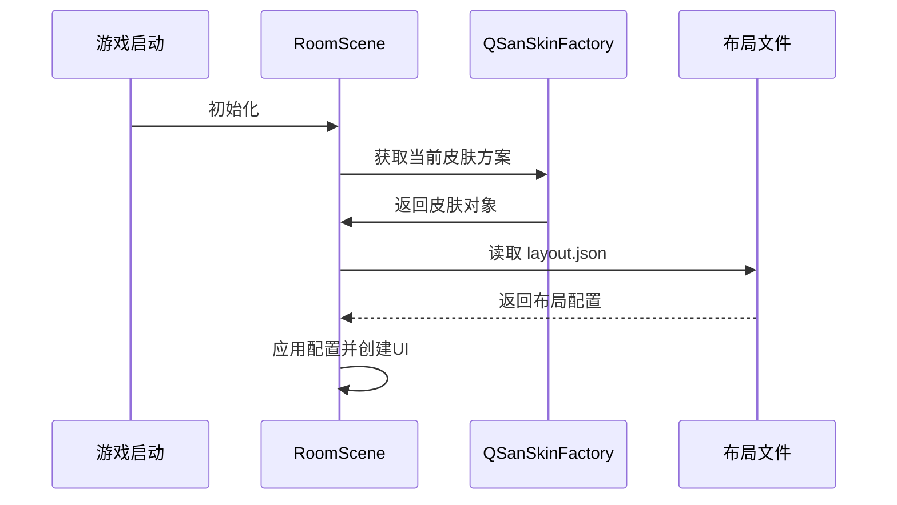

# 皮肤布局定义

<cite>
**本文档引用的文件**   
- [defaultSkin.layout.json](file://skins/defaultSkin.layout.json)
- [compactSkin.layout.json](file://skins/compactSkin.layout.json)
- [roomscene.cpp](file://src/ui/roomscene.cpp)
- [uiutils.cpp](file://src/ui/uiutils.cpp)
</cite>

## 目录
1. [简介](#简介)
2. [项目结构](#项目结构)
3. [核心组件](#核心组件)
4. [架构概述](#架构概述)
5. [详细组件分析](#详细组件分析)
6. [依赖分析](#依赖分析)
7. [性能考虑](#性能考虑)
8. [故障排除指南](#故障排除指南)
9. [结论](#结论)

## 简介
本文档深入解析《三国杀》游戏客户端中皮肤布局文件的结构与实现机制。重点分析`defaultSkin.layout.json`和`compactSkin.layout.json`两个核心布局文件，阐述其如何通过坐标定位、尺寸配置、层级控制和锚点布局等机制定义用户界面元素。同时，结合C++源码`roomscene.cpp`和`uiutils.cpp`，揭示布局数据在游戏场景初始化时的加载流程，以及多分辨率下的界面自适应策略。本文旨在为开发者提供一份全面、详尽的皮肤布局系统技术文档。

## 项目结构
项目根目录下包含多个功能模块，其中与皮肤布局直接相关的文件位于`skins`目录中。该目录存放了不同皮肤的布局、图像和动画配置文件。`src/ui`目录下的`roomscene.cpp`和`uiutils.cpp`是处理布局逻辑的核心C++源文件。`lua`目录则包含游戏逻辑脚本，而`image`和`include`目录分别存放游戏资源和第三方库头文件。



**图示来源**
- [defaultSkin.layout.json](file://skins/defaultSkin.layout.json)
- [compactSkin.layout.json](file://skins/compactSkin.layout.json)
- [roomscene.cpp](file://src/ui/roomscene.cpp)
- [uiutils.cpp](file://src/ui/uiutils.cpp)

**本节来源**
- [defaultSkin.layout.json](file://skins/defaultSkin.layout.json)
- [compactSkin.layout.json](file://skins/compactSkin.layout.json)
- [roomscene.cpp](file://src/ui/roomscene.cpp)

## 核心组件
皮肤布局系统的核心由JSON配置文件和C++渲染引擎两部分构成。`defaultSkin.layout.json`和`compactSkin.layout.json`文件定义了所有UI元素的精确位置、大小、层级和样式。`roomscene.cpp`文件中的`RoomScene`类负责解析这些配置，并在游戏启动时初始化整个游戏场景。`uiutils.cpp`则提供了布局适配的工具函数，确保UI在不同分辨率的屏幕上都能正确显示。

**本节来源**
- [defaultSkin.layout.json](file://skins/defaultSkin.layout.json)
- [compactSkin.layout.json](file://skins/compactSkin.layout.json)
- [roomscene.cpp](file://src/ui/roomscene.cpp)
- [uiutils.cpp](file://src/ui/uiutils.cpp)

## 架构概述
皮肤布局系统采用“配置驱动”的设计模式。JSON文件作为数据层，定义了UI的静态结构；C++代码作为逻辑层，负责读取配置、创建UI对象并处理用户交互。当游戏启动时，`RoomScene`类会根据当前选择的皮肤名称，加载对应的`.layout.json`文件，并将其中的配置项（如`cardNormalWidth`、`photoRoomPadding`等）应用到各个UI组件（如`Photo`、`CardItem`）上。



**图示来源**
- [roomscene.cpp](file://src/ui/roomscene.cpp)
- [defaultSkin.layout.json](file://skins/defaultSkin.layout.json)

## 详细组件分析

### 布局文件结构分析
`defaultSkin.layout.json`和`compactSkin.layout.json`文件采用分层的JSON结构，主要包含`common`、`room`、`photo`和`dashboard`四个顶级键。

#### common 部分
`common`部分定义了跨场景的通用UI元素配置，如卡牌尺寸、字体样式和通用按钮大小。
```json
"common": {
    "cardNormalWidth": 93,
    "cardNormalHeight": 130,
    "promptInfoSize": [900, 110],
    "magatamaFont": [
        ["Arial", [15, 15, -2], 80, [233, 0, 0, 