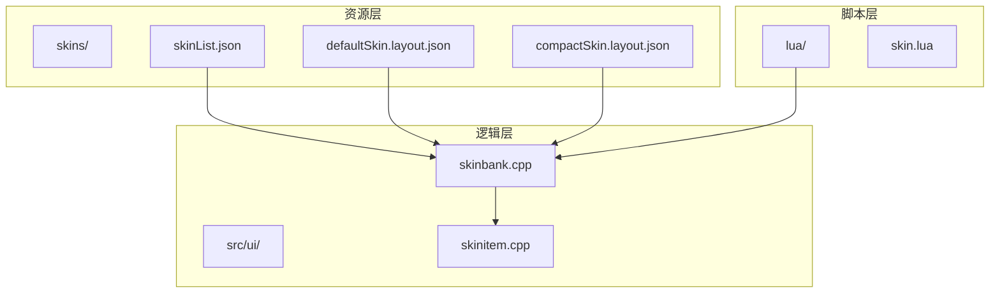
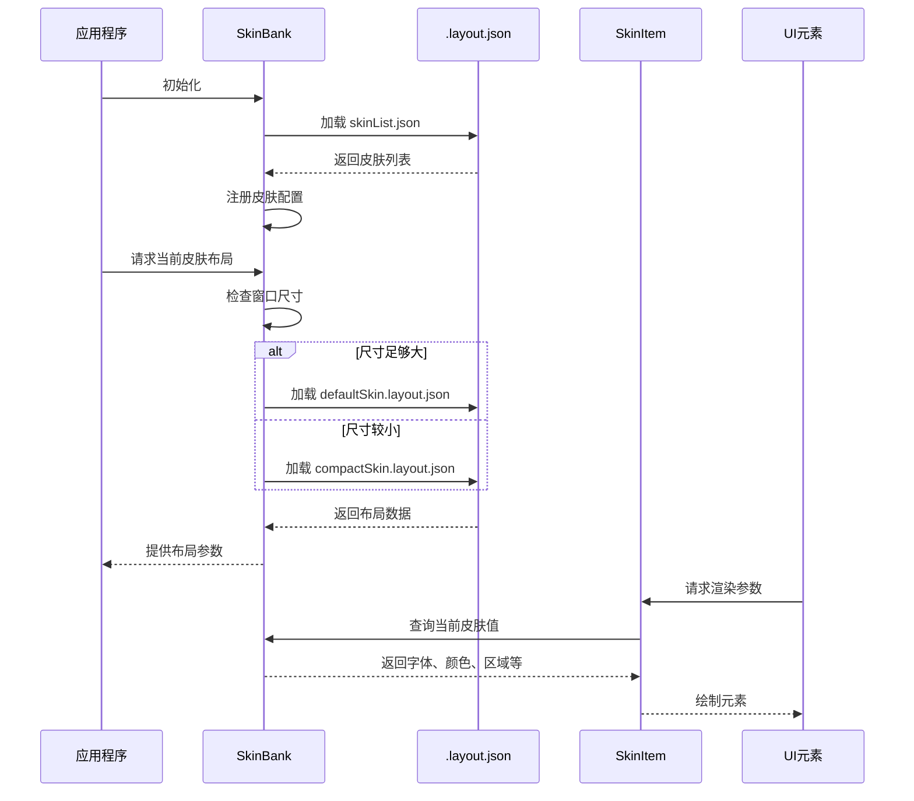
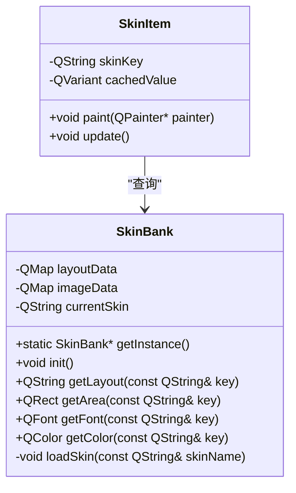
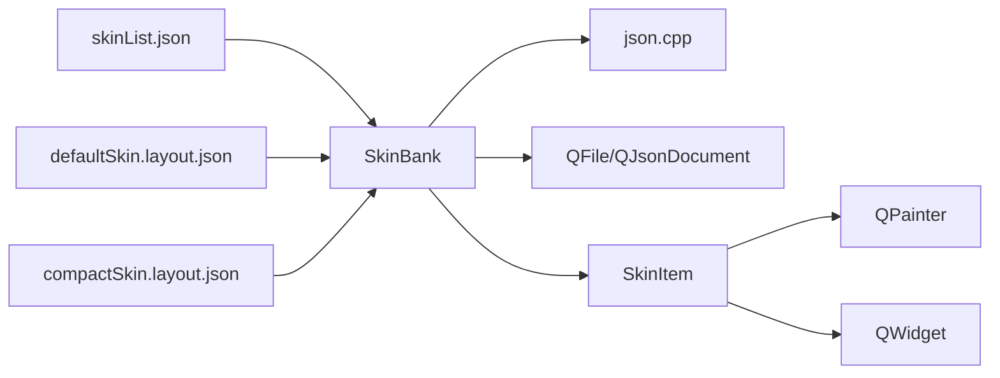

# 皮肤配置机制

<cite>
**本文档引用文件**   
- [skinList.json](file://skins/skinList.json)
- [defaultSkin.layout.json](file://skins/defaultSkin.layout.json)
- [compactSkin.layout.json](file://skins/compactSkin.layout.json)
- [skinbank.cpp](file://src/ui/skinbank.cpp)
- [skinitem.cpp](file://src/ui/skinitem.cpp)
</cite>

## 目录
1. [简介](#简介)
2. [项目结构](#项目结构)
3. [核心组件](#核心组件)
4. [架构概览](#架构概览)
5. [详细组件分析](#详细组件分析)
6. [依赖分析](#依赖分析)
7. [性能考量](#性能考量)
8. [故障排除指南](#故障排除指南)
9. [结论](#结论)

## 简介
本文档深入解析《三国杀》游戏中的皮肤配置体系，重点阐述基于JSON的界面布局定义、皮肤元数据管理以及动态皮肤切换机制。文档涵盖defaultSkin与compactSkin两种布局模式的坐标定位、尺寸设置、层级关系（z-index）及响应式策略，并结合C++源码分析皮肤资源的注册、缓存与渲染流程。通过具体示例说明如何实现自定义布局与多分辨率适配。

## 项目结构
项目采用模块化设计，主要分为资源（skins/）、源码（src/）、扩展脚本（lua/）和配置文件等部分。皮肤系统的核心配置位于`skins/`目录下，包含多个`.json`格式的布局与资源映射文件。C++实现位于`src/ui/`目录中，关键类为`SkinBank`和`SkinItem`。



**图示来源**
- [skinList.json](file://skins/skinList.json)
- [defaultSkin.layout.json](file://skins/defaultSkin.layout.json)
- [compactSkin.layout.json](file://skins/compactSkin.layout.json)
- [skinbank.cpp](file://src/ui/skinbank.cpp)
- [skinitem.cpp](file://src/ui/skinitem.cpp)

**本节来源**
- [skinList.json](file://skins/skinList.json)
- [src/ui/skinbank.cpp](file://src/ui/skinbank.cpp)

## 核心组件
皮肤系统由三大核心组件构成：皮肤元数据管理器（`skinList.json`）、布局配置文件（`.layout.json`）和C++运行时处理类（`SkinBank`与`SkinItem`）。`skinList.json`定义了可用皮肤及其资源配置路径；`.layout.json`文件通过坐标、尺寸和锚点等参数精确描述UI元素的布局；`SkinBank`负责加载、缓存和切换皮肤资源，而`SkinItem`则实现单个UI元素的渲染与状态更新。

**本节来源**
- [skinList.json](file://skins/skinList.json)
- [defaultSkin.layout.json](file://skins/defaultSkin.layout.json)
- [skinbank.cpp](file://src/ui/skinbank.cpp)
- [skinitem.cpp](file://src/ui/skinitem.cpp)

## 架构概览
皮肤系统的整体架构遵循配置驱动的设计模式，将界面布局与业务逻辑分离。系统启动时，`SkinBank`读取`skinList.json`注册所有可用皮肤，并根据当前窗口尺寸自动选择合适的布局（default或compact）。运行时，UI组件通过`SkinItem`接口获取当前皮肤下的具体样式和布局参数，实现动态渲染。



**图示来源**
- [skinList.json](file://skins/skinList.json)
- [defaultSkin.layout.json](file://skins/defaultSkin.layout.json)
- [compactSkin.layout.json](file://skins/compactSkin.layout.json)
- [skinbank.cpp](file://src/ui/skinbank.cpp)
- [skinitem.cpp](file://src/ui/skinitem.cpp)

## 详细组件分析

### 皮肤元数据与布局配置分析

#### skinList.json 结构解析
`skinList.json`是皮肤系统的入口配置文件，定义了不同皮肤模式（如"default"和"compact"）所对应的各类资源文件路径。

```json
{
  "default": {
    "roomLayoutConfigFile": "skins/defaultSkin.layout.json",
    "roomImageConfigFile": "skins/defaultSkin.image.json",
    "roomAudioConfigFile": "skins/defaultSkin.audio.json",
    "roomAnimationConfigFile": "skins/defaultSkin.animation.json"
  },
  "compact": {
    "roomLayoutConfigFile": "skins/compactSkin.layout.json",
    "roomImageConfigFile": "skins/compactSkin.image.json"
  }
}
```

该文件采用键值对结构，每个皮肤模式（如`default`）映射到一组资源文件。系统通过读取此文件来动态加载不同皮肤的布局、图像、音效和动画配置。

**本节来源**
- [skinList.json](file://skins/skinList.json)

#### defaultSkin.layout.json 与 compactSkin.layout.json 对比分析
这两个文件定义了游戏主界面在不同模式下的布局参数。它们都包含`common`、`room`、`photo`、`dashboard`等顶级键，分别对应通用设置、房间设置、玩家头像区域和玩家仪表盘。

**关键差异对比：**

| 配置项 | defaultSkin (默认皮肤) | compactSkin (紧凑皮肤) | 说明 |
| :--- | :--- | :--- | :--- |
| `minimumSceneSize` | [1130, 650] | [930, 550] | 触发compact模式的最小窗口尺寸 |
| `maximumSceneSize` | 无 | [1180, 660] | compact模式可扩展的最大尺寸 |
| `photo.normalWidth` | 157 | 131 | 玩家头像宽度 |
| `photo.normalHeight` | 181 | 152 | 玩家头像高度 |
| `photoVDistance` | 32 | 15 | 玩家头像垂直间距 |
| `dashboard.leftWidth` | 164 | 无 | 仪表盘左侧宽度 |
| `dashboard.rightWidth` | 282 | 无 | 仪表盘右侧宽度 |

`defaultSkin`适用于大屏幕，提供更宽松的布局和更大的头像；`compactSkin`则针对小屏幕优化，减小元素尺寸和间距，以适应有限的显示空间。

**响应式切换逻辑：**
系统通过比较当前窗口尺寸与`minimumSceneSize`和`maximumSceneSize`来决定使用哪种皮肤。例如，当窗口尺寸小于`defaultSkin`的`minimumSceneSize`时，自动切换到`compactSkin`。

**本节来源**
- [defaultSkin.layout.json](file://skins/defaultSkin.layout.json)
- [compactSkin.layout.json](file://skins/compactSkin.layout.json)

### C++ 运行时机制分析

#### SkinBank 类分析
`SkinBank`是皮肤资源的中央管理器，负责加载、缓存和提供皮肤数据。



**图示来源**
- [skinbank.cpp](file://src/ui/skinbank.cpp)
- [skinitem.cpp](file://src/ui/skinitem.cpp)

`SkinBank`采用单例模式，确保全局只有一个实例。其核心方法包括：
- `init()`: 初始化，加载`skinList.json`并注册所有皮肤。
- `loadSkin()`: 根据皮肤名称加载对应的`.layout.json`文件，将数据解析并存储在`layoutData`等成员变量中。
- `getArea()`: 根据键名（如`"photo.avatarArea"`）查询并返回对应的矩形区域`QRect`。
- `getFont()`: 返回指定键名对应的字体`QFont`对象。

**本节来源**
- [skinbank.cpp](file://src/ui/skinbank.cpp)

#### SkinItem 类分析
`SkinItem`是UI元素与皮肤系统的桥梁。每个需要皮肤化样式的UI组件（如按钮、头像框）都会包含一个或多个`SkinItem`。

```cpp
// 伪代码示例
void Photo::paint(QPainter* painter) {
    QRect avatarRect = SkinBank::getInstance()->getArea("photo.avatarArea");
    painter->drawImage(avatarRect, avatarImage);
    
    QFont nameFont = SkinBank::getInstance()->getFont("photo.avatarNameFont");
    painter->setFont(nameFont);
    painter->drawText(avatarRect, playerName);
}
```
`SkinItem`本身不直接持有UI状态，而是作为一个“查询代理”，在绘制时向`SkinBank`请求当前皮肤下的具体样式参数（如区域、字体、颜色），从而实现主题的动态切换。

**本节来源**
- [skinitem.cpp](file://src/ui/skinitem.cpp)

## 依赖分析
皮肤系统依赖于JSON解析库（`json.cpp`）来读取配置文件，并与UI框架（Qt）深度集成以实现渲染。其依赖关系如下：



**图示来源**
- [skinList.json](file://skins/skinList.json)
- [defaultSkin.layout.json](file://skins/defaultSkin.layout.json)
- [compactSkin.layout.json](file://skins/compactSkin.layout.json)
- [skinbank.cpp](file://src/ui/skinbank.cpp)
- [skinitem.cpp](file://src/ui/skinitem.cpp)
- [json.cpp](file://src/core/json.cpp)

**本节来源**
- [skinbank.cpp](file://src/ui/skinbank.cpp)
- [json.cpp](file://src/core/json.cpp)

## 性能考量
皮肤系统的性能主要体现在启动加载和运行时查询两个阶段。
- **启动性能**：`SkinBank`在初始化时会预加载所有皮肤的配置文件，虽然增加了启动时间，但避免了运行时频繁的I/O操作。
- **运行时性能**：通过`QMap`进行键值查询，时间复杂度为O(log n)，对于皮肤配置这种小规模数据集，性能开销极低。`SkinItem`的缓存机制（可选）能进一步减少重复查询。

## 故障排除指南
- **问题：皮肤未正确切换**
  - 检查`skinList.json`中的文件路径是否正确。
  - 确认`.layout.json`文件的JSON格式是否有效。
  - 检查`SkinBank::init()`是否被正确调用。
- **问题：UI元素错位或不显示**
  - 使用`SkinBank::getArea()`调试，打印出查询到的`QRect`值，确认是否符合预期。
  - 检查`.layout.json`中相关键名的拼写是否正确。
  - 确认`photo`或`dashboard`等父级键名是否存在。

**本节来源**
- [skinbank.cpp](file://src/ui/skinbank.cpp)
- [skinitem.cpp](file://src/ui/skinitem.cpp)

## 结论
该皮肤配置机制设计精巧，通过JSON配置文件实现了界面布局与代码逻辑的完全解耦。`skinList.json`提供了皮肤的元数据注册，`.layout.json`文件以声明式的方式定义了丰富的布局和样式信息，而`SkinBank`和`SkinItem`组成的C++运行时则高效地将这些配置应用到UI渲染中。响应式设计通过`minimumSceneSize`和`maximumSceneSize`参数自动切换`default`和`compact`皮肤，确保了游戏在不同设备上的良好用户体验。此架构清晰、可扩展性强，为实现多样化的游戏主题提供了坚实的基础。