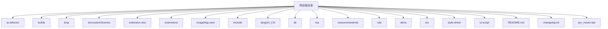
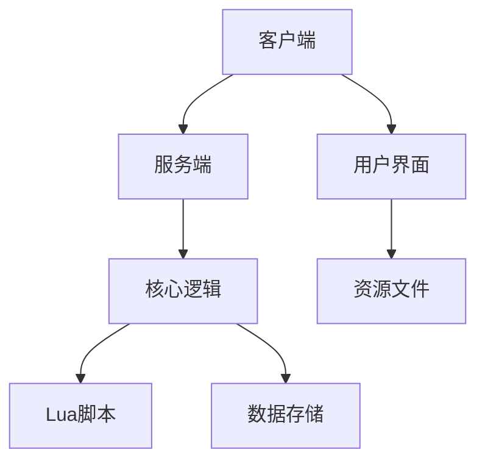
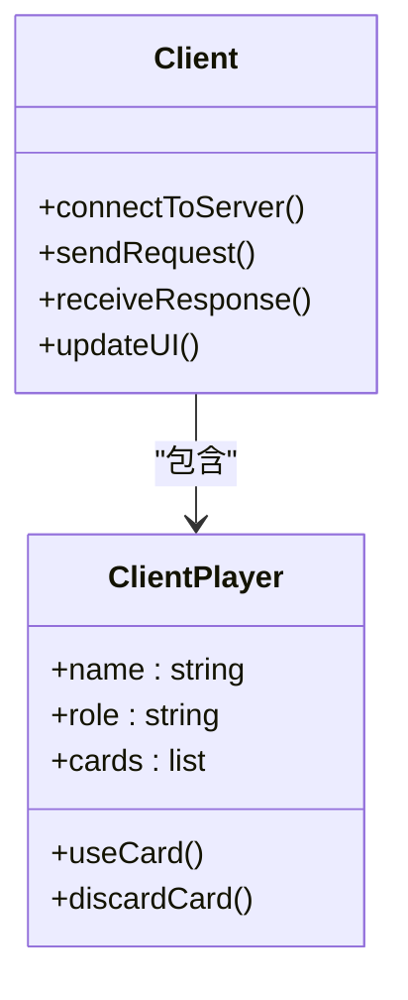
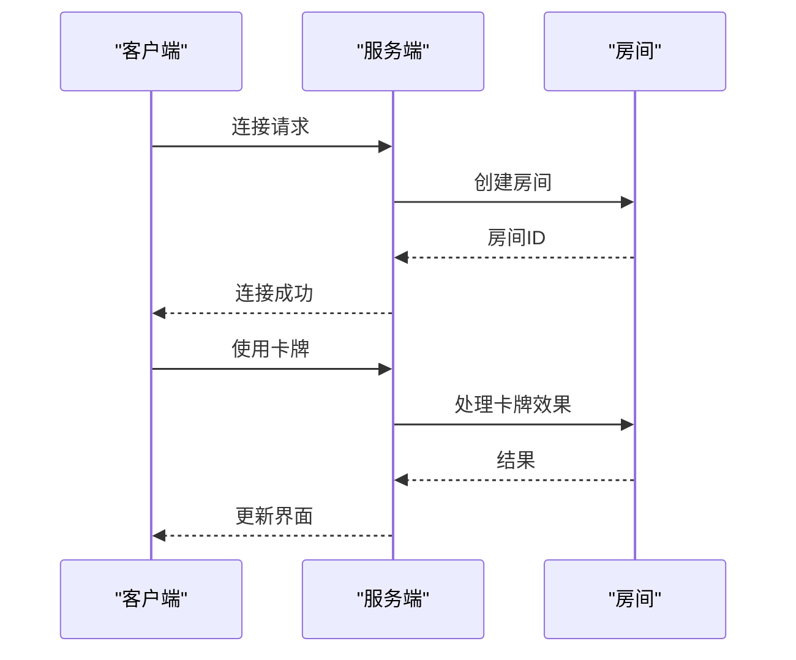
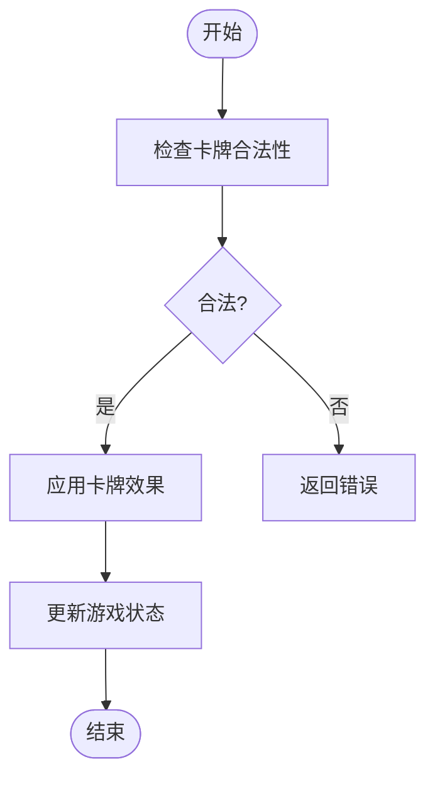
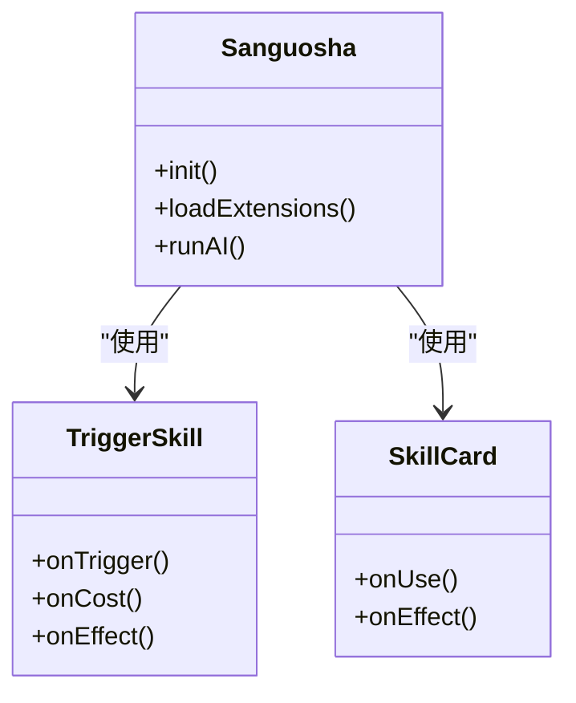
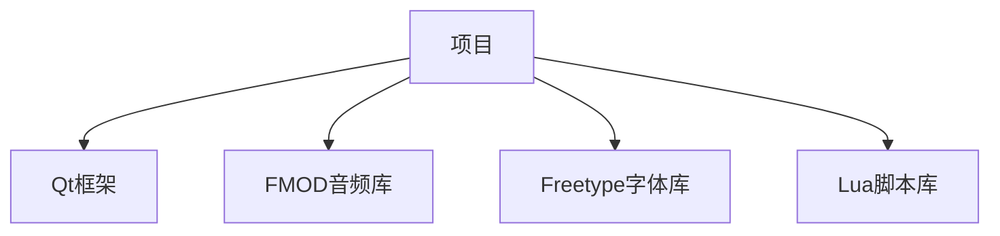

# 贡献指南

<cite>
**本文档引用文件**  
- [README.md](file://README.md)
- [changelog.txt](file://changelog.txt)
- [src/main.cpp](file://src/main.cpp)
- [src/core/skill.cpp](file://src/core/skill.cpp)
- [src/core/card.cpp](file://src/core/card.cpp)
- [src/server/room.cpp](file://src/server/room.cpp)
- [src/client/client.cpp](file://src/client/client.cpp)
- [lua/sanguosha.lua](file://lua/sanguosha.lua)
- [extension-doc/3-TriggerSkill.lua](file://extension-doc/3-TriggerSkill.lua)
- [extension-doc/5-SkillCard.lua](file://extension-doc/5-SkillCard.lua)
- [src/breakpad/client/windows/handler/exception_handler.h](file://src/breakpad/client/windows/handler/exception_handler.h)
</cite>

## 目录
1. [简介](#简介)
2. [项目结构](#项目结构)
3. [核心组件](#核心组件)
4. [架构概览](#架构概览)
5. [详细组件分析](#详细组件分析)
6. [依赖分析](#依赖分析)
7. [性能考量](#性能考量)
8. [故障排除指南](#故障排除指南)
9. [结论](#结论)

## 简介
本贡献指南旨在为开发者提供参与《QSanguosha-For-Hegemony》项目开发的全面指导。该项目是一个基于Qt框架的开源三国杀游戏实现，支持多种游戏模式和扩展功能。文档将详细介绍代码提交流程、编码规范、调试技巧和版本发布周期，帮助开发者高效地参与到项目中。

## 项目结构
项目采用模块化设计，主要分为客户端、服务端、核心逻辑、UI界面、Lua脚本和资源文件等部分。以下是项目的主要目录结构：

**图示来源**
- [README.md](file://README.md)

## 核心组件
项目的核心组件包括客户端、服务端、核心逻辑和Lua脚本。这些组件共同构成了游戏的主体功能。

**本节来源**
- [src/main.cpp](file://src/main.cpp)
- [src/core/skill.cpp](file://src/core/skill.cpp)
- [src/core/card.cpp](file://src/core/card.cpp)
- [src/server/room.cpp](file://src/server/room.cpp)
- [src/client/client.cpp](file://src/client/client.cpp)

## 架构概览
项目的整体架构基于客户端-服务端模式，客户端负责用户界面和交互，服务端负责游戏逻辑和状态管理。核心逻辑模块处理游戏规则和数据，Lua脚本用于扩展游戏功能。

**图示来源**
- [src/main.cpp](file://src/main.cpp)
- [src/server/room.cpp](file://src/server/room.cpp)

## 详细组件分析
### 客户端分析
客户端负责处理用户输入、显示游戏界面和与服务端通信。主要文件包括`client.cpp`和`client.h`。

#### 类图

**图示来源**
- [src/client/client.cpp](file://src/client/client.cpp)
- [src/client/clientplayer.cpp](file://src/client/clientplayer.cpp)

### 服务端分析
服务端负责处理游戏逻辑、管理游戏状态和与客户端通信。主要文件包括`server.cpp`和`room.cpp`。

#### 序列图

**图示来源**
- [src/server/server.cpp](file://src/server/server.cpp)
- [src/server/room.cpp](file://src/server/room.cpp)

### 核心逻辑分析
核心逻辑模块处理游戏规则、卡牌效果和技能触发。主要文件包括`skill.cpp`和`card.cpp`。

#### 流程图

**图示来源**
- [src/core/skill.cpp](file://src/core/skill.cpp)
- [src/core/card.cpp](file://src/core/card.cpp)

### Lua脚本分析
Lua脚本用于扩展游戏功能，如AI行为和自定义技能。主要文件包括`sanguosha.lua`和`extension-doc`中的示例脚本。

#### 类图

**图示来源**
- [lua/sanguosha.lua](file://lua/sanguosha.lua)
- [extension-doc/3-TriggerSkill.lua](file://extension-doc/3-TriggerSkill.lua)
- [extension-doc/5-SkillCard.lua](file://extension-doc/5-SkillCard.lua)

## 依赖分析
项目依赖于多个外部库，包括Qt、FMOD、Freetype和Lua。这些库提供了图形界面、音频处理、字体渲染和脚本支持。

**图示来源**
- [README.md](file://README.md)
- [src/main.cpp](file://src/main.cpp)

## 性能考量
项目在设计时考虑了性能优化，如使用高效的算法和数据结构，减少内存泄漏，优化AI响应时间等。

## 故障排除指南
当项目出现崩溃或异常时，可以使用Breakpad进行崩溃分析。Breakpad会生成崩溃报告，帮助开发者定位问题。

**本节来源**
- [src/breakpad/client/windows/handler/exception_handler.h](file://src/breakpad/client/windows/handler/exception_handler.h)

## 结论
通过本指南，开发者可以更好地理解项目的结构和工作流程，从而更有效地参与到项目开发中。希望本指南能帮助开发者快速上手，共同推动项目的发展。