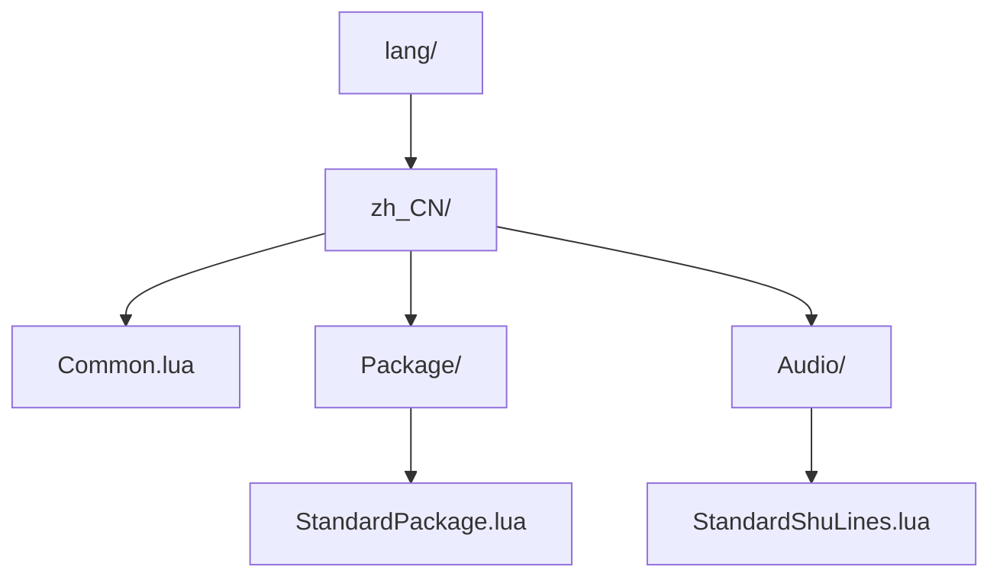

# 多语言支持

<cite>
**本文档引用文件**  
- [Common.lua](file://lang/zh_CN/Common.lua)
- [engine.cpp](file://src/core/engine.cpp)
- [engine.h](file://src/core/engine.h)
- [config.lua](file://lua/config.lua)
</cite>

## 目录
1. [简介](#简介)
2. [项目结构](#项目结构)
3. [核心组件](#核心组件)
4. [架构概述](#架构概述)
5. [详细组件分析](#详细组件分析)
6. [依赖分析](#依赖分析)
7. [性能考虑](#性能考虑)
8. [故障排除指南](#故障排除指南)
9. [结论](#结论)

## 简介
本项目为《三国杀》的扩展版本，支持多语言功能，允许玩家在不同语言之间切换界面文本。多语言实现基于Lua脚本语言文件与C++引擎的协同工作，通过键值对方式管理文本资源，并支持运行时语言切换和热重载调试。本文档深入讲解其多语言机制，指导开发者如何添加新语言、管理语言包及解决常见问题。

## 项目结构
项目采用模块化结构，语言资源集中存放在`lang/`目录下，以地区代码命名子目录（如`zh_CN`）。每个语言包包含多个Lua文件，分别对应不同功能模块的文本内容，如通用文本、卡牌包、音频台词等。



**图示来源**
- [Common.lua](file://lang/zh_CN/Common.lua)
- [StandardPackage.lua](file://lang/zh_CN/Package/StandardPackage.lua)

**本节来源**
- [Common.lua](file://lang/zh_CN/Common.lua)

## 核心组件
多语言系统的核心由三部分构成：语言键值文件、Lua加载机制、C++引擎接口。`Common.lua`定义了基础文本键，如界面按钮、提示信息；`Package/*.lua`和`Audio/*.lua`则分别存储卡牌名称与角色台词；C++中的`Engine`类负责加载并提供当前语言文本。

**本节来源**
- [Common.lua](file://lang/zh_CN/Common.lua)
- [engine.cpp](file://src/core/engine.cpp)
- [engine.h](file://src/core/engine.h)

## 架构概述
系统通过分层设计实现语言解耦：Lua层负责文本定义与组织，C++层负责运行时管理与调用。启动时，引擎根据配置加载指定语言包至内存映射，Lua脚本通过全局函数`sG.lang(key)`获取对应文本。

```mermaid
sequenceDiagram
participant C++引擎
participant Lua脚本
participant 语言文件
C++引擎->>C++引擎 : 初始化Engine实例
C++引擎->>语言文件 : 加载lang/zh_CN/Common.lua
语言文件-->>C++引擎 : 返回键值表
C++引擎->>C++引擎 : 存入m_languageMap
Lua脚本->>C++引擎 : 调用sG.lang("confirm")
C++引擎-->>Lua脚本 : 返回"确定"
```

**图示来源**
- [engine.cpp](file://src/core/engine.cpp#L150-L200)
- [Common.lua](file://lang/zh_CN/Common.lua)

## 详细组件分析

### 语言键值结构分析
以`lang/zh_CN/Common.lua`为例，文本以Lua表形式组织，采用层级命名空间避免冲突。

```lua
sgs.Sanguosha:addTranslationTable{
    ["confirm"] = "确定",
    ["cancel"] = "取消",
    ["settings"] = "设置",
    package = {
        ["standard"] = "标准包",
        ["sp"] = "神话再临"
    },
    audio = {
        zhaoxiang = {
            ["zhaoxiang1"] = "万象归一！",
            ["zhaoxiang2"] = "天地无极！"
        }
    }
}
```

该结构支持嵌套键，便于分类管理。所有文本通过`sG.lang("package/standard")`方式访问。

**图示来源**
- [Common.lua](file://lang/zh_CN/Common.lua)

#### 添加新语言（如en_US）流程
1. **创建目录**：在`lang/`下新建`en_US`文件夹。
2. **复制模板**：将`zh_CN`内所有`.lua`文件复制到`en_US`。
3. **编码规范**：确保所有文件保存为UTF-8编码，避免乱码。
4. **翻译文本**：逐文件修改字符串值为英文，保持键名不变。
5. **注册语言**：在`lua/config.lua`中添加语言选项：
```lua
sgs.Sanguosha:addLanguageEntry("en_US", {
    name = "English",
    font = "DejaVuSans.ttf"
})
```

**本节来源**
- [config.lua](file://lua/config.lua)
- [Common.lua](file://lang/zh_CN/Common.lua)

### C++引擎语言管理接口
`Engine`类提供语言资源管理功能，关键方法如下：

```cpp
class Engine {
public:
    void setLanguage(const QString &lang); // 设置当前语言
    QString translate(const QString &key); // 根据键查找文本
    QStringList getAvailableLanguages();   // 获取可用语言列表
private:
    QMap<QString, QString> m_languageMap;  // 当前语言键值映射
};
```

通过`setLanguage("en_US")`可动态切换语言，触发界面重绘以更新文本。

**图示来源**
- [engine.h](file://src/core/engine.h#L45-L60)
- [engine.cpp](file://src/core/engine.cpp#L180-L195)

**本节来源**
- [engine.h](file://src/core/engine.h)
- [engine.cpp](file://src/core/engine.cpp)

## 依赖分析
多语言系统依赖Lua脚本解析器与核心引擎的紧密集成。Lua层通过`lua-wrapper.cpp`调用C++函数注册翻译表，C++层通过`QMap`存储并快速检索文本。

```mermaid
graph TD
A[Lua脚本] --> |addTranslationTable| B(lua-wrapper.cpp)
B --> C[Engine::addTranslation]
C --> D[m_languageMap]
E[UI组件] --> |sG.lang(key)| D
D --> E
```

**图示来源**
- [lua-wrapper.cpp](file://src/core/lua-wrapper.cpp)
- [engine.cpp](file://src/core/engine.cpp)

**本节来源**
- [lua-wrapper.cpp](file://src/core/lua-wrapper.cpp)
- [engine.cpp](file://src/core/engine.cpp)

## 性能考虑
- **内存占用**：所有语言文本在启动时加载至内存，建议按需加载或延迟加载非当前语言包。
- **查找效率**：使用`QMap`保证O(log n)查找速度，对性能影响极小。
- **热重载**：开发阶段可通过重新加载Lua文件实现文本即时预览，无需重启游戏。

## 故障排除指南
### 常见问题及解决方案
- **界面乱码**：
  - 检查Lua文件是否为UTF-8编码（无BOM）。
  - 确认字体文件支持中文字符（如SimHei.ttf）。
- **文本缺失**：
  - 检查键名拼写是否一致。
  - 确保`addTranslationTable`已正确调用。
- **语言切换无效**：
  - 验证`setLanguage()`是否被调用。
  - 检查UI是否监听语言变更事件并刷新。

**本节来源**
- [engine.cpp](file://src/core/engine.cpp#L170-L190)
- [Common.lua](file://lang/zh_CN/Common.lua)

## 结论
本项目的多语言机制设计清晰、扩展性强，结合Lua的灵活性与C++的高效性，实现了良好的国际化支持。开发者可遵循标准流程添加新语言，利用热重载提升开发效率，并通过规范编码避免常见问题。未来可引入语言包压缩、按需加载等优化策略进一步提升性能。