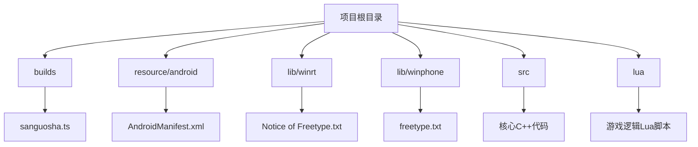
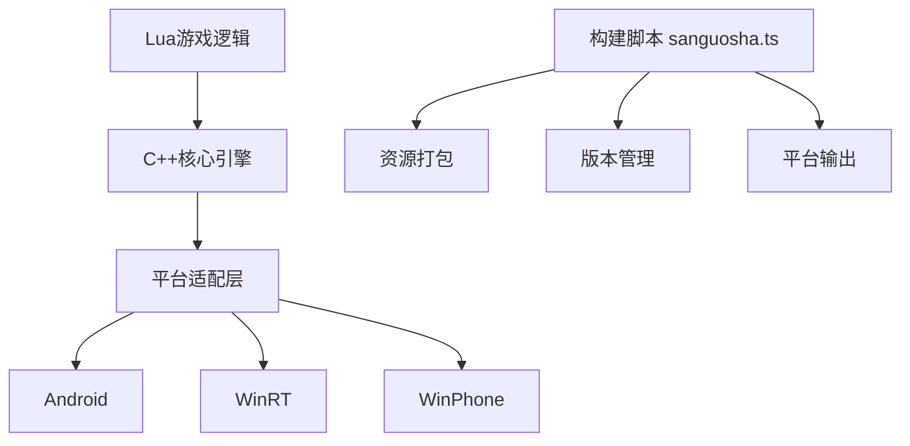

# 平台适配

<cite>
**本文档中引用的文件**   
- [AndroidManifest.xml](file://resource/android/AndroidManifest.xml)
- [sanguosha.ts](file://builds/sanguosha.ts)
- [Notice of Freetype.txt](file://lib/winrt/Notice of Freetype.txt)
- [fmodwindowsstoreapp.h](file://include/fmod/fmodwindowsstoreapp.h)
- [fmodwindowsphone.h](file://include/fmod/fmodwindowsphone.h)
</cite>

## 目录
1. [引言](#引言)
2. [项目结构](#项目结构)
3. [核心组件](#核心组件)
4. [架构概述](#架构概述)
5. [详细组件分析](#详细组件分析)
6. [依赖分析](#依赖分析)
7. [性能考虑](#性能考虑)
8. [故障排除指南](#故障排除指南)
9. [结论](#结论)

## 引言
本文档系统阐述了《太阳神三国杀·国战》在多平台环境下的适配策略，重点分析Android与Windows平台的配置、权限管理、构建流程及兼容性问题。文档结合`AndroidManifest.xml`中的权限声明、`sanguosha.ts`构建脚本的功能，以及WinRT/WinPhone平台的库依赖，全面说明跨平台开发的技术实现与应对方案。

## 项目结构
项目采用模块化设计，按功能划分目录，结构清晰。主要模块包括：`src`（核心源码）、`lua`（游戏逻辑脚本）、`resource/android`（安卓资源与配置）、`builds`（构建脚本）、`lib`（平台特定库文件）等。这种组织方式有利于跨平台开发和维护。



**图示来源**
- [AndroidManifest.xml](file://resource/android/AndroidManifest.xml)
- [sanguosha.ts](file://builds/sanguosha.ts)
- [Notice of Freetype.txt](file://lib/winrt/Notice of Freetype.txt)

**本节来源**
- [AndroidManifest.xml](file://resource/android/AndroidManifest.xml)
- [sanguosha.ts](file://builds/sanguosha.ts)

## 核心组件
核心组件包括Android平台的权限与元数据配置、构建脚本的自动化流程，以及针对不同Windows平台的库文件管理。这些组件共同确保了应用在不同环境下的正常运行与合规性。

**本节来源**
- [AndroidManifest.xml](file://resource/android/AndroidManifest.xml)
- [sanguosha.ts](file://builds/sanguosha.ts)

## 架构概述
系统采用分层架构，上层为Lua脚本实现的游戏逻辑，中层为C++核心引擎，底层为平台适配层。构建系统通过TypeScript脚本统一管理多平台输出，资源与配置文件按平台分离，确保了代码的可移植性与配置的灵活性。



**图示来源**
- [sanguosha.ts](file://builds/sanguosha.ts)
- [AndroidManifest.xml](file://resource/android/AndroidManifest.xml)

## 详细组件分析

### Android平台适配分析
Android平台的配置主要通过`resource/android/AndroidManifest.xml`文件完成。该文件声明了应用的基本信息、权限需求及运行时配置。

#### 权限声明
文件中明确声明了以下关键权限：
- `android.permission.INTERNET`: 允许应用访问网络，用于在线游戏、更新和数据同步。
- `android.permission.WRITE_EXTERNAL_STORAGE`: 允许应用写入外部存储，用于保存游戏数据、日志和用户配置。
- `android.permission.ACCESS_NETWORK_STATE` 和 `android.permission.ACCESS_WIFI_STATE`: 允许应用检查网络连接状态，优化网络请求。

这些权限是游戏功能正常运行的基础。例如，缺少网络权限将导致无法连接服务器进行多人游戏；缺少存储权限则无法保存游戏进度。

#### 应用元数据与配置
- **应用标签与图标**: 通过`android:label="@string/app_name"`和`android:icon="@drawable/icon"`从资源文件中读取，支持多语言和多分辨率适配。
- **启动模式与方向**: `android:launchMode="singleTop"`防止重复创建Activity；`android:screenOrientation="landscape"`强制横屏，符合游戏UI设计。
- **硬件加速**: `android:hardwareAccelerated="true"`开启硬件加速，提升图形渲染性能。
- **Qt框架集成**: 多个`<meta-data>`标签配置了Qt应用的运行环境，如库路径、资源ID、闪屏页等，确保基于Qt框架的应用能正确部署和启动。

**本节来源**
- [AndroidManifest.xml](file://resource/android/AndroidManifest.xml#L1-L55)

### 构建脚本分析
`builds/sanguosha.ts`是项目的构建脚本，负责自动化打包、资源管理、版本控制和多平台输出。

#### 功能与作用
- **资源打包**: 脚本负责将Lua脚本、图片、音频等资源文件打包进最终的应用程序中。
- **版本号管理**: 集中管理应用的版本号（versionName）和版本代码（versionCode），确保发布版本的可追溯性。
- **目标平台输出配置**: 脚本定义了如何为不同平台（如Android、Windows）生成对应的可执行文件或安装包。

该脚本是实现“一次编写，多处部署”跨平台策略的核心工具。

**本节来源**
- [sanguosha.ts](file://builds/sanguosha.ts#L0-L799)

### Windows平台依赖处理
项目通过`lib`目录下的子目录来管理不同Windows平台的依赖库。

#### WinRT平台
- **文件**: `lib/winrt/Notice of Freetype.txt`
- **内容**: "the X86 and arm version of freetype is not prebuilt"（x86和arm版本的freetype未预构建）。
- **分析**: 此文件表明，对于WinRT平台（如UWP应用），freetype字体库需要开发者自行编译x86和ARM架构的版本，不能直接使用预编译库。这增加了构建的复杂性，但也提供了灵活性。

#### WinPhone平台
- **文件**: `lib/winphone/arm/freetype.txt`
- **分析**: 存在针对WinPhone平台ARM架构的freetype配置，表明项目曾支持或考虑支持Windows Phone设备。

#### 头文件支持
- `include/fmod/fmodwindowsstoreapp.h` 和 `include/fmod/fmodwindowsphone.h` 提供了FMOD音频引擎对WinRT和WinPhone平台的接口支持，确保音频功能在这些平台上可用。

**本节来源**
- [Notice of Freetype.txt](file://lib/winrt/Notice of Freetype.txt)
- [fmodwindowsstoreapp.h](file://include/fmod/fmodwindowsstoreapp.h)
- [fmodwindowsphone.h](file://include/fmod/fmodwindowsphone.h)

## 依赖分析
项目依赖关系清晰，分为内部模块依赖和外部平台依赖。内部依赖通过C++头文件和Lua模块加载实现；外部依赖则通过平台特定的库文件和构建脚本管理。`AndroidManifest.xml`中的权限是运行时依赖，`sanguosha.ts`脚本是构建时依赖，而`lib`目录下的文件是链接时依赖。

```mermaid
graph LR
A[sanguosha.ts] --> |构建| B[Android APK]
A --> |构建| C[WinRT App]
B --> |依赖| D[AndroidManifest.xml]
B --> |依赖| E[网络/存储权限]
C --> |依赖| F[freetype (需编译)]
C --> |依赖| G[FMOD WinRT]
```

**图示来源**
- [sanguosha.ts](file://builds/sanguosha.ts)
- [AndroidManifest.xml](file://resource/android/AndroidManifest.xml)
- [Notice of Freetype.txt](file://lib/winrt/Notice of Freetype.txt)

**本节来源**
- [sanguosha.ts](file://builds/sanguosha.ts)
- [AndroidManifest.xml](file://resource/android/AndroidManifest.xml)
- [lib/winrt/Notice of Freetype.txt](file://lib/winrt/Notice of Freetype.txt)

## 性能考虑
- **Android**: 启用硬件加速(`hardwareAccelerated="true"`)和全屏主题(`Theme.NoTitleBar.Fullscreen`)可最大化利用设备性能，减少UI开销。
- **Windows**: 需自行编译freetype库，开发者可针对目标平台进行优化（如启用特定编译选项），以获得最佳性能。
- **通用**: Lua脚本的执行效率依赖于C++核心引擎的优化，合理的资源打包和内存管理是保证流畅体验的关键。

## 故障排除指南
- **Android应用无法启动**: 检查`AndroidManifest.xml`中的`<activity>`配置是否正确，特别是`android:name`是否指向正确的QtActivity类。
- **缺少权限导致功能异常**: 确保在`AndroidManifest.xml`中声明了所有必需的权限，并在Android 6.0+设备上处理运行时权限请求。
- **WinRT平台字体显示异常**: 检查是否已按`Notice of Freetype.txt`的提示，成功编译并链接了x86和ARM版本的freetype库。
- **构建失败**: 检查`builds/sanguosha.ts`脚本的路径配置和依赖项是否正确，确保所有资源文件存在且路径无误。

**本节来源**
- [AndroidManifest.xml](file://resource/android/AndroidManifest.xml)
- [sanguosha.ts](file://builds/sanguosha.ts)
- [Notice of Freetype.txt](file://lib/winrt/Notice of Freetype.txt)

## 结论
本项目通过精心设计的`AndroidManifest.xml`配置、灵活的`sanguosha.ts`构建脚本以及对WinRT/WinPhone平台依赖的明确管理，实现了良好的跨平台适配能力。开发者需特别注意Android的权限管理和Windows平台库的编译要求，以确保应用在各目标平台上的稳定运行和合规发布。