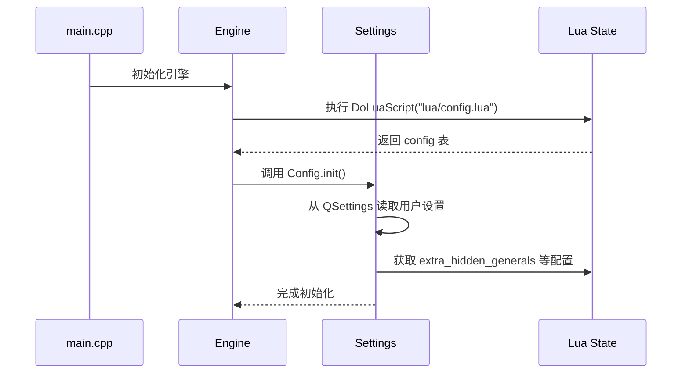

# 游戏配置

<cite>
**本文档引用的文件**  
- [config.lua](file://lua/config.lua)
- [settings.cpp](file://src/core/settings.cpp)
- [settings.h](file://src/core/settings.h)
- [engine.cpp](file://src/core/engine.cpp)
</cite>

## 目录
1. [简介](#简介)
2. [配置文件结构](#配置文件结构)
3. [核心配置项详解](#核心配置项详解)
4. [配置加载与运行时应用](#配置加载与运行时应用)
5. [推荐实践与安全边界](#推荐实践与安全边界)
6. [常见问题排查](#常见问题排查)
7. [实际配置示例](#实际配置示例)

## 简介
本文件详细解析 `lua/config.lua` 配置文件的结构与各项参数含义，涵盖游戏基础选项、网络通信设置、AI行为参数、战斗规则开关等。结合 `src/core/settings.cpp` 和 `settings.h` 中的实现逻辑，说明配置项如何被加载、解析并应用于运行时系统。提供配置修改的推荐实践、安全边界值建议以及错误配置导致的常见问题（如启动失败、网络连接异常）的排查方法。

## 配置文件结构

`lua/config.lua` 是游戏的核心配置脚本，用于存储程序本身的基本配置。该文件以 Lua 表（table）形式组织，包含多个子表，分别定义了势力颜色、技能颜色、扩展包名称、快捷聊天文本和机器人名称等。

```lua
config = {
    kingdoms = { "wei", "qun", "shu", "wu", "careerist", "god" },
    kingdom_colors = { ... },
    skill_colors = { ... },
    dialog_background_color = "#D6E7DB",
    dialog_background_alpha = 255,
    package_names = { ... },
    easy_text = { ... },
    robot_names = { ... }
}
```

**Section sources**
- [config.lua](file://lua/config.lua#L1-L149)

## 核心配置项详解

### 势力与颜色配置
定义游戏中各势力的标识符及其对应的颜色值。

**: 势力列表**
- **wei**: 魏
- **shu**: 蜀
- **wu**: 吴
- **qun**: 群
- **careerist**: 野心家
- **god**: 神

**: 势力颜色**
- **wei**: `#547998`
- **shu**: `#D0796C`
- **wu**: `#4DB873`
- **qun**: `#8A807A`
- **careerist**: `#A500CC`
- **god**: `#96943D`

**: 技能类型颜色**
- **compulsory**: 必备技能 `#0000FF`
- **once_per_turn**: 每回合一次 `#008000`
- **limited**: 限定技 `#FF0000`
- **head**: 主将技 `#00FF00`
- **deputy**: 副将技 `#00FFFF`
- **array**: 阵法技 `#800080`
- **lord**: 主公技 `#FFA500`

### 对话框背景设置
控制游戏内对话框的背景颜色与透明度。

**: dialog_background_color**
- 默认值: `"#D6E7DB"`
- 描述: 对话框背景颜色（十六进制 RGB）

**: dialog_background_alpha**
- 默认值: `255`
- 描述: 透明度（0-255），255为完全不透明

### 扩展包名称列表
定义所有可用的卡牌与武将扩展包。

**: package_names**
- 包含标准包、阵法、势力、神将等多个扩展模块
- 用于游戏模式选择与禁用包功能

### 快捷聊天文本
预设的快捷聊天语句，供玩家快速发送。

**: easy_text**
- 示例: `"太慢了，做两个俯卧撑吧！"`
- 共10条预设语句，增强游戏互动性

### 机器人名称
AI对手的默认名称列表。

**: robot_names**
- 包含中英文混合名称，如 `"無に帰ろう"`、`"啦啦失恋过"`
- 提升AI对战的趣味性

**Section sources**
- [config.lua](file://lua/config.lua#L10-L149)

## 配置加载与运行时应用

### 配置加载流程
游戏启动时通过 `DoLuaScript(lua, "lua/config.lua");` 加载 Lua 配置文件，并在 `Settings::init()` 中进行解析与初始化。



**Diagram sources**
- [engine.cpp](file://src/core/engine.cpp#L86)
- [settings.cpp](file://src/core/settings.cpp#L48-L169)
- [settings.h](file://src/core/settings.h#L1-L140)

### C++ 层配置映射
`Settings` 类继承自 `QSettings`，将 Lua 配置与 Qt 配置系统结合。

**: 核心字段映射**
- **ServerName**: 服务器名称
- **GameMode**: 游戏模式（如 "08p"）
- **BanPackages**: 禁用的扩展包列表
- **RandomSeat**: 是否随机座位
- **EnableCheat**: 是否启用作弊模式
- **OperationTimeout**: 操作超时时间（秒）
- **BGMVolume**: 背景音乐音量（0.0-1.0）
- **EffectVolume**: 音效音量（0.0-1.0）

**: 静态常量**
- **S_SURRENDER_REQUEST_MIN_INTERVAL**: 投降请求最小间隔（5000ms）
- **S_MOVE_CARD_ANIMATION_DURATION**: 移动卡牌动画时长（600ms）
- **S_JUDGE_ANIMATION_DURATION**: 判定动画时长（1200ms）

**Section sources**
- [settings.cpp](file://src/core/settings.cpp#L48-L169)
- [settings.h](file://src/core/settings.h#L1-L140)

## 推荐实践与安全边界

### 安全值建议
**: 音量设置**
- **BGMVolume**: 建议 0.3 - 0.8
- **EffectVolume**: 建议 0.5 - 1.0

**: 超时时间**
- **OperationTimeout**: 建议 10 - 30 秒
- **NullificationCountDown**: 建议 5 - 10 秒

**: AI 延迟**
- **OriginAIDelay**: 建议 500 - 2000 毫秒
- **AIDelayAD**: 建议 0 - 500 毫秒

### 修改建议
- 修改 `config.lua` 前请备份原文件
- 颜色值必须为有效十六进制格式（如 `#RRGGBB`）
- 扩展包名称需与实际文件名匹配
- 重启游戏以使部分配置生效

**Section sources**
- [settings.cpp](file://src/core/settings.cpp#L100-L150)

## 常见问题排查

### 启动失败
**: 可能原因**
- `config.lua` 语法错误（如缺少逗号、括号不匹配）
- 字体文件路径错误导致 `BigFont` 初始化失败
- Lua 脚本执行异常

**: 解决方法**
- 使用 Lua 语法检查工具验证 `config.lua`
- 确认 `font/simli.ttf` 文件存在
- 查看日志文件中的错误信息

### 网络连接异常
**: 可能原因**
- `ServerPort` 被占用或权限不足
- `HostAddress` 配置错误
- 防火墙阻止端口通信

**: 解决方法**
- 更换 `ServerPort` 为 9528 等其他端口
- 确认 `HostAddress` 为有效 IP 地址
- 检查防火墙设置

### 音效/音乐不播放
**: 可能原因**
- `EnableBgMusic` 或 `EnableEffects` 被禁用
- 音量设置为 0
- 音频文件缺失

**: 解决方法**
- 在设置中启用音效选项
- 调整 `BGMVolume` 和 `EffectVolume` 大于 0
- 验证音频资源完整性

**Section sources**
- [settings.cpp](file://src/core/settings.cpp#L100-L150)
- [serverdialog.cpp](file://src/dialog/serverdialog.cpp#L658-L707)

## 实际配置示例

### 禁用动画优化性能
```cpp
// 在 settings.cpp 中修改
Config.S_MOVE_CARD_ANIMATION_DURATION = 100;  // 减少动画时长
Config.S_JUDGE_ANIMATION_DURATION = 300;
Config.EnableEffects = false; // 完全关闭特效
```

### 开启调试模式查看日志
```lua
-- 在 config.lua 中添加调试字段
config.debug_mode = true
config.log_level = "verbose"
```

```cpp
// 在 settings.cpp 中读取
bool DebugMode = value("DebugMode", false).toBool();
QString LogLevel = value("LogLevel", "info").toString();
```

### 自定义快捷聊天
```lua
config.easy_text = {
    "快点出牌！",
    "这操作太秀了！",
    "我投降！",
    "你被骗了！",
    "最后一张了！"
}
```

**Section sources**
- [config.lua](file://lua/config.lua#L1-L149)
- [settings.cpp](file://src/core/settings.cpp#L48-L169)