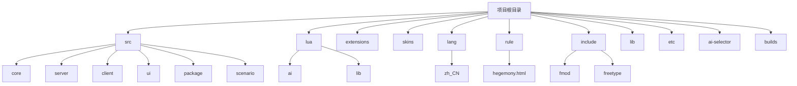
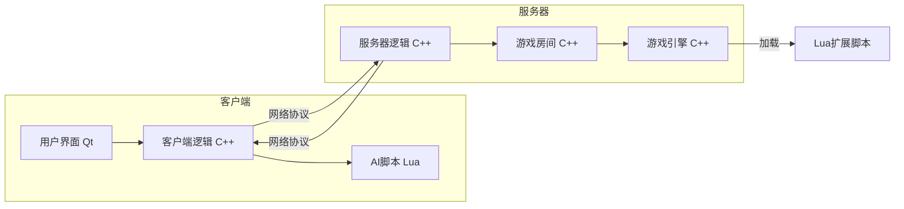
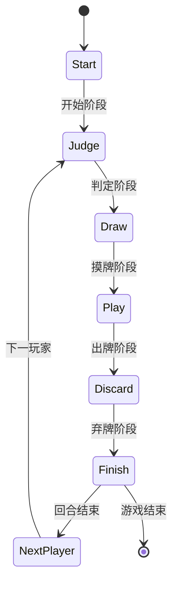
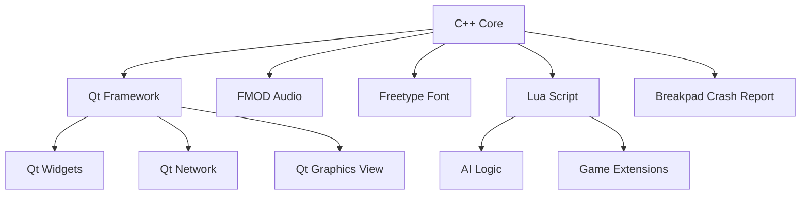

# 项目概述

<cite>
**本文档引用的文件**   
- [README.md](file://README.md)
- [changelog.txt](file://changelog.txt)
- [main.cpp](file://src/main.cpp)
- [engine.h](file://src/core/engine.h)
- [engine.cpp](file://src/core/engine.cpp)
- [card.h](file://src/core/card.h)
- [skill.h](file://src/core/skill.h)
- [player.h](file://src/core/player.h)
- [room.h](file://src/server/room.h)
- [server.h](file://src/server/server.h)
- [client.h](file://src/client/client.h)
- [lua-wrapper.h](file://src/core/lua-wrapper.h)
- [sanguosha.lua](file://lua/sanguosha.lua)
- [Xmode.lua](file://extensions/Xmode.lua)
- [config.lua](file://lua/config.lua)
- [defaultSkin.layout.json](file://skins/defaultSkin.layout.json)
- [style.css](file://rule/style.css)
- [qm_mover.bat](file://qm_mover.bat)
</cite>

## 目录
1. [简介](#简介)
2. [项目结构](#项目结构)
3. [核心组件](#核心组件)
4. [架构概览](#架构概览)
5. [详细组件分析](#详细组件分析)
6. [依赖分析](#依赖分析)
7. [性能考量](#性能考量)
8. [故障排除指南](#故障排除指南)
9. [结论](#结论)

## 简介
QSanguosha-For-Hegemony-xxyheaven 是一款基于经典桌面游戏《三国杀》的开源在线实现项目。该项目旨在通过现代软件工程技术，完整复现《三国杀》的游戏机制，并在此基础上扩展了“霸业模式”等特色玩法。项目采用客户端-服务器架构，支持多人在线对战，具备高度可扩展性，允许通过Lua脚本添加新的武将、技能和游戏模式。其核心目标是提供一个稳定、功能丰富且易于扩展的《三国杀》游戏平台，供玩家娱乐和开发者二次开发。

**Section sources**
- [README.md](file://README.md#L1-L10)

## 项目结构
该项目具有清晰的模块化结构，文件组织遵循功能划分原则，主要分为源代码、资源文件、脚本和配置文件四大类。



**Diagram sources**
- [src](file://src)
- [lua](file://lua)
- [skins](file://skins)

**Section sources**
- [README.md](file://README.md#L1-L274)

## 核心组件
项目的核心组件包括游戏引擎、客户端、服务器、AI系统和扩展系统。

**游戏引擎 (Engine)**：位于 `src/core` 目录下，是整个项目的核心。它通过单例模式实现，全局唯一，负责管理卡牌、武将、技能等游戏对象的创建与注册。`Engine` 类是核心中的核心，它维护着所有可用的卡牌、武将和技能的列表，并提供工厂方法来创建这些对象的实例。

**客户端 (Client)**：位于 `src/client` 目录下，负责处理用户界面和用户交互。它接收用户的操作（如出牌、使用技能），将其打包成网络协议发送给服务器，并接收服务器的指令来更新本地的游戏状态和UI。

**服务器 (Server)**：位于 `src/server` 目录下，是游戏逻辑的仲裁者。它接收来自所有客户端的请求，根据《三国杀》的规则进行逻辑判断和状态变更，然后将结果广播给所有客户端。`Room` 类代表一个游戏房间，管理着房间内的所有玩家和游戏流程。

**AI系统**：AI逻辑主要由Lua脚本驱动，位于 `lua/ai` 目录下。每个武将或模式都有对应的AI脚本（如 `standard-shu-ai.lua`），定义了AI在不同情境下的决策行为。C++层的 `AI` 类负责调用这些Lua脚本。

**扩展系统**：项目支持通过Lua脚本进行功能扩展。`extensions` 目录下的 `Xmode.lua` 文件定义了“霸业模式”的特殊规则。`extension-doc` 目录提供了详细的Lua扩展开发文档。

**Section sources**
- [engine.h](file://src/core/engine.h#L1-L50)
- [client.h](file://src/client/client.h#L1-L20)
- [server.h](file://src/server/server.h#L1-L20)
- [sanguosha.lua](file://lua/sanguosha.lua#L1-L100)

## 架构概览
该项目采用经典的客户端-服务器（C/S）架构，结合了C++、Lua和Qt等多种技术。



**Diagram sources**
- [client.h](file://src/client/client.h#L1-L20)
- [server.h](file://src/server/server.h#L1-L20)
- [engine.h](file://src/core/engine.h#L1-L50)

## 详细组件分析

### 游戏引擎分析
游戏引擎是项目的基石，其设计体现了多种设计模式。

#### 单例模式 (Singleton)
`Engine` 类是单例模式的典型应用。在整个程序生命周期中，只有一个 `Engine` 实例，通过 `Engine::getInstance()` 方法全局访问。这确保了卡牌、武将等核心数据的全局唯一性和一致性。

```mermaid
classDiagram
class Engine {
-static instance Engine*
-cards QMap<QString, Card*>
-generals QMap<QString, General*>
-skills QMap<QString, Skill*>
+static getInstance() Engine*
+addCard(Card*) void
+addGeneral(General*) void
+addSkill(Skill*) void
+getCardCreator(QString) CardCreator*
+getGeneral(QString) General*
}
note right of Engine
全局唯一的引擎实例
负责注册和创建所有游戏对象
end
```

**Diagram sources**
- [engine.h](file://src/core/engine.h#L1-L50)
- [engine.cpp](file://src/core/engine.cpp#L1-L100)

#### 工厂模式 (Factory)
引擎通过工厂模式创建游戏对象。例如，`Card` 类有一个抽象的 `clone()` 方法，每个具体的卡牌类（如 `Slash`、`Peach`）都重写此方法来返回自身的副本。`Engine` 维护一个 `CardCreator` 工厂映射，根据卡牌名称创建对应的卡牌实例。

**Section sources**
- [engine.h](file://src/core/engine.h#L1-L50)
- [card.h](file://src/core/card.h#L1-L30)

### 游戏状态管理分析
游戏流程的管理体现了状态模式的思想。

#### 状态模式 (State)
游戏的进行被划分为多个阶段（Phase），如回合开始、判定、摸牌、出牌、弃牌、回合结束等。`Room` 类通过一个状态机来管理当前所处的阶段，并根据当前阶段执行相应的逻辑。当一个阶段结束时，会自动进入下一个阶段。



**Diagram sources**
- [room.h](file://src/server/room.h#L1-L40)
- [gamerule.h](file://src/server/gamerule.h#L1-L20)

## 依赖分析
项目依赖于多个外部库和内部模块。



**Diagram sources**
- [include/fmod](file://include/fmod)
- [include/freetype](file://include/freetype)
- [src/lua](file://src/lua)
- [src/breakpad](file://src/breakpad)

**Section sources**
- [README.md](file://README.md#L30-L50)

## 性能考量
根据 `changelog.txt` 中的记录，项目在多个版本中持续进行了性能优化。

- **内存管理**：修复了多处内存泄漏问题（1.2.0版本）。
- **AI性能**：大幅优化了AI在出牌阶段牌多时的响应时间（0.8.0 beta2版本）。
- **渲染性能**：对程序性能进行了着手优化（0.7.0 beta版本）。
- **整体优化**：在0.7.2 beta版本中明确提到“性能大幅优化”。

这些优化措施确保了游戏在各种配置的计算机上都能流畅运行。

**Section sources**
- [changelog.txt](file://changelog.txt#L1-L200)

## 故障排除指南
根据 `README.md` 和 `changelog.txt`，以下是常见问题的解决方案。

**构建失败**：
- **Windows (VS2013)**：确保正确设置了Qt库路径，并将所需的Qt DLL文件（如 `Qt5Core.dll`）复制到可执行文件同目录。
- **Mac OS X**：使用 `install_name_tool` 修正 `libfmodex.dylib` 和 `libfreetype.1.dylib` 的动态库链接路径。
- **Linux/MinGW**：确保安装了正确版本的Qt库和SWIG工具，并将 `libfmodex*.so` 复制到系统库路径或使用 `ldconfig`。

**游戏崩溃**：
- 检查 `dmp` 目录下的崩溃报告文件。
- 确保所有依赖库（FMOD, Freetype）的版本与项目要求一致。

**AI行为异常**：
- 检查 `lua/ai` 目录下的对应AI脚本是否有语法错误。
- 参考 `ai-selector` 目录下的 `general-value.txt` 和 `pair-value.txt` 文件，这些文件定义了AI对武将的评分。

**Section sources**
- [README.md](file://README.md#L50-L274)
- [changelog.txt](file://changelog.txt#L1-L878)

## 结论
QSanguosha-For-Hegemony-xxyheaven 是一个技术架构清晰、功能完备的开源游戏项目。它成功地将《三国杀》复杂的桌面游戏规则通过C++和Qt框架在计算机上实现，并利用Lua脚本提供了强大的扩展能力。项目采用了单例、工厂、状态等多种设计模式，代码结构良好。通过持续的版本迭代，项目在功能、稳定性和性能上都得到了显著提升。无论是作为学习C++大型项目开发的范例，还是作为《三国杀》爱好者的游戏平台，该项目都具有很高的价值。